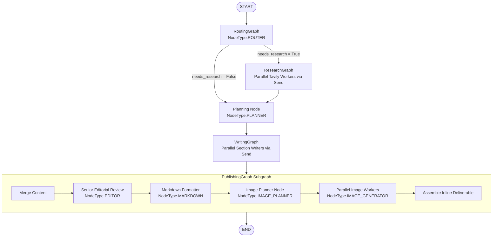

# InkFlow-AI ✍️🤖

> **Autonomous AI Technical Content Orchestrator & Editorial Pipeline**  
> Powered by **LangGraph**, **Google Vertex AI Enterprise SDK**, **LiteLLM**, **Tavily AI Search**, and **FastAPI**.

InkFlow-AI is a production-grade, multi-agent AI Editorial System that transforms raw technical topics into publication-ready, Medium/Towards Data Science grade technical articles. It orchestrates parallel research workers, parallel section writers, a Senior Editorial Review agent, a Markdown Formatter, and parallel technical image generation with inline placement.

---

## 🌟 Key Features & Highlights

- **Multi-Agent LangGraph Architecture**: Fully modular root graph orchestrating 4 subgraphs (`RoutingGraph`, `ResearchGraph`, `WritingGraph`, `PublishingGraph`) and an isolated `Planning` node.
- **Parallel Execution (`Send()` Fanout)**:
  - **Parallel Research**: Concurrent web searches across queries with automatic deduplication.
  - **Parallel Writing**: Independent section writers executing tasks concurrently.
  - **Parallel Image Generation**: Concurrent high-resolution technical diagram generation.
- **Node-Aware Model Infrastructure**:
  - Provider-agnostic gateway resolving models based on `NodeType` (`ROUTER`, `RESEARCH`, `PLANNER`, `WRITER`, `EDITOR`, `MARKDOWN`, `IMAGE_PLANNER`, `IMAGE_GENERATOR`).
  - Automatic fallback chains (Primary: **Vertex AI Gemini 3.5 Flash / 2.5 Pro** → Fallback: **OpenAI GPT-4o / GPT-4o-mini**).
  - Fast **Capability Validation** ensuring configured models support structured outputs, reasoning, or image generation.
- **AI Editorial Review & Formatting Pipeline**:
  - **Senior Editorial Review Node**: Polishes transitions, removes duplicate ideas, standardizes terminology, and improves narrative flow.
  - **Markdown Formatter Node**: Standardizes heading hierarchy, callout boxes (`> 💡 Tip`, `> ⚠️ Common Mistake`, `> ✅ Best Practice`, `> 🚀 Production Tip`), code blocks, and tables.
- **Medium-Grade Editorial Quality Standards**:
  - **3-Level Audience Targeting**: Accessible to Beginners (analogies, no jargon), Intermediate Developers (architecture & rationale), and Senior Engineers (scaling, performance, security, trade-offs).
  - **20-Step Mandatory Article Structure**: Includes 55–65 character non-clickbait SEO Title, SEO Meta Description, Hook, Architecture Overview, Code Walkthrough, `## Key Takeaways`, and exactly 5 `## SEO Keywords`.
- **Inline Technical Diagrams**:
  - Generates 2 to 5 high-resolution enterprise dark-mode vector illustrations per article.
  - Mandates an **Introduction Hero Diagram** (`[[IMAGE_1]]`) right beneath the title/intro.
  - Replaces placeholders inline directly at their respective section paragraphs.
- **Web UI & Real-Time SSE Streaming**:
  - Live execution progress via Server-Sent Events (SSE) streaming.
  - Markdown article preview and one-click `.md` deliverable download.

---

## 🏗️ System Architecture



---

## 🧠 Node-Aware Model Infrastructure

The model layer abstracts provider details away from workflow nodes. Nodes request models using `NodeType` enums, allowing models and providers to be reconfigured without altering workflow logic.

```mermaid
flowchart LR
    Node[Workflow Node\ne.g. Router] -->|gateway.chat(NodeType.ROUTER)| Gateway[Node-Aware LLMGateway]
    Gateway -->|lookup| Registry[Model Registry]
    Registry -->|ModelProfile & Fallbacks| Gateway
    Gateway -->|validate_capabilities| CapabilityCheck{Capability Check}
    CapabilityCheck -->|Pass| ChatLiteLLM[Build ChatLiteLLM / GenAI Client Chain]
    ChatLiteLLM -->|Primary: Vertex AI| VertexAI[Google Vertex AI]
    ChatLiteLLM -.->|Fallback: OpenAI| OpenAI[OpenAI API]
```

### Model Mapping Table

| Workflow `NodeType` | Primary Model | Fallback Chain | Required Capabilities |
| :--- | :--- | :--- | :--- |
| **`NodeType.ROUTER`** | `vertex_ai/gemini-2.5-flash-lite` | `openai/gpt-4o-mini` | `supports_structured_output=True` |
| **`NodeType.RESEARCH`** | `vertex_ai/gemini-2.5-flash` | `openai/gpt-4o-mini` | `supports_structured_output=True` |
| **`NodeType.PLANNER`** | `vertex_ai/gemini-3.5-flash` | `vertex_ai/gemini-2.5-pro`, `openai/gpt-4o` | `supports_structured_output=True`, `supports_reasoning=True` |
| **`NodeType.WRITER`** | `vertex_ai/gemini-3.5-flash` | `vertex_ai/gemini-2.5-pro`, `openai/gpt-4o` | `supports_reasoning=True` |
| **`NodeType.EDITOR`** | `vertex_ai/gemini-2.5-pro` | `openai/gpt-4o` | `supports_reasoning=True` |
| **`NodeType.MARKDOWN`** | `vertex_ai/gemini-2.5-flash` | `openai/gpt-4o-mini` | - |
| **`NodeType.IMAGE_PLANNER`** | `vertex_ai/gemini-3.5-flash` | `vertex_ai/gemini-2.5-pro`, `openai/gpt-4o` | `supports_structured_output=True` |
| **`NodeType.IMAGE_GENERATOR`** | `gemini-3.1-flash-image` | `imagen-3.0-generate-002`, `openai/dall-e-3` | `supports_images=True` |

---

## 📁 Repository Structure

```
InkFlow-AI/
├── app.py                         # FastAPI Web Application & SSE Streaming Endpoint
├── main.py                        # CLI Test Runner Entry Point
├── README.md                      # Production Documentation
├── src/
│   ├── config/
│   │   ├── settings.py            # Project paths, API keys, logger filters
│   │   └── __init__.py            # Settings re-export package
│   ├── graph/
│   │   ├── main_graph.py          # Root StateGraph definition
│   │   ├── builder.py             # Backward compatibility wrapper
│   │   └── state.py               # Shared BlogState definition
│   ├── subgraphs/
│   │   ├── routing_graph.py       # Dedicated RoutingGraph
│   │   ├── research_graph.py      # ResearchGraph with parallel Send() query fanout
│   │   ├── writing_graph.py       # WritingGraph with parallel Send() section writers
│   │   └── publishing_graph.py    # PublishingGraph with Editorial Review & Formatting
│   ├── nodes/
│   │   ├── router.py              # Router decision node
│   │   ├── research.py            # Tavily worker & evidence deduplication
│   │   ├── planner.py             # Isolated Planning node (Orchestrator)
│   │   ├── worker.py              # Section writer worker & markdown assembly
│   │   ├── editor.py              # Senior Editorial Review node
│   │   ├── formatter.py           # Markdown Formatter & Callout Standardization node
│   │   ├── merge.py               # Content merge & validation node
│   │   ├── image_planner.py       # Visual illustration planner node
│   │   └── image_generator.py     # Image worker & inline deliverable assembly
│   ├── schemas/
│   │   ├── models.py              # Pydantic domain models (Plan, Task, ImageSpec, etc.)
│   │   ├── state.py               # BlogState with Annotated[list, operator.add] reducers
│   │   └── blog.py                # Schema re-export package
│   ├── models/
│   │   ├── types.py               # NodeType Enum & ModelProfile dataclass
│   │   ├── providers.py           # ModelProfile definitions (Vertex AI & OpenAI)
│   │   ├── registry.py            # Central Node Model Registry & Capability Validation
│   │   └── gateway.py             # Node-Aware LLMGateway (chat & image resolution)
│   ├── prompts/
│   │   ├── base.py                # PromptFactory helper
│   │   └── prompts.py             # SystemPrompts registry & Editorial Quality Standards
│   └── tools/
│       ├── web_search.py          # Tavily search integration
│       ├── image_generator.py     # Image Generator tool (Google GenAI Enterprise SDK)
│       └── markdown.py            # MarkdownBuilder with inline placeholder replacement
├── static/                        # CSS styles & JavaScript app logic
├── templates/                     # HTML index template
└── data/                          # Saved markdown outputs and generated PNG images
```

---

## 🛠️ Getting Started

### Prerequisites

- Python 3.11+ or 3.12
- Google Cloud Project with Vertex AI API enabled (or Google AI Studio API key)
- Tavily API key for web research

### Installation

1. **Clone the Repository**:
   ```bash
   git clone https://github.com/ChandraCherupally/InkFlow-AI.git
   cd InkFlow-AI
   ```

2. **Create & Activate Virtual Environment**:
   ```bash
   # Using uv (recommended)
   uv venv
   .venv\Scripts\activate   # On Windows
   source .venv/bin/activate # On macOS/Linux

   # Install dependencies
   uv sync
   # OR using pip
   pip install -r requirements.txt
   ```

3. **Configure Environment Variables**:
   Create a `.env` file in the project root:
   ```env
   GOOGLE_CLOUD_PROJECT=gen-lang-client-0579266941
   GOOGLE_CLOUD_LOCATION=global
   GOOGLE_API_KEY=your_google_api_key
   TAVILY_API_KEY=your_tavily_api_key
   OPENAI_API_KEY=your_openai_api_key
   ```

---

## 🚀 Running the Application

### Option 1: Web Interface (FastAPI Server)

Launch the web application:
```bash
python app.py
# OR
uvicorn app:app --reload
```
Open your browser at `http://127.0.0.1:8000` to interact with the InkFlow-AI composer interface, watch real-time execution progress, and download generated Markdown articles.

### Option 2: CLI Command Line Execution

Execute a workflow directly from the terminal:
```bash
python main.py
```

---

## ⚙️ How It Works (Step-by-Step)

1. **Routing Phase**: The `router` node analyzes the prompt topic to select between `closed_book` (evergreen knowledge), `hybrid` (needs recent tools/examples), or `open_book` (news/updates), generating specific search queries if research is needed.
2. **Parallel Research**: If research is required, `ResearchGraph` uses LangGraph `Send()` fanout to execute Tavily searches concurrently, deduplicating findings into an `EvidencePack`.
3. **Structured Planning**: The `planner` node consumes the topic and research evidence to generate a structured 5-8 task section `Plan`.
4. **Parallel Writing**: `WritingGraph` uses `Send()` fanout to spawn parallel `worker_section` nodes that write each section concurrently.
5. **Senior Editorial Review**: The `editor` node reviews the assembled article to smooth section transitions, remove duplicate ideas, and standardize technical narrative flow.
6. **Markdown Formatting**: The `markdown_formatter` node standardizes heading levels, code block syntax highlighting, and blockquote callout boxes (`> 💡 Tip`, `> ⚠️ Common Mistake`, `> ✅ Best Practice`).
7. **Image Planning & Parallel Generation**: `image_planner` designs 2 to 5 technical diagrams (including a mandatory Hero intro visual `[[IMAGE_1]]`) and inserts placeholders inline. `PublishingGraph` generates the images concurrently via Vertex AI / Google GenAI SDK and embeds them directly into their respective sections.

---

## 🤝 Contributing

Contributions, feedback, and architectural discussions are welcome!
1. Fork the repository
2. Create your feature branch (`git checkout -b feature/editorial-enhancement`)
3. Commit your changes (`git commit -m 'Add new editorial check'`)
4. Push to the branch (`git push origin feature/editorial-enhancement`)
5. Open a Pull Request

---

## 📄 License

Distributed under the MIT License. See `LICENSE` for more information.
