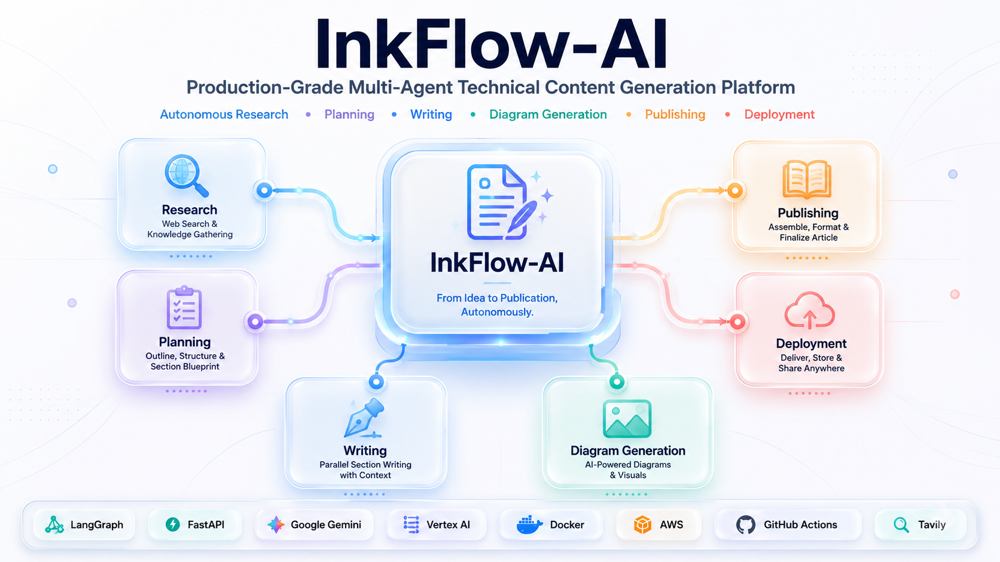
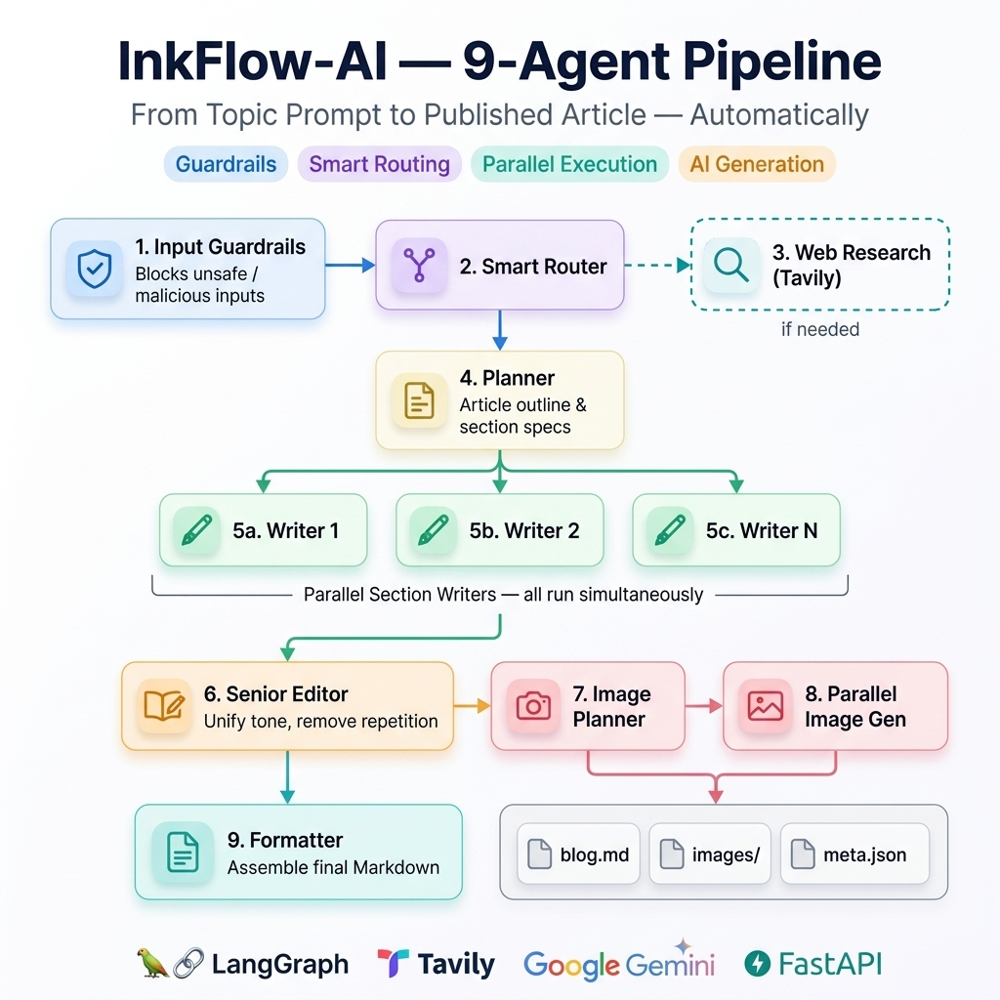
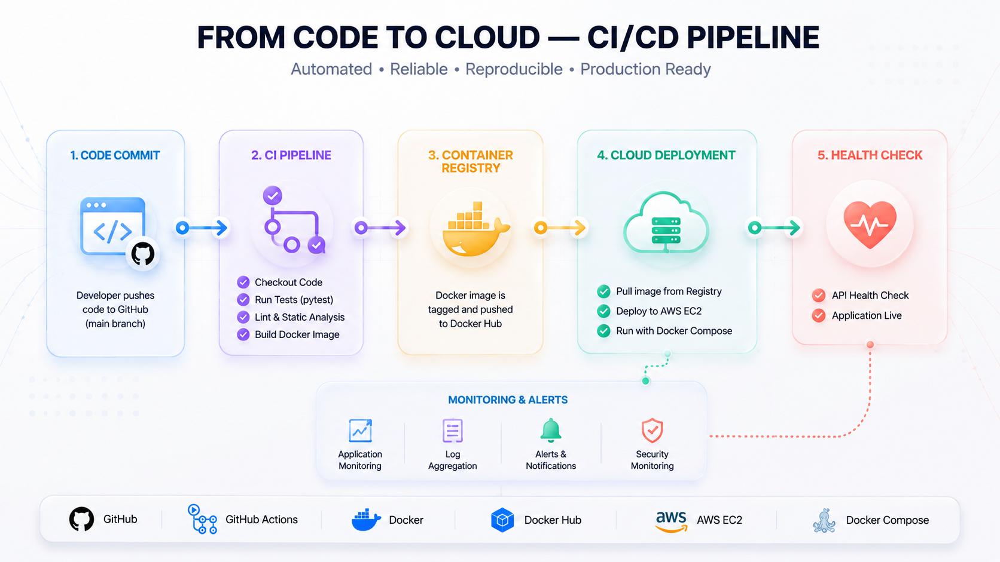

# I Built an AI That Writes Full Technical Articles Automatically — Here's Exactly How

### From a single topic prompt to a polished, illustrated article in under 2 minutes. No human editing required.

---

**By Chandra Cherupally** | 7 min read | August 2026

---



*InkFlow-AI — A production-grade multi-agent writing engine that researches, plans, writes, illustrates, and publishes technical articles autonomously.*

---

## The Problem I Was Trying to Solve

Ask ChatGPT to write a 5,000-word technical article and one of two things happens:

1. You get a **shallow, generic wall of text** that covers everything at surface level
2. The model **stops mid-article** because it hit its output limit

Neither is useful for publishing.

The real problem is not the AI — it is that writing a good technical article is actually **six different jobs**, not one:

- Research the topic with live web data
- Plan a logical structure before writing anything
- Write each section with focused context
- Generate diagrams to explain visual concepts
- Edit for consistent tone across all sections
- Format and assemble everything into final output

A single LLM prompt cannot reliably do all six. So I built **InkFlow-AI** — a system where each job is handled by a specialized AI agent.

---

## What InkFlow-AI Is (In Plain English)

**InkFlow-AI** takes a topic like *"How LangGraph enables stateful AI workflows"* and automatically produces:

- A fully-written Markdown article (2,000 to 8,000 words)
- 2 to 3 AI-generated diagrams embedded in the article
- A `meta.json` file showing exactly what it cost and how long each step took

**The secret:** Instead of one giant prompt, it runs a **pipeline of 9 specialized AI agents** — each doing one thing well, handing off structured output to the next.

Think of it like a newsroom: a researcher, a planner, five writers, an editor, and a designer all working on the same article — just automated.

---

## The Tech Stack

| What | Tool |
|---|---|
| Agent Orchestration | LangGraph (StateGraph) |
| API Server | FastAPI + Uvicorn |
| LLM Calls | Google Gemini via LiteLLM |
| Web Research | Tavily Search API |
| Image Generation | Google Gemini / Imagen |
| Containerization | Docker + Docker Compose |
| Cloud Deployment | AWS EC2 |
| CI/CD | GitHub Actions |

---

## How the Pipeline Works — Step by Step



*Figure 1 — The 9-step InkFlow-AI pipeline. Each box is a specialized AI agent. Arrows show data flow. Parallel steps run simultaneously.*

Here is what happens the moment you submit a topic:

### Step 1: Input Guardrails

The first agent **screens your input** for prompt injections, malicious instructions, or off-topic requests. If your input is clean, it moves forward. If not, it is blocked immediately. This is the safety gate — nothing passes through without being checked.

### Step 2: Smart Router

This agent makes a key decision: **Does this topic need live web research?**

- "Explain binary search trees" — the LLM already knows this. No search needed.
- "Latest LangGraph v0.2 features" — this needs fresh data from the web. Search required.

The router picks one of three modes:

| Mode | When Used | Cost Impact |
|---|---|---|
| `closed_book` | Classic concepts, algorithms | Cheapest — no search |
| `hybrid` | Topics needing some recent context | 1 to 2 searches |
| `open_book` | New frameworks, recent releases | Up to 5 parallel searches |

This single decision **saves up to 65% of latency** for appropriate topics.

### Step 3: Web Research (if needed)

If the router says "research required," InkFlow-AI fires **all search queries simultaneously** using LangGraph's `Send()` primitive — not one by one. Three searches finish in the time it would take to do one. All results merge into a deduplicated EvidencePack passed to the next step.

```python
# Fan-out: launch all searches at once
def fanout_queries(state):
    return [
        Send("tavily_worker", {"query": q})
        for q in state.search_queries   # all fire simultaneously
    ]
```

### Step 4: Planner

Before writing a single word, the Planner creates a **structured blueprint** for the entire article:

```python
class Plan(BaseModel):
    title: str
    tasks: list[Task]   # one Task per section

class Task(BaseModel):
    id: int
    title: str               # section heading
    target_word_count: int   # how long?
    key_points: list[str]    # what to cover
    requires_code: bool      # include code snippet?
```

This is the most important step. Without a shared plan, parallel writers would produce five disconnected short articles instead of one cohesive piece.

### Step 5: Parallel Writers

This is where InkFlow-AI gets fast. Instead of writing sections A to B to C to D in sequence, it fans out a **separate writer agent per section — all running at the same time**:

```python
def fanout_tasks(state):
    return [
        Send("worker_section", {"task": task})
        for task in state.plan.tasks   # all run simultaneously
    ]
```

**The speed impact:** An 8-section article that would take around 4 minutes sequentially finishes in around 45 seconds with parallel writing. That is a 75% reduction.

**But do parallel writers overwrite each other?** No. LangGraph handles this with Annotated Reducers:

```python
# operator.add safely appends results — no race conditions
sections: Annotated[list[tuple[int, str]], operator.add] = field(default_factory=list)
```

Each writer appends `(section_id, content)` atomically. A merge step sorts by ID to restore correct order.

### Step 6: Senior Editor

Parallel writing has one downside: each section was written in isolation. Section 3 might repeat something already explained in Section 1. The Editor runs a **single polish pass** over the full assembled draft to:

- Remove repeated explanations
- Smooth transitions between sections
- Standardize technical tone throughout

### Steps 7 and 8: Image Planning + Parallel Image Generation

The Image Planner reads the finished article and identifies 2 to 3 spots where a visual would genuinely help. Then image workers generate all diagrams **simultaneously** — same parallel fan-out pattern.

If the primary image API fails, the system automatically tries a backup provider. If that also fails, it generates a clean local SVG placeholder. **The pipeline always completes.**

### Step 9: Formatter

The final agent assembles everything: article sections in correct order, embedded images, source citations. Output is a clean, publication-ready `.md` file.

---

## The LLM Gateway: No Single Point of Failure

Every AI call passes through a centralized **LLM Gateway** — not raw API calls scattered through the code.

```python
class LLMGateway:
    def chat(self, node_type: NodeType) -> BaseChatModel:
        config = get_node_config(node_type)
        primary = self._create_chat_model(config.primary)
        fallbacks = [self._create_chat_model(fb) for fb in config.fallbacks]
        return primary.with_fallbacks(fallbacks)  # auto-retry with backup
```

Each agent has its own model configuration:

| Agent | Primary Model | Backup |
|---|---|---|
| Router | Gemini 2.5 Flash | GPT-4o-mini |
| Writer | Gemini 3.5 Flash | GPT-5-mini |
| Editor | Gemini 2.5 Pro | GPT-5.4-mini |
| Image Gen | Gemini Image 3 | GPT-5.4-image |

**Why this matters in production:** LLM APIs get rate-limited. Models get deprecated without warning. Without a gateway, one 429 error crashes the entire pipeline mid-article. With it, the system gracefully falls back and keeps running.

---

## Observability: Every Token Tracked

After every agent runs, InkFlow-AI logs a structured record:

```json
{
  "node": "worker_section",
  "model_used": "gemini/gemini-3.5-flash",
  "latency_ms": 1420,
  "input_tokens": 1240,
  "output_tokens": 850,
  "cost_usd": 0.000348
}
```

These records accumulate into `meta.json` alongside every article. You can see exactly what the full article cost (usually $0.01 to $0.05), which agent was the bottleneck, and which model was used at each step.

The web UI also streams **live progress via Server-Sent Events (SSE)** — so you watch agents work in real time rather than staring at a spinner.

---

## From Your Laptop to AWS in One Push



*Figure 2 — Push code to GitHub, tests run automatically, Docker image builds, deploys to AWS EC2. Zero manual steps.*

Every push to `main` triggers a fully automated two-stage pipeline:

**Stage 1 — CI (Continuous Integration):**

1. Run `pytest` — if any test fails, everything stops here
2. Build the Docker image — validates the Dockerfile compiles correctly

**Stage 2 — CD (Continuous Deployment):**

Only runs if CI passes. A self-hosted GitHub Actions runner on the EC2 instance:

1. Builds and pushes Docker image to Docker Hub (tagged `latest` + git commit SHA)
2. Injects secrets from GitHub Secrets into a `.env` file on the server
3. Runs `docker compose up -d` to restart with the new image
4. Calls `/api/health` — if it returns `{"status": "healthy"}`, deployment is confirmed

No API keys live in the code, Dockerfile, or Docker Hub image. **Secrets only exist on the server at deploy time.**

---

## What the Output Looks Like

Every run creates an isolated output folder:

```
outputs/run_20260803_152439_fd76433a/
├── blog.md        <- publication-ready Markdown article
├── images/
│   ├── diagram_1.png
│   └── diagram_2.png
└── meta.json      <- cost, latency, and model usage per agent
```

The `blog.md` is directly publishable on Medium, Dev.to, or GitHub Pages without editing.

---

## 4 Things I Learned Building This

**1. Plan before you parallelize.**
The Planner agent was the last thing I added but had the biggest impact. Without a shared plan, parallel writers produce disconnected sections. Structure first, then scale.

**2. Reducers are non-negotiable for parallel state.**
Early versions had `list[str]` with no reducer. Parallel workers silently overwrote each other. Switching to `Annotated[list[tuple[int, str]], operator.add]` fixed it completely.

**3. Rate limits are a first-class problem.**
Every production AI pipeline needs a fallback strategy. Building the LLM Gateway upfront saved hours of debugging half-finished articles caused by API 429 errors.

**4. Observability from day one.**
Adding `meta.json` output on day one meant I always knew what each run cost and where the time went. Optimization without metrics is guesswork.

---

## Try It in 3 Commands

```bash
git clone https://github.com/ChandraCherupally/InkFlow-AI.git
cd InkFlow-AI
uv sync && uv run uvicorn app:app --reload --port 8000
```

Add your keys to `.env`:

```
GEMINI_API_KEY=...
OPENAI_API_KEY=...
TAVILY_API_KEY=...
```

Open `http://localhost:8000`, type a topic, and watch it run.

---

## The Big Idea

InkFlow-AI works because it treats **writing like software engineering**: break the problem into small, focused, testable units — then run them in parallel where possible.

| Engineering Decision | Why It Matters |
|---|---|
| LangGraph StateGraph | Explicit, testable execution — no infinite loops |
| Smart Router | Skips expensive searches when unnecessary |
| Parallel fanout | 75% faster article generation |
| Annotated state reducers | Thread-safe state across parallel workers |
| LLM Gateway with fallbacks | No single point of failure |
| SSE streaming | Live progress — not a black box |
| Docker + GitHub Actions + EC2 | Push-to-deploy, zero manual steps |

The lesson: **do not try to make one LLM do everything**. Design specialized agents. Give each one a clear job. Let them work in parallel. Build safety nets for when APIs fail.

That is how you go from "ChatGPT gave me mediocre content" to "my system produces publication-ready articles automatically."

---

**GitHub: [ChandraCherupally/InkFlow-AI](https://github.com/ChandraCherupally/InkFlow-AI)**

*Found this useful? Follow for more production AI engineering content.*

---

*Tags: #AI #LLM #LangGraph #MultiAgent #Python #FastAPI #Docker #AWS #MachineLearning #SoftwareEngineering*
