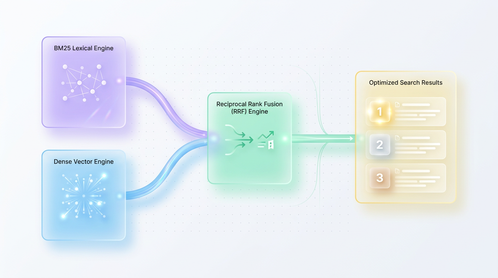
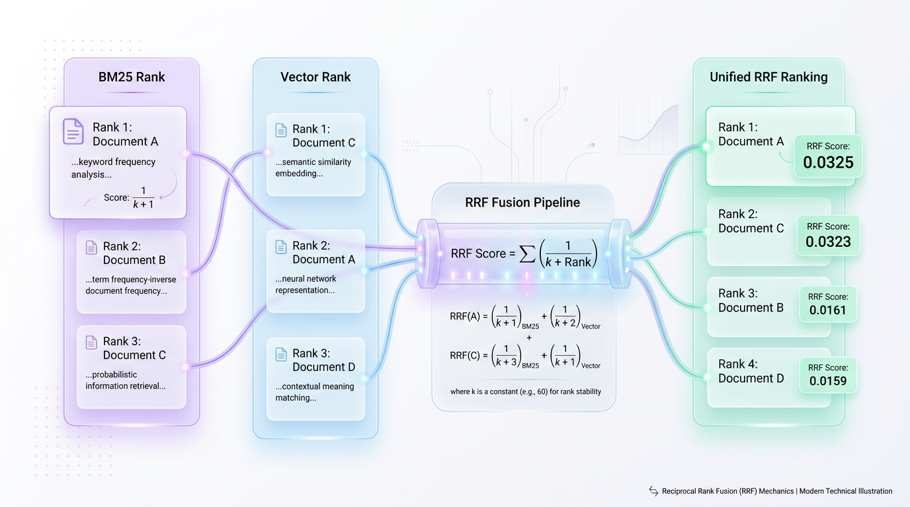
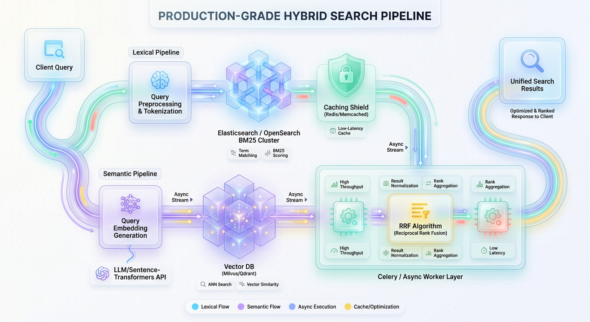

# The Retrieval Dilemma: Why Pure Vector Search Fails in Production

*Learn how to combine sparse lexical search and dense semantic vector retrieval using Reciprocal Rank Fusion to build highly accurate production RAG systems.*

*Combining the precision of lexical search with the context of vector embeddings is the only way to build a search system that is both smart and accurate.*



*Figure 1: The Hybrid Search Architecture merging BM25 and Vector Search through Reciprocal Rank Fusion (RRF).*

Vector search has been widely heralded as the ultimate evolution of search technology, promising to understand human intent and render keyword search obsolete. Yet, engineering teams deploying pure vector search to production quickly encounter a frustrating reality: it frequently fails at the most basic retrieval tasks.

The core issue is that dense embedding models, while excellent at conceptual matching, are fundamentally blind to exact token matching. This compression of text into a continuous vector space creates the **vocabulary mismatch problem**, where the system fails to retrieve exact keywords, product serial numbers, or rare technical terms.

Imagine walking into a hardware store looking for a "TX-90 Bolt." A purely semantic assistant (Vector Search) understands a bolt is a fastener and leads you to an aisle of conceptually similar wood screws. A traditional catalog clerk (Lexical Search), however, looks up the exact string "TX-90" and points you directly to the correct bin. To build a world-class search experience, you need both the intuitive assistant and the precise catalog clerk working in tandem.

## The Two Pillars: Lexical vs. Semantic Search


*Figure 2: Reciprocal Rank Fusion (RRF) alignment and mathematical score normalization.*

Modern search architecture no longer forces a choice between exact keywords and conceptual understanding. The industry has converged on **hybrid search**, an approach that runs two different retrieval methods in parallel and merges their results. To build a production-grade system, you must first master its two underlying pillars: lexical (sparse) and semantic (dense) retrieval.

### Lexical Search: The Precision of BM25
Lexical search relies on algorithms like **BM25 (Best Matching 25)**, the industry standard for sparse retrieval used by engines like Elasticsearch and OpenSearch. BM25 ranks documents based on how often search terms appear in them relative to how common those terms are across the entire database.

It excels at matching specific, unique identifiers because it values rare words over common ones. For example, matching "Kubernetes" is far more significant than matching "system." BM25 also intelligently penalizes long documents, ensuring a short, concise article on a topic isn't outranked by an encyclopedia that happens to mention the keyword once.

> ✅ **Best Practice:** Use lexical search as a "safety net" to guarantee that specific product names, error codes, serial numbers, and jargon are always retrievable.

The BM25 relevance score for a document `D` and a query `Q` is calculated as follows:

`Score(D, Q) = Σ [ IDF(qi) * (f(qi, D) * (k1 + 1)) / (f(qi, D) + k1 * (1 - b + b * (doc_length / avg_doc_length))) ]`

Here, `f(qi, D)` is the term frequency, `IDF(qi)` is the inverse document frequency, and `k1` and `b` are calibration parameters controlling term saturation and document length penalties.

### Semantic Search: The Context of Dense Vectors
While BM25 is precise, it's blind to context, synonyms, and intent. This is where dense vector search excels. This approach uses deep learning models to translate text into numerical representations called **embeddings**, which capture the conceptual meaning.

Vector search can understand that "dog" and "canine" are nearly identical concepts, even though the words share no letters. Similarity is determined not by token overlap, but by measuring the geometric distance between the query vector and document vectors in a high-dimensional space, most commonly using Cosine Similarity.

`Cosine Similarity(q, d) = (q · d) / (||q|| * ||d||)`

This formula calculates the cosine of the angle between two vectors. A score of `1.0` means they point in the exact same direction, indicating high semantic alignment.

> 💡 **Tip:** Semantic search is ideal for handling conversational queries, natural language questions, and abstract user intents where the exact keywords are unknown.

The following Python code demonstrates how a pure vector search can miss a critical product ID that a simple lexical search would find instantly.

```python
import numpy as np

# Mock database of product documents
documents = [
    {"id": 1, "text": "High-performance laptop with 16GB RAM and model code LP-990X"},
    {"id": 2, "text": "Standard business workstation laptop with 8GB RAM"},
    {"id": 3, "text": "Portable gaming console with model code LP-990Y"}
]

# A simplified mock representation of semantic vector similarity
# The model squashes "LP-990X" into the general concept of "laptops"
semantic_vectors = {
    "query": np.array([0.8, 0.6, 0.1]),  # "Looking for LP-990X"
    1: np.array([0.75, 0.65, 0.12]),      # Laptop 1 (LP-990X)
    2: np.array([0.78, 0.62, 0.08]),      # Laptop 2 (No code, but highly "laptop-like")
    3: np.array([0.30, 0.40, 0.85])       # Console (LP-990Y)
}

def cosine_similarity(v1, v2):
    return np.dot(v1, v2) / (np.linalg.norm(v1) * np.linalg.norm(v2))

# Execute Semantic Search
print("--- Semantic Search Results ---")
# Laptop 2 wins because it is more "generically laptop-like" than Laptop 1.
for doc in documents:
    score = cosine_similarity(semantic_vectors["query"], semantic_vectors[doc["id"]])
    print(f"Doc {doc['id']} (Score: {score:.4f}): '{doc['text'][:50]}...'")

# Execute Lexical Match (Exact Keyword Lookup)
print("\n--- Lexical Search Results (Looking for 'LP-990X') ---")
query_term = "LP-990X"
for doc in documents:
    score = 1.0 if query_term in doc["text"] else 0.0
    print(f"Doc {doc['id']} (Score: {score:.1f}): '{doc['text'][:50]}...'")
```

## The Fusion Challenge: Combining Incompatible Scores


*Figure 3: Production-grade asynchronous architecture with parallel execution and caching layers.*

Because neither approach is sufficient alone, production systems are rapidly adopting **hybrid search**. This pattern executes both lexical and semantic queries in parallel and then fuses their results into a single, unified list.

```text
               +------------------+
               |    User Query    |
               +--------+---------+
                        |
           +------------+------------+
           |                         |
           v                         v
+--------------------+     +--------------------+
|   Lexical Search   |     |   Vector Search    |
|   (Sparse/BM25)    |     |   (Dense/HNSW)     |
+----------+---------+     +---------+----------+
           |                         |
           |  Sparse Hits            |  Dense Hits
           v                         v
+-----------------------------------------------+
|         Hybrid Fusion & Re-ranking            |
|       (Reciprocal Rank Fusion / RRF)          |
+-----------------------+-----------------------+
                        |
                        v
           +-------------------------+
           |  Optimal Relevance List |
           +-------------------------+
```

However, this introduces a fundamental mathematical challenge: **score incompatibility**. BM25 scores are unbounded positive numbers (e.g., `28.5`), while vector similarity scores are tightly bounded (e.g., `0.0` to `1.0`). You cannot simply add them together, as the much larger BM25 scores would completely drown out the vector scores.

> ⚠️ **Common Mistake:** Naively adding or multiplying raw scores from lexical and semantic search will fail. The unbounded nature of BM25 scores renders the bounded vector scores irrelevant, breaking the hybrid balance.

## The Solution: Reciprocal Rank Fusion (RRF)
To solve the score incompatibility problem, we use **Reciprocal Rank Fusion (RRF)**, an elegant algorithm that ignores the raw scores entirely. Instead, it evaluates the position—or **rank**—of each document within its respective result list.

Imagine you're choosing a movie. One critic uses a 1-to-5 star scale, while another uses a 0-to-100 scale. Instead of trying to convert the scores, you can simply see where a movie places on each critic's Top-10 list. A movie ranked #1 by the first and #2 by the second is likely an excellent choice, regardless of their arbitrary scoring systems.

The RRF formula for a document `d` is:

`RRF_Score(d) = Σ (1 / (k + rank(d)))`

Where `rank(d)` is the position of the document in a result list, and `k` is a constant (typically `60`) that adds weight to the rank. This `k` value smooths the penalty curve, preventing top-ranked outliers in one list from dominating the final fused results.

Below is a Python function demonstrating how to merge two result lists using RRF.

```python
from typing import List, Dict, Any

def reciprocal_rank_fusion(
    lexical_results: List[str], 
    vector_results: List[str], 
    k: int = 60
) -> List[Dict[str, Any]]:
    """
    Fuses lexical and vector search results using Reciprocal Rank Fusion (RRF).
    
    Args:
        lexical_results: Ordered list of document IDs from a lexical search.
        vector_results: Ordered list of document IDs from a vector search.
        k: The constant used to smooth ranking weights.
        
    Returns:
        A sorted list of dictionaries with the document ID and its fused RRF score.
    """
    rrf_scores: Dict[str, float] = {}

    # Helper function to process a ranked list
    def score_results(results: List[str]) -> None:
        for rank, doc_id in enumerate(results, start=1):
            rrf_scores.setdefault(doc_id, 0.0)
            rrf_scores[doc_id] += 1.0 / (k + rank)

    score_results(lexical_results)
    score_results(vector_results)

    sorted_results = sorted(
        rrf_scores.items(), 
        key=lambda item: item[1], 
        reverse=True
    )

    return [{"doc_id": doc_id, "rrf_score": score} for doc_id, score in sorted_results]

# --- Verification Run ---
# Doc_C and Doc_A appear in both lists, so RRF will rank them highly.
bm25_hits = ["Doc_A", "Doc_C", "Doc_B", "Doc_D", "Doc_E"]
vector_hits = ["Doc_F", "Doc_C", "Doc_A", "Doc_G", "Doc_H"]

fused_hits = reciprocal_rank_fusion(bm25_hits, vector_hits, k=60)
print("--- Fused Hybrid Results (RRF) ---")
for rank, hit in enumerate(fused_hits, start=1):
    print(f"Rank {rank}: {hit['doc_id']} | Score: {hit['rrf_score']:.6f}")
```

## Building a Full Hybrid Search Pipeline in Python
Now, let's combine these concepts into a complete, production-ready hybrid search pipeline. This implementation uses the `rank-bm25` library for sparse retrieval and `sentence-transformers` for dense embedding generation.

First, install the required dependencies:
```bash
pip install rank-bm25 sentence-transformers numpy
```

The following class encapsulates the entire hybrid retrieval process, from indexing to searching and fusing results with RRF.

```python
import numpy as np
from rank_bm25 import BM25Okapi
from sentence_transformers import SentenceTransformer

class HybridRetriever:
    """
    A hybrid search retriever combining BM25 and dense vectors with RRF.
    """
    def __init__(self, corpus: list[str]):
        self.corpus = corpus
        self.encoder = SentenceTransformer("all-MiniLM-L6-v2")

        # 1. Initialize Sparse (BM25) Index
        tokenized_corpus = [doc.lower().split(" ") for doc in corpus]
        self.bm25 = BM25Okapi(tokenized_corpus)

        # 2. Initialize Dense (Vector) Index
        corpus_embeddings = self.encoder.encode(corpus, show_progress_bar=False)
        # Normalize for fast cosine similarity via dot product
        self.corpus_embeddings = corpus_embeddings / np.linalg.norm(
            corpus_embeddings, axis=1, keepdims=True
        )

    def _sparse_search(self, query: str, top_n: int) -> list[tuple[int, float]]:
        tokenized_query = query.lower().split(" ")
        scores = self.bm25.get_scores(tokenized_query)
        ranked_indices = np.argsort(scores)[::-1][:top_n]
        return [(idx, scores[idx]) for idx in ranked_indices if scores[idx] > 0]

    def _dense_search(self, query: str, top_n: int) -> list[tuple[int, float]]:
        query_embedding = self.encoder.encode(query, show_progress_bar=False)
        query_embedding /= np.linalg.norm(query_embedding)
        scores = np.dot(self.corpus_embeddings, query_embedding)
        ranked_indices = np.argsort(scores)[::-1][:top_n]
        return [(idx, scores[idx]) for idx in ranked_indices]

    def _reciprocal_rank_fusion(
        self,
        sparse_results: list[tuple[int, float]],
        dense_results: list[tuple[int, float]],
        k: int = 60,
    ) -> list[tuple[int, float]]:
        rrf_scores = {}
        all_docs = set(idx for idx, _ in sparse_results) | set(idx for idx, _ in dense_results)

        for doc_idx in all_docs:
            rrf_scores[doc_idx] = 0.0

        for rank, (idx, _) in enumerate(sparse_results, 1):
            rrf_scores[idx] += 1.0 / (k + rank)
        
        for rank, (idx, _) in enumerate(dense_results, 1):
            rrf_scores[idx] += 1.0 / (k + rank)
            
        return sorted(rrf_scores.items(), key=lambda x: x[1], reverse=True)

    def search(self, query: str, top_k: int = 3) -> list[dict]:
        # Retrieve a larger pool of candidates from each retriever
        candidate_pool_size = max(top_k * 3, 20)
        sparse_ranks = self._sparse_search(query, top_n=candidate_pool_size)
        dense_ranks = self._dense_search(query, top_n=candidate_pool_size)

        # Fuse the results using RRF
        fused_results = self._reciprocal_rank_fusion(sparse_ranks, dense_ranks, k=60)

        # Format final output
        results = []
        for rank, (doc_idx, rrf_score) in enumerate(fused_results[:top_k], 1):
            results.append({
                "rank": rank,
                "document": self.corpus[doc_idx],
                "rrf_score": round(rrf_score, 5),
            })
        return results

# --- Execution Example ---
knowledge_base = [
    "How to configure python virtual environments using venv.",
    "Python package management using pip and requirements files.",
    "Deep learning model optimization with PyTorch.",
    "Setting up virtual routing on AWS and GCP.",
    "Optimizing SQL database queries with indexing.",
]

retriever = HybridRetriever(knowledge_base)
query_text = "how do I start a virtual environment in python"

print(f"User Query: '{query_text}'")
top_docs = retriever.search(query_text, top_k=2)

for doc in top_docs:
    print(f"\n[Rank {doc['rank']}] (RRF Score: {doc['rrf_score']})")
    print(f"Content: {doc['document']}")
```
The output correctly prioritizes documents that are both lexically and semantically relevant, demonstrating the power of the hybrid approach.

## From Prototype to Production
Transitioning a hybrid system to production reveals new challenges in latency, cost, and relevance tuning. Here are key practices to ensure your system is fast, accurate, and scalable.

### Mitigating Latency with Asynchronous Execution
A naive hybrid search implementation executes queries sequentially, adding the latency of both systems together. This creates a severe performance bottleneck.

`Latency_Sequential = Latency_BM25 + Latency_Vector + Latency_Fusion`

By leveraging non-blocking asynchronous I/O, you can execute both network-bound queries concurrently. This reduces the total retrieval latency to that of the *slower* of the two engines.

`Latency_Parallel = max(Latency_BM25, Latency_Vector) + Latency_Fusion`

> 🚀 **Production Tip:** Always run your lexical and vector queries in parallel using tools like Python's `asyncio`. This simple architectural change can cut your P99 latency nearly in half.

```python
import asyncio
import time

async def mock_bm25_query(query: str) -> list:
    """Simulates a network call to an Elasticsearch-like service."""
    await asyncio.sleep(0.045)  # 45ms latency
    return ["Doc_A", "Doc_C", "Doc_B"]

async def mock_vector_query(query: str) -> list:
    """Simulates a network call to a vector database like Pinecone or Qdrant."""
    await asyncio.sleep(0.065)  # 65ms latency (typically slower)
    return ["Doc_F", "Doc_C", "Doc_A"]

async def concurrent_hybrid_search(query: str):
    start_time = time.perf_counter()
    
    # Schedule both coroutines to run on the event loop concurrently
    bm25_task = asyncio.create_task(mock_bm25_query(query))
    vector_task = asyncio.create_task(mock_vector_query(query))
    
    # Wait for both tasks to complete
    bm25_results, vector_results = await asyncio.gather(bm25_task, vector_task)
    
    latency_ms = (time.perf_counter() - start_time) * 1000
    print(f"Total parallel latency: {latency_ms:.2f} ms") # Should be ~65ms, not 110ms
    return bm25_results, vector_results

asyncio.run(concurrent_hybrid_search("example query"))
```

### Avoiding Generic Embeddings in Specialized Domains
Deploying a general-purpose embedding model (like `text-embedding-3-small`) for a specialized domain like medicine or finance often yields poor results. These models lack the context to understand domain-specific jargon.

For example, in a generic model, the word "driver" is semantically close to "car." In a software engineering search engine, it must cluster near "kernel" and "hardware."

*   **Generic Models:** Map domain jargon to unrelated concepts or split them into meaningless sub-tokens.
*   **Fine-Tuned Models:** Preserve precise semantic distances between industry-specific terms, like correctly matching "myocardial infarction" with "heart attack."

> ⚠️ **Common Mistake:** Using off-the-shelf embedding models for highly specialized content leads to poor semantic relevance. If you cannot fine-tune a model, ensure your critical domain-specific terms are thoroughly indexed in your lexical search layer to act as a fallback.

## Key Takeaways
*   **Pure Vector Search is Insufficient:** Relying solely on vector embeddings causes systems to fail at retrieving exact keywords, product codes, and domain-specific jargon due to the "vocabulary mismatch" problem.
*   **Hybrid Search is the Standard:** Production-grade systems combine lexical search (like BM25) for precision with vector search for semantic context, creating a solution that is both accurate and intelligent.
*   **Use RRF for Score Fusion:** Reciprocal Rank Fusion (RRF) is the superior method for merging results. It ignores incompatible raw scores and instead relies on the rank of a document in each result list, making it robust and easy to implement.
*   **Execute Queries in Parallel:** To manage latency, always run your lexical and vector search queries concurrently using asynchronous programming. This reduces total latency from the sum of both systems to the maximum of the two.
*   **Prioritize Domain-Specific Embeddings:** Generic embedding models fail in specialized domains. Fine-tune your models on domain-specific data or lean heavily on your lexical index to handle jargon, ensuring high-quality relevance.