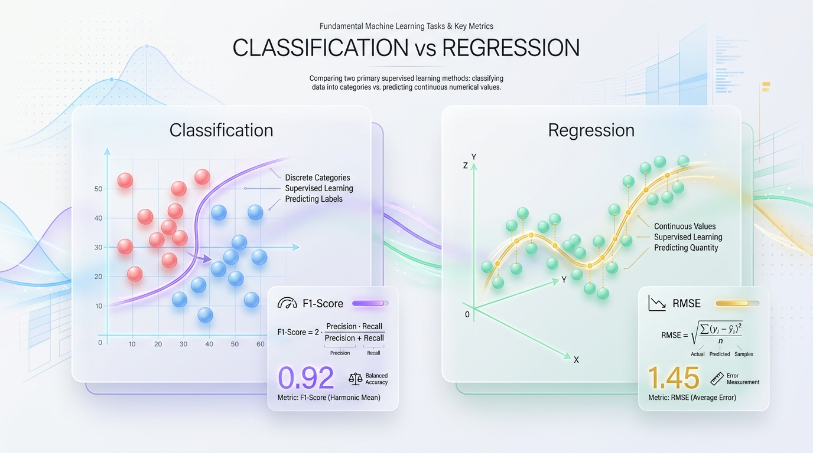
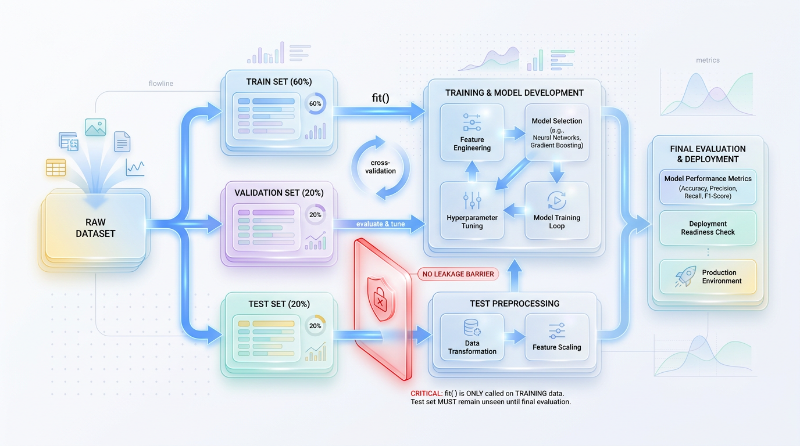

# The Labeling Engine: Why Supervised Learning Powers Modern AI

*Learn how supervised learning models map inputs to targets, write clean training pipelines, and deploy robust predictors to production.*

*Despite the rise of generative AI and self-supervised models, supervised learning remains the architectural workhorse that translates messy, real-world data into high-value automated decisions.*


*Figure 1: The core supervised learning engine: mapping inputs to targets via an iterative learning loop.*

At its core, artificial intelligence is not a mystical mind; it is a sophisticated mathematical mapping engine. The goal of supervised learning is to discover a hidden function, `f`, that reliably maps a set of inputs, `x`, to a known set of outputs, `y`. In algebra, we express this relationship with the elegant equation `y = f(x)`.

In this context, `x` represents your input features—historical house data, patient vitals, or image pixels—while `y` represents the ground-truth label you want to predict, such as a home price, a disease diagnosis, or an object's class. The magic of machine learning lies in its ability to approximate this function `f` automatically from data.

## The Student and the Answer Key


*Figure 2: Classification (discrete boundaries) vs. Regression (continuous trends) with their primary evaluation metrics.*


To understand how a machine learns this mapping, imagine a student preparing for an exam using a practice workbook. This workbook contains thousands of questions (`x`), but crucially, it also includes a comprehensive answer key (`y`) at the back.

The student attempts a question and, at first, makes a wild guess. They immediately flip to the back, compare their guess to the correct answer, and measure how far off they were. With each corrected mistake, the student refines their mental model.

Eventually, after practicing on enough diverse questions, they stop memorizing individual answers and start grasping the underlying principles. On exam day, they can accurately answer brand-new, unseen questions because they have successfully reverse-engineered the problem-solving function.

> ✅ **Best Practice:** The "answer key" is your labeled dataset. The process of checking the key, calculating the error, and adjusting your study strategy is the exact computational loop a neural network uses to minimize its loss function.

## From Intuition to the Optimization Loop


*Figure 3: Secure data splitting and pipeline architecture designed to prevent data leakage.*


In a production system, we translate this educational analogy into an iterative algorithmic pipeline driven by a **Loss Function** and an **Optimizer**.

First, the model takes an input `x` and makes a prediction, which we'll call `y_pred`. The Loss Function acts as our grader, calculating a numerical score representing how far `y_pred` deviated from the actual ground truth `y`.

Next, the Optimizer—typically an algorithm like Gradient Descent—uses this loss score to calculate how to adjust the model's internal parameters (its weights and biases). By shifting these weights slightly in the direction that reduces error, the model becomes marginally more accurate. This loop repeats millions of times until the model's error minimizes to an acceptable level.

```text
[ Input Data (x) ] ---> [ Model (f) ] ---> [ Prediction (y_pred) ]
                                                   |
                                                   v
[ Label (y) ] <---------------------------- [ Loss Function ]
                                                   | (Calculates Error)
                                                   v
[ Optimizer ] ------------------------> [ Adjust Weights ]
  (Gradient Descent)
```

### Code in Action: Approximating `y = 2x + 1`

Let's watch this mathematical engine in action. We'll build a simple linear regression model using Python and `scikit-learn` to approximate the true function `y = 2x + 1` from a synthetic dataset.

```python
import numpy as np
from sklearn.linear_model import LinearRegression

# 1. Generate synthetic input features (x)
# Create 100 random data points to represent our inputs.
np.random.seed(42)
x = np.random.rand(100, 1) * 10

# 2. Define the true underlying mapping function (y = 2x + 1)
# Add a small amount of random noise to simulate messy, real-world data.
noise = np.random.randn(100, 1) * 0.5
y = 2 * x + 1 + noise

# 3. Instantiate the supervised learning model.
# Linear Regression is an algorithm designed to find linear mapping functions.
model = LinearRegression()

# 4. Train the model using the labeled dataset (x, y).
# This is the "optimization loop" where the model learns the function f.
model.fit(x, y)

# 5. Extract the learned parameters from the model.
learned_coefficient = model.coef_[0][0]
learned_intercept = model.intercept_[0]

# Explain the output: The model should closely approximate the slope of 2 and intercept of 1.
print(f"True Function:    y = 2.00 * x + 1.00")
print(f"Learned Function: y = {learned_coefficient:.2f} * x + {learned_intercept:.2f}")

# 6. Make a prediction on brand-new, unseen data.
unseen_x = np.array([[5.0]])
predicted_y = model.predict(unseen_x)
print(f"Prediction for x=5: {predicted_y[0][0]:.2f} (Expected close to 11.0)")
```

The model never saw the formula `y = 2x + 1`. It was only given pairs of `x` and `y` coordinates. Through optimization, it successfully reverse-engineered the underlying relationship, allowing it to generalize and make accurate predictions for completely new inputs.

## Architectural Boundaries: Supervised vs. Other Paradigms

While supervised learning is incredibly powerful, it's only one branch of the machine learning family tree. To build robust AI systems, you must know when to use it over its alternatives based on your data constraints and business objectives.

*   **Supervised Learning**
    *   **Data Requirement:** Requires fully labeled pairs of inputs (`x`) and targets (`y`).
    *   **Feedback Mechanism:** Explicit error correction via a loss function using ground-truth labels.
    *   **Core Objective:** Map new inputs to known target classes or continuous values.
    *   **Common Use Cases:** Fraud detection, medical image segmentation, sentiment analysis, and price forecasting.

*   **Unsupervised Learning**
    *   **Data Requirement:** Works with unlabeled data containing only inputs (`x`).
    *   **Feedback Mechanism:** Self-guided discovery of patterns, densities, or structures without external answers.
    *   **Core Objective:** Find hidden groupings, associations, or low-dimensional representations in data.
    *   **Common Use Cases:** Customer segmentation, anomaly detection, and dimensionality reduction.

*   **Reinforcement Learning**
    *   **Data Requirement:** Requires an interactive environment, an agent, and a state space.
    *   **Feedback Mechanism:** Delayed reward or penalty signals received after taking actions within the environment.
    *   **Core Objective:** Learn an optimal sequence of decisions (a policy) to maximize cumulative rewards over time.
    *   **Common Use Cases:** Game-playing agents (AlphaGo), autonomous driving, and robotic manipulation.

If you have high-quality, labeled historical data and want to automate predictions, supervised learning is your optimal architectural choice.

## Classification vs. Regression: The Two Faces of Supervised Learning

Supervised learning splits into two primary domains: classification and regression. The distinction hinges on the type of question you are asking your model to answer. Are you choosing a label from a predefined list, or are you estimating a specific number?

### The Core Difference: Sorting vs. Measuring

In **classification**, the goal is to predict a discrete category. Your output is a label, such as "Spam" or "Not Spam," or an image category like "Cat," "Dog," or "Airplane." The model's job is to draw decision boundaries that separate data points into distinct buckets.

In **regression**, the goal is to predict a continuous numerical value. Your output is a point on a real number line, such as a house price of $415,200 or tomorrow's temperature of 72.4 degrees Fahrenheit. Here, the model fits a continuous curve to the data points to project future values.

> 💡 **Tip:** Classifiers sort items into buckets. Regressors measure and predict a specific quantity.

### Foundational Algorithms

To build these systems, we rely on a few foundational algorithms that serve as the bedrock for both tasks.

#### Logistic Regression (The Classification Specialist)
Despite its name, **Logistic Regression** is a classification algorithm. It estimates the probability that an input belongs to a specific class by passing a linear combination of inputs through the Sigmoid function, which squashes any real-valued number into a probability range between 0 and 1.

`P(y = 1 | x) = 1 / (1 + e^(-z))`, where `z` is a linear equation like `w_1*x_1 + ... + b`.

#### Decision Trees (The Versatile Splitting Engine)
**Decision Trees** build a flowchart-like structure to segment data. They ask a series of nested, binary questions to partition the data into increasingly pure subsets. In classification, splits maximize **Information Gain**, while in regression, splits minimize the **Variance** within each leaf node.

#### Support Vector Machines (The Margin Maximizer)
**Support Vector Machines (SVMs)** project data into high-dimensional spaces to find an optimal decision boundary. For classification, this boundary maximizes the margin between classes. For regression, the objective flips: the algorithm tries to fit as many data points as possible *inside* a boundary corridor around the regression line.

### Why Metrics Matter

You cannot evaluate a regressor with classification metrics or vice-versa. Understanding why is crucial for building robust models.

For **classification**, we use metrics like the **F1-Score**, which is the harmonic mean of Precision and Recall. This is vital for imbalanced datasets, where simple accuracy can be misleading. A model that correctly identifies 99% of "Not Spam" emails but misses 100% of "Spam" emails has 99% accuracy but is completely useless. The F1-Score penalizes this imbalance heavily.

`F1-Score = 2 * (Precision * Recall) / (Precision + Recall)`

For **regression**, predictions are rarely exact. Instead, we measure the average prediction error with **Root Mean Squared Error (RMSE)**. We square the errors to penalize larger mistakes more heavily and to prevent positive and negative errors from canceling each other out. Taking the square root at the end returns the error metric to the original units, making it easy to interpret.

`RMSE = sqrt( (1 / N) * Σ (y_actual - y_predicted)^2 )`

## From Sandbox to Production: Building Resilient Pipelines

Moving a model from a local notebook to a production environment is where most ML projects fail. A model is not a static artifact; it's a dynamic system that demands a disciplined architecture to survive contact with real-world data.

The cornerstone of this architecture is a clean training pipeline that prevents **data leakage**. Leakage occurs when information from the validation or test set accidentally drips into the training process, leading to overly optimistic metrics during development and catastrophic failures in production.

> ⚠️ **Common Mistake:** Calling `fit()` or `fit_transform()` on your entire dataset before splitting it. This allows the model to "peek" at the test set, making your evaluation metrics meaningless. Any scaling or imputation parameters must be learned *only* from the training data.

A robust pipeline automates preprocessing and model training in a strict, sequential order, making data leakage programmatically impossible.

```text
[ Raw Data Input ]
       │
       ▼
[ Split Dataset ] ──────► [ Holdout Test Set ] (Keep completely isolated)
       │
       ▼
[ Training Set ]
       │
   (Compute Mean/Std Dev)
       │
       ▼
[ Fit Preprocessor ] ───► [ Transform Training Data ] ───► [ Train Model ]
       │                                                         │
       └────────────────► [ Transform Test Data ] ───────► [ Evaluate Model ]
                             (Apply cached Mean/Std Dev)
```

### Implementing a Leak-Proof Scikit-Learn Pipeline

The most idiomatic way to enforce this separation in Python is by using `scikit-learn`'s `Pipeline` and `ColumnTransformer`. These utilities package preprocessing and modeling into a single, unified object.

The following production-ready script demonstrates how to build, train, and evaluate a clean pipeline that handles missing values, scales numerical features, and encodes categorical features safely.

```python
import numpy as np
import pandas as pd
from sklearn.model_selection import train_test_split
from sklearn.compose import ColumnTransformer
from sklearn.pipeline import Pipeline
from sklearn.impute import SimpleImputer
from sklearn.preprocessing import StandardScaler, OneHotEncoder
from sklearn.ensemble import RandomForestClassifier
from sklearn.metrics import classification_report

# 1. Generate a synthetic dataset with mixed data types and missing values.
np.random.seed(42)
data = pd.DataFrame({
    'age': np.random.randint(18, 70, size=1000).astype(float),
    'income': np.random.exponential(scale=50000, size=1000),
    'department': np.random.choice(['Sales', 'Engineering', 'Marketing', None], size=1000),
    'subscribed': np.random.choice([0, 1], size=1000, p=[0.7, 0.3])
})
data.loc[data.sample(frac=0.05).index, 'age'] = np.nan # Introduce missing values

# 2. Separate features (X) and target (y), then strictly partition the data.
X = data.drop(columns=['subscribed'])
y = data['subscribed']
X_train, X_test, y_train, y_test = train_test_split(
    X, y, test_size=0.20, random_state=42, stratify=y
)

# 3. Define separate preprocessing pipelines for numeric and categorical features.
numeric_features = ['age', 'income']
numeric_transformer = Pipeline(steps=[
    ('imputer', SimpleImputer(strategy='median')), # Learns median from training data only
    ('scaler', StandardScaler())                   # Learns mean/std from training data only
])

categorical_features = ['department']
categorical_transformer = Pipeline(steps=[
    ('imputer', SimpleImputer(strategy='constant', fill_value='missing')),
    ('onehot', OneHotEncoder(handle_unknown='ignore')) # Handles new categories in test data
])

# 4. Combine preprocessors into a single ColumnTransformer object.
preprocessor = ColumnTransformer(
    transformers=[
        ('num', numeric_transformer, numeric_features),
        ('cat', categorical_transformer, categorical_features)
    ])

# 5. Construct the final, unified training pipeline.
pipeline = Pipeline(steps=[
    ('preprocessor', preprocessor),
    ('classifier', RandomForestClassifier(n_estimators=100, random_state=42))
])

# 6. Fit the entire pipeline on the training data.
pipeline.fit(X_train, y_train)

# 7. Evaluate on the completely isolated test set.
# The pipeline automatically applies the transformations learned from the training data.
y_pred = pipeline.predict(X_test)

print("Classification Report on Test Set:")
print(classification_report(y_test, y_pred))
```

## The Bias-Variance Tradeoff: Diagnosing Model Failures

Even with a perfect pipeline, models can fail. A model's generalization error is governed by the **Bias-Variance Tradeoff**.

*   **Bias** represents simplifying assumptions a model makes. High bias leads to **underfitting**, where the model is too simple to capture underlying patterns.
*   **Variance** represents the model's sensitivity to the training data. High variance leads to **overfitting**, where the model memorizes noise instead of learning general rules.

We diagnose these issues using **validation curves**, which plot training and validation error against model complexity.

*   **Underfitting:** Both training and validation errors are high and close together. The model is too simple.
*   **Overfitting:** Training error is low, but validation error is high. The model has memorized the training set and cannot generalize.

> 🚀 **Production Tip:** When a model overfits, you can constrain its complexity using **L1 and L2 regularization**, which penalize large model weights, or **Dropout**, which randomly deactivates neurons during training to force the network to learn redundant representations.

## The Reality of Production: Data and Concept Drift

Once deployed, a model's performance inevitably degrades over time due to **production drift**.

*   **Data Drift:** The distribution of your input data `P(X)` changes. For example, a heatwave in winter shifts shopping patterns from coats to t-shirts.
*   **Concept Drift:** The relationship between your inputs and outputs `P(Y|X)` changes. For example, a sudden price hike makes a previously popular product unpopular, even though its features are the same.

To combat drift, engineering teams must implement continuous monitoring systems. By tracking the statistical distance between production data and the original training data, you can trigger automated retraining pipelines when performance begins to slip, ensuring your model adapts to the world as it changes.

## Key Takeaways

*   Supervised learning approximates a function `y = f(x)` using labeled data, driven by an optimization loop that iteratively minimizes a loss function.
*   It splits into two core tasks: **classification** for predicting discrete labels (evaluated with F1-Score) and **regression** for predicting continuous values (evaluated with RMSE).
*   A leak-proof training architecture using `scikit-learn`'s `Pipeline` and `ColumnTransformer` is essential to prevent test data from influencing the training process and to ensure reliable evaluation.
*   The **Bias-Variance Tradeoff** governs model performance. Underfitting (high bias) and overfitting (high variance) are diagnosed with validation curves and mitigated with techniques like regularization and dropout.
*   Production models degrade over time due to **data drift** and **concept drift**, requiring continuous monitoring and automated retraining pipelines to maintain accuracy in a changing environment.