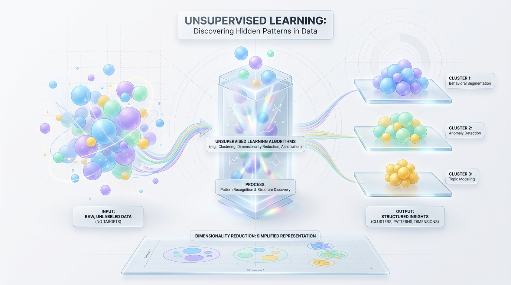
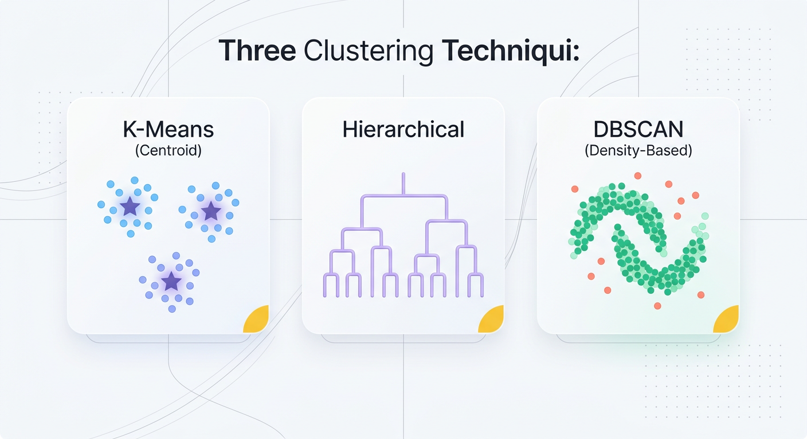
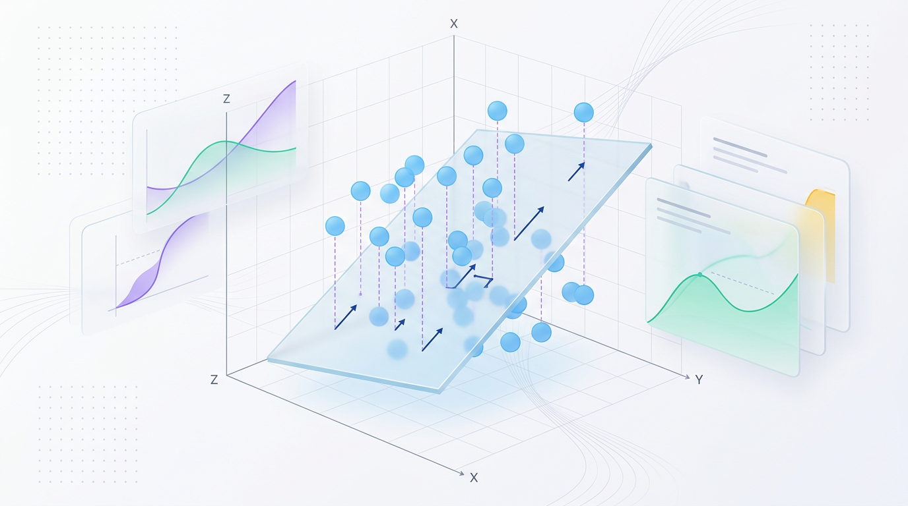

# Beyond Labels: The Power of Unsupervised Learning

*Discover how algorithms find hidden structures and insights from raw data without any predefined labels or human supervision.*

*Unsupervised learning offers a groundbreaking way to explore data and discover patterns without relying on predefined labels.*



*Figure 1: The core paradigm of Unsupervised Learning: extracting order, clusters, and low-dimensional structures from raw, unlabeled datasets.*

## Introduction


*Figure 2: Three classic approaches to grouping unlabeled data: Centroid, Hierarchical, and Density-Based clustering.*


In the realm of machine learning, unsupervised learning operates without the constraints of pre-labeled data. Unlike supervised learning, which uses input-output pairs like a teacher guiding students, unsupervised learning examines data with fresh eyes, free from predefined categories. Imagine entering a library where every book is scattered on the floor, without knowing their genres or authors. Your task is to organize these books meaningfully, akin to unsupervised learning's role in uncovering hidden structures within data.

> 💡 Tip: Unsupervised learning is a powerful tool for exploratory data analysis, pattern discovery, and data preprocessing.

## Clustering: Grouping the Unknown Together


*Figure 3: Visualizing PCA: High-dimensional data points projected onto a 2D principal component axis, preserving variance and maximizing data separation.*


Clustering is a fundamental unsupervised learning task that groups unlabeled data points into meaningful clusters. This technique is essential for pattern recognition, data compression, and customer segmentation.

### K-Means Algorithm

The K-Means algorithm is a straightforward and popular clustering technique. It partitions a dataset into `K` distinct clusters, where each point belongs to the cluster with the nearest mean, or centroid.

- **Iterative Process**:
  1. **Initialization**: Select `K` random centroids.
  2. **Assignment**: Assign data points to the nearest centroid.
  3. **Recalculation**: Update centroids by calculating the mean.
  4. **Repeat**: Iterate steps 2 and 3 until centroids stabilize.

```python
from sklearn.cluster import KMeans
import numpy as np

# Example data
data = np.array([[1.0, 2.0], [1.5, 1.8], [5.0, 8.0], [8.0, 8.0]])

# Initialize K-Means with 2 clusters
kmeans = KMeans(n_clusters=2)
kmeans.fit(data)

# Display cluster centers
print(kmeans.cluster_centers_)  # Centroids: points representing each cluster
```

### Hierarchical Clustering

Hierarchical clustering constructs a dendrogram to illustrate nested clusters, using either agglomerative or divisive approaches. Hierarchical methods capture data hierarchy and do not require the number of clusters upfront.

### Density-Based Clustering: DBSCAN

DBSCAN groups points based on density, identifying clusters and labeling distant points as noise. Choose DBSCAN when non-regular cluster shapes and noise handling are crucial.

> ✅ Best Practice: Select the appropriate clustering technique based on dataset characteristics and problem requirements.

## Dimensionality Reduction: Simplifying for Clarity

Dimensionality reduction simplifies high-dimensional data, extracting meaningful features while reducing noise for improved model performance and visualization.

### Principal Component Analysis (PCA)

PCA is a linear technique that captures maximum variance while reducing dimensions.

- **Concept**: Summarize complex data with fewer components by identifying principal axes of variance.

```python
from sklearn.decomposition import PCA
import numpy as np

# Sample dataset with three features
data = np.array([[2.5, 2.4, 8.0],
                 [0.5, 0.7, 2.0],
                 [2.2, 2.9, 4.0],
                 [1.9, 2.2, 1.5]])

# Apply PCA to reduce to 2 dimensions
pca = PCA(n_components=2)
reduced_data = pca.fit_transform(data)

print(reduced_data)  # Transformed dataset to 2D
```

### Non-linear Techniques: t-SNE and UMAP

For high-dimensional data, non-linear methods like t-SNE and UMAP are ideal for maintaining local relationships and visual exploration.

> 💡 Tip: Use non-linear techniques when linear methods like PCA fall short in capturing complex patterns.

## Best Practices, Mistakes & Production Tips

### Feature Scaling is Essential

Feature scaling is crucial for distance-based algorithms like K-Means and PCA.

- **Standardization**: Adjusts features to have zero mean and unit variance.
- **Normalization**: Rescales features to a fixed range (e.g., [0, 1]).

```python
from sklearn.preprocessing import StandardScaler, MinMaxScaler

# Standardization example
scaler = StandardScaler()
standardized_data = scaler.fit_transform(raw_data)

# Normalization example
normalizer = MinMaxScaler()
normalized_data = normalizer.fit_transform(raw_data)
```

### Evaluate Clusters with Confidence

Evaluate unsupervised models using metrics like the Silhouette Score and Davies-Bouldin Index for quality assurance.

> 🚀 Production Tip: Use unsupervised learning as a preprocessing step for feature engineering, enriching supervised models with derived features.

## Key Takeaways

- Unsupervised learning is vital for exploring unlabeled data to uncover hidden patterns and insights.
- Clustering techniques such as K-Means, hierarchical clustering, and DBSCAN cater to different data shapes and noise levels.
- Dimensionality reduction via PCA, t-SNE, and UMAP refines data analysis and visualization.
- Feature scaling is essential for effective distance-based algorithm performance.
- Unsupervised techniques excel in preprocessing, augmenting supervised models for robust performance.