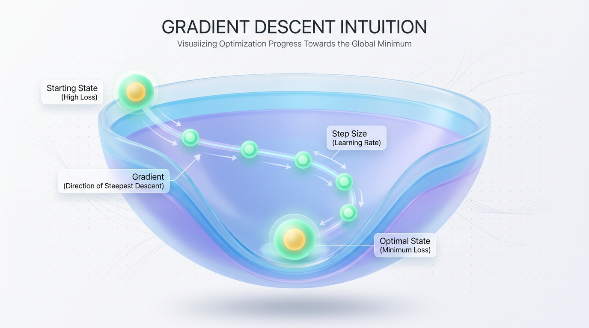
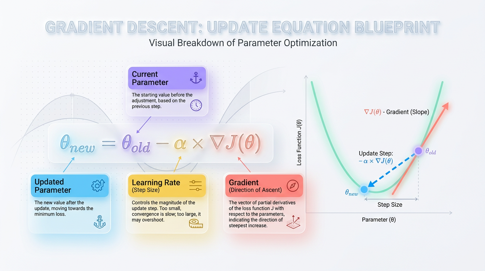
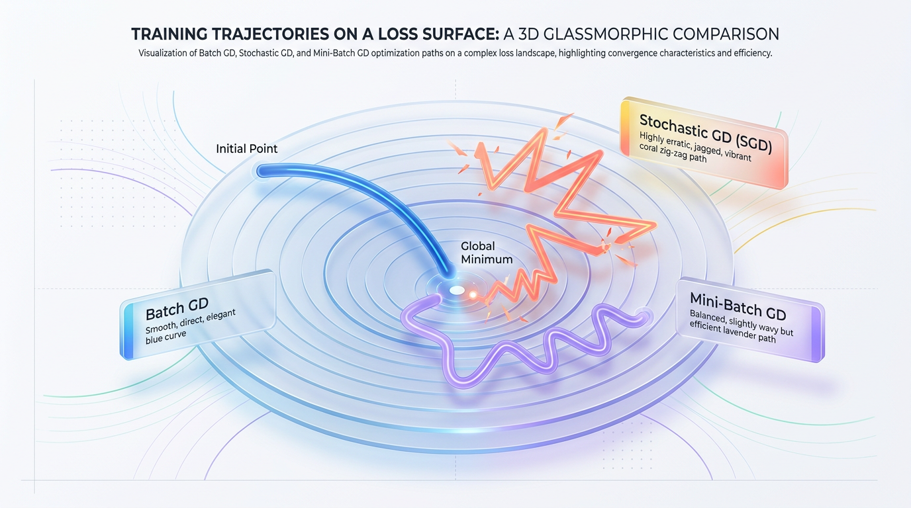
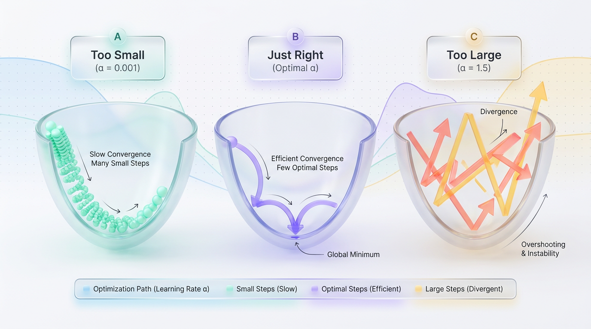

# Why Your AI Needs a Compass

*Visualize the core algorithm that powers machine learning by seeing how models find the best parameters by minimizing error one step at a time.*

*Gradient Descent guides AI models, much like a hiker navigating a foggy valley, seeking optimal performance by minimizing prediction errors.*



*Figure 1: The Intuitive Journey of Gradient Descent — Navigating the Loss Landscape to Find the Global Minimum.*

## The Core Problem


*Figure 2: Deconstructing the Gradient Descent Update Equation with Visual Mechanics.*


In machine learning, our goal is to minimize a 'cost' or 'loss' function, synonymous with finding the valley's lowest point in our hiker analogy. The **loss function** measures how far off a model’s predictions are from actual outcomes, and minimizing this function fine-tunes the model parameters for better accuracy.

> **Key Takeaway:** As a hiker seeks the valley's lowest point, your AI aims to minimize its cost function to achieve peak performance.

## Visualizing the Terrain


*Figure 3: Path Comparison of Batch, Stochastic, and Mini-Batch Gradient Descent Variants.*


- **Parameters**: Comparable to the hiker’s coordinates, defining the AI model’s current position.
- **Loss Function**: Illustrates the terrain's shape, with steep slopes indicating high prediction deviations.
- **Learning Rate**: Analogous to the hiker's step size; a small rate allows careful navigation, possibly lengthening the journey.

## The Descent Process


*Figure 4: The Impact of Learning Rate (α) on Optimization Behavior.*


Training a model involves iterative adjustments, where each step assesses the "slope" — the rate at which the loss function changes with parameter shifts — to determine the optimal movement direction.

```python
# Pseudocode for a simple gradient descent step
def gradient_descent_step(parameters, learning_rate, gradient):
    new_parameters = parameters - learning_rate * gradient
    return new_parameters

parameters = 10
learning_rate = 0.1
gradient = 3

updated_parameters = gradient_descent_step(parameters, learning_rate, gradient)
print(updated_parameters)  # Output: 9.7
```

This code demonstrates a basic gradient descent update, where parameters are adjusted opposite to the gradient, guiding the AI model towards optimality.

## The Math Under the Hood: From Slopes to Steps

Gradient Descent's mechanics revolve around the **Cost Function**, J(θ), which quantifies prediction inaccuracy. Lower J(θ) implies better predictions, thus minimizing it is crucial.

**The Gradient** (∇J(θ)) acts as a compass, suggesting direction. In mathematical terms, it's a vector of partial derivatives pointing towards the steepest ascent. Since our objective is minimization, steps are directed away from ascent and towards steepest descent.

- **θ_new = θ_old - α * ∇J(θ)**:
  - **θ (theta):** Current variable adjustments for cost reduction.
  - **α (alpha):** Step size controller.
  - **∇J(θ):** Cost function gradient at current parameters, guiding updates.

```python
# Simple Gradient Descent on y = x^2

alpha = 0.1
theta = 3.0

for i in range(10):
    gradient = 2 * theta
    theta -= alpha * gradient
    print(f"Iteration {i+1}: theta = {theta}, cost = {theta**2}")
```

> **Key Takeaway:** Gradient Descent guides parameter adjustments through informed steps directed by gradients to minimize prediction errors effectively.

## Batch, Mini-Batch, & Stochastic: Choosing Your Path

In Gradient Descent, selecting between **Batch**, **Stochastic**, and **Mini-Batch Gradient Descent** impacts training efficiency and efficacy.

### Batch Gradient Descent

- **Concept**: Utilizes the entire dataset for each gradient calculation.
- **Analogy**: Filling a pool with a bucket; precise but time-consuming.
- **Consideration**: Highly accurate; impractical for large datasets due to computational intensity.

### Stochastic Gradient Descent (SGD)

- **Concept**: Updates based on a random single data point.
- **Analogy**: Filling a pool with a water pistol; quick but uneven.
- **Consideration**: Faster with higher convergence variance, potentially leading to suboptimal outcomes.

### Mini-Batch Gradient Descent

- **Concept**: Uses small data batches for gradient calculations.
- **Analogy**: Filling a pool with a medium-sized bucket; balanced between speed and stability.
- **Consideration**: Efficient convergence with balanced optimization; preferred for deep learning.

> **Key Takeaway:** Mini-Batch GD generally achieves a balanced trade-off between speed and accuracy, offering quicker, more reliable convergence.

## Production Tips, Pitfalls & Best Practices

Optimizing Gradient Descent's application requires understanding critical aspects. Here's how you can harness its strength and mitigate common pitfalls.

### The Learning Rate (α)

**Concept:** The learning rate influences step size per iteration towards a minimum.

**Explanation:** An inappropriate learning rate leads to either divergence (if too high) or slow convergence (if too low).

```python
import numpy as np
import matplotlib.pyplot as plt

steps = np.arange(0, 30, 0.1)
high_lr = np.sin(steps ** 1.5)
low_lr = steps ** 0.5

plt.plot(steps, high_lr, label="High LR: Divergence")
plt.plot(steps, low_lr, label="Low LR: Slow Convergence")
plt.xlabel("Steps")
plt.ylabel("Loss")
plt.title("Learning Rate Impact")
plt.legend()
plt.show()
```

*The plot illustrates convergence variations due to different learning rates.*

### Feature Scaling is Crucial

**Concept:** Ensures equal contribution from all features to the distance calculation.

**Explanation:** Without scaling, uneven feature scales skew model parameter updates, affecting optimization paths.

### Local Minima & Saddle Points

**Concept:** These are optimization traps that stall progress in complex landscapes.

**Explanation:** Common in deep networks, where traditional Gradient Descent struggles.

### Optimizers Beyond Vanilla GD

**Concept:** Advanced optimizers adjust learning processes with dynamic parameter handling.

**Benefits:** Techniques like Adam and RMSprop adaptively manage learning rates for quicker, stable convergence.

> **Advanced Optimizers**: Act like GPS, dynamically guiding the optimization path for efficient convergence.

## Key Takeaways

- Gradient Descent minimizes a model's cost function, refining prediction accuracy.
- Learning rate consistency is crucial for balancing speed and accuracy.
- Mini-Batch GD combines speed and stability, ideal for deep learning applications.
- Feature scaling is essential for optimal performance.
- Advanced optimizers like Adam offer dynamic adaptability for enhanced learning efficiency.