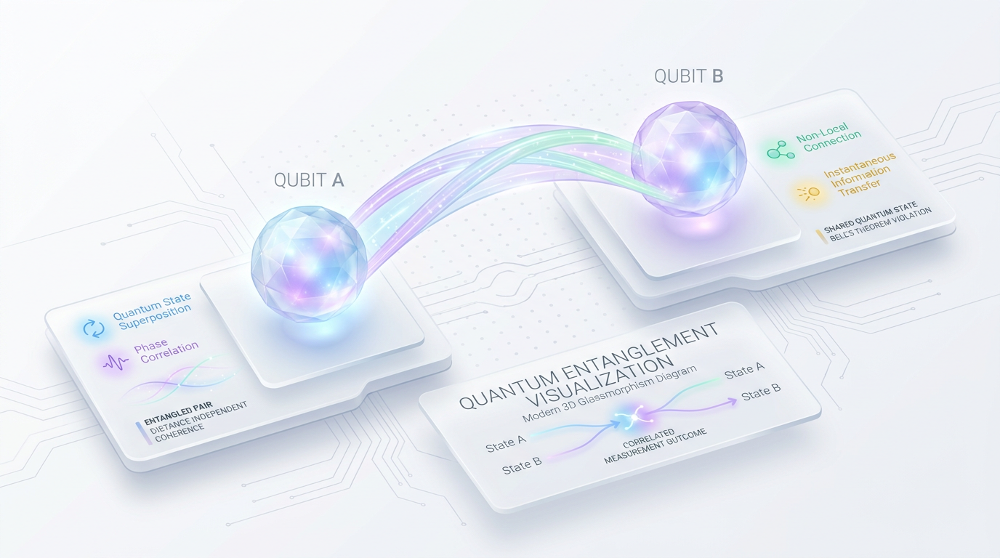
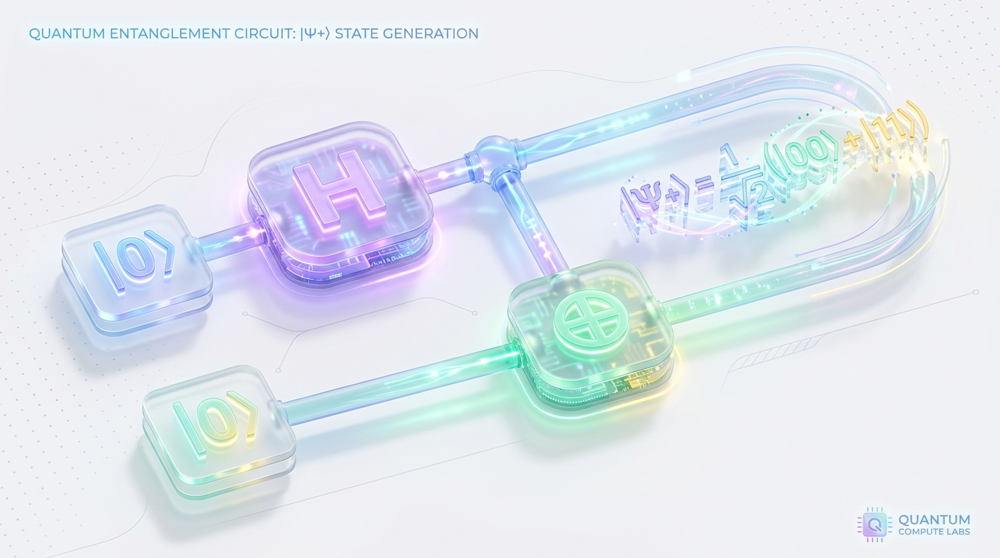
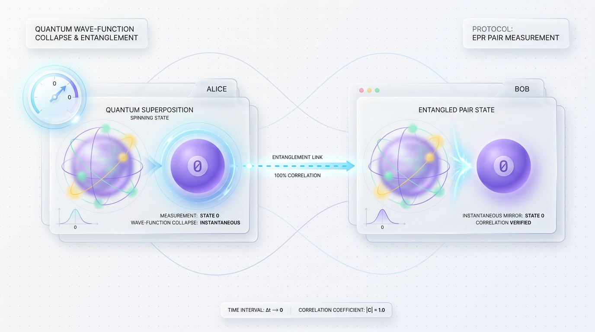
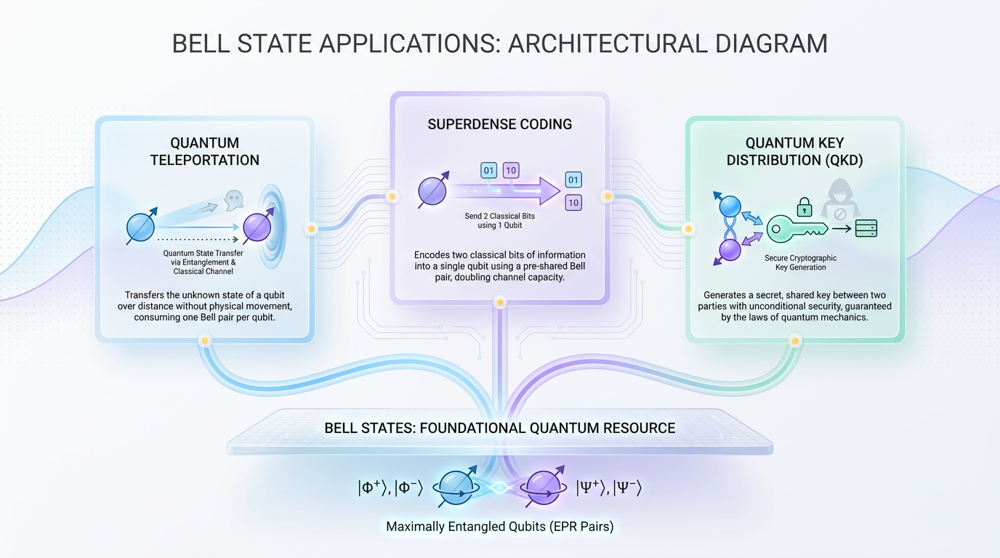

# 'Spooky Action': An Intuition for Quantum Entanglement

*Unpack the simplest form of quantum entanglement, where the state of two qubits becomes perfectly correlated, no matter how far apart they are.*

*Understanding quantum entanglement through the lens of the Bell state.*



*Figure 1: The Bell State as the fundamental 'Hello, World!' of Quantum Entanglement.*

Imagine a "magic coin" split into two halves that you and a friend can independently observe. No matter the distance, knowing the state of one half tells you the state of the other instantly. This is akin to the concept of **quantum entanglement**.

At the core of quantum entanglement is the **Bell state**, a two-qubit quantum system illustrating "spooky action at a distance," a phrase coined by Albert Einstein. This article aims to demystify the Bell state: its creation, properties, and significance in quantum computing, challenging our traditional worldview and forming a cornerstone for quantum technologies.

## Circuit Logic: How to Create a Bell State


*Figure 2: The step-by-step quantum circuit for generating the |Ψ+⟩ Bell State.*


Creating a **Bell state** is fundamental to showcasing quantum entanglement. Let's break it down step-by-step with a simple two-qubit system.

### Initial State: |00⟩

Start with two qubits initialized in the base state |00⟩, where both are in the computational basis state |0⟩. This is before any operations are applied.

### Step 1: Apply the Hadamard Gate

The **Hadamard gate** (H) creates quantum superpositions.

- **Explanation:** Applying the H gate to the first qubit changes it from |0⟩ into a superposition of |0⟩ and |1⟩.

- **Analogy:** Like flipping a coin where the coin simultaneously holds heads (|0⟩) and tails (|1⟩).

- **Technical Insight:** |0⟩ becomes (1/√2)(|0⟩ + |1⟩), distributing the probabilistic amplitude across two states.

```python
from qiskit import QuantumCircuit

qc = QuantumCircuit(2)  # Initialize circuit with 2 qubits
qc.h(0)  # Apply Hadamard to the first qubit
qc.draw('mpl')
```

### Step 2: Apply the Controlled-NOT Gate

The **Controlled-NOT (CNOT) gate** establishes quantum entanglement.

- **Explanation:** Using CNOT with the first qubit as control and the second as target links their states based on the first qubit's outcome.

- **Analogy:** Two people holding hands—if one moves, the other mirrors, aligning together.

- **Technical Insight:** The CNOT flips the second qubit if the first is |1⟩, creating the entangled state (1/√2)(|00⟩ + |11⟩), known as |Φ+⟩.

```python
qc.cx(0, 1)  # Apply CNOT with qubit 0 as control and qubit 1 as target
qc.draw('mpl')
```

> 💡 Tip: The Hadamard followed by CNOT creates a Bell state, illustrating quantum mechanics' superposition and entanglement.

## The Payoff: Measurement and Correlated Fates


*Figure 3: Non-local measurement collapse: observing one qubit instantly determines the state of the other.*


In quantum entanglement, measuring one qubit in a Bell pair immediately affects the other.

### Real-world Analogy: The Dice Game

Imagine a dice game with a twist: you and a friend roll dice secretly. Checking one die and seeing a one means your friend's must be a one too. This randomness showcases measurement correlation.

### Technical Explanation

Consider the Bell state |Φ+⟩ (|00⟩ + |11⟩) / √2. Before measurement, neither qubit is definitively |0⟩ or |1⟩, existing in shared states.

- **Measurement of First Qubit as |0⟩**:
  - The system collapses into |00⟩, making the second qubit |0⟩.
  
- **Measurement of First Qubit as |1⟩**:
  - The collapse to |11⟩ ensures the second qubit is |1⟩.

> 💡 Tip: Individual outcomes stay random in a Bell pair, but measurement reveals perfect correlation between the qubits.

### Code Example

Using `qiskit`, simulate and measure a Bell state to see this correlation.

```python
from qiskit import QuantumCircuit, Aer, execute
from qiskit.visualization import plot_histogram

qc = QuantumCircuit(2, 2)  # Create a 2-qubit, 2-classical bit circuit

qc.h(0)  
qc.cx(0, 1)
qc.measure([0,1], [0,1])

simulator = Aer.get_backend('qasm_simulator')
job = execute(qc, simulator, shots=1000)
result = job.result()

counts = result.get_counts()
print(counts)
plot_histogram(counts)
```

## Protocols in Practice: Where Bell States Shine


*Figure 4: The three pillars of quantum communications powered by Bell States.*


**Bell states** are crucial, underpinning many algorithms and protocols due to their entanglement properties.

### Quantum Teleportation

Through quantum teleportation, information leaps across distances via a shared Bell state. The sender uses specific measurements and classical bits to transfer quantum information to the receiver.

- **Analogy:** Entangled socks reveal color instantly when viewed, despite distance.

### Superdense Coding

Superdense coding enables sending two classical bits using one qubit, boosting bandwidth efficiency.

### Quantum Key Distribution (QKD)

Protocols like **E91** use Bell states to detect eavesdroppers. Any observation disrupts the entanglement, signaling potential data breaches.

### Foundation for Algorithms

Bell states are fundamental for achieving **quantum advantage**. Their manipulation assists in algorithms surpassing classical capabilities.

> 🚀 Production Tip: Bell states aren't just theoretical; they're pivotal in current quantum technology advancements, forming the basis for communication and computation breakthroughs.

## Common Mistakes, Pitfalls & Production Tips

### Mistake: Assuming Perfect Entanglement

Entanglement isn't always perfect. *Decoherence* can degrade correlation, resulting in errors.

> ⚠️ Common Mistake: Expect perfect entanglement throughout computation. Real-world systems guarantee no such perfection.

### Production Tip: Focus on Gate Fidelity

The **fidelity** of two-qubit gates like CNOT is critical. Better fidelity yields more reliable entanglement.

```python
from qiskit import QuantumCircuit, Aer, execute

circuit = QuantumCircuit(2, 2)  
circuit.h(0)   
circuit.cx(0, 1)

simulator = Aer.get_backend('aer_simulator')
result = execute(circuit, simulator).result()
counts = result.get_counts()

print(counts)  # High probability for '00' and '11' with high fidelity
```

### Best Practice: Use Error Mitigation Techniques

Employ *error mitigation techniques* to counteract noise and errors in quantum circuits.

- **Noise Mitigation:** Design with known noise levels; employ techniques like zero-noise extrapolation.

### Conceptual Pitfall: Independent Qubit Misconception

Viewing entangled qubits as independent is incorrect—they are interdependent.

> ⚠️ Conceptual Pitfall: Entangled qubits form a single composite system; considering them independently is flawed.

## Key Takeaways

- **Bell states** are foundational to quantum computing, embodying quantum entanglement.
- The **Hadamard** and **CNOT gates** are crucial for creating these states.
- Quantum protocols like **teleportation** and **superdense coding** rely heavily on Bell states.
- **Decoherence** and gate **fidelity** impact entanglement quality.
- Embrace **error mitigation** for robust quantum computation.