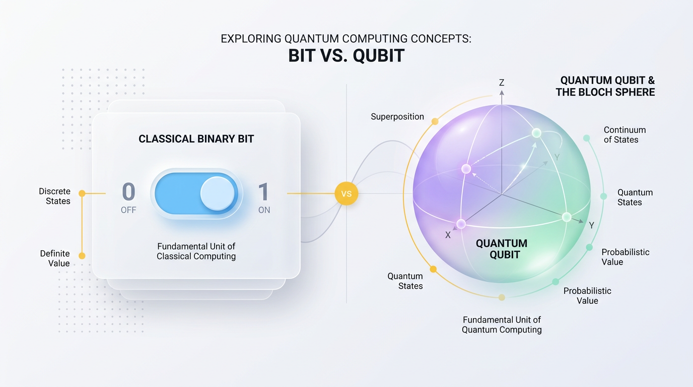
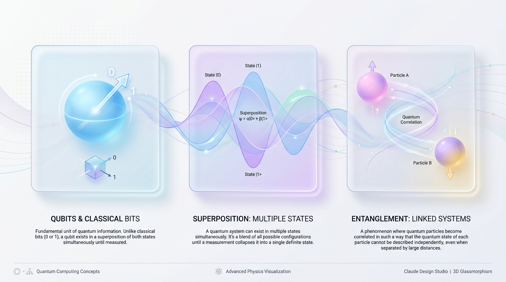
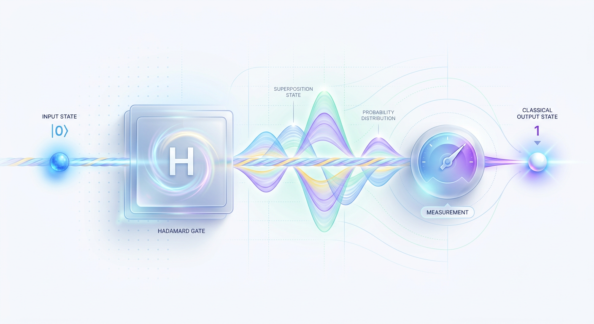

# Beyond Bits: A Practical Introduction to Quantum Computing

*Unlock the world of quantum mechanics where bits aren't just 0s and 1s, but can exist in multiple states at once to solve immense problems.*

*From spinning coins to unbreakable codes, learn how quantum mechanics is redefining the limits of computation.*



*Figure 1: The shifting paradigm from binary states (0 or 1) to the infinite possibilities of a quantum Bloch sphere.*

Our modern world runs on silicon. Every app, video stream, and database query relies on classical computers manipulating microscopic switches. But as we push these chips to their physical limits, we’re hitting a wall. Some of the world's most critical scientific and mathematical problems remain unsolvable by even our greatest supercomputers.

To break through this wall, we must rethink the very nature of information. This is where quantum computing enters the picture. It's not just a faster version of the computer you're using right now; it's an entirely new paradigm of processing power built on the strange and wonderful laws of physics.

## The Quantum Leap: From Bits to Qubits


*Figure 2: The Core Trio: Qubits as multi-state elements, Superposition as overlapping waves, and Entanglement as a synchronized link.*

To understand this paradigm shift, let's contrast how classical and quantum computers store information. A classical bit is like a standard light switch: it can only exist in one of two positions, either completely off (0) or completely on (1). Every digital file you've ever interacted with is just a massive combination of these binary states.

A quantum bit, or **qubit**, is more like a spinning coin. While it spins, it’s not decisively heads or tails; it's a dynamic, fluid mixture of both states. It can represent 0, 1, or countless possibilities in between simultaneously. This ability to exist in multiple states at once is called **superposition**.

But the magic doesn't stop there. Qubits can also be linked together through a phenomenon Albert Einstein famously called "spooky action at a distance": **quantum entanglement**.

> ✅ **Best Practice:** Think of entanglement like a pair of magical shoes split into two identical boxes. You keep one and send the other to a friend across the globe. The moment you open your box and find a left shoe, you know with 100% certainty that your friend has the right shoe—instantly, without any communication.

Once entangled, the state of one qubit instantly dictates the state of its partner, no matter how far apart they are. This cosmic connection allows quantum systems to process information in a way that is exponentially more powerful than the sum of its individual parts.

### Visualizing the Quantum State: The Bloch Sphere
To help engineers conceptualize these abstract states, we map them onto a 3D model called the **Bloch Sphere**. On this sphere, the state of a qubit is represented by a vector pointing from the center to the surface.

*   **The North Pole:** Represents the pure classical state `|0>`.
*   **The South Pole:** Represents the pure classical state `|1>`.
*   **The Equator:** Represents all states of perfect 50/50 superposition.
*   **The Surface:** Any point on the sphere's surface represents a valid, pure quantum state.

When a quantum algorithm runs, it rotates this state vector smoothly across the sphere's surface, navigating an infinite landscape of potential solutions before finally collapsing to a single point upon measurement.

## How Quantum Computers Actually Work


*Figure 3: A quantum circuit flow where a Hadamard gate creates superposition, followed by a measurement collapse.*

A quantum computer manipulates a delicate web of probabilities by executing a precise, three-step lifecycle. You cannot simply read or write quantum data on the fly as you do with classical memory; doing so would destroy the fragile quantum states.

Instead, the process behaves like a highly choreographed laboratory experiment:

1.  **Initialization:** The system begins by resetting all qubits to a predictable baseline state, typically represented as `|0>`. This is like preparing a blank canvas.
2.  **Manipulation:** A sequence of quantum gates—physical forces like precisely-timed laser or microwave pulses—are applied to the qubits. These gates shift them into complex states of superposition and entanglement, painting a fluid landscape of probabilities.
3.  **Measurement:** Finally, the system is measured. This act forces the complex quantum states to "collapse" into standard classical bits (0s and 1s) that we can read and analyze, effectively snapping a photo of the final result.

### Programming a Quantum Circuit with Qiskit
We can control this entire process using open-source SDKs like IBM's **Qiskit**. The following Python script demonstrates the "Hello World" of quantum computing: creating a **Bell State**, which is the simplest example of two-qubit entanglement.

```python
# Import the core Qiskit tools for building and simulating circuits
from qiskit import QuantumCircuit
from qiskit_aer import AerSimulator

# Step 1: Initialize a circuit with 2 qubits and 2 classical bits
# The classical bits store the final measurement results.
circuit = QuantumCircuit(2, 2)

# Step 2: Put qubit 0 into superposition using a Hadamard (H) gate.
# This converts the definite |0> state into a 50/50 mix of |0> and |1>.
circuit.h(0)

# Step 3: Entangle qubit 0 and qubit 1 using a Controlled-NOT (CNOT) gate.
# If qubit 0 (the control) is 1, it flips qubit 1 (the target).
circuit.cx(0, 1)

# Step 4: Measure both qubits and write the results to the classical bits.
circuit.measure([0, 1], [0, 1])

# Step 5: Simulate the circuit 1000 times to gather statistics.
simulator = AerSimulator()
job = simulator.run(circuit, shots=1000)
result = job.result()
counts = result.get_counts()

# The output format is 'qubit1qubit0'
print("Measurement Results:", counts)
```
When you run this code, the output will look similar to `{'00': 505, '11': 495}`. You will almost never see the `01` or `10` states. This proves the qubits were successfully entangled: measuring one instantly determined the state of the other, creating a perfectly correlated system.

## Problems Worthy of a Quantum Computer
Quantum computers are not built to do ordinary things faster; they are built to solve highly specific, computationally "impossible" problems where the number of possible solutions grows exponentially.

> 💡 **Tip:** A classical computer processes information sequentially, like reading a book one page at a time. A quantum computer leverages superposition to read all the pages at once, transforming problems that would take billions of years into tasks of a few minutes.

Here are the primary domains where quantum computing is poised to revolutionize our world.

### 1. Molecular Simulation & Drug Discovery
Simulating the exact quantum behavior of electrons in a complex molecule is impossible for classical computers. For every electron added, the computational resources required double.

A quantum computer, however, uses qubits that naturally mimic these quantum states, allowing scientists to design life-saving drugs by simulating molecular interactions atom-by-atom with perfect accuracy.

```python
# A simple demonstration of the exponential memory scaling of classical computers
# versus the linear scaling of quantum computers for molecular simulation.

def calculate_classical_memory(qubits_needed):
    # Classically, tracking N qubits requires 2^N complex amplitudes.
    # Assuming 16 bytes per complex number (float64 real + float64 imaginary).
    states_to_track = 2 ** qubits_needed
    memory_bytes = states_to_track * 16
    
    if memory_bytes < 1024**3:
        return f"{memory_bytes / 1024**2:.2f} MB"
    elif memory_bytes < 1024**4:
        return f"{memory_bytes / 1024**3:.2f} GB"
    else:
        return f"{memory_bytes / 1024**5:.2f} PB (Petabytes)"

# Compare resource requirements for different molecular sizes
print(f"Simulating a 10-qubit molecule requires: {calculate_classical_memory(10)} of classical RAM.")
print(f"Simulating a 50-qubit molecule requires: {calculate_classical_memory(50)} of classical RAM.")
print(f"Simulating an 80-qubit molecule requires: {calculate_classical_memory(80)} of classical RAM.")
```

### 2. Logistics and Combinatorial Optimization
Finding the single best route for a global shipping fleet or optimizing a complex financial portfolio involves navigating a maze with trillions of shifting options.

Quantum algorithms like the **Quantum Approximate Optimization Algorithm (QAOA)** evaluate a vast number of pathways simultaneously. They use quantum interference to cause incorrect answers to cancel each other out while amplifying the probability of measuring the correct, optimal solution.

### 3. Cryptography and Cybersecurity
Modern encryption, such as RSA, relies on the fact that it would take a classical computer millions of years to find the prime factors of a large number.

*   **Shor's Algorithm:** A quantum algorithm that can find these factors in minutes, theoretically breaking most of today's encryption standards.
*   **Quantum Key Distribution (QKD):** A new form of security that uses the laws of physics to create unhackable communication. Any attempt to intercept the key instantly changes its quantum state, alerting the users of a breach.

### 4. Quantum Machine Learning (QML)
Quantum computers excel at finding hidden patterns in high-dimensional datasets. They can map data into vast mathematical spaces where complex correlations become easy to classify, radically accelerating the training of advanced AI models.

## The Reality Check: Myths vs. Production
Quantum computing is surrounded by massive hype, making it easy to fall for common misconceptions. To build practical applications, we must separate reality from science fiction.

### ⚠️ Common Mistake: Quantum Computers Will Replace Your Laptop
This is the most common myth. In reality, quantum computers are highly specialized accelerators, not general-purpose machines. For tasks like web browsing, running a database, or playing a video game, classical computers remain vastly more efficient.

> ✅ **Best Practice:** Think of a Quantum Processing Unit (QPU) exactly like a Graphics Processing Unit (GPU). Your CPU runs the main application, but it offloads massive parallel calculations to the GPU for graphics or AI. Similarly, a CPU will offload specific mathematical problems (like optimization or simulation) to a QPU.

### ⚠️ Common Mistake: Quantum Computers Are "Infinitely" Fast
The idea that quantum computers "try every answer at once" is an oversimplification. While a system can hold many states in superposition, a single measurement collapses it to just one random outcome.

The real power comes from **quantum interference**. Like noise-canceling headphones that use sound waves to cancel out ambient noise, quantum algorithms orchestrate constructive interference to amplify the probability of the correct answer while using destructive interference to cancel out the millions of incorrect ones.

### 🚀 Production Tip: The Battle Against Noise
The biggest engineering challenge today is **decoherence**. Qubits are incredibly fragile; the slightest vibration or temperature change can cause them to lose their quantum state and "decohere" into useless classical noise.

To combat this, the industry is focused on **Quantum Error Correction (QEC)**, where thousands of noisy "physical qubits" are bundled together to create a single, stable "logical qubit." This massive overhead is why building a fault-tolerant quantum computer is one of the greatest engineering challenges of our time.

## Key Takeaways
*   **Bits vs. Qubits:** While classical bits are binary switches (0 or 1), qubits are dynamic systems that use **superposition** to exist as a combination of both states simultaneously, and **entanglement** to create powerful correlations.
*   **A Probabilistic Process:** Quantum computation is a three-step lifecycle: **Initialize** qubits to a ground state, **Manipulate** their probabilities with quantum gates, and **Measure** to collapse them into a final classical result.
*   **Specialized Co-Processors:** Quantum Processing Units (QPUs) will not replace CPUs. They are accelerators designed for a narrow class of problems involving simulation, optimization, and cryptography that are intractable for classical machines.
*   **The Power of Interference:** Quantum algorithms don't just brute-force answers in parallel. They leverage quantum interference to systematically cancel out incorrect solution pathways and amplify the probability of measuring the correct one.
*   **The Era of Noise:** Today's quantum hardware operates in the Noisy Intermediate-Scale Quantum (NISQ) era. The primary engineering challenge is overcoming environmental noise (decoherence) to build stable, fault-tolerant logical qubits.