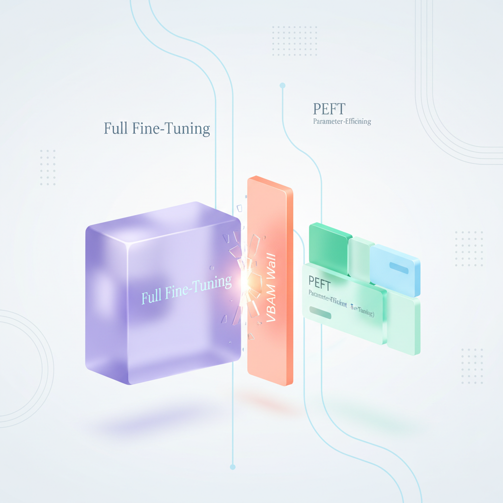
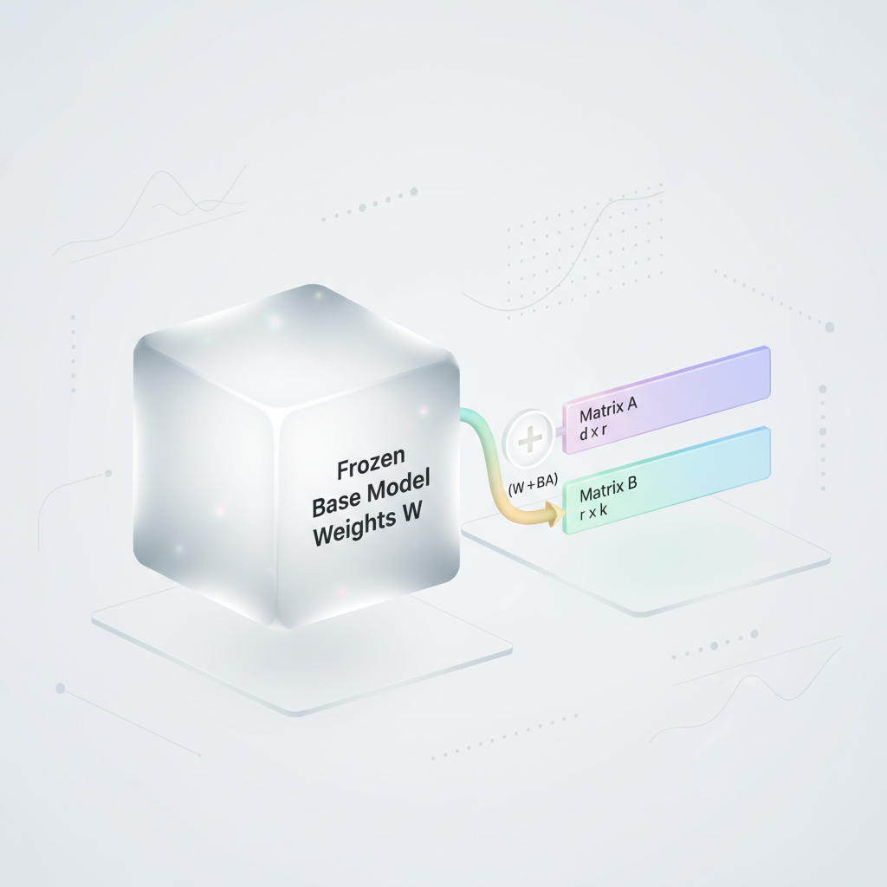
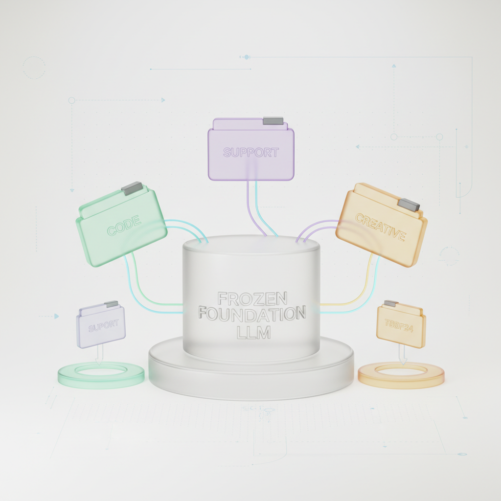

# Why Full Fine-Tuning is Often a Trap

*Learn how Parameter-Efficient Fine-Tuning (PEFT) adapts giant AI models for custom tasks without the massive costs of traditional fine-tuning.*

*Full fine-tuning can look like the cleanest way to adapt a large model, but in practice it often burns memory, increases cost, and risks erasing the strengths you wanted to keep.*



*Figure 1: Full Fine-Tuning (massive resource footprint) versus Parameter-Efficient Fine-Tuning (modular and lightweight).*

## Why Full Fine-Tuning is Often a Trap


*Figure 2: The LoRA weight update decomposition (W + BA), freezing the massive pre-trained weights while training only low-rank matrices.*


### The seduction of “just fine-tune the whole model”

At first glance, full fine-tuning feels like the simplest path. You take a strong pretrained model, show it your data, and let it adapt everywhere. In theory, more trainable parameters should mean more flexibility and better task performance.

In practice, that “train everything” mindset often runs into three walls: **memory**, **money**, and **model drift**. For modern large language models, full fine-tuning is not only expensive, it can also damage the very capabilities that made the model useful in the first place.

> 💡 Tip: Full fine-tuning is not the default smart choice for large models. It is often the fastest way to burn GPU budget and lose general-purpose capability.

### The VRAM wall: why 7B+ models are already hard before training begins

A 7B parameter model sounds manageable until you account for what training actually requires. You are not just storing the weights once. You also need memory for gradients, optimizer states, and activations from the forward pass. That means the true memory footprint is far larger than the raw model size suggests.

A simple analogy: owning a car is not the same as repairing it with the engine running. Training needs the full engine exposed, plus a workshop large enough to hold every tool, part, and diagnostic readout at once.

For a rough intuition, a 7B model can already consume:
- ~14 GB for FP16 weights
- ~14 GB for gradients
- ~28 GB or more for optimizer states, depending on the optimizer
- Additional activation memory that grows with batch size and sequence length

That is why full fine-tuning of 7B+ models often pushes you into:
- A100/H100-class GPUs
- Multi-GPU setups
- Model sharding or ZeRO-style training
- Careful batch-size and sequence-length compromises

Even then, you are still one configuration tweak away from an out-of-memory crash.

### Catastrophic forgetting: when adaptation erases general knowledge

Full fine-tuning does not just add new behavior. It changes the entire parameter space, including the parts responsible for broad language understanding, reasoning patterns, and general world knowledge. If your dataset is narrow, the model can become overly specialized and forget how to behave well outside that niche.

Think of it like retraining an experienced employee from scratch for one task. They may become excellent at that one workflow, but you risk losing the broader judgment and flexibility that made them valuable across many situations.

Technically, this happens because:
- All weights are updated
- Gradients from the new task propagate everywhere
- Pretrained features can be overwritten
- Small or biased datasets exert disproportionate influence

The result is often a model that looks improved on the target benchmark, but regresses on:
- General instruction following
- Reasoning on unseen tasks
- Robustness to prompt variation
- Other domains the base model once handled well

> ⚠️ Common Mistake: Optimizing for a single benchmark can hide regressions in general capability.

### The cost equation: why “more training” becomes a hidden tax

Full fine-tuning is expensive in two ways: **compute cost** and **engineering cost**.

On the compute side, you pay for:
- Longer training time
- Higher GPU memory requirements
- More expensive hardware
- Larger batch management overhead
- More checkpoint storage

On the engineering side, you often need:
- Distributed training logic
- Mixed precision tuning
- Gradient checkpointing
- Careful optimizer and scheduler selection
- More debugging when training becomes unstable

Here is the real cost trap: full fine-tuning scales badly as model size grows. If a task needs a single adaptation cycle, maybe the cost is acceptable. But if you need to iterate on multiple datasets, product variants, or customer-specific domains, the bill compounds quickly.

A practical comparison:
- **Full fine-tuning**
  - Train all parameters
  - Requires large VRAM
  - More compute per step
  - Slower iteration cycles
  - Higher risk of forgetting

- **PEFT**
  - Train a small subset of parameters
  - Fits on smaller GPUs more often
  - Faster and cheaper training
  - Easier to experiment repeatedly
  - Preserves the base model better

Imagine updating a 100-room hotel by renovating every room versus replacing only the electrical switches in the 10 rooms that matter. The first option is technically thorough, but brutally expensive and disruptive. The second is targeted, cheaper, and usually the smarter move.

### Why this matters in the real world

Most real production teams do not need to reinvent a foundation model from scratch. They need to adapt it to:
- A domain
- A tone of voice
- A business workflow
- A compliance rule set
- A retrieval or classification task

For those problems, full fine-tuning is often more machinery than solution. PEFT lets teams move from “we need a giant training run” to “we can adapt this model this afternoon.”

That is the real shift: not just lower cost, but lower friction. Once you see training through that lens, full fine-tuning starts to look less like the default and more like a trap.

## The PEFT Playbook: Core Principles


*Figure 3: Production deployment hosting multiple specialized LoRA adapters on top of a single, shared frozen base model.*


### The big idea: train less, adapt more

Parameter-Efficient Fine-Tuning, or PEFT, is a simple answer to a very expensive problem: how do you customize a massive language model without retraining all of it?

The core trick is to freeze the base model’s weights and train only a small number of new parameters. That means you keep the model’s general knowledge intact while adding just enough flexibility to make it useful for a specific task, domain, or style.

> 💡 Tip: PEFT works because most of the model stays untouched, and only a tiny control layer learns the new behavior.

### The “frozen giant” analogy

Think of a large LLM as a frozen giant expert. It already knows how to write, summarize, reason, and classify, but you are not allowed to rewrite its brain.

Instead of rebuilding the giant, PEFT attaches small trainable modules on top of it. These modules act like specialized assistants that learn your task quickly and cheaply.

A useful real-world analogy is a high-end camera with attachable lenses:
- The camera body is the pretrained LLM.
- The body stays the same because it already works well.
- The lens is the PEFT module, tuned for a specific kind of shot.

You do not replace the whole camera to take better portraits. You add the right lens.

### Why freezing works

A pretrained LLM already contains broad language knowledge. In many fine-tuning tasks, you do not need to change that knowledge; you only need to steer it.

Freezing the original weights gives you a few practical benefits:
- Lower training cost because far fewer parameters update
- Lower GPU memory usage since optimizer states are stored only for the small trainable part
- Reduced risk of forgetting because the base model’s capabilities remain stable
- Easier deployment because the adapter is lightweight and often portable

This is why PEFT is so popular in production settings. It is a way to personalize a giant model without paying the full price of retraining one.

### LoRA: the most popular PEFT method

Among all PEFT methods, LoRA, or Low-Rank Adaptation, is the best-known and most widely used.

Instead of changing a model’s full weight matrix, LoRA adds a small trainable update that is expressed as the product of two much smaller matrices. The intuition is that the adaptation you need is often low-dimensional, even if the original model is very large.

In plain terms, LoRA says:
- Keep the original weight matrix frozen.
- Learn a compact correction matrix.
- Inject that correction into the layer during training.

A simple view of the idea is:

```python
# Conceptual LoRA form:
# output = x @ W_frozen + x @ (A @ B)

# W_frozen stays fixed.
# A and B are small trainable matrices.
```

Why this works is the important part. Many model adaptations do not require a full-rank change to every weight. A low-rank update is often enough to bend the model in the right direction.

That is the engineering sweet spot: big model, tiny update.

### How LoRA fits into a transformer layer

In a transformer, the most expensive and influential parts are typically the linear projections inside attention and feed-forward layers. LoRA usually targets those matrices.

Here is the mental model:
- The base transformer layer computes its usual output.
- A LoRA branch computes a small learned adjustment.
- The two outputs are combined.

The original weights remain frozen, so the model’s foundation stays stable. Only the LoRA matrices learn task-specific behavior.

### A tiny runnable LoRA-style example

The following example is not a full LoRA implementation for a large transformer, but it captures the exact training logic: freeze the base layer, train a small low-rank adapter, and combine both during the forward pass.

```python
import torch
import torch.nn as nn
import torch.optim as optim

class LoRALinear(nn.Module):
    def __init__(self, in_features, out_features, rank=4):
        super().__init__()
        # Frozen base weight: this represents the pretrained model layer.
        self.base = nn.Linear(in_features, out_features, bias=False)
        for param in self.base.parameters():
            param.requires_grad = False

        # Small trainable low-rank adapter:
        # A maps input -> rank space, B maps rank -> output space.
        self.A = nn.Linear(in_features, rank, bias=False)
        self.B = nn.Linear(rank, out_features, bias=False)

        # Initialize adapter to near-zero influence at the start.
        nn.init.zeros_(self.B.weight)

    def forward(self, x):
        # Frozen base transformation + trainable low-rank update.
        return self.base(x) + self.B(self.A(x))

# Example usage
torch.manual_seed(42)
model = LoRALinear(in_features=8, out_features=4, rank=2)

# Only adapter parameters should train.
trainable_params = [p for p in model.parameters() if p.requires_grad]
optimizer = optim.Adam(trainable_params, lr=1e-3)

x = torch.randn(16, 8)
target = torch.randn(16, 4)

criterion = nn.MSELoss()

model.train()
for step in range(5):
    optimizer.zero_grad()
    output = model(x)
    loss = criterion(output, target)
    loss.backward()
    optimizer.step()
    print(f"step={step}, loss={loss.item():.4f}")
```

Why this structure matters:
- The base layer is frozen, so its knowledge does not drift.
- The adapter is tiny, so training is fast and memory-efficient.
- The model learns a task-specific adjustment without touching the giant original weight matrix.

### Other PEFT flavors worth knowing

LoRA gets most of the attention, but it is not the only PEFT strategy. The field has several useful variants, each with a slightly different way of steering the frozen model.

#### Prompt Tuning

Prompt Tuning learns a small set of soft prompt embeddings that are prepended to the input.

Instead of changing model weights, you learn vector representations that nudge the model into the right behavior. It is like handing the model a carefully worded note before the real request begins.

#### Prefix-Tuning

Prefix-Tuning is similar, but the learned vectors are injected deeper into the transformer, often as prefix key/value states for attention layers.

This gives the model extra contextual guidance at multiple layers, not just at the input boundary.

#### Adapters

Adapters insert small bottleneck networks inside transformer blocks. These are trainable modules that sit alongside the frozen backbone and learn task-specific transformations.

They are conceptually very close to the frozen giant analogy: the giant stays fixed, and the small module learns the new job.

### PEFT in one diagram

Here is the architecture to keep in your head.

```text
Input
  |
  v
[Frozen Transformer Block]
  |-------------------------------|
  |                               |
  v                               v
Base computation (frozen)     PEFT module (trainable)
  |                               |
  |------- combine outputs --------|
                  |
                  v
              Final output
```

A more LoRA-specific view looks like this:

```text
x ---> [Frozen Linear W] -----------+
  \                                  |
   \-> [Trainable Low-Rank A -> B] --+--> output
```

The important diagram context is simple: PEFT does not replace the model. It attaches a small trainable path beside the frozen one, then learns how to mix the two.

### The intuition to remember

PEFT is not about making a smaller model. It is about making a small change to a large model.

That distinction matters because it explains why PEFT is so practical:
- You get much of the power of a foundation model.
- You train only a fraction of the parameters.
- You can specialize the model without destroying its general abilities.

> ✅ Best Practice: Freeze the giant, train the tiny helper, and let the helper shape the giant’s behavior.

That is the mental model behind almost every PEFT method, from LoRA to prompts to adapters.

## Deep Dive: Implementing LoRA & QLoRA with Hugging Face

### From full fine-tuning to parameter-efficient adaptation

When you fine-tune a large language model traditionally, you update nearly every weight in the network. That works, but it is expensive in memory, slower to train, and often unnecessary if your task is narrow.

PEFT changes that by updating only a tiny set of parameters while keeping the original model mostly frozen. In practice, this means you can adapt a strong base model to your task without paying the full cost of retraining it.

> 💡 Tip: LoRA and QLoRA let you customize large models by training a small number of additional parameters instead of the entire network.

A good mental model is this: instead of rebuilding a car engine from scratch, you attach a high-performance tuning kit to a few critical parts. The engine stays the same, but its behavior changes in the direction you want.

### The core idea behind LoRA: W + BA

LoRA, short for Low-Rank Adaptation, assumes that the change you want to make to a pretrained weight matrix does not need to be full-sized. Instead, the update matrix ΔW can be approximated as a product of two smaller matrices:

- A: projects the input down to a lower-dimensional space
- B: projects it back up to the original size

So the effective weight becomes:
- Original weight: W
- Adapted weight: W + BA

This is powerful because BA has far fewer trainable parameters than a full matrix update. If W is huge, learning ΔW directly is expensive; learning A and B is much cheaper.

Think of it like compressing a long detour into two shorter directions:
- A says, “reduce the problem to its most important signals”
- B says, “expand those signals back into the model’s original space”

> ✅ Best Practice: Treat low-rank updates as a capacity control mechanism, not just a compression trick.

### Applying LoRA with Hugging Face `peft`

The Hugging Face `peft` library makes LoRA surprisingly easy to use. You load a base model, define a LoRA configuration, and wrap the model with that configuration.

Here is a minimal but practical example:

```python
# pip install transformers peft accelerate torch

import torch
from transformers import AutoModelForCausalLM, AutoTokenizer
from peft import LoraConfig, TaskType, get_peft_model

model_name = "gpt2"

# Load tokenizer and base model
tokenizer = AutoTokenizer.from_pretrained(model_name)
base_model = AutoModelForCausalLM.from_pretrained(model_name)

# LoRA configuration:
# r controls the rank of the low-rank update.
# target_modules specifies which layers get LoRA adapters.
lora_config = LoraConfig(
    task_type=TaskType.CAUSAL_LM,
    r=8,
    lora_alpha=16,
    lora_dropout=0.05,
    target_modules=["c_attn", "c_proj"]
)

# Wrap the base model with PEFT
model = get_peft_model(base_model, lora_config)

# Show how many parameters will be trained
model.print_trainable_parameters()
```

This is the key pattern:
- Load a pretrained `transformers` model
- Define a `LoraConfig`
- Call `get_peft_model(...)`
- Train only the adapter parameters

The base model weights remain frozen, which is why LoRA is so efficient.

#### What the config fields mean

- `r`: the rank of the low-rank decomposition
- `lora_alpha`: scaling factor that controls adapter strength
- `lora_dropout`: regularization applied to adapter inputs
- `target_modules`: which layers receive LoRA adapters
- `task_type`: tells PEFT what kind of model you are adapting

> ⚠️ Common Mistake: The exact `target_modules` depend on the architecture, so always verify the module names before training.

### QLoRA: the same idea, but on a 4-bit base model

LoRA is already memory-efficient, but QLoRA pushes this further by quantizing the pretrained base model to 4-bit precision.

That means:
- the base model weights are stored in a compressed 4-bit format
- the LoRA adapters are still trained in higher precision
- you get a much smaller memory footprint while preserving strong performance

A simple analogy: LoRA reduces how much you train, while QLoRA reduces how much memory the frozen model consumes. Together, they make it possible to fine-tune very large models on much smaller hardware.

> 💡 Tip: QLoRA is LoRA plus aggressive quantization of the frozen backbone, making large-model fine-tuning far more accessible.

Technically, QLoRA relies on quantization libraries such as `bitsandbytes` to load the base model in 4-bit form. You still attach LoRA adapters with `peft`, but the backbone is far lighter in memory.

### QLoRA in practice with Hugging Face

Below is a runnable example showing the typical QLoRA loading pattern.

```python
# pip install transformers peft bitsandbytes accelerate torch

import torch
from transformers import AutoModelForCausalLM, AutoTokenizer, BitsAndBytesConfig
from peft import LoraConfig, TaskType, get_peft_model

model_name = "gpt2"

# 4-bit quantization config for QLoRA-style loading
bnb_config = BitsAndBytesConfig(
    load_in_4bit=True,
    bnb_4bit_quant_type="nf4",       # good default for LLM fine-tuning
    bnb_4bit_use_double_quant=True,  # improves compression quality
    bnb_4bit_compute_dtype=torch.float16
)

tokenizer = AutoTokenizer.from_pretrained(model_name)

# Load the base model in 4-bit precision
base_model = AutoModelForCausalLM.from_pretrained(
    model_name,
    quantization_config=bnb_config,
    device_map="auto"
)

# Attach LoRA adapters on top of the quantized base model
lora_config = LoraConfig(
    task_type=TaskType.CAUSAL_LM,
    r=8,
    lora_alpha=16,
    lora_dropout=0.05,
    target_modules=["c_attn", "c_proj"]
)

model = get_peft_model(base_model, lora_config)
model.print_trainable_parameters()
```

Why this works:
- The backbone is compressed to 4-bit, so memory usage drops sharply
- The adapters remain trainable and are small enough to optimize efficiently
- The model can still learn task-specific behavior without fully dequantizing the entire network

This is especially useful when your GPU memory is the limiting factor.

### The rank r trade-off: smaller is cheaper, larger is stronger

LoRA’s most important hyperparameter is often the rank `r`. It directly affects how expressive the adapter is.

A lower `r` means:
- fewer trainable parameters
- lower memory use
- faster training
- but potentially weaker adaptation

A higher `r` means:
- more trainable parameters
- more flexibility to fit the target task
- but greater compute and memory cost
- and sometimes a higher risk of overfitting

In simple terms, `r` controls how much room the adapter has to learn task-specific changes.

A useful way to think about it is bandwidth:
- Small `r` is like sending a short text message
- Large `r` is like sending a full report

The right choice depends on how complex your task is.

#### How rank affects parameter count

For a weight matrix adapted with LoRA, the trainable parameters scale roughly with the rank `r`. If you increase `r`, you increase the size of both low-rank matrices `A` and `B`, which increases the number of learned parameters.

That means:
- `r = 4` or `8` is often enough for simpler tasks
- `r = 16` or `32` may help with harder domain adaptation
- very large ranks can approach diminishing returns

> ✅ Best Practice: Start small, evaluate, and increase `r` only if your validation performance suggests the adapter is underpowered.

### Choosing between LoRA and QLoRA

Both methods use the same adapter idea, but they solve different bottlenecks.

- LoRA
  - best when you can afford a full-precision frozen backbone
  - simpler setup
  - less dependency on quantization tooling

- QLoRA
  - best when GPU memory is tight
  - enables large-model fine-tuning on smaller hardware
  - adds quantization complexity but dramatically improves efficiency

A practical workflow is:
1. Start with LoRA if your model fits comfortably in memory
2. Move to QLoRA when memory becomes the bottleneck
3. Tune `r`, `lora_alpha`, and target layers based on validation results

In both cases, the central benefit is the same: you train only a small number of parameters while preserving the knowledge in the pretrained model.

### Diagram context: how the pieces fit together

Here is the conceptual flow:
- Pretrained model weights `W`
  - frozen during adaptation
- LoRA adapters `A` and `B`
  - trainable low-rank matrices
- Effective update
  - `W + BA`
- QLoRA extension
  - the frozen `W` is stored in 4-bit form
  - the adapters remain trainable

So the pipeline looks like this:
- input tokens
- transformer layers with quantized frozen weights
- small LoRA adapters injected into selected modules
- task-specific output

This is why PEFT is so attractive in real systems: you get most of the benefit of fine-tuning with a fraction of the cost.

> 🚀 Production Tip: LoRA changes what you train, and QLoRA changes how efficiently the frozen model is stored and used.

## Production Playbook: Best Practices & Common Mistakes

### Start with the deployment question, not the algorithm

Before choosing PEFT or full fine-tuning, ask a simpler question: what is the job of this model in production? If you need to adapt a strong base model to a narrow task, PEFT is often the safest and fastest path. If you need to reshape the model’s behavior across many domains, with lots of data and enough compute, full fine-tuning may be justified.

Think of it like modifying a car. PEFT is a performance upgrade kit: turbo, suspension, tuning. Full fine-tuning is rebuilding the engine. Both can improve performance, but one is cheaper, faster, and easier to reverse.

> ✅ Best Practice: Use PEFT first unless you have a strong reason not to. It gives you a low-risk baseline and usually enough capacity for task-specific adaptation.

### A practical decision framework

Use this checklist to decide between PEFT and full fine-tuning:

- Use PEFT when:
  - Your task is focused, such as classification, retrieval, summarization, or domain adaptation.
  - You have limited labeled data.
  - You need to train quickly or on a limited GPU budget.
  - You want to maintain a single shared base model and swap adapters per task.
  - You care about easier rollback, cheaper storage, and simpler experimentation.

- Consider full fine-tuning when:
  - Your task is highly specialized and the base model misses important patterns.
  - You have a large, high-quality dataset.
  - You can afford longer training time and more memory.
  - You need the model weights fully merged for a very specific deployment constraint.

- Be cautious with PEFT when:
  - The base model is too weak for the task.
  - The task requires deep behavioral changes, not just style or domain adaptation.
  - You are seeing underfitting even after reasonable hyperparameter tuning.

A good production pattern is to start with PEFT, measure the gap to your target quality, and only escalate if the adapter clearly hits a ceiling. That keeps your iteration loop short and your infrastructure simpler.

### Choosing the right rank: small first, then scale

In LoRA, the rank `r` controls how much extra capacity the adapter gets. A bigger `r` means more trainable parameters and more expressive power, but it also increases memory use, training time, and the risk of overfitting.

Start with `r=8` or `r=16`. These values are often enough for many real-world tasks, especially when the dataset is moderate and the domain shift is not extreme. If performance plateaus, increase rank gradually instead of jumping straight to a large number.

A useful mental model is to treat `r` like the size of a temporary workspace. A small workspace can handle a focused task efficiently. A giant workspace gives you more room, but it also slows movement and makes mistakes easier to hide.

> 💡 Tip: Higher rank is not automatically better. It is a tradeoff between capacity, speed, and overfitting risk.

### How to tune rank in practice

A simple production tuning loop looks like this:
- Start with `r=8`.
- Evaluate on a clean validation set.
- If the model underfits, try `r=16`.
- If the task is still hard and data is plentiful, try `r=32`.
- Stop increasing rank once the gain becomes marginal.

Also watch the trainable parameter count. If rank climbs too high, PEFT starts to look less like a lightweight adaptation method and more like a partial re-training strategy. That may be acceptable in research, but in production it can reduce the very benefits PEFT is supposed to give you.

### A minimal LoRA config pattern

Here is a simple example using Hugging Face-style LoRA configuration. The point is not just the code, but the strategy: begin with a conservative rank and only widen capacity when evidence supports it.

```python
from transformers import AutoModelForSequenceClassification, AutoTokenizer
from peft import LoraConfig, get_peft_model, TaskType

# Base model and tokenizer
model_name = "distilbert-base-uncased"
tokenizer = AutoTokenizer.from_pretrained(model_name)
base_model = AutoModelForSequenceClassification.from_pretrained(model_name, num_labels=2)

# Start small: r=8 is a good default for many tasks
lora_config = LoraConfig(
    task_type=TaskType.SEQ_CLS,
    r=8,                      # Small rank first
    lora_alpha=16,            # Scaling factor
    lora_dropout=0.05,        # Helps regularization
    target_modules=["q_lin", "v_lin"]  # Example for DistilBERT-like architectures
)

model = get_peft_model(base_model, lora_config)

# Why this matters:
# - r=8 keeps the adapter lightweight
# - target_modules ensures LoRA is applied where it matters
# - dropout helps prevent overfitting on smaller datasets
model.print_trainable_parameters()
```

Notice the `target_modules` list. That detail matters more than many teams expect, because a LoRA adapter that touches the wrong layers can look configured while quietly learning very little.

### Adapter management: treat adapters like versioned assets

In production, adapters should be managed like first-class artifacts, not throwaway experiment files. You will almost always want to store the base model once and keep adapters separate by task, domain, or customer.

This is similar to having one stable operating system and multiple app plugins. The core platform stays the same, while each adapter adds a specific behavior on top.

A strong adapter management strategy usually includes:
- Clear naming conventions
  - Example: `base_model + finance_qa_lora_v3`
  - Avoid vague names like `adapter_final` or `best_new`
- Versioned storage
  - Track dataset version, training run, rank, target modules, and validation score
  - Keep adapters in artifact storage, not ad hoc folders on a training machine
- Task isolation
  - Use one adapter per task or domain when possible
  - This makes rollback and A/B testing much easier
- Safe loading
  - Load only the adapter needed for the request path
  - Prevent mixing incompatible adapters in a shared service unless you explicitly support it

### Loading and swapping multiple adapters

One of PEFT’s biggest production advantages is that you can keep multiple adapters for the same base model and switch between them as needed. That makes multi-tenant systems, domain-specific assistants, and routing-based applications much easier to maintain.

Here is a simple example of saving and loading adapters with a shared base model:

```python
from transformers import AutoModelForSequenceClassification
from peft import PeftModel

base_model_name = "distilbert-base-uncased"
adapter_path_finance = "./adapters/finance_qa"
adapter_path_support = "./adapters/support_qa"

# Load the base model once
base_model = AutoModelForSequenceClassification.from_pretrained(
    base_model_name,
    num_labels=2
)

# Load the first adapter
model = PeftModel.from_pretrained(base_model, adapter_path_finance)

# Later, you can load another adapter into a fresh base model instance
base_model_2 = AutoModelForSequenceClassification.from_pretrained(
    base_model_name,
    num_labels=2
)
support_model = PeftModel.from_pretrained(base_model_2, adapter_path_support)

# Why this matters:
# - Base weights remain shared
# - Adapter weights stay small and easy to version
# - Different tasks can use different behavior without separate full models
```

If your application routes requests by domain, you can map each domain to a dedicated adapter. That gives you a clean separation between shared foundation and task-specific specialization.

### Merging adapters: useful, but be intentional

Sometimes you want to merge an adapter into the base model for simpler inference. This can reduce runtime complexity because the model no longer needs to keep adapter logic active during serving.

But merging is not free. Once merged, you lose the clean separation between the original base model and the adapter. That makes future edits, swaps, or comparative testing harder.

Use merging when:
- You are confident in the adapter’s quality.
- You want a simpler deployment artifact.
- You no longer need to swap adapters dynamically.

Do not merge when:
- You are still experimenting.
- You need multiple adapters active for different tenants or tasks.
- You want easy rollback to the original adapter state.

> 🚀 Production Tip: Keep both versions if possible: one merged model for stable inference, and one unmerged adapter for future iteration.

### The most common mistake: targeting the wrong modules

A surprisingly common PEFT failure mode is misconfiguring `target_modules`. If LoRA is attached to the wrong layers, the model may train successfully but barely improve in quality.

For transformer models, the most important layers are often the attention projection modules, especially `q_proj` and `v_proj`. In some architectures, the equivalent names may differ, such as `q_lin`, `v_lin`, or fused projection layers. The exact names depend on the model family.

This is like tuning the wrong part of a machine. You may change something visible, but not the component actually controlling the behavior you care about.

### How to avoid this mistake

Use the following workflow before training:
- Inspect model module names
  - Print or traverse the model structure
  - Confirm the exact names used in your architecture
- Match the architecture
  - Do not assume `q_proj` and `v_proj` exist in every model
  - Different families use different naming conventions
- Start with proven targets
  - For many decoder-only transformers, `q_proj` and `v_proj` are solid defaults
  - Some tasks benefit from adding `k_proj`, `o_proj`, or MLP layers too
- Validate trainable parameters
  - Make sure LoRA is applied where you expect
  - If almost nothing is trainable, your configuration is probably wrong

Here is a quick inspection pattern:

```python
from transformers import AutoModelForCausalLM

model_name = "gpt2"
model = AutoModelForCausalLM.from_pretrained(model_name)

# Print candidate module names so you can choose the correct LoRA targets
for name, module in model.named_modules():
    if "attn" in name or "proj" in name:
        print(name)

# Why this matters:
# - Module names vary across architectures
# - LoRA must target the correct layers to be effective
# - A quick inspection prevents silent configuration bugs
```

If you skip this step, you may end up training an adapter that looks valid in logs but performs poorly in the real world. That is one of the most expensive mistakes in PEFT because it wastes both compute and trust.

### Production checklist for PEFT success

Use this short checklist before shipping a PEFT-based model:
- Choose PEFT first unless the task clearly requires full fine-tuning.
- Start with small rank values like `r=8` or `r=16`.
- Inspect module names before setting `target_modules`.
- Track adapter versions with the same discipline as code releases.
- Keep base model and adapters separate for easier rollback.
- Merge only when deployment simplicity outweighs flexibility.
- Measure validation gains, not just training loss.

### Final takeaway

PEFT works best when you treat it as an engineering system, not just a training trick. The strongest results usually come from careful module targeting, conservative rank choices, and disciplined adapter lifecycle management.

> ✅ Best Practice: Start small, target the right layers, and manage adapters like production assets. That is how PEFT stays lightweight, reliable, and scalable.

## Summary & Your Next Steps

### The core takeaway

PEFT changes the economics of model adaptation. Instead of updating every parameter in a large model, you update only a small, targeted subset and keep the base model frozen. In practice, that means LoRA and QLoRA can deliver strong results without the heavy memory, time, and infrastructure demands of full fine-tuning.

A simple way to think about it: full fine-tuning is like renovating an entire house when you only need to remodel the kitchen. PEFT lets you make the change you need, where you need it.

> 💡 Tip: For many real-world use cases, PEFT is not a compromise — it is the most practical path to customization.

### Why PEFT matters in practice

The biggest win is that PEFT decouples model adaptation from massive compute. You no longer need a cluster of expensive GPUs just to specialize a model for your domain, tone, or workflow. That opens the door to experimentation on consumer-grade hardware, smaller teams, and faster iteration cycles.

This matters for teams building:
- Customer support assistants tuned to internal policies
- Domain-specific copilots for legal, medical, or financial text
- Task-focused classifiers or extractors
- Style-adapted generators for marketing, research, or education

In other words, PEFT makes customization accessible, not just possible.

### The 99% rule

A useful mental model is the 99% rule: for most domain adaptation tasks, PEFT gives you about 99% of the benefit of full fine-tuning for about 1% of the cost. That does not mean full fine-tuning is obsolete. It means full fine-tuning should be the exception, not the default.

If your goal is:
- adapting a model to your data
- improving task performance
- preserving the general intelligence of the base model
- doing it efficiently

then PEFT is usually the first thing to try.

### What to do next

The best way to learn PEFT is to use it on a real model and a real dataset. Start small, measure results, and compare against your baseline. You will quickly see how far a lightweight adaptation method can take you.

Here is a practical starting path:
- Pick a base model you already trust, such as a small instruction-tuned model.
- Choose a narrow dataset from your own domain or a public benchmark.
- Train with the Hugging Face `peft` library using LoRA first.
- Try QLoRA if GPU memory is tight or if you want to fine-tune larger models locally.
- Compare quality, memory usage, and training time against a full fine-tuning baseline if you have one.
- Inspect the outputs for domain fit, hallucination behavior, and style control.

> 🚀 Production Tip: Do one small PEFT experiment this week. A single run will teach you more than reading three more articles.

### A simple experiment to start with

If you want a low-friction first project, choose a task like text classification, summarization, or instruction tuning on a small dataset. Then fine-tune with `peft`, evaluate on a held-out set, and compare the results to the base model.

A typical workflow looks like this:
1. Load your pretrained model.
2. Freeze the base weights.
3. Attach LoRA adapters.
4. Train on your dataset.
5. Evaluate the adapter-tuned model.
6. Save and deploy only the lightweight adapter weights.

That last step is especially important. You do not need to ship a second giant model when a small adapter can capture the adaptation.

### Final thought

PEFT is one of the clearest examples of a better engineering tradeoff in modern AI. It preserves what foundation models already know while giving you a controlled, efficient way to specialize them. For many teams, that is the difference between “we should try this” and “we can actually ship this.”

If you have not tried it yet, start with the Hugging Face `peft` library, pick a model and dataset you care about, and run your first adapter-based fine-tune. The barrier to entry is low, and the upside is unusually high.

## Key Takeaways

- Full fine-tuning large models is often limited by VRAM, compute cost, and catastrophic forgetting.
- PEFT keeps the base model frozen and trains only a small number of task-specific parameters.
- LoRA is the core low-rank adaptation strategy, and QLoRA extends it by loading the backbone in 4-bit precision.
- The rank `r` is a crucial tradeoff knob: start small, validate carefully, and scale only when needed.
- In production, treat adapters as versioned assets and verify `target_modules` before training.