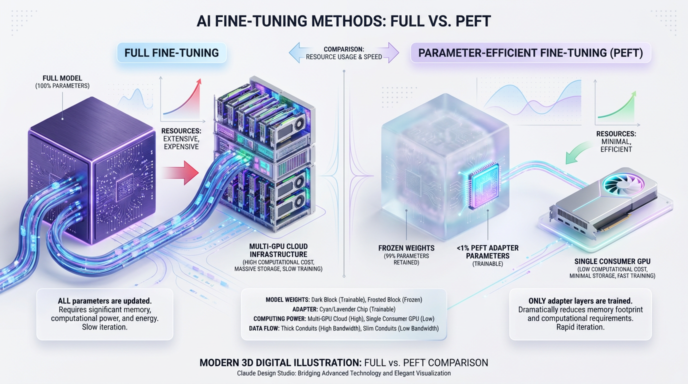
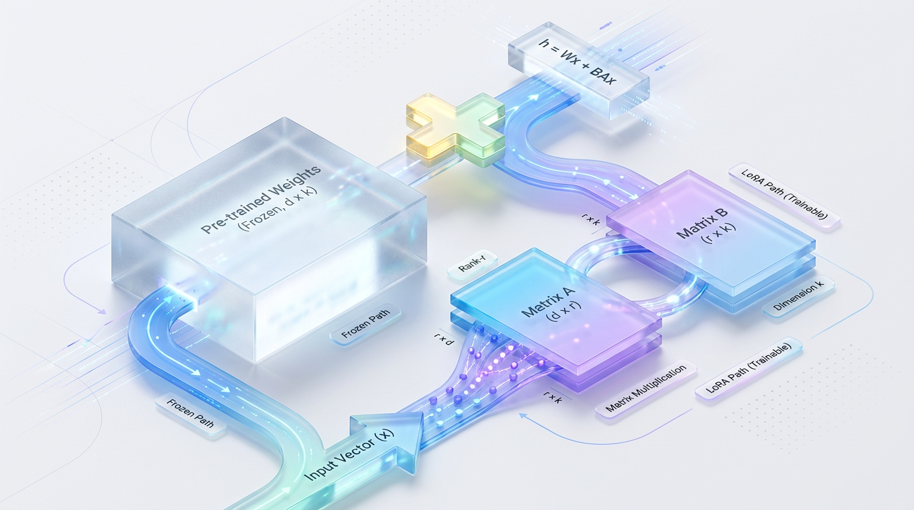
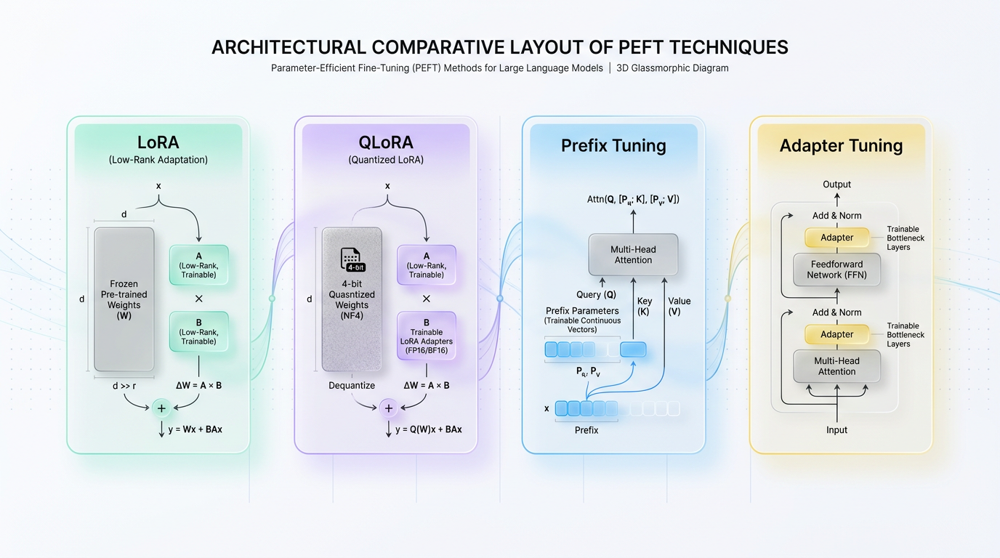

# The Billion-Parameter Problem: Why Full Fine-Tuning Is Dead

*Learn how PEFT methods like LoRA let you adapt huge AI models with minimal compute, avoiding the need for expensive, full parameter fine-tuning.*

## Why “Just Fine-Tune It” Stopped Being a Good Answer

Large language models are no longer the size of a clever neural network. They are billions of parameters packed into foundation models that already know a huge amount about language, code, and reasoning.

That scale is exactly what makes them powerful, but it is also what makes full fine-tuning painfully expensive. Updating every weight in the model is like rebuilding an entire car engine just to improve fuel efficiency by a few percentage points.


*Figure 1: Full Fine-Tuning (modifying 100% of weights across cluster GPUs) vs. PEFT (freezing base model, updating <1% of parameters on a single GPU).*

> ✅ Best Practice: When a model has billions of parameters, changing all of them is not a customization strategy — it is an infrastructure project.

## Full Fine-Tuning vs. PEFT: Engine Rebuild vs. Tuning Chip

Imagine you want your car to run more efficiently.

- **Full fine-tuning** is like taking apart the engine, replacing or recalibrating nearly everything, and then re-testing the whole vehicle.
- **PEFT (Parameter-Efficient Fine-Tuning)** is like installing a high-performance tuning chip that adjusts behavior without touching the entire engine.

The result is the same broad goal — better performance for your specific use case — but the cost, risk, and effort are dramatically different.


*Figure 2: The LoRA architecture decomposes weight updates into two low-rank matrices, A and B, keeping the pre-trained weights entirely frozen.*

In practice, PEFT works because most of a foundation model’s knowledge is already useful. You usually do not need to rewrite the whole model; you only need to steer it toward your domain, task, or style.

## The Scale Problem: Billions of Weights, Tiny Updates

A full LLM might contain 7 billion, 13 billion, or even 70 billion parameters. Fine-tuning all of them means storing gradients, optimizer states, and training activations for the entire network.

PEFT methods change only a tiny fraction of those parameters — often well under 1%, and sometimes far less.


*Figure 3: High-level architectural comparison of alternative PEFT families and their structural integration points.*

```text
Full fine-tuning:
[████████████████████████████████████████] 100% of parameters updated

PEFT:
[█---------------------------------------] <1% of parameters updated
```

This difference is not cosmetic. It changes what kind of hardware you need, how fast you can train, how much memory you consume, and how many experiments you can realistically run.

> 💡 Tip: PEFT’s promise is simple — customize a foundation model quickly and cheaply while preserving the model’s general knowledge.

## The Hardware Barrier: From Data-Center Training to a Single GPU

Full fine-tuning large models often requires serious multi-GPU infrastructure, often built around A100s or similar accelerators. That is because every training step must carry the burden of the entire model: weights, gradients, optimizer states, and temporary tensors.

PEFT changes the economics.

With techniques like LoRA, adapter tuning, or prefix tuning, you can often fine-tune a large model on a single consumer GPU, such as an RTX 4090, depending on sequence length, batch size, and model size. Suddenly, experimentation becomes much more accessible to small teams and individual practitioners.

That shift matters because the bottleneck is no longer “Can we afford a training cluster?” but “Which adaptation should we test next?”

## Why This Matters in Real Projects

Full fine-tuning is often overkill when your goal is narrow:

- classify support tickets
- adapt a chatbot to a medical or legal domain
- teach a model a house style or brand voice
- specialize a code assistant for an internal codebase
- improve retrieval-aware behavior on company-specific documents

In these cases, you want specialization without destruction. That last part is critical: full fine-tuning can lead to catastrophic forgetting, where the model gets better at your target task but forgets useful general capabilities it already had.

PEFT avoids most of that risk by leaving the base model mostly intact and learning small task-specific additions on top.

## The Mental Model for PEFT

Think of the foundation model as a highly trained employee.

- Full fine-tuning is like retraining the entire employee from scratch.
- PEFT is like giving them a focused playbook, a domain cheat sheet, or a new workflow layer.

The employee still brings all their existing knowledge, but now they operate more effectively in your specific environment.

That is why PEFT has become the practical default for many teams. It gives you the benefits of specialization without requiring the budget, hardware, or training complexity of full-scale retraining.

## What the Diagram Should Communicate

If you visualize the difference, the message is simple:

- **Base LLM:** billions of parameters
- **PEFT update:** a tiny adapter or low-rank matrix
- **Trainable fraction:** often below 1%
- **Hardware requirement:** from A100 clusters down to a single high-end consumer GPU
- **Outcome:** fast, affordable, task-specific tuning with minimal forgetting

This is the central shift in modern model adaptation: we no longer need to move every weight to move the model in the right direction.

> 🚀 Production Tip: Full fine-tuning is expensive, slow, and often unnecessary. PEFT is the practical way to customize foundation models at scale.

## LoRA Explained: The Art of Low-Rank Adaptation

### Why LoRA Exists

Fine-tuning a large language model used to mean updating millions or even billions of parameters. That is powerful, but it is also expensive in memory, storage, and training time. **LoRA, or Low-Rank Adaptation**, changes the game by training only a tiny adapter while keeping the original model frozen.

The intuition is simple: most task-specific changes do not require a full rewrite of the model’s weights. Instead, they can often be captured as a compact update in a smaller space.

> 💡 Tip: LoRA keeps the base model intact and learns a lightweight delta that teaches the model a new task efficiently.

### The Core Idea: Replace a Big Update With Two Small Matrices

When we fine-tune a layer, we usually think in terms of a weight update matrix, ΔW. In standard fine-tuning, the model learns that full update directly, which can be large and costly.

LoRA assumes that this update does not need to be full-rank. Instead, it factorizes the update into two much smaller matrices:

- **A**: maps from the original hidden size down to a small bottleneck dimension
- **B**: maps from that bottleneck dimension back to the original hidden size

So instead of learning ΔW directly, the model learns:

**ΔW = B A**

This is called a low-rank decomposition because the bottleneck dimension is small compared to the original matrix dimensions.

A helpful analogy is to think of a giant organizational chart that needs a minor correction. Rather than redrawing every node and edge, you insert a small overlay that captures the important changes. The overlay is compact, cheap to store, and easy to swap in or out.

### How the Adapter Fits Into the Model

LoRA does not replace the original weight matrix. It adds a parallel trainable path beside it.

At inference or training time, the layer output becomes:

**y = W x + B A x**

where:

- **W** is the frozen pre-trained weight matrix
- **A** and **B** are the trainable LoRA matrices
- **x** is the input vector

The key point is that **W never changes**. Only the low-rank adapter learns task-specific behavior.

Here is the architectural picture in words:

- **Input x**
  - flows into the frozen base layer using **W**
  - also flows into the LoRA branch
- **LoRA branch**
  - first projects down with **A**
  - then projects back up with **B**
- **Outputs**
  - the base output and LoRA output are added together

This makes LoRA both memory-efficient and easy to deploy. You can store tiny adapter weights instead of a full model checkpoint.

### Why Low Rank Works in Practice

Deep learning models are huge, but the changes needed for a new task are often surprisingly structured. That means the update matrix often lives in a smaller subspace than the full parameter space.

In plain language, the model is not learning everything again. It is learning a focused adjustment. LoRA exploits that fact by giving the optimizer a smaller, more constrained set of parameters to search.

Technically, this constraint does two important things:

- Reduces trainable parameters
- Improves efficiency without usually hurting quality much

That is why LoRA became one of the most popular PEFT methods.

### Key Hyperparameters: `r` and `lora_alpha`

Two parameters matter most when using LoRA:

- **`r`**: the rank of the adapter
- **`lora_alpha`**: the scaling factor applied to the LoRA update

#### `r`: Rank Controls Expressiveness

The rank determines how much capacity the adapter has.

- A small `r` means fewer trainable parameters and lower memory use
- A larger `r` gives the adapter more expressiveness, which can improve task fit
- But too large an `r` starts to eat into LoRA’s efficiency benefits

A good way to think about `r` is like the width of a bridge. A narrow bridge is cheaper to build, but it can carry less traffic. A wider bridge is more flexible, but it costs more.

#### `lora_alpha`: Scaling Controls Update Strength

`lora_alpha` scales the contribution of the LoRA branch. In practice, it helps keep the adapter update numerically well-behaved.

- Higher `lora_alpha` increases the impact of the adapter
- Lower `lora_alpha` makes the adapter update more conservative
- The effective scale is often implemented as `lora_alpha / r`

That ratio is important because it ties capacity and stability together. If `r` grows, scaling helps prevent the update from becoming too aggressive.

> 💡 Tip: `r` decides how much the adapter can learn, while `lora_alpha` decides how strongly that learning influences the model.

### Minimal LoRA Setup With Hugging Face PEFT

One reason LoRA became so popular is that it is easy to apply. The `huggingface/peft` library makes the setup concise and readable.

```python
from peft import LoraConfig, get_peft_model, TaskType
from transformers import AutoModelForCausalLM

# Load a pre-trained model
model = AutoModelForCausalLM.from_pretrained("gpt2")

# Define a LoRA configuration
config = LoraConfig(
    r=16,                     # Rank: controls adapter capacity
    lora_alpha=32,             # Scaling factor: controls update strength
    target_modules=["c_attn"], # Apply LoRA to attention projection layers
    lora_dropout=0.05,         # Regularization for the adapter path
    bias="none",               # Keep the base model bias frozen
    task_type=TaskType.CAUSAL_LM
)

# Wrap the model with LoRA adapters
lora_model = get_peft_model(model, config)

# Print trainable parameters to verify only adapters are updated
lora_model.print_trainable_parameters()
```

This example shows the core benefit of PEFT in one glance:

- the base model is loaded normally
- LoRA is attached only to selected modules
- most parameters remain frozen
- training becomes lighter and faster

The `target_modules` setting is especially important because LoRA is usually applied to attention and projection layers, where task adaptation often matters most.

### What the Diagram Looks Like in Your Head

Imagine a frozen transformer layer as a main highway. Traffic flows through it unchanged. Next to it is a small side road made of two compact adapter stages: first a narrowing (`A`), then a widening (`B`).

The final output is the merge of both paths.

- **Main path:** frozen pretrained knowledge
- **Adapter path:** task-specific learning
- **Merge point:** the adapted layer output

This design is why LoRA is so elegant. It preserves the model’s general knowledge while adding a small, trainable correction layer.

### Why LoRA Is the Default PEFT Choice for Many Teams

LoRA is popular because it hits a sweet spot:

- Cheap to train
- Easy to store
- Fast to iterate
- Often high quality
- Simple to merge or swap at deployment time

For many production workflows, that combination is exactly what teams need. They can keep one base model and maintain many task-specific adapters on top.

> ✅ Best Practice: LoRA gives you the adaptability of fine-tuning without paying the full cost of full-model updates.

### The Big Picture

LoRA’s brilliance is not that it makes models smaller. It makes adaptation smarter. By learning a low-rank update, it captures the essence of task-specific change without disturbing the entire model.

If full fine-tuning is rewriting the whole book, LoRA is adding a carefully edited appendix. That appendix is compact, targeted, and often all you need.

## Beyond LoRA: A Tour of the PEFT Family

LoRA gets most of the attention in parameter-efficient fine-tuning, but it is really just one member of a much larger family. The broader idea behind PEFT is simple: keep the base model mostly frozen, and learn only a small number of new parameters that steer it toward your task.

That matters because modern foundation models are huge. Full fine-tuning is expensive in memory, slow to iterate, and often unnecessary when you only need task-specific behavior. PEFT methods solve that by choosing where to inject trainable capacity: inside attention layers, between transformer blocks, or even in the input sequence itself.

> 💡 Tip: PEFT is not one technique, but a design space. Different methods trade off memory, flexibility, and inference cost in different ways.

### QLoRA: LoRA Meets 4-Bit Quantization

**QLoRA** is the method that made large-model tuning feel practical for a lot more people. It combines standard LoRA adapters with 4-bit quantization of the frozen base model, which dramatically lowers memory usage during fine-tuning.

A simple way to think about it is this: LoRA reduces the number of trainable weights, while quantization reduces the size of the weights you keep around. Together, they attack both sides of the memory problem.

Imagine trying to edit a huge movie file on a laptop. LoRA says, “Only store the edits, not a full copy.” QLoRA adds, “And keep the original movie compressed while you work.” That combination is what makes very large models much more accessible.

Technically, QLoRA freezes the backbone model in a low-precision format, usually 4-bit, and trains LoRA adapters on top of it. The quantized weights are used for forward and backward passes, while the adapter weights remain in higher precision for stable optimization.

This is why QLoRA became such a game-changer for practitioners: it can make 70B-class model tuning possible on a single GPU, depending on sequence length, batch size, and optimizer setup. In practice, the exact hardware needs still vary, but the memory savings are large enough to change the deployment model entirely.

### Adapter Tuning: The Original PEFT Workhorse

Before LoRA became the default conversation starter, adapter tuning was one of the earliest and most influential PEFT methods. The idea is to insert small trainable neural modules, usually bottleneck layers, between the layers of a transformer.

Think of adapters like adding a small translation booth inside a pipeline. The main transformer keeps doing its general-purpose work, but the adapter learns how to slightly reshape the signal for the new task.

Compared with LoRA, adapters are more intrusive because they add extra forward-pass modules inside the network. That can increase inference latency a bit, especially if you stack adapters or run many tasks with separate adapter weights.

Still, adapters are attractive when you want strong modularity. They are easy to swap in and out, which makes them useful in multi-task systems, domain-specific deployments, and setups where different teams need different task heads without touching the base model.

A typical adapter block looks like this:

```python
import torch
import torch.nn as nn

class Adapter(nn.Module):
    """
    Simple bottleneck adapter:
    down-project -> nonlinearity -> up-project
    This keeps the added parameter count small.
    """
    def __init__(self, hidden_size: int, bottleneck_size: int = 64):
        super().__init__()
        self.down = nn.Linear(hidden_size, bottleneck_size)
        self.act = nn.ReLU()
        self.up = nn.Linear(bottleneck_size, hidden_size)

    def forward(self, x):
        # Why this works:
        # The bottleneck forces the adapter to learn a compact task-specific transform.
        return x + self.up(self.act(self.down(x)))

# Example usage
if __name__ == "__main__":
    batch, seq_len, hidden = 2, 8, 768
    x = torch.randn(batch, seq_len, hidden)
    adapter = Adapter(hidden_size=hidden, bottleneck_size=64)
    y = adapter(x)
    print(y.shape)  # torch.Size([2, 8, 768])
```

The residual connection is important here. It lets the adapter refine the representation without overwriting the original transformer signal, which helps preserve general knowledge.

### Prefix and Prompt Tuning: Learning at the Input Boundary

**Prefix tuning** and **prompt tuning** push PEFT even further toward minimal change. Instead of modifying internal weights, they learn a small set of continuous vectors that are prepended to the input sequence or injected into the attention mechanism.

The easiest analogy is custom instructions at the front of a request. You do not rewrite the model; you just give it a reusable soft prompt that nudges it toward the right behavior.

This approach is especially effective for generation tasks, where the model’s output style, tone, or task framing matters a lot. Because the base model stays untouched, prompt-based methods can be very lightweight and easy to manage across many tasks.

The technical distinction is subtle but important:

- **Prompt tuning** learns trainable embeddings at the input level.
- **Prefix tuning** learns vectors that can influence attention layers more directly.

The benefit is very low parameter count. The trade-off is that these methods may be less expressive than LoRA or adapters for tasks that need deeper task-specific transformation.

### How These Methods Compare

Each PEFT method is a different answer to the same question: where should the task-specific knowledge live?

- **LoRA** stores it in low-rank updates to weight matrices.
- **QLoRA** stores the base model in 4-bit form and learns LoRA updates on top.
- **Adapters** store it in small inserted bottleneck layers.
- **Prompt/Prefix tuning** stores it in learned input-side vectors.

> ✅ Best Practice: If your bottleneck is memory, start with QLoRA. If you need modular, swappable task components, adapters are a strong choice. If you want the lightest possible update for generation-style tasks, prompt or prefix tuning can be enough.

### When to Use Which Method

A practical way to choose is to start from your constraints.

- **Use QLoRA** if you want the best memory efficiency and need to fine-tune a very large model on limited hardware.
- **Use LoRA** if you want a strong default that is easy to train, easy to merge, and widely supported.
- **Use adapters** if your application needs task modularity or frequent swapping between domains.
- **Use prefix/prompt tuning** if you need the smallest possible parameter update and your task is mostly generation-oriented.

The important shift is philosophical as much as technical. PEFT lets you treat large models less like monoliths and more like flexible systems that can be specialized with small, targeted updates.

That is the real story beyond LoRA: not one best method, but a toolkit for fitting foundation models to real-world constraints.

## PEFT in Production: Best Practices and Common Mistakes

PEFT is one of the best tools we have for making large models practical in real systems.

It lets you adapt a foundation model without paying the full cost of full fine-tuning. That means faster iteration, smaller storage, and easier deployment.

But production PEFT is not just “train a LoRA and ship it.” The details matter. A wrong target module, a bad rank choice, or an unclear adapter versioning strategy can turn a clean experiment into a fragile service.

> ✅ Best Practice: In production, PEFT is less about saving parameters and more about controlling behavior, latency, and maintainability.

### Mistake: Choosing the Wrong Target Modules

A very common mistake is attaching adapters to the wrong layers.

People often assume “more layers = better adaptation,” so they add PEFT modules broadly across the model. In practice, this can waste capacity, slow inference, and sometimes reduce quality if the adapters are not placed where the model actually learns task-specific behavior.

A good mental model is this: if the model is a factory, not every machine needs an upgrade. You want to modify the stations that have the most influence over output.

For transformer models, the attention projections are usually the most effective place to start, especially `q_proj` and `v_proj`. These layers strongly affect how the model selects information and how it uses context.

#### Why `q_proj` and `v_proj`?

- **`q_proj`** controls what the model is asking for.
- **`v_proj`** controls what information is passed through after attention is computed.
- Together, they often capture much of the task-specific behavior you want to adapt.

In contrast, blindly targeting every linear layer can add complexity without proportional gains.

#### Correct way to identify target modules

Start by inspecting the model architecture. Most Hugging Face causal LLMs expose attention submodules with names like `q_proj`, `k_proj`, `v_proj`, and `o_proj`.

Here is a simple way to list candidate modules:

```python
from transformers import AutoModelForCausalLM

model_name = "meta-llama/Llama-2-7b-hf"
model = AutoModelForCausalLM.from_pretrained(model_name)

# Print module names that look relevant for PEFT targeting.
for name, module in model.named_modules():
    if any(x in name for x in ["q_proj", "k_proj", "v_proj", "o_proj"]):
        print(name)
```

This is useful because model families differ. Some architectures use different naming conventions, and you should never assume the same target list works everywhere.

#### Example LoRA configuration

```python
from peft import LoraConfig, get_peft_model, TaskType

lora_config = LoraConfig(
    task_type=TaskType.CAUSAL_LM,
    r=16,
    lora_alpha=32,
    lora_dropout=0.05,
    target_modules=["q_proj", "v_proj"],  # start here first
)

peft_model = get_peft_model(model, lora_config)
peft_model.print_trainable_parameters()
```

This is usually a strong starting point because it keeps the adapter focused on the most influential attention paths.

### Best Practice: Merge or Not to Merge?

This is one of the most important deployment decisions.

If you are serving a single task and care about low latency, merge the adapter into the base model after training. In PEFT workflows, that usually means calling `model.merge_and_unload()`.

If you are serving multiple tenants, customers, or tasks, keep adapters separate so you can switch them dynamically without reloading the full model.

Think of it like software plugins:

- **Merged weights** are like baking a plugin directly into the app binary.
- **Separate adapters** are like loading plugins at runtime.

Both are valid. The right choice depends on your serving pattern.

#### When to merge

Use merging when:

- You have one stable production task.
- You want the fastest possible inference.
- You do not need to swap adapters frequently.
- You want to simplify the serving stack.

A merged model often reduces operational complexity because there is only one artifact to manage at inference time.

```python
# Merge LoRA weights into the base model for deployment.
# This is useful when you have one task and want lower serving latency.

merged_model = peft_model.merge_and_unload()

# Save the merged model for inference deployment.
merged_model.save_pretrained("./merged_model")
```

#### When to keep adapters separate

Keep adapters separate when:

- You serve multiple products or tenants.
- You need rapid A/B testing.
- You want to load task-specific behavior on demand.
- You need to minimize storage duplication across many adapters.

This model is especially useful in multi-tenant APIs, where one base model can support many customer-specific adapters.

> 🚀 Production Tip: Merge for speed and simplicity. Keep adapters separate for flexibility and scale.

### Production Tip: Version Adapters Like Real Software Artifacts

Adapters are not just training outputs. They are production assets.

Treat them like code, because they have the same lifecycle concerns:

- versioning
- compatibility
- rollback
- reproducibility
- auditability

The adapter should always be tied to the exact base model version it was trained against. A LoRA trained on one checkpoint may not behave correctly on another, even if the architecture looks identical.

#### Good artifact management practice

Store:

- the base model identifier
- the adapter version
- the training dataset version
- the PEFT config
- the evaluation metrics
- the deployment environment metadata

A model registry such as Hugging Face Hub or MLflow is a strong fit for this.

##### Example of a practical registry convention

- `base-model`: `meta-llama/Llama-2-7b-hf`
- `adapter`: `customer-support-lora-v3`
- `base-model-revision`: `commit-hash-or-tag`
- `adapter-revision`: `v3.1.0`
- `task`: `support-classification`
- `owner`: `team-ai-platform`

This makes rollback straightforward. If a new adapter regresses quality, you can restore the previous version without guessing which training run produced it.

#### Why this matters

Without versioning, teams often end up with mystery adapters.

That leads to questions like:

- Which base model was this trained on?
- Was this adapter evaluated on the latest data?
- Why does it perform differently in staging and production?
- Can we reproduce the release from two months ago?

Versioned adapters prevent these failures before they happen.

### Common Pitfall: Underfitting With Too Small a Rank

Another easy mistake is choosing an overly tiny rank, especially `r=4`, just to save a few megabytes.

Yes, smaller ranks reduce adapter size. But in many real tasks, they also reduce capacity too much and cause underfitting. The model may train cleanly but fail to learn enough task-specific behavior.

A useful analogy is handwriting with a very small brush. You save paint, but your lines become too crude to express detail.

In practice, `r=16` or `r=32` is often a much more reliable starting point.

#### Why start higher?

- You get enough adaptation capacity to capture meaningful patterns.
- You reduce the chance of blaming PEFT for a problem that is really just insufficient rank.
- You can later shrink the setup if profiling shows the model is over-capacity.

A small rank can be a valid optimization, but it should usually be the result of experimentation, not the default assumption.

#### A pragmatic tuning approach

Start with a baseline like this:

- `r=16`
- `lora_alpha=32`
- `lora_dropout=0.05`
- `target_modules=["q_proj", "v_proj"]`

Then compare against:

- `r=32` for higher-capacity adaptation
- a smaller rank only if memory or storage constraints are severe

This gives you a much better chance of finding the lowest rank that still preserves quality.

```python
from peft import LoraConfig

# Start with a robust baseline before shrinking rank.
baseline_lora = LoraConfig(
    task_type="CAUSAL_LM",
    r=16,
    lora_alpha=32,
    lora_dropout=0.05,
    target_modules=["q_proj", "v_proj"],
)
```

### A Simple Production Checklist

Before deploying a PEFT model, verify the following:

- **Target modules are intentional.**
  - Start with `q_proj` and `v_proj`.
  - Inspect module names for your specific architecture.
- **Inference strategy is chosen correctly.**
  - Merge for single-task low-latency serving.
  - Keep adapters separate for multi-tenant or multi-task systems.
- **Artifacts are versioned.**
  - Register adapters with the base model version and training metadata.
- **Rank is validated, not guessed.**
  - Start at `r=16` or `r=32`.
  - Avoid defaulting to `r=4` unless you have a measured reason.
- **Evaluation is done on production-like data.**
  - Synthetic or narrow benchmarks can hide underfitting and deployment regressions.

> ✅ Best Practice: Successful PEFT in production is mostly about disciplined engineering. The adapter is small, but the operational decisions around it are not.

## Summary: Your Flywheel for AI Customization

PEFT is not a downgrade. It is a strategy.

When you adapt a large language model with Parameter-Efficient Fine-Tuning, you are choosing a path that preserves the power of the base model while dramatically reducing the cost of customization. That means less GPU memory, shorter training cycles, lower infrastructure spend, and faster iteration.

> 💡 Tip: PEFT lets you customize smarter, not harder.

### Why PEFT Changes the Economics of Fine-Tuning

The old model of fine-tuning asks you to move and retrain almost everything. That is like remodeling an entire factory just to add one new product line. PEFT instead adds a small number of trainable components on top of a frozen foundation.

In practice, this gives you:

- Lower compute usage
- Faster training and experimentation
- Reduced memory requirements
- Much lower cost to deploy and iterate

The result is a system that is easier to maintain and much more realistic to use in production.

### Start With QLoRA

If you are working with large models and limited hardware, start with QLoRA. It usually delivers the best balance between performance and memory efficiency, which is exactly why it has become such a practical default.

Think of it like packing for a long trip with a carry-on instead of shipping a full container. You still bring what matters, but you remove the overhead that slows everything down.

From a technical perspective, QLoRA combines:

- Quantization to reduce model memory footprint
- LoRA adapters to train only a small number of parameters
- Efficient fine-tuning on hardware that would otherwise struggle with full model training

For most real-world projects, that combination is the sweet spot.

### Use the Right Tool: `huggingface/peft`

The `huggingface/peft` library is the standard choice because it hides the implementation complexity and gives you a clean, consistent interface for adapter-based fine-tuning. Instead of wrestling with low-level training mechanics, you can focus on the actual customization problem.

That matters because the hardest part of PEFT is not the idea itself, but making it repeatable across models, tasks, and teams. The library turns that into a manageable workflow.

A typical PEFT setup looks like this:

```python
from transformers import AutoModelForCausalLM, AutoTokenizer
from peft import LoraConfig, get_peft_model, TaskType

# Load the base model and tokenizer
model_name = "gpt2"
model = AutoModelForCausalLM.from_pretrained(model_name)
tokenizer = AutoTokenizer.from_pretrained(model_name)

# Define a LoRA adapter configuration
lora_config = LoraConfig(
    task_type=TaskType.CAUSAL_LM,
    r=8,                  # Small rank keeps adaptation lightweight
    lora_alpha=16,        # Scales adapter contribution
    lora_dropout=0.05,    # Helps regularize training
)

# Wrap the base model with PEFT
peft_model = get_peft_model(model, lora_config)

# This prints how many parameters are trainable
peft_model.print_trainable_parameters()
```

Why this matters:

- The base model stays mostly frozen
- The adapter learns the task-specific behavior
- You get a compact artifact that is easier to store, share, and deploy

### Think of Adapters as Skill Plugins

A good mental model is to treat PEFT adapters as portable skill plugins for your base LLM. The foundation model is your general-purpose engine. Each adapter adds a specific capability, such as support for a domain, brand voice, workflow, or internal policy.

This makes your AI architecture much more modular.

Instead of maintaining one monolithic model for every use case, you can:

- Keep one strong base model
- Attach different adapters for different tasks
- Swap capabilities without retraining everything
- Share adapters across teams or environments

> ✅ Best Practice: PEFT turns model customization into a modular system, not a one-off engineering project.

### The Flywheel Effect

Once you adopt PEFT, a positive loop begins:

- You prototype faster
- You spend less on training
- You can test more ideas
- You ship better adaptations
- You reuse adapters across use cases

That is the flywheel. Each iteration becomes cheaper and faster, which makes the next improvement easier to justify.

In other words, PEFT is not just a technique for saving resources. It is an operating model for building adaptable AI systems at scale.

## Key Takeaways

- Full fine-tuning of billion-parameter models is often too expensive, too slow, and too operationally heavy for practical customization.
- PEFT keeps the base model frozen and updates only a small fraction of parameters, dramatically reducing memory and compute needs.
- LoRA learns low-rank weight updates that preserve model quality while making training and deployment far more efficient.
- QLoRA, adapters, and prompt or prefix tuning give you different trade-offs depending on hardware limits, modularity needs, and task type.
- In production, success depends on careful target module selection, adapter versioning, rank validation, and choosing whether to merge adapters or keep them separate.