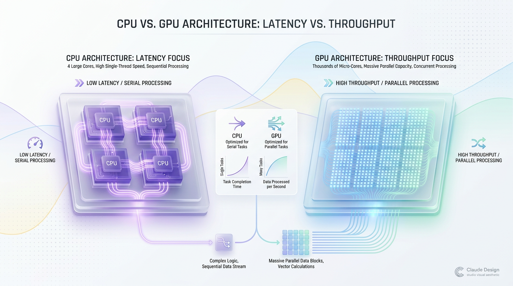
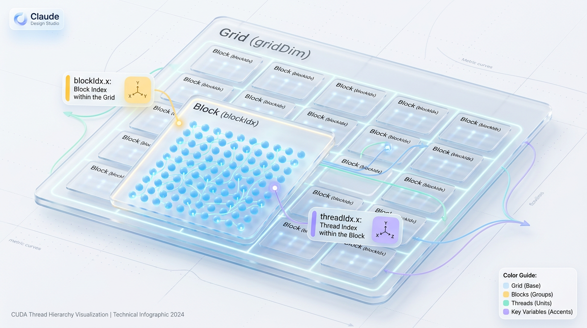
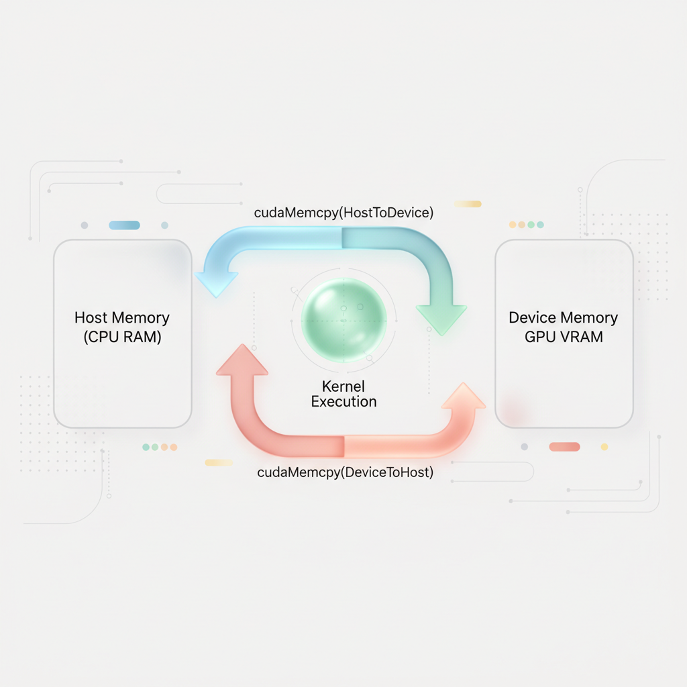
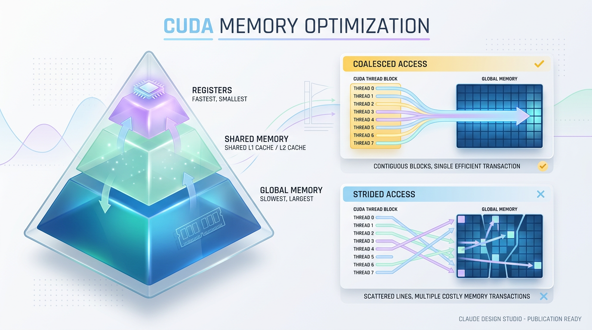

# CUDA Programming: Guide to Massive Parallelism on GPUs

*Learn the fundamentals of CUDA C++ to offload heavy computations from your CPU and dramatically accelerate your applications using GPU power.*

# Why Your CPU Is a Bottleneck: The Parallelism Paradigm

*CPUs excel at fast, flexible decision-making, while GPUs are built for massive data-parallel throughput.*


## Why CPUs and GPUs Are Built for Different Workloads

A **CPU** is like a small team of highly skilled specialists in a workshop. Each specialist is great at handling complex tasks, making decisions, and switching between different kinds of work quickly.

A **GPU** is more like a large crew of workers. Each worker is simpler, but together they can perform the same operation on thousands or millions of items at once.


*Figure 1: Architectural paradigm shift from CPU sequential latency optimization to GPU massively parallel throughput.*


> ✅ Best Practice: Think of CPUs as optimized for low-latency decision-making, and GPUs as optimized for high-throughput parallel execution.

This difference matters the moment your workload stops being mostly sequential. If your program processes one thing at a time, a CPU is often the best tool. But if it applies the same calculation to a huge amount of data, the CPU can become the bottleneck.

A good analogy is a kitchen:
- A **CPU** is a few expert chefs handling complicated recipes with precision.
- A **GPU** is a large team of prep cooks chopping the same vegetables at incredible speed.

The chefs win when the task is varied. The prep team wins when the task is repetitive and massive.


## Latency vs. Throughput: The Architectural Split

The biggest difference is not just the number of cores. It is the design philosophy.

A CPU is engineered for **latency**:


*Figure 2: The CUDA execution hierarchy, showing how Grids, Blocks, and Threads map logical indexing to hardware blocks.*

- It tries to finish one task as quickly as possible.
- It uses large caches to avoid waiting on slow memory.
- It has sophisticated branch prediction and control logic.
- It handles complex instruction flow very well.

A GPU is engineered for **throughput**:
- It tries to complete as many operations as possible per unit of time.
- It uses thousands of smaller cores.
- It expects many threads to run the same instruction on different data.
- It is less focused on individual task speed and more focused on total volume.

Think of it this way:
- **CPU:** “How fast can I solve this one problem?”
- **GPU:** “How many of these problems can I solve right now?”


## When GPUs Are the Better Fit

GPUs are especially effective when the same operation must be repeated across large datasets.

Common GPU-friendly workloads include:


*Figure 3: The standard Host-to-Device memory execution pipeline in a CUDA application.*

- **Image processing**
  - Applying filters to every pixel
  - Resizing, blurring, and edge detection
  - Video frame transformations

- **Scientific simulations**
  - Physics calculations
  - Fluid dynamics
  - Molecular modeling
  - Weather and climate simulation

- **Machine learning**
  - Matrix multiplication
  - Neural network training
  - Large-scale inference
  - Tensor operations on batches of data

These tasks share a pattern: many independent data elements, one repeated operation, and little need for complex branching.

> 💡 Tip: If you can describe your work as “do this same thing to a lot of items,” the GPU is probably worth considering.


## Why CPUs Struggle with Parallel Workloads

A CPU is not weak. In fact, it is incredibly strong at general-purpose computing.

The problem is that many workloads do not need a brilliant decision-maker. They need brute-force repetition.


*Figure 4: Left: The GPU speed-to-capacity memory hierarchy. Right: Impact of memory coalescing on memory transactions.*


When a CPU handles a highly parallel workload:
- It may process data in smaller batches.
- It can run into memory bandwidth limits.
- It wastes potential because only a few cores are active compared to a GPU.
- It spends more effort on control and flexibility than raw repetition.

That is why a CPU can feel like a bottleneck when the problem scales up. The code is not necessarily bad. The architecture is simply mismatched to the workload.


## From Sequential Thinking to Parallel Thinking

Programming on a CPU often teaches you to think step by step:
1. Read this value.
2. Compute the result.
3. Store it.
4. Move to the next item.

That mindset works well for a serial machine.

CUDA programming forces a different model. You stop thinking, “What is the next step?” and start thinking, “What can happen all at once?”

This shift is the heart of GPU programming:
- Break the problem into many independent pieces.
- Give each piece to a thread.
- Let thousands of threads work concurrently.
- Minimize dependencies between tasks.

In other words, the question changes from **“How do I make this faster?”** to **“How do I expose enough parallel work?”**


## A Simple Mental Model

Imagine you need to sort 10,000 identical forms.

A CPU might assign a few experts who can each process forms very efficiently, one after another. They are fast, but there are only a few of them.

A GPU would send hundreds or thousands of workers to process those forms in parallel. Each worker does a simple part, but the total job finishes much faster.

That is the real power of the GPU: **massive parallelism**.


## A Runnable Example: CPU-Style vs Parallel Thinking

Here is a simple Python example that shows the difference in mindset. It does not use a GPU yet, but it highlights the core idea: the same operation repeated across a large list.

```python
# sequential_vs_parallel_mindset.py
# Run with: python sequential_vs_parallel_mindset.py

from time import perf_counter

# Create a large dataset.
# In GPU-friendly problems, this could represent pixels, samples, or tensor values.
data = list(range(10_000_00))

def transform(x):
    # A simple repeated operation.
    # This is the kind of work GPUs are great at when applied across many values.
    return x * 2 + 1

# Sequential approach: process one item at a time.
start = perf_counter()
sequential_result = []
for value in data:
    sequential_result.append(transform(value))
sequential_time = perf_counter() - start

# Vector-like conceptual approach: same operation, still on CPU here,
# but this is the style of work that maps well to GPU kernels.
start = perf_counter()
comprehension_result = [transform(value) for value in data]
comprehension_time = perf_counter() - start

print(f"Sequential loop time: {sequential_time:.4f} seconds")
print(f"List comprehension time: {comprehension_time:.4f} seconds")
print(f"Results match: {sequential_result == comprehension_result}")
```

This example is still CPU-bound, but it reveals the pattern CUDA targets: **apply one operation to many independent values**.

On a GPU, that repeated transformation could be spread across thousands of threads instead of being handled one item at a time.


## How This Maps to CUDA

CUDA gives you a way to say: “Run this function across many data elements in parallel.”

That is the programming model shift:
- A CPU program often focuses on **control flow**
- A CUDA program focuses on **data parallelism**

The GPU hardware then schedules those threads in a way that keeps the machine busy and the throughput high.


## The Big Picture

If your workload is mostly:
- large,
- repetitive,
- data-parallel,
- and mathematically uniform,

then the GPU is usually a much better fit than the CPU.

If your workload involves:
- a lot of branching,
- irregular logic,
- frequent decisions,
- or complex single-threaded control,

the CPU is still the better choice.

> 🚀 Production Tip: CPUs are built to be fast thinkers. GPUs are built to be tireless workers. CUDA becomes powerful when you write for the worker army, not the lone specialist.


## CUDA’s Core Concepts: Grids, Blocks, and Threads

### The Kernel: The Function That Runs on the GPU

In CUDA, the basic unit of work is the **kernel**. A kernel is a C++ function marked with `__global__`, which tells the compiler that this function will run on the GPU and be launched from the CPU.

A kernel does not execute once in the usual way. Instead, it executes **across many threads at the same time**, with each thread handling a different piece of the problem.

> ✅ Best Practice: A CUDA kernel is the GPU version of a parallel function call.

A simple analogy is a warehouse packing line. Instead of one worker packing every box, you assign many workers, and each worker handles one box or a small group of boxes. CUDA works the same way: one kernel launch creates many GPU workers, called threads.

### The Hierarchy: Grid, Blocks, and Threads

CUDA organizes parallel work in a clear hierarchy:
- **Grid**: the entire collection of thread blocks launched for one kernel
- **Block**: a group of threads that run together on the same streaming multiprocessor
- **Thread**: the smallest execution unit, responsible for one piece of work

This hierarchy is how you map your problem onto the GPU hardware.

Think of it like a company structure:
- The **grid** is the full project
- Each **block** is a team
- Each **thread** is one team member doing a specific task

This structure matters because it lets CUDA scale from a few threads to millions of threads without changing the programming model.

### Built-In Variables for Finding Each Thread

CUDA gives you built-in variables to locate each thread inside the hierarchy:
- **threadIdx**: the thread’s index within its block
- **blockIdx**: the block’s index within the grid
- **blockDim**: the number of threads per block
- **gridDim**: the number of blocks in the grid

These values let each thread compute a **unique global index**, so it knows exactly which element of the data it should process.

For a 1D problem, the global index is usually:

```cpp
int globalIndex = blockIdx.x * blockDim.x + threadIdx.x;
```

Here’s why this works:
- `blockIdx.x * blockDim.x` gives the starting position of the block
- `threadIdx.x` offsets within that block
- Together, they produce one unique index per thread

> 💡 Tip: The thread index tells you who you are inside your block, while the block index tells you where your block starts in the overall grid.

### A Runnable Example: Adding Two Arrays

Here is a simple CUDA kernel that adds two arrays element by element.

```cpp
#include <cuda_runtime.h>
#include <iostream>
#include <vector>

// Each thread computes exactly one output element.
// __global__ means this function runs on the GPU.
__global__ void vectorAdd(const float* a, const float* b, float* c, int n) {
    // Compute a unique index for this thread across the entire grid.
    int idx = blockIdx.x * blockDim.x + threadIdx.x;

    // Guard against threads that map past the end of the array.
    if (idx < n) {
        c[idx] = a[idx] + b[idx];
    }
}

int main() {
    const int n = 8;
    const size_t bytes = n * sizeof(float);

    // Host data
    std::vector<float> h_a = {1, 2, 3, 4, 5, 6, 7, 8};
    std::vector<float> h_b = {10, 20, 30, 40, 50, 60, 70, 80};
    std::vector<float> h_c(n);

    // Device pointers
    float *d_a, *d_b, *d_c;

    // Allocate GPU memory
    cudaMalloc(&d_a, bytes);
    cudaMalloc(&d_b, bytes);
    cudaMalloc(&d_c, bytes);

    // Copy inputs from CPU to GPU
    cudaMemcpy(d_a, h_a.data(), bytes, cudaMemcpyHostToDevice);
    cudaMemcpy(d_b, h_b.data(), bytes, cudaMemcpyHostToDevice);

    // Choose a block size and compute the number of blocks needed.
    int threadsPerBlock = 4;
    int blocksPerGrid = (n + threadsPerBlock - 1) / threadsPerBlock;

    // Launch the kernel:
    // blocksPerGrid blocks, each with threadsPerBlock threads.
    vectorAdd<<<blocksPerGrid, threadsPerBlock>>>(d_a, d_b, d_c, n);

    // Copy the result back to the CPU
    cudaMemcpy(h_c.data(), d_c, bytes, cudaMemcpyDeviceToHost);

    // Print the result
    for (float value : h_c) {
        std::cout << value << " ";
    }
    std::cout << std::endl;

    // Cleanup
    cudaFree(d_a);
    cudaFree(d_b);
    cudaFree(d_c);

    return 0;
}
```

This example shows the core CUDA pattern:
- Allocate memory on the GPU
- Copy data to the GPU
- Launch a kernel using a grid of blocks and threads
- Copy results back to the CPU

### Visualizing the Mapping

Imagine a 1D array of 8 elements:
- `a[0] a[1] a[2] a[3] a[4] a[5] a[6] a[7]`

Now launch:
- **2 blocks**
- **4 threads per block**

The mapping looks like this:

```text
Grid
├── Block 0
│   ├── Thread 0 -> a[0]
│   ├── Thread 1 -> a[1]
│   ├── Thread 2 -> a[2]
│   └── Thread 3 -> a[3]
└── Block 1
    ├── Thread 0 -> a[4]
    ├── Thread 1 -> a[5]
    ├── Thread 2 -> a[6]
    └── Thread 3 -> a[7]
```

If you use more threads than data elements, some threads will compute an index outside the valid range. That is why the `if (idx < n)` check is essential.

### Extending the Idea to 2D Data

CUDA is not limited to 1D problems. For images, matrices, and simulations, you often use **2D grids and 2D blocks**.

For a 2D image, each thread might process one pixel:
- `threadIdx.x`, `threadIdx.y`
- `blockIdx.x`, `blockIdx.y`
- `blockDim.x`, `blockDim.y`

A 2D global coordinate can be computed like this:

```cpp
int x = blockIdx.x * blockDim.x + threadIdx.x;
int y = blockIdx.y * blockDim.y + threadIdx.y;
```

This is useful when each thread should work on one pixel in a matrix or image. The same hierarchy still applies, but now the mapping matches the geometry of the problem.

### Why This Hierarchy Matters

CUDA’s grid-block-thread model is not just syntax. It is the foundation that lets you express parallel work in a way the GPU can execute efficiently.

It helps you:
- Split large problems into manageable pieces
- Match work to GPU hardware
- Give each thread a clear responsibility
- Scale from small data to massive arrays and images

> 💡 Tip: CUDA programming starts with one question: “How do I map my problem onto a grid of blocks and threads?”

### What to Remember

When you look at a CUDA program, mentally trace this path:
- **Kernel**: the GPU function you launch
- **Grid**: the full set of blocks
- **Block**: a group of cooperating threads
- **Thread**: one lane of execution
- **Global index**: the unique data item that thread processes

If you can picture that structure clearly, CUDA becomes much easier to reason about. The rest of CUDA programming is mostly about choosing the right mapping for your data and your algorithm.


## Your First Kernel: A Hands-On Vector Addition

### From CPU Orchestration to GPU Parallelism

A CUDA program has two kinds of code working together: **host code** and **device code**. The **host** runs on the CPU and acts like the project manager, preparing data, launching work, and collecting results. The **device** runs on the GPU and handles the highly parallel part of the job.

A simple analogy is a restaurant kitchen. The host code is the head chef taking the order and coordinating the workflow, while the device code is the line of cooks processing many dishes at the same time. CUDA shines when you can break a problem into many independent pieces, just like adding elements of two vectors.

> ✅ Best Practice: The CPU sets up the work, and the GPU performs the repeated computation in parallel.

### The CUDA Memory Workflow

Before the GPU can do anything, it needs its own memory space. You typically move through four steps:
- **Allocate GPU memory** with `cudaMalloc()`
- **Copy input data to the GPU** with `cudaMemcpy()`
- **Copy results back to the CPU** with `cudaMemcpy()`
- **Release GPU memory** with `cudaFree()`

Think of it like packing luggage for a flight. The CPU is your home base, the GPU is a remote workspace, and `cudaMemcpy()` is the shuttle moving files between them. If you forget to move data over, the GPU has nothing to work on.

### A Complete Vector Addition Program

The following example adds two vectors element by element. Each GPU thread computes one output element, which is why vector addition is a perfect first kernel.

```cpp
// vector_add.cu
#include <iostream>
#include <vector>
#include <cuda_runtime.h>

// Simple error-checking helper.
// Why: CUDA calls can fail, and checking errors early makes debugging much easier.
#define CUDA_CHECK(call)                                                     \
    do {                                                                     \
        cudaError_t err = call;                                              \
        if (err != cudaSuccess) {                                            \
            std::cerr << "CUDA error: " << cudaGetErrorString(err)          \
                      << " at " << __FILE__ << ":" << __LINE__ << "\n";     \
            std::exit(EXIT_FAILURE);                                         \
        }                                                                    \
    } while (0)

// Device kernel: runs on the GPU.
// Each thread adds one element of a and b, storing the result in c.
__global__ void vectorAdd(const float* a, const float* b, float* c, int n) {
    // Compute the global thread index.
    int idx = blockIdx.x * blockDim.x + threadIdx.x;

    // Guard against out-of-bounds access when n is not a multiple of block size.
    if (idx < n) {
        c[idx] = a[idx] + b[idx];
    }
}

int main() {
    const int n = 1 << 20;  // 1,048,576 elements
    const size_t bytes = n * sizeof(float);

    // Host vectors: CPU-side storage.
    std::vector<float> h_a(n), h_b(n), h_c(n);

    // Initialize input data on the host.
    for (int i = 0; i < n; ++i) {
        h_a[i] = 1.0f;
        h_b[i] = 2.0f;
    }

    // Device pointers: GPU-side storage.
    float* d_a = nullptr;
    float* d_b = nullptr;
    float* d_c = nullptr;

    // Allocate memory on the GPU.
    CUDA_CHECK(cudaMalloc(&d_a, bytes));
    CUDA_CHECK(cudaMalloc(&d_b, bytes));
    CUDA_CHECK(cudaMalloc(&d_c, bytes));

    // Copy inputs from host to device.
    CUDA_CHECK(cudaMemcpy(d_a, h_a.data(), bytes, cudaMemcpyHostToDevice));
    CUDA_CHECK(cudaMemcpy(d_b, h_b.data(), bytes, cudaMemcpyHostToDevice));

    // Kernel launch configuration.
    // Why: Threads are grouped into blocks, and blocks form the grid.
    const int block_size = 256;
    const int grid_size = (n + block_size - 1) / block_size;

    // Launch the kernel on the GPU.
    vectorAdd<<<grid_size, block_size>>>(d_a, d_b, d_c, n);

    // Catch any launch or runtime errors from the kernel.
    CUDA_CHECK(cudaGetLastError());
    CUDA_CHECK(cudaDeviceSynchronize());

    // Copy result back to host.
    CUDA_CHECK(cudaMemcpy(h_c.data(), d_c, bytes, cudaMemcpyDeviceToHost));

    // Verify the result.
    bool valid = true;
    for (int i = 0; i < n; ++i) {
        if (h_c[i] != 3.0f) {
            std::cerr << "Mismatch at index " << i
                      << ": got " << h_c[i] << ", expected 3.0\n";
            valid = false;
            break;
        }
    }

    if (valid) {
        std::cout << "Vector addition succeeded.\n";
        std::cout << "h_c[0] = " << h_c[0] << ", h_c[n-1] = " << h_c[n - 1] << "\n";
    }

    // Free GPU memory.
    CUDA_CHECK(cudaFree(d_a));
    CUDA_CHECK(cudaFree(d_b));
    CUDA_CHECK(cudaFree(d_c));

    return valid ? EXIT_SUCCESS : EXIT_FAILURE;
}
```

### What the Kernel Launch Means

The line below is the heart of CUDA execution:

```cpp
vectorAdd<<<grid_size, block_size>>>(d_a, d_b, d_c, n);
```

This syntax tells CUDA to launch many threads on the GPU.

- **`grid_size`**: how many blocks to launch
- **`block_size`**: how many threads per block
- **`vectorAdd`**: the kernel function running on the device

A useful mental model is this:
- The **grid** is the whole job
- A **block** is one team of workers
- A **thread** is one worker handling one vector element

Inside the kernel, this formula gives each thread a unique index:

```cpp
int idx = blockIdx.x * blockDim.x + threadIdx.x;
```

That index is what makes parallelism simple. Each thread computes one output value independently, so many elements are processed at once instead of one by one.

### Compiling the CUDA Program

CUDA source files use the `.cu` extension and are compiled with NVIDIA’s **`nvcc`** compiler. Assuming you saved the file as `vector_add.cu`, compile it like this:

```bash
nvcc -O2 vector_add.cu -o vector_add
```

Here’s what that command means:
- **`nvcc`**: NVIDIA CUDA compiler
- **`-O2`**: enables optimization
- **`vector_add.cu`**: input source file
- **`-o vector_add`**: output executable name

Then run the program:

```bash
./vector_add
```

If everything is set up correctly, you should see output similar to:

```bash
Vector addition succeeded.
h_c[0] = 3, h_c[n-1] = 3
```

### How to Read the Execution Flow

The program follows a predictable host-device workflow:
- The CPU allocates and initializes input data
- The CPU allocates GPU memory with `cudaMalloc()`
- The CPU copies input arrays to the GPU with `cudaMemcpy()`
- The CPU launches the GPU kernel
- The GPU computes vector sums in parallel
- The CPU copies the results back
- The CPU verifies correctness and frees resources

That sequence is the backbone of most CUDA applications. Once you understand it, you can scale from vector addition to image processing, matrix multiplication, and other workloads that benefit from parallel execution.

> 🚀 Production Tip: CUDA programming starts with a simple pattern: prepare data on the host, compute on the device, and move results back when the GPU is done.


## Optimizing Performance: Memory and Execution

CUDA performance is often won or lost in two places: **how data moves** and **how many threads can run at once**. A kernel can have perfect parallel logic and still perform poorly if threads keep waiting on slow memory or if the GPU sits underutilized.

The good news is that most CUDA tuning follows a few repeatable rules. If you understand the **memory hierarchy**, write for **coalesced access**, and choose a block size that supports good **occupancy**, you can usually unlock major speedups without changing the algorithm itself.

> ✅ Best Practice: In CUDA, performance is less about doing more work and more about feeding the GPU efficiently.

### The Memory Hierarchy: Fast, Small, and Expensive vs. Slow, Large, and Cheap

CUDA memory is not one thing. It is a layered system with different trade-offs between **speed**, **capacity**, and **scope**.

Think of it like a kitchen:
- **Registers** are the chef’s hands: fastest, but extremely limited.
- **Shared memory** is the countertop: very fast and shared within a small team.
- **Global memory** is the pantry: large, convenient, but much slower to reach.
- **Local memory** is the emergency storage bin: still in device memory, but used when registers run out or when the compiler needs spill space.

In practice:
- **Registers** are the fastest storage available to each thread.
- **Shared memory (`__shared__`)** is fast on-chip memory shared by threads in the same block.
- **Global memory** is large device memory visible to all threads, but much slower.
- **Local memory** is not actually on-chip local storage; it usually lives in global memory space and is used for thread-private data that could not fit in registers.

The critical trade-off is simple: the faster the memory, the smaller it is.

### Why Shared Memory Matters

Shared memory exists because many kernels repeatedly read the same global data. If every thread fetches the same values from global memory, the GPU wastes bandwidth and time.

Shared memory solves this by letting threads in a block **load data once**, then reuse it many times at much lower latency.

A useful analogy is a group project:
- Going back to the library for every fact is slow.
- Writing important notes on a whiteboard in the room is much faster.
- That whiteboard is shared memory.

This makes shared memory ideal for:
- **Tiling** matrix operations
- **Staging input data** for repeated reuse
- **Exchanging values between threads in the same block**
- **Reducing redundant global memory accesses**

### Shared Memory in Practice

Below is a simple example of loading a tile of data into shared memory before computing on it. The main reason to do this is to avoid repeatedly reading the same values from global memory.

```cpp
// CUDA kernel: each block loads a tile into shared memory,
// then each thread works on the faster on-chip copy.
__global__ void scaleTile(const float* input, float* output, int n) {
    __shared__ float tile[256];  // Fast on-chip storage shared by the block

    int tid = threadIdx.x;
    int idx = blockIdx.x * blockDim.x + tid;

    // Load from global memory only once
    if (idx < n) {
        tile[tid] = input[idx];
    }

    // Make sure all threads finish loading before any thread uses the tile
    __syncthreads();

    // Do work using shared memory
    if (idx < n) {
        output[idx] = tile[tid] * 2.0f;
    }
}
```

Why this helps:
- The input value is fetched from **global memory** once.
- The same value is then used from **shared memory**, which is much faster.
- `__syncthreads()` ensures the block does not read partially loaded data.

A common optimization pattern is to use shared memory when:
- data is reused multiple times,
- neighboring threads need to cooperate,
- or a kernel benefits from a tile-based approach.

### Coalesced Memory Access: The Most Important Rule

If there is one memory rule to internalize, it is this: **threads in a warp should access consecutive memory locations whenever possible**.

This is called **coalesced access**. The GPU can combine memory requests from threads in the same warp into a small number of transactions instead of issuing one request per thread.

Think of it like a delivery truck:
- If 32 customers live on the same street, one truck can make a single efficient trip.
- If each customer is on a different road, the truck must make many separate stops.

That is exactly what happens with memory access patterns. Consecutive accesses are cheap. Scattered accesses are expensive.

### Why Coalescing Changes Performance So Much

A warp is a group of threads that execute together. When those threads read adjacent elements, the hardware can service them efficiently.

For example:
- Thread 0 reads `data[0]`
- Thread 1 reads `data[1]`
- Thread 2 reads `data[2]`
- ...
- Thread 31 reads `data[31]`

This is ideal because the memory controller can often combine the request into a few transactions.

But if the threads access something like:
- Thread 0 reads `data[0]`
- Thread 1 reads `data[1024]`
- Thread 2 reads `data[2048]`

then the GPU loses that benefit, and bandwidth drops sharply.

### A Coalesced Access Example

This example shows a simple kernel that copies data in a warp-friendly way. Notice that each thread accesses one element in a contiguous array.

```cpp
#include <cuda_runtime.h>
#include <iostream>

// Copy one element per thread with coalesced access.
__global__ void copyKernel(const float* input, float* output, int n) {
    int idx = blockIdx.x * blockDim.x + threadIdx.x;

    // Coalesced: consecutive threads access consecutive elements.
    if (idx < n) {
        output[idx] = input[idx];
    }
}

int main() {
    const int n = 1 << 20;
    const size_t bytes = n * sizeof(float);

    float *h_in = new float[n];
    float *h_out = new float[n];

    for (int i = 0; i < n; i++) h_in[i] = static_cast<float>(i);

    float *d_in, *d_out;
    cudaMalloc(&d_in, bytes);
    cudaMalloc(&d_out, bytes);

    cudaMemcpy(d_in, h_in, bytes, cudaMemcpyHostToDevice);

    int blockSize = 256;  // Good starting point for many kernels
    int gridSize = (n + blockSize - 1) / blockSize;

    copyKernel<<<gridSize, blockSize>>>(d_in, d_out, n);
    cudaDeviceSynchronize();

    cudaMemcpy(h_out, d_out, bytes, cudaMemcpyDeviceToHost);

    std::cout << "First output value: " << h_out[0] << std::endl;

    cudaFree(d_in);
    cudaFree(d_out);
    delete[] h_in;
    delete[] h_out;

    return 0;
}
```

Why this pattern is efficient:
- Each thread handles one contiguous element.
- Threads in the same warp access neighboring addresses.
- The GPU can combine those accesses into fewer memory transactions.

### Occupancy: Keeping the SM Busy

**Occupancy** is the ratio of active warps on an SM to the maximum number of warps the SM can support.

Put simply, it measures how well you are filling the GPU’s execution slots.

A useful analogy is a factory floor:
- If only a few workers are present, machines sit idle.
- If enough workers are available, when one group waits, another can keep the machines busy.

That is what occupancy helps with. When some threads stall on memory latency, the SM can switch to other ready warps and continue executing.

### Why Occupancy Matters, But Is Not Everything

Higher occupancy often helps hide latency, especially memory latency. But it is not a magic number that always improves performance.

In some kernels, using too many threads or too much shared memory per block can reduce occupancy. In others, the kernel is already compute-bound, so more occupancy gives little benefit.

The goal is not maximum occupancy at all costs. The goal is **enough occupancy to keep the GPU busy** while still allowing the kernel to use registers and shared memory efficiently.

### Tuning Block Size for Better Occupancy

Block size is one of the most important knobs in CUDA performance tuning. It affects:
- how many warps each block creates,
- how many blocks can fit on an SM,
- how much shared memory and register file space each block consumes.

A common starting point is:
- **128 threads per block**
- **256 threads per block**
- sometimes **512 threads per block**

These values often work well because they map cleanly to warps of 32 threads and give the scheduler enough work to balance across the SM.

However, the best block size depends on:
- **register usage per thread**
- **shared memory usage per block**
- **the target GPU architecture**
- **whether the kernel is memory-bound or compute-bound**

### A Practical Way to Think About Occupancy

If a block uses too many registers or too much shared memory, fewer blocks can fit on an SM. That reduces the number of active warps, which lowers occupancy.

If the block is too small, the GPU may not have enough parallel work to hide latency efficiently.

The balance is usually found through profiling, not guesswork.

> ✅ Best Practice: Occupancy helps hide latency, but it must be balanced against register pressure and shared memory usage.

### Execution Configuration: Matching Work to Hardware

A CUDA kernel launch is not just a function call. It is a contract with the GPU about how work is distributed.

When choosing execution configuration, aim for:
- **Enough threads per block** to create useful warp-level parallelism
- **Enough blocks** to keep all SMs busy
- **Memory layouts** that support coalescing
- **Shared memory usage** that improves reuse without choking occupancy

A good rule of thumb is to start with a standard block size such as 256 threads, then profile and adjust.

### Optimization Checklist

When a kernel is slow, ask these questions in order:
- Are global memory accesses coalesced?
- Can repeated global reads be moved into shared memory?
- Are registers spilling into local memory?
- Is block size limiting occupancy?
- Are you using more shared memory than necessary?

These questions usually reveal the biggest wins quickly.

### How the Pieces Fit Together

Imagine each SM as a small engine with:
- a set of **registers** for each thread,
- a block of **shared memory** for cooperating threads,
- a scheduler that runs **warps**,
- and access to large but slower **global memory**.

The performance path looks like this:
- **Global memory** feeds data into the SM
- **Shared memory** stages reusable data for a block
- **Registers** hold the thread’s hottest values
- **Occupancy** keeps enough warps ready to run when others stall

If you optimize these layers together, CUDA kernels become much faster without changing the underlying algorithm.


## Best Practices, Common Mistakes, and Production Tips

Writing CUDA code that is fast is only half the job. Writing CUDA code that is reliable, maintainable, and diagnosable in production is what separates a demo from a real system.

The most common CUDA failures are not exotic algorithm bugs. They are usually basic performance mistakes, silent runtime errors, and assumptions made without profiling.

> ✅ Best Practice: In production CUDA, reduce data movement, avoid warp divergence, check every API call, and optimize only after profiling.

### Mistake 1: Overusing `cudaMemcpy`

A frequent first-pass design is to move data back and forth between host and device after every small step. That works functionally, but it often destroys performance because **PCIe transfers are much slower than device memory operations**.

Think of the CPU and GPU like two offices connected by a slow courier service. If you keep sending tiny notes across the street one by one, the courier becomes the bottleneck, not the work itself.

#### Why This Hurts Performance

Every `cudaMemcpy` introduces:
- Transfer latency
- Synchronization overhead
- Reduced overlap between compute and communication

If your kernel does only a little work per transfer, the GPU spends more time waiting than computing.

#### Better Approach

- Keep data on the GPU as long as possible
- Batch transfers instead of many small copies
- Fuse kernels when it reduces round trips
- Use pinned memory when host-device transfers are unavoidable and performance-sensitive

### Mistake 2: Ignoring Thread Divergence

CUDA executes threads in groups called **warps**. On most NVIDIA GPUs, a warp contains 32 threads, and those threads are most efficient when they follow the same instruction path.

If threads inside a warp take different branches in an `if/else`, the GPU must execute each path separately. That is called **thread divergence**, and it can serialize execution.

Imagine 32 people in a synchronized marching band. If half of them suddenly turn left and the other half turn right, the band can no longer move as one unit. The same thing happens inside a warp.

#### Why This Hurts Performance

Divergence can:
- Reduce instruction throughput
- Waste active lanes in a warp
- Make performance unpredictable
- Hide the real cost of your algorithm

#### Better Approach

- Prefer branch-free logic when possible
- Keep branches uniform across neighboring threads
- Reorder data so threads in the same warp follow similar paths
- Use lookup tables or predication when the logic is simple

### A Divergence-Prone Kernel

```cuda
// Example: branch-heavy kernel that may cause warp divergence.
// Each thread chooses a different path based on its input.

__global__ void classify_and_transform(const float* input, float* output, int n) {
    int idx = blockIdx.x * blockDim.x + threadIdx.x;
    if (idx >= n) return;

    float x = input[idx];

    // Why this can be slow:
    // threads in the same warp may split across multiple branches.
    if (x > 0.0f) {
        output[idx] = x * 2.0f;
    } else if (x < -1.0f) {
        output[idx] = x * 0.5f;
    } else {
        output[idx] = x + 1.0f;
    }
}
```

### A More Warp-Friendly Idea

If the logic allows it, rewrite branches into arithmetic or simpler masks.

```cuda
// Example: reduce branching by using arithmetic selection.
// This is not always possible, but it shows the idea.

__global__ void transform_less_divergent(const float* input, float* output, int n) {
    int idx = blockIdx.x * blockDim.x + threadIdx.x;
    if (idx >= n) return;

    float x = input[idx];

    // Compute candidates first.
    float doubled = x * 2.0f;
    float halved = x * 0.5f;
    float shifted = x + 1.0f;

    // Use simple conditions to select a result.
    // Real code may use ternary operators or predication depending on the compiler.
    output[idx] = (x > 0.0f) ? doubled : ((x < -1.0f) ? halved : shifted);
}
```

### Best Practice: Check Every CUDA API Call

CUDA failures are often silent until later. A kernel may launch successfully, but the real error might only appear on the next API call or when synchronization happens. If you ignore return codes, you may spend hours debugging the wrong line.

This is similar to driving a car with the dashboard lights covered. The engine may already be failing, but you only discover it much later when the car stops.

#### What to Check

Always check the return value of:
- `cudaMalloc`
- `cudaMemcpy`
- `cudaFree`
- Kernel launches
- Stream operations
- Event operations

#### Why This Matters

- Catch invalid pointers early
- Detect out-of-memory conditions
- Surface launch configuration errors
- Reveal illegal memory access before they corrupt your debugging session

### Recommended Error-Checking Pattern

```cuda
#include <stdio.h>
#include <cuda_runtime.h>

// Small helper to print readable CUDA errors and stop early.
#define CUDA_CHECK(call) do {                                         \
    cudaError_t err = call;                                           \
    if (err != cudaSuccess) {                                         \
        fprintf(stderr, "CUDA error at %s:%d: %s\n",                  \
                __FILE__, __LINE__, cudaGetErrorString(err));         \
        exit(EXIT_FAILURE);                                           \
    }                                                                 \
} while (0)

__global__ void add_one(int* data, int n) {
    int idx = blockIdx.x * blockDim.x + threadIdx.x;
    if (idx < n) {
        data[idx] += 1;
    }
}

int main() {
    const int n = 1024;
    const size_t bytes = n * sizeof(int);

    int* h_data = (int*)malloc(bytes);
    int* d_data = nullptr;

    for (int i = 0; i < n; i++) {
        h_data[i] = i;
    }

    // Check every API call so failures are visible immediately.
    CUDA_CHECK(cudaMalloc(&d_data, bytes));
    CUDA_CHECK(cudaMemcpy(d_data, h_data, bytes, cudaMemcpyHostToDevice));

    add_one<<<(n + 255) / 256, 256>>>(d_data, n);

    // Kernel launches are asynchronous, so check launch errors explicitly.
    CUDA_CHECK(cudaGetLastError());

    // Synchronize here to catch runtime errors from the kernel.
    CUDA_CHECK(cudaDeviceSynchronize());

    CUDA_CHECK(cudaMemcpy(h_data, d_data, bytes, cudaMemcpyDeviceToHost));

    printf("h_data[0] = %d\n", h_data[0]);

    CUDA_CHECK(cudaFree(d_data));
    free(h_data);

    return 0;
}
```

### Production Tip: Profile Before You Optimize

It is tempting to guess where the slowdown is, then rewrite code based on intuition. In CUDA, that usually leads to wasted effort. The GPU has many overlapping bottlenecks: memory bandwidth, occupancy, instruction mix, divergence, cache behavior, and synchronization.

NVIDIA’s profiling tools, especially **Nsight Systems** and **Nsight Compute**, help you see what is actually happening.

Think of profiling like using a medical scan instead of treating symptoms blindly. You do not need a guess; you need evidence.

#### What Each Tool Is Good For

- **Nsight Systems**
  - Finds system-level bottlenecks
  - Shows CPU/GPU overlap
  - Reveals transfer stalls, stream usage, and timeline gaps

- **Nsight Compute**
  - Deep-dives into a single kernel
  - Shows occupancy, memory throughput, branch efficiency, register pressure, and warp execution details

#### Production Workflow

Use this loop repeatedly:
- Profile
- Analyze
- Optimize
- Re-profile

That cycle prevents optimizations that improve one metric while making the overall application worse.

> 💡 Tip: Do not optimize what you have not measured. CUDA performance work should be guided by profiler evidence, not intuition.

### A Practical Production Mindset

The best CUDA code is usually not the code with the most clever tricks. It is the code that:
- Moves data deliberately
- Keeps warps doing similar work
- Fails loudly when something goes wrong
- Uses profiling data to drive every optimization decision

If you follow those principles, your code will be much easier to maintain and much more likely to hold up under real workloads.


## Summary: Thinking in Parallel

CUDA programming is not about rewriting everything for the GPU. It is about identifying the **massively parallel** parts of your workload and moving only those pieces off the CPU. The CPU still handles orchestration, branching, setup, and other sequential logic well, while the GPU takes over the work that can be split into thousands of similar operations.

> 🚀 Production Tip: Keep the control flow on the CPU, and push the data-parallel heavy lifting to the GPU.

A helpful analogy is a kitchen. The CPU is the head chef who plans the meal, coordinates timing, and handles decisions. The GPU is the brigade of line cooks, all chopping, mixing, and plating at the same time. The faster your task can be divided into repeated, independent actions, the better it maps to the GPU.

### The CUDA Programming Model Is a Mental Model First

CUDA gives you a logical abstraction of **Grid**, **Block**, and **Thread**. This is not just syntax; it is how you describe work so the runtime can distribute it across the physical hardware.

- **Grid**: the entire kernel launch, representing all work
- **Block**: a group of threads that can cooperate closely
- **Thread**: the smallest unit of execution, usually responsible for one element or one small chunk of work

In practice, this abstraction lets you think in terms of “who does what” rather than “which core runs which instruction.” One thread might process one array element, one pixel, or one simulation cell. A block groups related threads, and the grid spans the full problem size.

### Performance Lives and Dies by Memory Behavior

The biggest CUDA performance gains often come not from raw compute, but from **memory efficiency**. GPU cores are fast, but they can stall if data is poorly arranged or constantly moved between host and device.

The two most important habits are:
- **Minimize host-device transfers**
  - Copy data to the GPU once when possible.
  - Keep intermediate results on the device instead of bouncing them back and forth.
- **Use coalesced global memory access**
  - Arrange access so neighboring threads read neighboring memory locations.
  - This lets the GPU combine requests efficiently and reduces memory traffic.

Think of it like delivering packages to a row of houses. If each driver visits adjacent houses in order, the route is efficient. If every driver must zigzag across town for one package each, the whole system slows down, even if the drivers are fast.

### A Simple CUDA Thinking Pattern

When approaching a new problem, ask these questions:
- What part is embarrassingly parallel?
- What must remain sequential?
- Where is the data living?
- How will threads access memory?

That mental checklist often matters more than the first kernel you write. A correct kernel with poor data movement can be slower than a well-designed CPU solution.

### A Tiny Example of the Split Between CPU and GPU

The CPU prepares the data and launches the kernel. The GPU performs the repeated work on each element in parallel.

```python
# This example uses Numba's CUDA support.
# It demonstrates the core idea: the CPU orchestrates, the GPU parallelizes.
# Install: pip install numba numpy

import numpy as np
from numba import cuda

@cuda.jit
def square_kernel(input_array, output_array):
    # Each thread handles one index.
    idx = cuda.grid(1)

    # Guard against out-of-bounds access.
    if idx < input_array.size:
        output_array[idx] = input_array[idx] * input_array[idx]

def main():
    n = 1024
    host_input = np.arange(n, dtype=np.float32)
    host_output = np.empty_like(host_input)

    # Move data to the GPU once.
    device_input = cuda.to_device(host_input)
    device_output = cuda.device_array_like(host_input)

    # Choose a launch configuration.
    threads_per_block = 128
    blocks_per_grid = (n + threads_per_block - 1) // threads_per_block

    # Launch the kernel: GPU does the parallel work.
    square_kernel[blocks_per_grid, threads_per_block](device_input, device_output)

    # Bring the result back only after computation finishes.
    device_output.copy_to_host(host_output)

    print(host_output[:10])

if __name__ == "__main__":
    main()
```

This code is small, but the structure reflects the full CUDA model:
- The **CPU** allocates memory and launches work.
- The **GPU** executes the kernel across many threads.
- Each thread handles one independent piece of the problem.

### What This Means for Your CUDA Journey

You now have the foundation to reason about parallel problems in a GPU-friendly way. The next step is not memorizing APIs; it is recognizing which parts of an algorithm benefit from massive concurrency and which parts should stay on the CPU.

From here, the natural next topics are:
- **Streams** for overlapping computation and data transfer
- **Dynamic parallelism** for launching kernels from kernels
- **CUDA libraries** such as:
  - **cuBLAS** for linear algebra
  - **cuFFT** for fast Fourier transforms
  - **cuDNN** for deep learning workloads

> ✅ Best Practice: CUDA performance starts with thinking in parallel, but it is won by respecting memory, data movement, and the CPU-GPU division of labor.

If you keep that model in mind, every future CUDA problem becomes easier to decompose, optimize, and scale.


## Key Takeaways

- CPUs are optimized for low-latency control flow, while GPUs are optimized for high-throughput parallel execution.
- CUDA works best when you can map a problem into many independent threads organized into grids and blocks.
- Coalesced global memory access and good shared-memory reuse are often more important than raw compute.
- Occupancy helps hide latency, but it must be balanced against register pressure and shared memory usage.
- Production CUDA code should minimize transfers, avoid divergence, check errors explicitly, and rely on profiling before optimization.