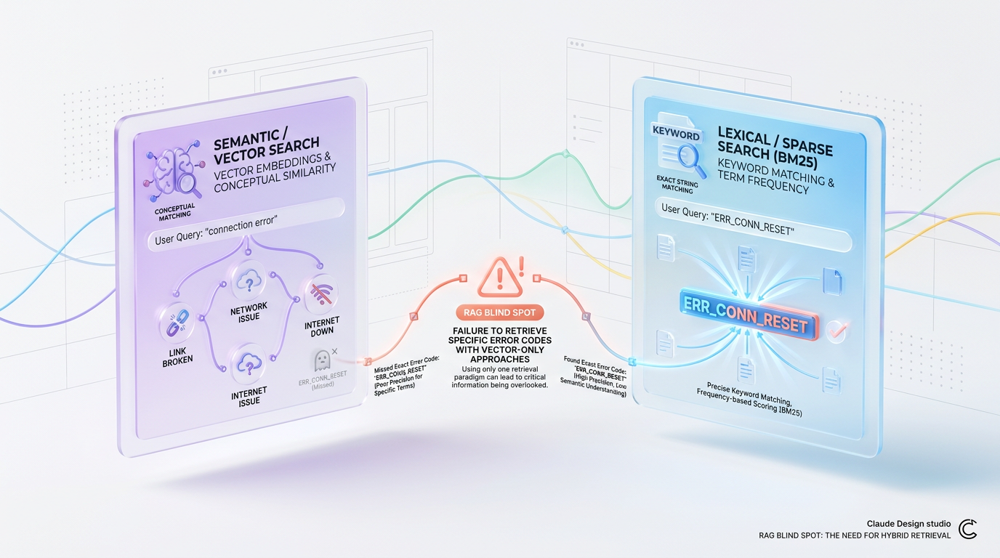
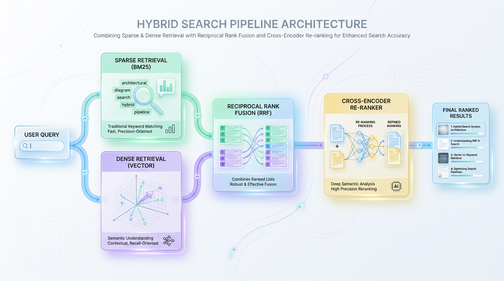

# Hybrid Search: Level Up Your RAG with BM25 & Vector Search

*Discover why pure vector search falls short and how combining BM25 and semantic embeddings creates a superior, production-ready AI retrieval system.*

# When Semantic Search Isn't Enough: The RAG Blind Spot

*Vector search is brilliant at meaning, but meaning alone is not enough in production RAG systems.*


## The Librarian Who Knows Ideas, But Not Labels

A pure embedding-based RAG system can answer broad, conceptual questions with impressive fluency. But when a user asks for a specific error code, product name, SKU, function name, or exact phrase, semantic similarity can become a liability.

> 💡 Tip: Production-grade RAG is not about choosing semantic search or lexical search. It is about combining them so each covers the other’s blind spots.

Imagine a librarian who understands every book’s theme, plot, and context, but cannot search by title, author, or ISBN.


*Figure 1: The RAG Blind Spot — Where pure semantic vector search overlooks exact keyword matches like error codes or SKUs, while lexical search misses context.*


If you ask, “Find me the book about memory in distributed systems,” they will do great. If you ask, “Find the book with ISBN 978-1-4028-9462-6,” they may stare blankly, even if the book is right there on the shelf. That is exactly how vector search behaves when the query depends on an exact token, code, or identifier.

Semantic retrieval is powerful because it captures intent. But intent is not always enough in real systems, where precision matters as much as relevance.


## A Real Failure Case: When the Error Code Vanishes

Consider a support agent asking a RAG system:

- “What does `ERR_CONN_RESET` mean?”
- “How do I fix `ERR_CONN_RESET` in production?”

A vector retriever might understand that this is about network connectivity, connection drops, retries, or socket failures. It may return documentation on generic network instability, timeout handling, or server disconnects.


*Figure 2: Hybrid Search Pipeline — Parallel execution of BM25 and Dense Retrieval fused through Reciprocal Rank Fusion (RRF) and refined by a Re-ranker.*


But if the source of truth is a document that explicitly says:

- `ERR_CONN_RESET: The remote peer reset the connection unexpectedly`

and that exact token never influences similarity enough, the retriever can miss it completely.

This is a dangerous failure mode because the answer is not just slightly off. It can be incomplete, misleading, or entirely wrong, even though the system appears confident.


## Why Pure Semantic Search Misses These Cases

Vector search compresses text into dense representations that capture concepts, not exact symbols. That works beautifully for phrases like:

- “How do I reduce API latency?”
- “Why is my model training so slow?”
- “Best way to cache repeated database queries”

But exact-match signals behave differently. Tokens like these often need lexical precision:

- Error codes: `ERR_CONN_RESET`
- IDs: `INV-20491`
- Function names: `parse_user_profile()`
- Product variants: `XG-9000`
- Legal clauses and quoted text

A dense vector may place `ERR_CONN_RESET` near “connection reset” in embedding space, but not always near the exact document that contains the string. The system understands the neighborhood, not the address.


## Why Hybrid Search Is the Robust Fix

Hybrid search combines BM25 and vector search so the retriever can find both the meaning and the exact wording.

Think of it this way:

- Vector search finds conceptually related documents
- BM25 finds documents containing the exact words, codes, and rare tokens
- Hybrid search merges both signals into one retrieval strategy

That fusion matters because real user queries are mixed. A single question may contain an exact identifier and a broad intent, such as:

- “How do I resolve `ERR_CONN_RESET` on our streaming gateway?”
- “Where is `invoice_48291` referenced in the billing docs?”
- “Explain the timeout policy for `auth_refresh_failed`”

In these cases, vector search handles the intent, while BM25 anchors the retrieval to the precise token. Together, they reduce false negatives dramatically.

> ✅ Best Practice: Treat hybrid retrieval as the default for production RAG when exact terms and semantic intent can appear in the same query.


## The Production Thesis

If you are building RAG for demos, vector search alone may look good enough.

If you are building RAG for production, it usually is not.

Production systems need to retrieve:

- exact error codes
- product and policy names
- unique IDs and filenames
- legal or compliance terms
- domain-specific jargon and abbreviations

That is why the real architectural choice is not “BM25 or embeddings.” It is **BM25 plus embeddings**. Hybrid search gives you semantic breadth and lexical precision in the same retrieval layer, which is exactly what real users expect when the cost of missing the right document is high.

> 🔥 Production Tip: The best retrieval stack is not the one that sounds smartest. It is the one that reliably returns the right document when the query is vague, specific, or both.


## Lexical Power: A Refresher on BM25 Sparse Retrieval


## What BM25 Is, in Plain English

**BM25** is one of the most important retrieval algorithms in search systems. It is a refined version of TF-IDF, designed to rank documents by how well they match the exact words in a query.

At a simple level, BM25 asks three questions:

- How often does the query term appear in the document?
- How rare is that term across all documents?
- How long is the document?

> ✅ Best Practice: Use BM25 whenever exact wording, rare identifiers, or quoted phrases are important to retrieval quality.

A helpful analogy is a library index card system. If you search for a very specific title, catalog code, or legal clause, BM25 is like the librarian who instantly knows which books contain that exact phrase. It does not need to understand meaning; it just needs to find strong textual overlap.


## Why BM25 Became the Workhorse of Search

BM25 improved on classic TF-IDF by making relevance scoring more practical and stable.

In TF-IDF, a term is important if it appears frequently in one document and is rare across the corpus. BM25 keeps that idea, but adds term saturation and length normalization:

- Term frequency helps when a word appears multiple times in a document.
- Inverse document frequency boosts rare terms more than common terms.
- Length normalization prevents long documents from winning simply because they have more words.

This matters because a short product page with the exact SKU should not be buried under a long article that mentions the SKU once in passing.

A practical way to think about it:

- Common words like “the” or “and” contribute almost nothing.
- Rare words like `XJ-2049` or `Section 14(b)` contribute a lot.
- Very long documents are not automatically favored just for being verbose.


## How BM25 Scores Relevance

BM25 computes a score for each document by combining the importance of each query term. The exact formula varies slightly by implementation, but the core idea is consistent:

- Terms that appear more often in the document increase the score.
- Terms that appear in fewer documents increase the score more strongly.
- Document length reduces the effect of raw frequency when the document is unusually long.

A simplified view looks like this:

```text
BM25(d, q) = sum over query terms t of:
  IDF(t) * [ TF component adjusted by document length ]
```

Where:

- IDF(t) = how rare the term is in the corpus
- TF component = how often the term appears in the document, with diminishing returns
- Length normalization = a penalty or adjustment based on document size

> ✅ Best Practice: BM25 does not just count words. It rewards rare, exact, repeated matches while controlling for document length.


## A Simple Ranking Example

Imagine three documents in a product knowledge base:

- Doc A: “The ZX-81 printer cartridge is compatible with model ZX-81.”
- Doc B: “This article explains printer compatibility across many brands.”
- Doc C: “ZX-81 replacement cartridge installation guide and warranty notes.”

Now search for: **“ZX-81 cartridge”**

BM25 will likely rank them like this:

1. Doc A — contains both exact terms, and `ZX-81` is rare
2. Doc C — also contains both terms, but maybe slightly less focused
3. Doc B — talks about printers, but does not contain the exact identifier

Why?

- `ZX-81` is a rare identifier, so it gets a strong boost.
- `cartridge` appears in relevant docs and adds more evidence.
- A document that contains both terms is far more likely to be ranked higher than one that only discusses the general topic.

This is why BM25 shines in domains where exact wording matters:

- SKUs and product IDs
- Legal clauses and statute references
- Error codes and log signatures
- Part numbers and serial identifiers
- Medical codes and technical abbreviations


## Why BM25 Is So Strong for Exact Keyword Queries

BM25’s biggest strength is precision when the query contains specific lexical anchors.

A user searching for:

- `iPhone 15 Pro Max A2849`
- `Section 230`
- `ERR_CONNECTION_RESET`
- `NVIDIA H100 SXM`
- `ISO 27001 clause 9.2`

usually wants documents containing those exact strings, not semantically similar ones.

That makes BM25 extremely valuable in production systems because it reliably handles:

- Highly specific searches
- Navigational queries
- Compliance and legal retrieval
- Catalog and inventory lookup
- Support and troubleshooting search


## The Trade-Off: Fast, Accurate, and Narrow

BM25 is computationally efficient. It works well with inverted indexes, which means search engines can find matching documents very quickly without scanning the entire corpus.

That is why BM25 has remained a backbone of search infrastructure for years. It is fast, mature, and easy to reason about.

But it has clear limitations:

- It does not understand context
- It does not infer intent
- It struggles with synonyms
- It can miss relevant documents if the exact words are absent

For example, a query for “car repair cost” may not retrieve a document that says “auto maintenance pricing,” even if the content is clearly relevant to a human.

BM25 sees words, not meaning.

> ✅ Best Practice: BM25 is excellent at exact lexical matching, but it cannot bridge semantic gaps the way vector search can.


## Why This Still Matters in the AI Stack

Even in a world of embeddings and large language models, BM25 is not obsolete. In fact, it is often the first retrieval layer in hybrid search systems.

Why?

- It is reliable for exact terms
- It is fast at scale
- It provides strong recall for keyword-heavy queries
- It complements vector search, which handles semantic similarity

The most effective modern retrieval stacks often combine both:

- BM25 for exact text overlap
- Vector search for meaning and paraphrase

That combination is what makes hybrid search so powerful: lexical precision plus semantic breadth.


## The Semantic Dimension: Where Vector Search Shines


## From Words to Meaning

**Vector search** works by turning text into dense embeddings: numeric vectors that represent meaning, not just words.

A language model reads a sentence, article, or query and maps it into a point in a high-dimensional space. In that space, documents with similar intent land close together, even if they use different vocabulary.

> 💡 Tip: Vector search does not ask, “Do these words match?” It asks, “Does this text mean something similar?”


## A Simple Mental Model

Think of vector embeddings like coordinates on a map of ideas.

A query like **“summer vacation ideas”** might sit near documents about:

- warm weather trip destinations
- beach resorts
- family travel in July
- coastal weekend getaways

Even if none of those pages contain the exact phrase “summer vacation ideas,” their semantic meaning is close enough that the model can recognize the connection.

That is the superpower of dense retrieval: it captures intent, context, and conceptual similarity.


## Why This Matters in Real Search

Keyword search is great when the right words appear in the right place. Vector search is better when users express the same need in different language.

For example:

- Query: “how to reduce latency in APIs”
- Relevant result: “optimizing response time for backend services”

These are semantically aligned, even though the wording differs. A keyword-only system may miss the match, but a vector-based system can still surface it.

> ✅ Best Practice: Vector search expands recall by finding related documents that share meaning, not just surface-level terms.


## How the Geometry Works

In practice, embeddings create a kind of semantic geography.

Nearby points represent related ideas, while distant points represent unrelated topics. This lets the system use distance metrics such as cosine similarity to rank results by closeness in meaning.

You can imagine this in two dimensions like this:

```text
                 Travel
                   ^
                   |
      warm weather trip destinations
                 •
               /   \
              /     \
   beach resorts •   • family travel in July

                   |
                   |
      summer vacation ideas •
                   |
                   +--------------------------------->

             Finance / Legal / Tech topics farther away
```

In a real system, this space is not 2D but hundreds or thousands of dimensions. The idea is the same: similar meaning clusters together.


## Where Vector Search Struggles

Dense retrieval is powerful, but it is not perfect.

Its biggest weakness is that it can miss specific, exact keywords that matter a lot. If a query includes a precise term like:

- a product code
- a medical drug name
- a legal clause number
- a rare technical acronym

a vector model may generalize too much and return conceptually related but factually off-target results.

It is also more expensive than sparse methods like BM25.

Why?

- Embeddings must be generated for documents and queries.
- Similarity search often requires specialized indexes.
- Large-scale nearest-neighbor retrieval adds infrastructure and latency overhead.

So while vector search improves semantic matching, it can cost more in compute, memory, and operational complexity.


## When to Use It

Vector search is especially useful when the query is:

- vague or conversational
- expressed in natural language
- likely to use synonyms or paraphrases
- focused on intent rather than exact phrasing

It is less reliable when precision depends on:

- exact token matches
- rare named entities
- structured identifiers
- compliance-sensitive wording

> ⚠️ Common Mistake: Do not use vector search alone when exact terms, IDs, or codes determine whether the answer is correct.


## Why This Becomes Important in Hybrid Search

This is exactly why dense retrieval is so valuable in a hybrid system. It fills the semantic gap left by keyword methods, while BM25 still protects precision around exact terms.

Together, they cover both sides of search:

- BM25 for lexical accuracy
- Vector search for semantic understanding

That balance is what makes hybrid search powerful.


## Fusing Worlds: Architecting a Hybrid Search Pipeline


## Why Hybrid Search Works

BM25 and vector search solve different parts of the retrieval problem. BM25 is excellent at exact term matching, while vector search is strong at semantic similarity and intent matching.

A hybrid pipeline does not choose between them. Instead, it runs both in parallel and merges the results into a single ranked list. The result is usually a more robust search experience, especially for queries that are short, ambiguous, or phrased in unexpected ways.

> 💡 Tip: Hybrid search improves recall and ranking quality by combining lexical precision with semantic understanding.


## The Parallel Retrieval Model

The architectural pattern is simple: the user query is broadcast to two retrieval systems at the same time.

- Sparse retrieval path: BM25 searches an inverted index for exact and near-exact term matches.
- Dense retrieval path: A vector index finds documents whose embeddings are semantically close to the query embedding.

This parallelism matters because neither path blocks the other. In practice, the query fan-outs simultaneously, each retriever returns its own top-K list, and a fusion layer combines them downstream.

Think of it like asking two specialists the same question:

- One is a librarian who finds books by keywords.
- The other is a research assistant who understands meaning and context.

Each gives a ranked shortlist, and the system later reconciles both opinions.


## Why Reciprocal Rank Fusion Is the Default Choice

A common challenge in hybrid search is that BM25 scores and vector similarity scores are not directly comparable. One system may return cosine similarity, another may return BM25 relevance scores, and their numeric ranges can be wildly different.

That is where Reciprocal Rank Fusion, or RRF, shines. Instead of trying to normalize scores, it uses only the rank position of each document in each list. This makes it simple, stable, and surprisingly effective.

The core idea is:

- Documents ranked highly by either system get rewarded.
- Documents appearing in both lists get an extra boost.
- Low-ranked documents contribute very little.

The formula is:

**RRF(d) = Σ 1 / (k + rank(d, list))**

Where:

- d is a document
- rank(d, list) is the position of document d in a ranked list
- k is a smoothing constant, often around 60
- The sum is taken across all retrieval lists

Because RRF uses ranks instead of raw scores, it avoids the messy problem of score calibration across retrieval systems.


## How RRF Merges Results in Practice

Here is a simple pseudocode view of the fusion layer:

```python
def reciprocal_rank_fusion(result_lists, k=60):
    """
    Merge multiple ranked lists using Reciprocal Rank Fusion.

    Why this works:
    - Higher-ranked documents contribute more.
    - Documents appearing in multiple lists get rewarded.
    - No score normalization is required.
    """
    fused_scores = {}

    # result_lists is a list of ranked lists:
    # [
    #   ["docA", "docB", "docC"],   # BM25 results
    #   ["docC", "docE", "docA"]    # Vector results
    # ]
    for ranked_list in result_lists:
        for rank, doc_id in enumerate(ranked_list, start=1):
            # Reciprocal contribution from this list
            contribution = 1.0 / (k + rank)

            # Accumulate contributions across systems
            fused_scores[doc_id] = fused_scores.get(doc_id, 0.0) + contribution

    # Sort documents by fused score in descending order
    return sorted(fused_scores.items(), key=lambda x: x[1], reverse=True)


# Example usage
bm25_results = ["docA", "docB", "docC"]
vector_results = ["docC", "docE", "docA"]

fused = reciprocal_rank_fusion([bm25_results, vector_results], k=60)

for doc_id, score in fused:
    print(doc_id, round(score, 6))
```

A document like `docA` benefits because it appears in both lists, even if it is not number one in either. That is the essence of hybrid retrieval: agreement between systems increases confidence.


## A Mental Model for the Fusion Layer

Imagine two judges scoring contestants, but instead of using their raw scores, you only care about placement.

- First place earns the most fusion credit.
- Second place earns a little less.
- Tenth place still counts, but barely.
- If both judges rank the same contestant well, that contestant rises.

This is why RRF is so useful in real systems. It is easy to reason about, resilient to score scale differences, and usually performs well without heavy tuning.


## Reference Architecture for the Pipeline

A clean hybrid search architecture usually looks like this:

- Query intake
  - User submits a search query.
- Parallel retrieval
  - BM25 retrieves lexical matches.
  - Vector search retrieves semantic matches.
- Candidate pooling
  - Combine the top-K candidates from both systems.
- Fusion
  - Apply RRF to produce one unified score per document.
- Optional reranking
  - A cross-encoder or LLM-based reranker can refine the final top results.
- Response assembly
  - Return the final ranked list to the application.

> ✅ Best Practice: Treat retrieval as a two-stage problem: fast candidate generation first, then smarter ranking second.


## The Trade-Off: Relevance Gains Versus System Cost

Hybrid search is not free. You are now operating two retrieval paths, maintaining two indexes, and merging two ranked lists. That adds a bit of latency, infrastructure complexity, and operational overhead.

But the payoff is often worth it.

- Latency impact: Slightly higher due to parallel fan-out and fusion logic.
- Engineering complexity: More moving parts, more monitoring, more tuning.
- Relevance gain: Usually a measurable improvement in retrieval quality, often reflected in better nDCG and stronger Top-K satisfaction.

In practice, the latency increase is often modest because the two retrieval systems run concurrently. The real cost is usually in orchestration and evaluation, not in the fusion step itself.


## Why This Architecture Is Worth It

Hybrid search behaves well across query types:

- Exact product names and IDs favor BM25.
- Conceptual or paraphrased queries favor vector search.
- Mixed queries benefit from both.

That makes RRF-based fusion a practical default for modern search systems. It is simple enough to ship, strong enough to matter, and flexible enough to support future reranking layers.

> 🚀 Production Tip: Keep the retrieval layer modular so you can tune BM25, embeddings, fusion, and reranking independently as your corpus and user behavior change.


## Production Playbook: Mistakes, Tips & Best Practices

Hybrid search works best when you treat it like a ranking pipeline, not a simple score merge. The goal is not to add BM25 to vectors and hope for the best. The goal is to combine two different signals in a way that is stable, explainable, and easy to tune in production.

> ✅ Best Practice: If your lexical and semantic scores live on different scales, score addition is usually a trap. Rank-based fusion is safer, more robust, and easier to operate.


## Mistake: Naively Adding BM25 and Vector Scores

A very common first attempt is to normalize both systems’ scores and add them together. That sounds reasonable, but it often fails because BM25 scores and vector similarity scores are not naturally comparable. One engine may produce values in a narrow range, while the other may spread results much more aggressively.

Think of it like combining a thermometer and a speedometer by adding their readings together. The number is technically real, but it does not mean anything useful. In search, this leads to unstable rankings where one retriever dominates simply because its score distribution is larger.


## Why Rank-Based Fusion Works Better

A better approach is Reciprocal Rank Fusion. Instead of trusting raw scores, RRF looks at where a document ranked in each result list. Documents that appear near the top in multiple lists get rewarded, while documents that appear low or not at all get less influence.

The intuition is simple:

- If BM25 thinks a document is relevant, that is a strong lexical signal.
- If vector search also thinks it is relevant, that is a strong semantic signal.
- If both systems agree, the document should rise.

RRF captures that agreement without requiring score calibration. That makes it much more reliable across different models, corpora, and search engines.


## Simple RRF Example

Here is a minimal Python example that demonstrates the idea:

```python
from collections import defaultdict

def reciprocal_rank_fusion(result_lists, k=60):
    """
    Combine ranked lists from multiple retrievers using RRF.

    WHY:
    - Avoids score calibration problems.
    - Rewards documents that appear high in multiple rankings.
    - Works well when BM25 and vector scores are on different scales.
    """
    fused_scores = defaultdict(float)

    for results in result_lists:
        for rank, doc_id in enumerate(results, start=1):
            fused_scores[doc_id] += 1.0 / (k + rank)

    # Return docs sorted by fused score descending
    return sorted(fused_scores.items(), key=lambda x: x[1], reverse=True)


bm25_results = ["doc_7", "doc_2", "doc_9", "doc_1"]
vector_results = ["doc_2", "doc_8", "doc_7", "doc_3"]

fused = reciprocal_rank_fusion([bm25_results, vector_results], k=60)
print(fused)
```

This works because it uses relative position, not fragile score magnitudes. If both systems place the same item near the top, that item naturally becomes more important.


## Best Practice: Add a Lightweight Re-Ranker After Fusion

Fusion should not be your final stop. For best-in-class quality, use a lightweight re-ranker model on the top-K fused candidates. This stage takes the most promising results and scores them more carefully using the actual query and document text together.

A good mental model is:

- BM25 finds exact term matches
- Vector search finds semantic neighbors
- Fusion merges their candidate lists
- Re-ranking performs the final precision pass

This final step is where you often get the biggest quality jump for the smallest additional cost. Cross-encoders and small transformer re-rankers are especially useful when relevance depends on nuance, phrasing, or domain-specific context.

> ✅ Best Practice: Use hybrid retrieval for recall, then use re-ranking for precision.


## Production Tip: Tune RRF k or Use Weighted Fusion

The RRF constant `k` is not just a math detail. It controls how much you favor the very top positions versus the broader tail of each ranking list. A smaller `k` makes top ranks matter more; a larger `k` smooths the influence across more results.

In some domains, you may also want weighted fusion. For example:

- Legal or compliance search: favor lexical matches more heavily
- Customer support knowledge bases: favor semantic matches more heavily
- E-commerce search: balance exact product terms with intent matching

A practical weighted approach is to multiply each rank contribution by a retriever-specific weight.

```python
from collections import defaultdict

def weighted_rrf(result_lists, weights=None, k=60):
    """
    Weighted reciprocal rank fusion.

    WHY:
    - Lets you bias retrieval toward lexical or semantic signals.
    - Useful when one retriever performs better for your domain.
    """
    if weights is None:
        weights = [1.0] * len(result_lists)

    fused_scores = defaultdict(float)

    for weight, results in zip(weights, result_lists):
        for rank, doc_id in enumerate(results, start=1):
            fused_scores[doc_id] += weight * (1.0 / (k + rank))

    return sorted(fused_scores.items(), key=lambda x: x[1], reverse=True)


bm25_results = ["doc_7", "doc_2", "doc_9", "doc_1"]
vector_results = ["doc_2", "doc_8", "doc_7", "doc_3"]

# Give BM25 a slight boost if exact terminology matters more in your domain
fused = weighted_rrf([bm25_results, vector_results], weights=[1.2, 1.0], k=60)
print(fused)
```

A good tuning workflow is:

- Start with plain RRF
- Measure retrieval metrics and clickthrough behavior
- Adjust `k` to control rank sensitivity
- Add weights only if one retriever consistently helps more than the other


## Optimization Strategy: Simplify Operations With One Engine

If you can, use a single search engine that supports both sparse and dense retrieval. Platforms such as Weaviate and Elasticsearch reduce operational complexity by keeping lexical and vector search under one roof.

That matters more than it first appears. If BM25 and vector search live in separate systems, you must manage:

- two indexing pipelines
- two availability targets
- two query paths
- synchronization issues between stores
- duplicated observability and tuning

A unified engine simplifies deployment and reduces the chance that one index drifts out of sync with the other. It also makes it easier to experiment with hybrid scoring, retrieval weights, and reranking in one place.


## What to Index and How

For robust hybrid search, index both text fields and dense embeddings for the same document. Keep the document ID consistent across sparse and dense representations so fusion is deterministic and easy to debug.

A production-friendly indexing checklist:

- Text normalization: lowercase, tokenize, remove obvious noise where appropriate
- Dense embeddings: generated with the same model version across the corpus
- Metadata: store filters such as category, language, and access control
- Versioning: track embedding model version and reindex when it changes
- Observability: log query terms, top-K candidates, and final reranker outputs


## Final Production Pattern

A strong hybrid search stack usually follows this sequence:

1. BM25 retrieval for exact term recall
2. Vector retrieval for semantic recall
3. Rank-based fusion to merge candidates safely
4. Lightweight re-ranker to refine the top-K
5. Filtering and business rules for access control, freshness, or personalization

This pipeline keeps the system robust under change. You can swap embedding models, update lexical analyzers, or adjust domain weights without rebuilding the whole architecture.

> 🚀 Production Tip: Use rank fusion to combine candidate sets, and use a re-ranker to decide the final winners. That separation of labor is what makes hybrid search production-grade.


## Summary: The New Standard for High-Performance RAG


## The Core Lesson: Retrieval Works Best When It Admits Its Limits

The biggest takeaway from hybrid search is simple: lexical search and vector search solve different problems. BM25 is excellent when the query terms matter exactly, while embeddings shine when meaning matters more than wording.

Think of it like using both a map and a local guide. The map is precise about names and locations; the guide understands intent, context, and shortcuts. Relying on only one works sometimes, but serious retrieval systems need both.

> 💡 Tip: Treat retrieval like complementary signals, not competing ideologies.


## Why Hybrid Search Wins: Better Relevance, Backed by Math

Hybrid search is not just a pragmatic compromise. It is a relevance strategy that combines the strengths of both retrieval methods and reduces the chance that one system misses something important.

A common approach is Reciprocal Rank Fusion, which rewards documents that rank well in multiple retrieval lists. In plain terms, if a document appears near the top in both BM25 and vector results, it gets a stronger fused score than something that only appears in one list.

The intuition is easy to grasp: if two independent systems agree on a result, that result is probably worth trusting. RRF turns that intuition into a simple, mathematically sound ranking method.

```python
from collections import defaultdict

def reciprocal_rank_fusion(result_lists, k=60):
    """
    Fuse multiple ranked lists using Reciprocal Rank Fusion.
    Why this works:
    - Higher-ranked documents contribute more.
    - Documents appearing in multiple lists get boosted.
    - Simple and robust for production retrieval.
    """
    scores = defaultdict(float)

    for result_list in result_lists:
        for rank, doc_id in enumerate(result_list, start=1):
            scores[doc_id] += 1.0 / (k + rank)

    # Sort by highest fused score
    return sorted(scores.items(), key=lambda x: x[1], reverse=True)


# Example ranked outputs from BM25 and vector search
bm25_results = ["doc_12", "doc_7", "doc_3", "doc_99"]
vector_results = ["doc_7", "doc_42", "doc_3", "doc_8"]

fused = reciprocal_rank_fusion([bm25_results, vector_results])

for doc_id, score in fused:
    print(doc_id, round(score, 6))
```


## What the Best Production Systems Look Like

The most reliable RAG systems usually follow a Fetch -> Fuse -> Re-rank pipeline.

- Fetch: Retrieve a broad candidate set from BM25 and vector search.
- Fuse: Combine rankings with a method like RRF to create a stronger shortlist.
- Re-rank: Apply a more expensive model, such as a cross-encoder or LLM-based scorer, to refine the final ordering.

This architecture is powerful because each stage does what it does best. Retrieval is fast and broad, fusion is stable and robust, and re-ranking is precise where it matters most.

> ✅ Best Practice: A well-architected hybrid pipeline is not an advanced optional feature anymore. It is the new baseline for production-grade RAG.


## The New Default for Serious RAG Applications

If your application needs accuracy, resilience, and consistent answer quality, hybrid search should be your default starting point. Pure BM25 can miss semantic matches, and pure vector search can miss exact terms, rare entities, acronyms, and structured signals.

That is why hybrid systems are now the practical standard for serious retrieval workloads. They give you better recall, better ranking stability, and a safer path to trustworthy generation.


## Benchmark It Before You Bet on It

The fastest way to prove this to yourself is to run an evaluation on your own data. Compare your current retrieval method against a hybrid baseline using metrics like:

- Recall@K
- MRR
- nDCG@K
- Answer accuracy
- Human relevance judgment

If hybrid search is implemented well, the improvement is usually obvious in both rankings and downstream answer quality. The data will tell you whether your current setup is good enough — or whether it is time to upgrade.

> 🚀 Production Tip: Benchmark hybrid search against your current retrieval pipeline. For most serious RAG systems, the results make the case for themselves.


## Key Takeaways

- BM25 is essential when exact terms, IDs, codes, and quoted phrases determine relevance.
- Vector search excels at semantic similarity, paraphrase handling, and intent-based retrieval.
- Hybrid search reduces false negatives by combining lexical precision with semantic breadth.
- Reciprocal Rank Fusion is a strong default because it merges rankings without fragile score calibration.
- The most production-ready RAG stacks use hybrid retrieval plus a re-ranker for final precision.