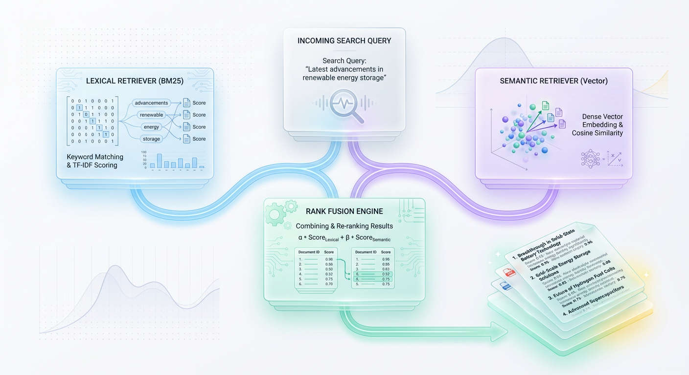
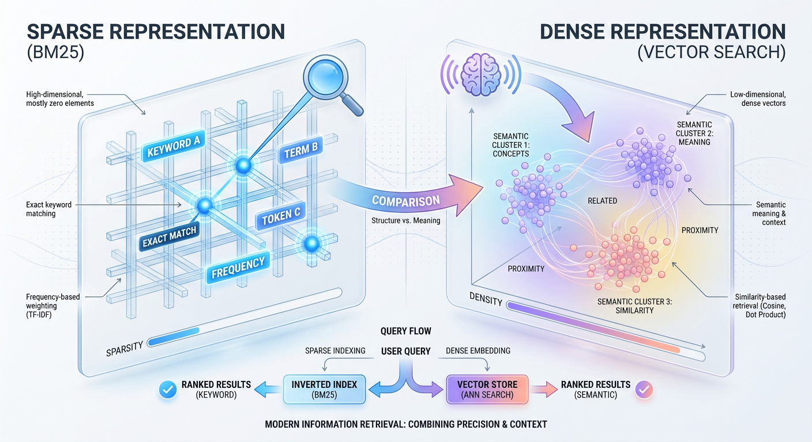
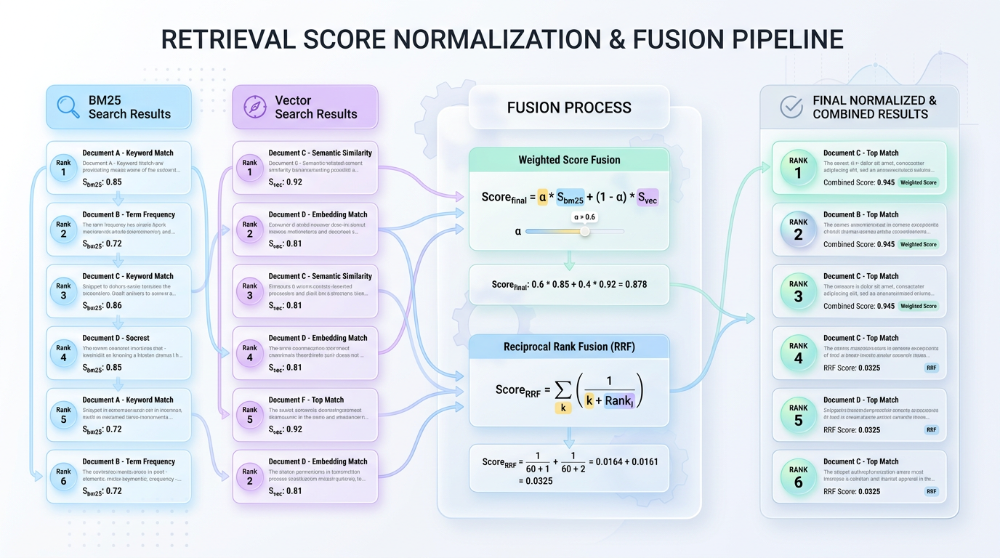
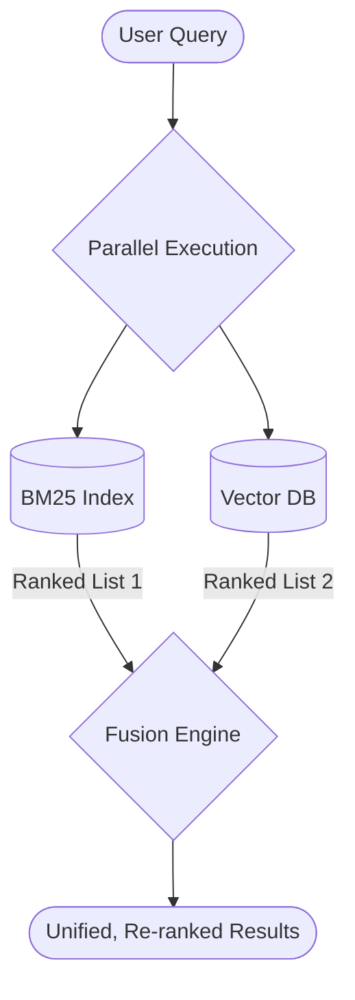

# Hybrid Search: Unlocking Smarter AI with BM25 & Vectors

*Discover why pure vector search fails for production RAG and how hybrid models combining BM25 and vectors deliver superior, more relevant AI results.*


## When Semantic Search Isn't Enough: The Hybrid Imperative
*Pure vector search often fails on exact-match queries, making a hybrid approach of lexical and semantic retrieval essential for production-grade AI systems.*

We were promised that vector search would solve information retrieval forever. By encoding text into dense mathematical vectors, semantic search captures the underlying intent and context of a user's query, moving us past the era of rigid keyword matching. Yet, engineering teams migrating entirely to vector databases often encounter a frustrating surprise: users searching for exact product serial numbers, obscure acronyms, or specific error codes suddenly get highly irrelevant results.



*Figure 1: The Hybrid Search Architecture—Combining Lexical Precision with Semantic Depth.*


The reality of production AI is that pure semantic search has a massive blind spot: it struggles with exactness.

> ⚠️ **The Vector Blind Spot:** Dense retrieval algorithms excel at understanding broad concepts, but they are notoriously poor at identifying specific, low-frequency tokens like product SKUs, serial numbers, or new industry jargon. This happens because the embedding models that create vectors are trained to generalize, often "smearing" or averaging out the uniqueness of rare terms.


## The Two Modes of Search: Conceptual vs. Lexical

To build a robust search system, we must first understand the dual nature of how users seek information. Imagine searching for a book in a massive library.

*   **Conceptual Search (Semantic):** You tell the librarian, "I want a cozy, historical mystery set in Victorian London." The librarian understands the *vibe* and guides you to the correct aisle, suggesting books with the right atmospheric mood, even if "Victorian" isn't in their titles. This is vector search.
*   **Lexical Search (Keyword):** You go to the card catalog and look for the exact registration number "ISBN 978-3-16-148410-0." The catalog doesn't understand moods, but it points you to the book's precise shelf and slot instantly. This is traditional keyword search.

A system that relies only on the librarian will fail to find books by their exact registration code. A system that relies only on the card catalog cannot browse by mood. Modern search requires both, leading us to a hybrid architecture that combines the strengths of two distinct retrieval methods: keyword-based BM25 and semantic Vector Search.



*Figure 2: Sparse (BM25) vs. Dense (Vector) retrieval representations.*


## A Tale of Two Retrievers: BM25 vs. Vector Search

To build a hybrid system, you need to master its two core components. One is an expert in literal matching, while the other is a master of abstract understanding.

### BM25: The Keyword Expert

**BM25 (Best Matching 25)** is the gold standard for keyword-based, or lexical, search. It's a sophisticated evolution of TF-IDF that scores documents based on the exact query terms they contain. It excels by balancing three factors:



*Figure 3: Mechanics of Hybrid Score Fusion—Comparing Weighted Fusion and Reciprocal Rank Fusion.*


1.  **Term Frequency (TF):** How often do the query words appear in a document?
2.  **Inverse Document Frequency (IDF):** Are the query words common or rare across all documents? Rare words get a higher weight.
3.  **Document Length:** It penalizes overly long documents to prevent them from ranking highly just by chance.

The result is a system that is incredibly fast, requires no model training, and is unbeatable at finding documents with specific, rare tokens.

> ✅ **Best Practice:** Use BM25 for queries that demand precision, such as finding product SKUs, error codes, legal case numbers, or exact names and acronyms.

### Vector Search: The Concept Guru

**Vector Search** operates on a completely different principle. It uses deep learning models (like BERT or Cohere Embed) to convert text into numerical vectors, which are points in a high-dimensional "concept space." In this space, words and sentences with similar meanings are placed close together, regardless of their vocabulary.

When a user submits a query, it is also converted into a vector. The system then finds the document vectors that are mathematically closest, typically using Cosine Similarity. This allows it to understand synonyms, handle typos, and even work across different languages.

`Cosine_Similarity(A, B) = (A • B) / (||A|| * ||B||)`

> 💡 **Tip:** Vector search is ideal for exploratory or conversational queries where the user is describing a problem or concept without knowing the exact terminology.

### How They Behave: A Practical Comparison

Let's observe how these two retrievers handle the query **"best laptop for coding"** against a small set of documents.

*   **Document A:** "Choosing the *best* *laptop* *for* software development and programming."
*   **Document B:** "A guide to the *best* mechanical keyboard *for* *coding* on a desktop."
*   **Document C:** "Our top-rated developer computer options for 2024."

Here’s a Python script demonstrating the divergent results using `rank_bm25` and `sentence-transformers`.

```python

# Ensure you have installed: pip install rank_bm25 sentence-transformers numpy
import numpy as np
from rank_bm25 import BM25Okapi
from sentence_transformers import SentenceTransformer


# 1. Prepare our corpus and query
documents = [
    "Choosing the best laptop for software development and programming.", # Doc A
    "A guide to the best mechanical keyboard for coding on a desktop.",    # Doc B
    "Our top-rated developer computer options for 2024."                 # Doc C
]
query = "best laptop for coding"


# --- BM25 (Keyword) Retrieval ---
tokenized_corpus = [doc.lower().split(" ") for doc in documents]
bm25 = BM25Okapi(tokenized_corpus)
bm25_scores = bm25.get_scores(query.lower().split(" "))

print("--- BM25 Results (Keyword-Driven) ---")


## BM25 will rank Doc B highest due to matching 'best', 'for', and 'coding'

# It incorrectly prioritizes keyword overlap over the core subject (laptop vs. keyboard).
for doc, score in sorted(zip(documents, bm25_scores), key=lambda x: x[1], reverse=True):
    print(f"Score: {score:.2f} | Doc: {doc}")


# --- Vector Search (Semantic) Retrieval ---
model = SentenceTransformer('all-MiniLM-L6-v2')
doc_embeddings = model.encode(documents)
query_embedding = model.encode(query)


# Simple cosine similarity function
def cosine_similarity(v1, v2):
    dot_product = np.dot(v1, v2)
    norm_v1 = np.linalg.norm(v1)
    norm_v2 = np.linalg.norm(v2)
    return dot_product / (norm_v1 * norm_v2)

vector_scores = [cosine_similarity(query_embedding, doc_emb) for doc_emb in doc_embeddings]

print("\n--- Vector Search Results (Concept-Driven) ---")

# Vector search will correctly rank Doc A and C highest.

# It understands "developer computer" is a synonym for "laptop for coding".
for doc, score in sorted(zip(documents, vector_scores), key=lambda x: x[1], reverse=True):
    print(f"Score: {score:.2f} | Doc: {doc}")
```

This example perfectly illustrates the trade-off. BM25 is precise but brittle, while vector search is intelligent but can miss the mark on specificity. The only way to get the best of both is to fuse their results.


## Architecting a Hybrid Search Pipeline

A hybrid search system runs queries through both lexical and semantic retrievers in parallel and then intelligently merges the two result sets into a single, superior ranking. The key to this process is the fusion step, where you reconcile two fundamentally different scoring systems.



### The Challenge: Incompatible Scores

You cannot simply add the scores from BM25 and vector search together. BM25 scores are unbounded and can range from 0 to over 100, while vector similarity scores (like cosine similarity) are typically bounded between -1 and 1. Adding them directly would cause the larger BM25 scores to completely dominate the final ranking.

> ⚠️ **Common Mistake:** Directly adding raw BM25 scores to normalized vector scores is like adding a student's SAT score (out of 1600) to their GPA (out of 4.0). The scales are incompatible, and one will render the other meaningless.

### The Solution: Reciprocal Rank Fusion (RRF)

While some methods involve complex score normalization and weighting, the industry-standard approach is **Reciprocal Rank Fusion (RRF)**. RRF elegantly sidesteps the score incompatibility problem by ignoring the scores altogether and focusing only on the *rank* (position) of each document in the result lists.

RRF computes a new, unified score for each document by summing the reciprocal of its rank from each retriever. The formula is simple and requires no tuning:

`RRF Score(d) = Σ (1 / (k + rank_i(d)))`

Here, `rank_i(d)` is the position of document `d` in the results from retriever `i`, and `k` is a constant (usually set to 60) that adds a small amount of smoothing. This method rewards documents that are ranked consistently well by both systems.

Let's implement RRF in Python to fuse two sets of ranked results.

```python
from collections import defaultdict

def reciprocal_rank_fusion(
    search_results: list[list[str]], 
    k: int = 60
) -> list[tuple[str, float]]:
    """
    Combines multiple ranked lists of document IDs using Reciprocal Rank Fusion.
    
    Args:
        search_results: A list of lists, where each inner list is a ranked set of doc IDs.
        k: A constant used in the RRF formula to balance ranks.
    
    Returns:
        A sorted list of (doc_id, rrf_score) tuples.
    """
    rrf_scores = defaultdict(float)
    

# Iterate through each retriever's ranked list
    for results_list in search_results:


## Apply the RRF formula for each document in the list
        for rank, doc_id in enumerate(results_list, start=1):
            rrf_scores[doc_id] += 1.0 / (k + rank)
            


## Sort documents descending by their combined RRF score
    return sorted(rrf_scores.items(), key=lambda x: x[1], reverse=True)


## Example: Fusing ranked lists from BM25 and Vector Search


## Doc 'B' and 'A' are ranked well by both, so they will win.
bm25_ranked_ids = ["doc_A", "doc_B", "doc_E"]
vector_ranked_ids = ["doc_D", "doc_B", "doc_A"]

fused_results = reciprocal_rank_fusion([bm25_ranked_ids, vector_ranked_ids])

print("--- Fused Hybrid Search Ranking (RRF) ---")
print(fused_results)


## Output shows 'doc_B' and 'doc_A' at the top due to high mutual agreement.
```

> 🚀 **Production Tip:** Start with RRF. It is a robust, parameter-free baseline that consistently outperforms single-retriever systems and is far more stable than manually tuned weighted fusion methods.


## The Future: Adaptive Retrieval

As search systems evolve, even static hybrid architectures are giving way to dynamic, intelligent ones. The next frontier is **adaptive retrieval**, where a lightweight classifier first analyzes the user's query intent.

*   If the query contains a serial number like `"RRF-12"`, the system routes it only to the BM25 index, saving compute.
*   If the query is a conceptual question like `"how to fix database connection errors?"`, it routes it to the vector database for semantic retrieval.

By combining the speed of lexical search, the intuition of vector search, and the reasoning of modern LLMs for re-ranking, engineers are building search applications that are not just relevant, but truly intelligent.


## Key Takeaways
*   **Pure Semantic Search is Not Enough:** Vector search excels at conceptual understanding but fails on exact-match queries for specific tokens like product codes, serial numbers, or acronyms.
*   **Hybrid Search is the Standard:** Production-grade search combines keyword-based (lexical) retrieval like BM25 with semantic vector search to achieve both precision and recall.
*   **BM25 for Precision, Vectors for Intent:** Use BM25 for queries demanding exactness and vector search for queries that are conversational, conceptual, or contain synonyms.
*   **Fuse Results with RRF:** Reciprocal Rank Fusion (RRF) is the industry-standard method for merging lexical and semantic search results. It ignores incompatible raw scores and focuses only on rank, making it robust and tuning-free.
*   **Parallel Architecture is Key:** A hybrid system executes queries against both a BM25 index and a vector database simultaneously, then uses a fusion engine like RRF to combine the two ranked lists into a single, unified result.