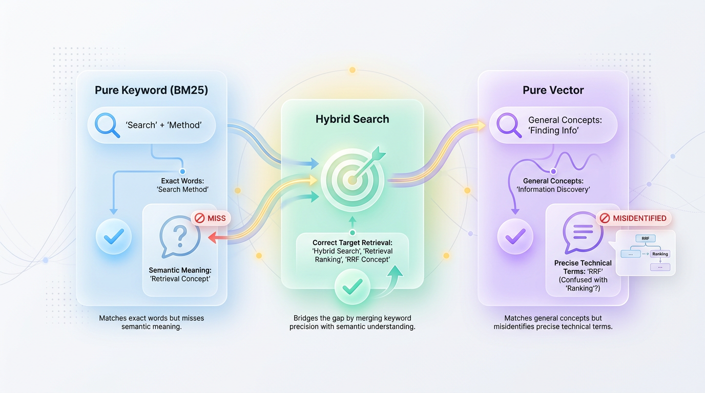
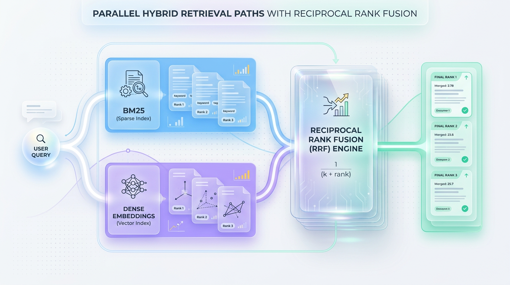
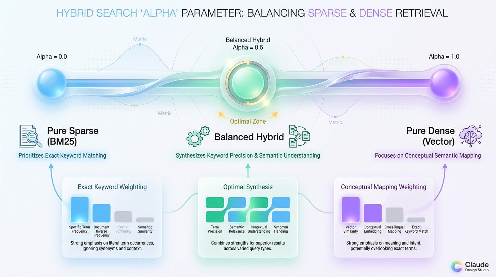

# Beyond Vector Search: A Guide to Production Hybrid Search

*Stop choosing between keyword precision and semantic recall; combine BM25 and vector search for a robust, production-ready retrieval system for your AI.*


## Why Your RAG Fails: The Limits of a Single Search Method

*Relying on a single retrieval method for your RAG system forces a compromise that inevitably hurts accuracy in production environments.*

Most Retrieval-Augmented Generation (RAG) systems start with a simple promise: convert documents into vectors, store them in a database, and let semantic search handle the rest. This approach works beautifully in slide decks and basic demos. However, once exposed to real-world user queries, a pure vector search strategy quickly begins to break down.



*Figure 1: The Retrieval Gap — Pure Keyword vs. Pure Vector vs. Unified Hybrid Search.*


Production environments demand a difficult balance between finding exact matches and understanding conceptual meaning. To build a robust system, you must understand the distinct strengths and weaknesses of the two foundational search paradigms.


## The Problem: Why Single-Method Search Fails

Relying on a single retrieval method, whether keyword or vector, creates critical blind spots in your RAG system's ability to understand and respond to user queries.

### The Blind Spot of Pure Vector Search

Vector search excels at capturing the broad conceptual meaning of a query, but it is notoriously blind to specific keywords, serial numbers, and rare jargon. Because dense vector embeddings compress an entire text passage into a fixed-dimensional space, precise terminology can easily get washed out. This happens because embedding models prioritize global semantic similarity over local token exactness.


> ⚠️ **Common Mistake:** A software engineer searches your technical docs for an "RRF guide" to learn about Reciprocal Rank Fusion. Because the abbreviation "RRF" is rare in standard vector training sets, the model maps it to a much more common financial concept: "Required Rate of Return." Instead of a search optimization guide, your user receives articles about retirement portfolio management.

If your users search for product SKUs, exact error codes, or domain-specific acronyms, pure vector search will frequently hallucinate relevance.

### The Weakness of Keyword Search (BM25)

To solve this, you might fall back on traditional keyword search powered by BM25. BM25 is highly precise; it calculates relevance based on exact word matches, penalizing words that appear too frequently across your document collection. However, it lacks any understanding of synonyms, context, or human intent.

> ⚠️ **Common Mistake:** A user searches for "AI that understands documents." Your database contains a groundbreaking paper titled "Building Semantic Reasoning Machines," but BM25 completely ignores this paper because it does not contain the exact keywords "AI," "understands," or "documents," leaving your user with empty or low-quality results.

BM25 treats language as a bag of isolated tokens. If a user does not search using the exact vocabulary of your technical writers, the system cannot bridge the conceptual gap.

### The Search Team Analogy

To understand why these systems fail individually, imagine hiring a team to organize and search a massive library.

*   **The Archivist (BM25):** This specialist has a perfect memory for catalog IDs and exact titles. If you ask for file "A9-402," they find it in seconds. However, if you ask for "inspiring stories about perseverance," they stare blankly because "perseverance" is not in any document title.
*   **The Investigator (Vector Search):** This expert understands themes and metaphors. They can instantly gather books about triumph over adversity. Yet, if you ask for the blueprint labeled "Version 4.2," they might bring you "Version 4.1" because the blueprints "look almost identical."

A world-class library cannot run with only one of these experts. You need them working in tandem.


## The Solution: Hybrid Search Architecture

To build a production-grade RAG pipeline, you must combine the strengths of both approaches into a unified **Hybrid Search** framework. Hybrid search executes both a keyword and a vector search in parallel and then intelligently merges the results, balancing the precision of BM25 with the conceptual recall of vector search.

The diagram below illustrates this parallel flow. A single user query is dispatched to both search systems, and their distinct results are fed into a fusion engine to produce a single, re-ranked list.



*Figure 2: Architectural Data Flow of a Hybrid Retrieval System using Reciprocal Rank Fusion (RRF).*


```text
         +---------------------------------------+
         |              User Query               |
         +-------------------+-------------------+
                             |
              +--------------+--------------+
              | (Parallel Dispatch)         |
              v                             v
     +-----------------+           +-----------------+
     |   BM25 Search   |           |  Vector Search  |
     | (Keyword/Sparse)|           | (Semantic/Dense)|
     +-----------------+           +-----------------+
              | [Doc A: #1]                 | [Doc B: #1]
              | [Doc B: #2]                 | [Doc A: #2]
              v                             v
     +-----------------------------------------------+
     |            Reciprocal Rank Fusion             |
     |                 (RRF Engine)                  |
     +-----------------------+-----------------------+
                             |
                             v
                 +-----------------------+
                 |  Final Re-ranked List |
                 |  [Doc A, Doc B, ...]  |
                 +-----------------------+
```

### Fusing Disparate Results: The Core Challenge

The magic of hybrid search happens at the fusion step, but this presents a significant architectural challenge. The raw scores from BM25 and vector search are fundamentally incompatible.

*   **Scale Mismatch:** BM25 scores are unbounded and can range from 0 to over 100, while vector search scores (like cosine similarity) are typically bounded between 0 and 1.
*   **Distribution Mismatch:** Semantic scores often cluster tightly (e.g., between 0.75 and 0.85), whereas BM25 scores can have steep drop-offs between relevant and irrelevant documents.
*   **Drift Vulnerability:** BM25 scores change as you add documents to your corpus, making any hardcoded weighting logic fragile and prone to breaking over time.

> ⚠️ **Common Mistake:** Attempting to combine raw scores using a simple weighted average, like `Hybrid Score = (alpha * Vector Score) + ((1 - alpha) * BM25 Score)`. This approach is unstable because the underlying score distributions are inconsistent and can drift, requiring constant, manual recalibration.

### Reciprocal Rank Fusion (RRF): The Industry Standard

Instead of trying to normalize incompatible scores, the industry-standard approach is to ignore the scores entirely and focus only on the **rank position** of each document in its respective results list. This method is called **Reciprocal Rank Fusion (RRF)**.

The RRF algorithm evaluates how consistently a document appears near the top of multiple search lists. A document that ranks #2 in both BM25 and vector search will often score higher than a document that ranks #1 in one list but is missing from the other.

The formula for RRF is elegant and simple: `RRF_Score(d) = Σ (1 / (k + rank(d)))`.

Let's break this down:
*   `d` is a specific document.
*   `rank(d)` is the 1-based rank position of the document in a result list.
*   `k` is a constant (typically set to 60) that diminishes the influence of documents with very low ranks.

This rank-based approach provides a stable and effective way to merge results from any number of different search systems without worrying about their underlying scoring mechanics.


## Implementing Hybrid Search in Practice

Let's move from theory to a concrete implementation. Modern vector databases like Weaviate, Pinecone, or Elasticsearch have built-in support for hybrid search, managing both sparse and dense indexes for you.

### Step 1: Setting Up Dual Indexes

First, you must configure your database schema to generate both dense vectors (for semantic search) and a sparse keyword index (for BM25). Here is a sample configuration using the Weaviate Python client.



*Figure 3: Tuning the Hybrid Search Balance using the Alpha Parameter.*


```python
import weaviate

# Connect to your vector database instance
client = weaviate.Client("http://localhost:8080")

# Define the schema with both vector and keyword indexing enabled
collection_config = {
    "class": "Article",
    "description": "A collection of technical articles with hybrid search enabled",
    "vectorizer": "text2vec-openai",  # Automatically generates vectors
    "properties": [
        {
            "name": "title",
            "dataType": ["text"],
            "tokenization": "word" # Enables BM25 keyword indexing
        },
        {
            "name": "content",
            "dataType": ["text"],
            "tokenization": "word"
        }
    ]
}

# Create the collection in the database
client.schema.create_class(collection_config)
print("Collection 'Article' created with parallel BM25 and Vector indexes!")
```

### Step 2: Executing a Fused Query with RRF

With the dual indexes in place, you can execute a hybrid query. The database runs both searches in parallel and uses a fusion algorithm like RRF to merge the results before returning them.

```python
# Execute the hybrid search query
response = (
    client.query
    .get("Article", ["title", "content", "_additional { score }"])
    .with_hybrid(
        query="leveraging LLMs for production code",
        alpha=0.5,  # Ratio for score-based fusion, RRF is often a separate ranking_method
        # Some databases let you choose the fusion method explicitly
    )
    .with_limit(3)
    .do()
)

# Output the results
import json
print(json.dumps(response, indent=2))
```

> 💡 **Tip:** While many databases use an `alpha` parameter for a simplified weighted fusion, look for options to enable RRF directly. RRF is generally more robust as it does not depend on normalizing the original scores.

### Step 3: Avoiding Common Pitfalls

Moving a hybrid system to production requires careful attention to detail. Here are the most common mistakes to avoid.

#### Mistake #1: Inconsistent Text Pre-processing

A silent killer of hybrid search relevance is inconsistent text cleaning between your sparse and dense indexing pipelines. BM25 relies on aggressive normalization (lowercase, stemming, punctuation removal), while modern embedding models require punctuation and casing to understand semantic context.

✅ **Best Practice:** Maintain two separate but aligned text pre-processing pipelines. One aggressively cleans text for your BM25 index, while the other performs minimal cleaning to preserve semantic structure for your vectorizer.

```python
import re

def preprocess_for_bm25(text: str) -> str:
    """Aggressive normalization for keyword matching."""
    text = text.lower()
    text = re.sub(r'[^\w\s]', '', text)  # Strip punctuation
    return text

def preprocess_for_embedding(text: str) -> str:
    """Minimal normalization to preserve semantic structure."""
    text = text.strip()  # Only clean up surrounding white spaces
    return text

raw_document = "The quick brown fox, sleeping soundly, jumped over the lazy dog!"

bm25_input = preprocess_for_bm25(raw_document)
vector_input = preprocess_for_embedding(raw_document)

print(f"BM25 Input:   '{bm25_input}'")
print(f"Vector Input: '{vector_input}'")
```

#### Mistake #2: Ignoring Metadata and Security Filters

A search engine must respect business rules. If your hybrid search returns documents a user doesn't have permission to see or products that are out of stock, the system has failed.

✅ **Best Practice:** Use database-native **pre-filtering** instead of application-level post-filtering. Pre-filtering applies metadata constraints (like `tenant_id` or `status`) during the search, ensuring every result is valid. Post-filtering, which filters results *after* the search, is inefficient and can lead to empty result pages.

```python
# Conceptual production query with integrated filters
hybrid_query_payload = {
    "query": "kubernetes networking issues",
    "filters": {
        "and": [
            {"path": ["tenant_id"], "operator": "Equal", "valueString": "tenant-9921"},
            {"path": ["status"], "operator": "Equal", "valueString": "active"}
        ]
    },
    "hybrid_config": { "limit": 10 }
}
```

#### Mistake #3: High Latency from Sequential Queries

Running two search queries can double your latency if not handled correctly. Never run the BM25 and vector searches sequentially.

🚀 **Production Tip:** Execute search queries concurrently using asynchronous programming. Your API coordinator should fire off both requests in parallel and wait for both to complete before proceeding to the fusion step. This ensures your total latency is determined by the *slower* of the two searches, not the sum of both.

```python
import asyncio
import time

async def fetch_bm25_results(query: str):
    await asyncio.sleep(0.015)  # Simulate 15ms BM25 index lookup
    return ["doc_A", "doc_B"]

async def fetch_vector_results(query: str):
    await asyncio.sleep(0.022)  # Simulate 22ms vector ANN search
    return ["doc_C", "doc_A"]

async def execute_hybrid_search(query: str):
    start_time = time.time()
    
    # Run both query arms in parallel
    bm25_task = fetch_bm25_results(query)
    vector_task = fetch_vector_results(query)
    
    bm25_res, vector_res = await asyncio.gather(bm25_task, vector_task)
    
    elapsed = (time.time() - start_time) * 1000
    print(f"Parallel execution completed in: {elapsed:.2f} ms") # ~22ms, not 37ms
    # ... proceed to RRF fusion ...
    return

asyncio.run(execute_hybrid_search("scaling database"))
```


## Key Takeaways

*   **Single-Method Search is Insufficient:** Relying solely on vector search ignores critical keywords, while pure keyword search fails to understand user intent and synonyms.
*   **Hybrid Search is the Standard:** Production-grade RAG systems require a hybrid approach, combining keyword (BM25) and semantic (vector) search to balance precision and recall.
*   **Use RRF for Fusion:** Merge disparate search results using Reciprocal Rank Fusion (RRF), which is more robust than simple weighted scoring because it relies on rank positions, not volatile raw scores.
*   **Isolate Pre-processing Pipelines:** Maintain separate text-cleaning pipelines for BM25 (aggressive normalization) and vector embeddings (minimal cleaning) to optimize each system's performance.
*   **Filter Before You Fetch:** Implement security and business logic using database-native pre-filtering to ensure efficient, secure, and relevant search results, avoiding the pitfalls of post-filtering.