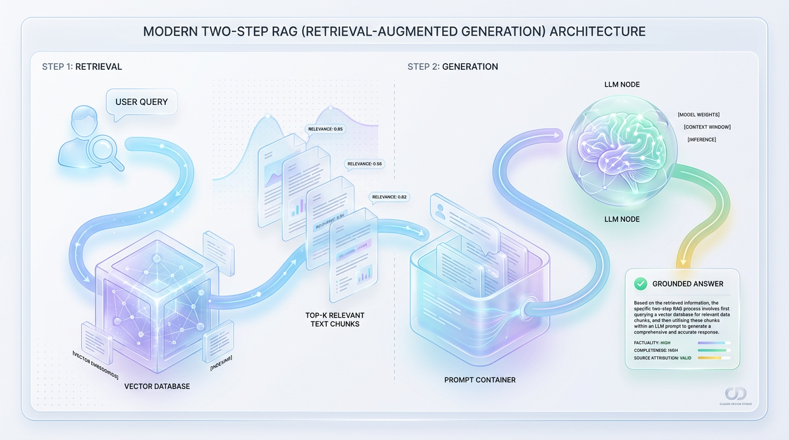
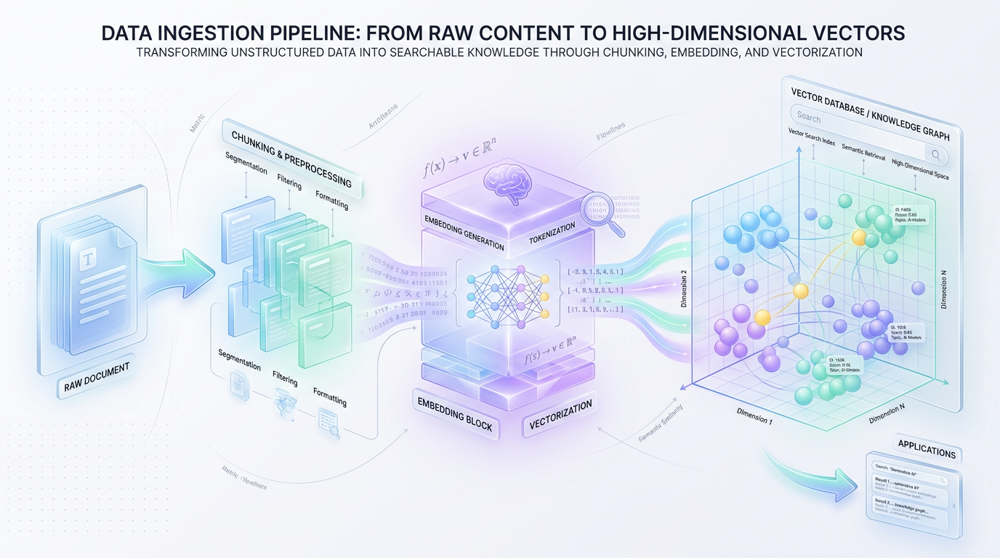
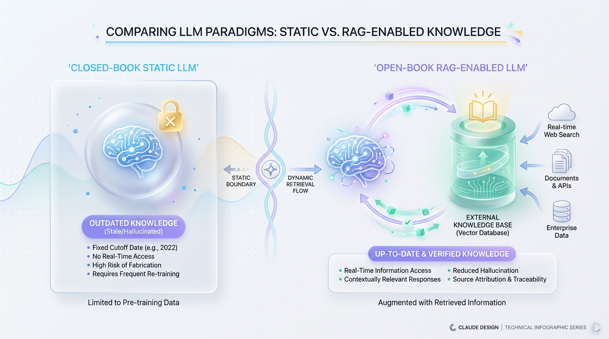

# How RAG Connects LLMs to Your Private Data and Knowledge

*Learn how retrieval-augmented generation grounds LLMs in your private data, reducing hallucinations and providing up-to-date, trustworthy answers.*


## Why Your LLM Needs an External Brain

*Retrieval-Augmented Generation (RAG) is an architectural pattern that connects a static Large Language Model to dynamic, external data sources, eliminating hallucinations and enabling factually accurate, up-to-date responses.*

Large Language Models (LLMs) are incredibly capable, but they suffer from a fundamental limitation: they are frozen in time. Once an LLM finishes its training process, its internal knowledge is locked. It cannot browse your company's private files, read today's news, or access updated internal databases. When forced to answer questions beyond their training data, these models confidently invent plausible-sounding lies—a critical flaw known as **hallucination**.


To understand this, imagine a brilliant student who aced every exam in 2022, memorizing entire libraries of historical facts and scientific papers. Now, lock this student in a vault with no phone or internet. If you ask them who won the latest election or what your team discussed in yesterday's meeting, they can only guess based on outdated information. Without a connection to the outside world, even the most powerful model is isolated from reality.

This is where RAG comes in. Instead of retraining the model, we give it an "open-book exam." Before the LLM generates a response, a retrieval system searches your private documents for relevant facts. It then packages those facts along with the original question, handing the LLM a complete cheat sheet to read before it speaks.


## RAG vs. Fine-Tuning: Choosing the Right Tool

When customizing an LLM, developers often confuse RAG with **fine-tuning**. While both techniques adapt a model, they serve completely different purposes and should not be used interchangeably. RAG provides knowledge, while fine-tuning teaches skills.



*Figure 2: The Two-Step RAG Pipeline: Retrieving relevant documents, then synthesizing the final answer.*


> 💡 Tip: Think of RAG as giving your LLM a search engine and a library card. In contrast, fine-tuning is like sending it to graduate school to learn a specific professional dialect or formatting style.

Here’s how they compare:

*   **Primary Purpose**
    *   **RAG:** Built for information retrieval, factual accuracy, and eliminating hallucinations by providing real-time, external context.
    *   **Fine-Tuning:** Built to adjust the model's tone, style, or output format, or to master domain-specific jargon.

*   **Knowledge Handling**
    *   **RAG:** Retrieves dynamic, on-the-fly facts from external databases. Knowledge can be updated instantly without modifying the model.
    *   **Fine-Tuning:** Bakes static knowledge directly into the model's weights during an offline training process. Updating this knowledge requires a new, expensive training run.

*   **Complexity and Cost**
    *   **RAG:** Requires setting up a vector database but is cheap and fast to update. You simply add or change documents in the data source.
    *   **Fine-Tuning:** Requires expensive GPU compute time and large, highly curated training datasets.

*   **Data Security**
    *   **RAG:** Easily respects user permissions by filtering documents at the retrieval stage, before they ever reach the model.
    *   **Fine-Tuning:** Cannot easily restrict access to specific facts baked into its weights, making granular security difficult.


## The Two-Step Architecture: Retrieval and Generation

At its core, RAG is an elegant division of labor. Instead of forcing a single model to memorize your entire database, RAG splits the job into two specialized phases: finding the facts and writing the response. Think of it as a high-performing duo: a research librarian and an expert synthesizer.



*Figure 3: Data Ingestion: Breaking down documents into searchable, semantic vector representations.*


### Step 1: Retrieval (The "Librarian")

The retrieval step is your hyper-efficient librarian. When a user asks a question, the system doesn't try to answer it directly. Instead, it converts the query into a numerical format called an **embedding** and uses it to search a specialized **vector database**. This search finds the exact document passages, or "chunks," that are semantically similar to the user's question.


> ✅ Best Practice: The goal of retrieval is not to answer the question but to find the precise needle of context in the haystack of your data. A successful retrieval phase delivers a small set of highly relevant text chunks.

The data flows through a straightforward sequence:
`User Query -> Embedding Model -> Vector Database Search -> Top-K Relevant Chunks`

### Step 2: Generation (The "Synthesizer")

Once the librarian hands over the relevant document chunks, the generation step takes over. This phase acts as the expert synthesizer. The system combines the retrieved text chunks and the user's original query into a single, comprehensive **prompt**. This augmented prompt is then sent to the LLM.

Because the LLM is given the exact source material it needs, it doesn't have to guess or recall from memory. It simply synthesizes the provided facts into a coherent, natural-sounding answer. The code below shows how to construct this prompt, instructing the LLM to ground its response strictly in the provided sources.

```python
def build_grounded_prompt(user_query: str, retrieved_chunks: list[str]) -> str:
    """
    Combines retrieved knowledge chunks with the user's query to create a
    context-rich prompt that constrains the LLM.
    """
    # Merge the retrieved document passages into a single text block
    formatted_context = "\n\n".join(
        f"[Source {i+1}]: {chunk}" for i, chunk in enumerate(retrieved_chunks)
    )

    # Construct the instruction template for the LLM
    prompt_template = (
        "You are a helpful, factual assistant. Answer the user's question "
        "using ONLY the provided context below. If the context does not contain "
        "the answer, respond with 'I cannot find that information in the sources.'\n\n"
        f"CONTEXT:\n{formatted_context}\n\n"
        f"QUESTION: {user_query}\n\n"
        "ANSWER:"
    )
    return prompt_template

# Example usage:
chunks = [
    "The ACME Widget 2.0 has an upgraded battery life of 14 hours.",
    "In 2024, the charging port for the ACME Widget 2.0 was upgraded to USB-C."
]
query = "How long does the ACME Widget 2.0 battery last?"
final_prompt = build_grounded_prompt(query, chunks)

print(final_prompt)
```


## Your Essential RAG Toolkit

Building a RAG system is like assembling a high-performance engine. Each component has a distinct role, working in sequence to turn static data into dynamic, accurate answers. Let's look at the four fundamental components you'll need.



*Figure 1: Static LLM (Closed-Book) vs. RAG-Enabled LLM (Open-Book) system architecture.*


### 1. Data Ingestion and Chunking

Before your data can be retrieved, you must prepare it. **Data Ingestion** is the process of extracting raw text from source files like PDFs or web pages. **Chunking** is the crucial art of slicing this text into small, semantically meaningful pieces.

> ⚠️ Common Mistake: Using chunks that are too large or too small. Large chunks dilute the specific facts with irrelevant noise, while tiny chunks lose the surrounding context needed for comprehension.

Chunking requires balancing size and overlap. The `chunk_size` determines how many characters are in each slice, while `chunk_overlap` keeps a small portion of the preceding chunk to maintain contextual continuity across splits.

```python
# Use a text splitter that respects semantic boundaries like paragraphs and sentences.
from langchain_text_splitters import RecursiveCharacterTextSplitter

raw_document = """
RAG systems combine retrieval models with generative LLMs.
The retrieval model finds relevant document snippets.
The generative model uses these snippets to write a highly accurate response.
"""

# Initialize the splitter with a target size and safety overlap.
splitter = RecursiveCharacterTextSplitter(
    chunk_size=100,      # Small chunk size for demo purposes
    chunk_overlap=20     # Prevents splitting a key sentence in half
)
chunks = splitter.split_text(raw_document)

for i, chunk in enumerate(chunks):
    print(f"Chunk {i+1}: {chunk.strip()}")
```

### 2. Embeddings and Vector Databases

Once you have text chunks, you must translate them into a format computers can compare mathematically. An **embedding** is a process that converts text into a long list of numbers (a vector) that represents its semantic meaning. Think of it as a GPS coordinate for meaning, where similar concepts like "king" and "queen" are plotted close together in a high-dimensional space.

A **vector database** (e.g., Pinecone, Chroma, Qdrant) is a specialized storage engine designed to index these vectors. Unlike traditional databases that search for exact keywords, vector databases search by measuring similarity, often using calculations like Cosine Similarity to find vectors pointing in the same direction (`Cosine Similarity(A, B) = (A • B) / (||A|| * ||B||)`).

### 3. The Retriever

The **Retriever** is the engine that executes the search. It takes a user's incoming query, converts it into a query vector using the same embedding model, and searches the vector database for the document chunks with the highest similarity scores. The retriever performs a high-speed search (like K-Nearest Neighbors) to find the top-ranked chunks and passes their raw text to the next stage.

### 4. The Generator (LLM)

The final piece is the **Generator**—the LLM itself. It receives the carefully structured prompt containing the user's query and the relevant text chunks from the retriever. With this verified context in hand, the LLM's job is not to recall information but to synthesize it into a factual, well-written answer. You can use commercial models like GPT-4o and Claude 3.5 Sonnet or self-hosted open-source models like Llama 3 and Mixtral.


## From Prototype to Production

Moving a RAG system from a local prototype to a production-ready application reveals hidden complexities. A basic setup might work for simple queries, but handling diverse user needs with high accuracy requires robust engineering. Here are the common traps and best practices for building an enterprise-grade RAG pipeline.

### ⚠️ Common Mistake: Using a "One-Size-Fits-All" Chunking Strategy

Many developers use default chunking parameters, which is the most common reason production RAG systems fail. If your chunks are too large, the retrieved context will be full of irrelevant noise. If they are too small, the LLM loses the broader context needed to form a complete answer.


> 🚀 Production Tip: Never settle for default chunking. Optimize your chunk sizes based on your document structure and expected query types. For dense technical documents, smaller chunks (256-512 tokens) often work best. Use overlapping windows to preserve context across chunks.

### ✅ Best Practice: Implementing Hybrid Search

Relying solely on vector search can fail when users search for specific keywords, product codes, or acronyms. **Hybrid Search** solves this by combining the conceptual power of vector search with the precision of traditional keyword search (like BM25).

The two search systems run in parallel, and their results are merged using a technique called **Reciprocal Rank Fusion (RRF)**. RRF intelligently combines the ranked lists from both retrievers, balancing semantic relevance with keyword precision to deliver a superior final ranking.

```python
def reciprocal_rank_fusion(vector_results: list, keyword_results: list, k: int = 60) -> list:
    """Combines search results from two ranked lists using RRF."""
    rrf_scores = {}
    
    # Process vector search rankings
    for rank, doc_id in enumerate(vector_results):
        rrf_scores[doc_id] = rrf_scores.get(doc_id, 0) + (1.0 / (k + rank + 1))
        
    # Process keyword search rankings
    for rank, doc_id in enumerate(keyword_results):
        rrf_scores[doc_id] = rrf_scores.get(doc_id, 0) + (1.0 / (k + rank + 1))
        
    # Sort documents by their combined RRF score
    sorted_docs = sorted(rrf_scores.items(), key=lambda item: item[1], reverse=True)
    return sorted_docs

# Example with mock document IDs
vector_hits = ["doc_A", "doc_B", "doc_C"]
keyword_hits = ["doc_C", "doc_A", "doc_D"]

final_ranking = reciprocal_rank_fusion(vector_hits, keyword_hits)
print("Unified Rankings:", final_ranking)
```

### ⚠️ Common Mistake: Flying Blind Without Systematic Evaluation

Many developers tweak prompts and chunk sizes based on "vibe checks"—testing a few favorite queries and assuming the system is improved. This approach is unreliable and often makes the system worse on edge cases.

> ✅ Best Practice: Adopt an automated evaluation framework like the **RAG Triad** (Context Precision, Faithfulness, and Answer Relevance). Use tools like Ragas or TruLens to systematically grade your pipeline's performance before and after any changes. This data-driven approach is essential for knowing if a change actually improved retrieval and generation quality.

### ✅ Best Practice: Adding a Re-ranking Step

Vector databases are optimized for speed, not perfect precision. They quickly retrieve a broad set of candidate documents (e.g., the top 50). Sending all these candidates to the LLM increases cost, latency, and the risk of the model getting lost in the noise. A **re-ranker** solves this.

A re-ranking model is a second, more precise filter. It takes the initial candidates from the vector search and re-orders them based on a more computationally intensive analysis of their relevance to the query. This ensures that only the absolute best 3-5 documents are passed to the LLM, dramatically improving efficiency and accuracy.

```python
# Conceptual example of a two-stage retrieval pipeline with a re-ranker
def two_stage_retrieval(query: str, vector_db, reranker_model, top_n: int = 3):
    # Stage 1: Fast retrieval of a broad candidate pool from the vector DB
    broad_candidates = vector_db.similarity_search(query, k=25)
    
    # Stage 2: High-precision re-ranking of the candidates
    reranked_scores = reranker_model.compute_relevance_scores(
        query=query, 
        documents=[doc.page_content for doc in broad_candidates]
    )
    
    # Combine documents with their new scores and sort
    candidates_with_scores = zip(broad_candidates, reranked_scores)
    sorted_candidates = sorted(candidates_with_scores, key=lambda x: x[1], reverse=True)
    
    # Return only the top N, most relevant documents for the LLM
    return [doc for doc, score in sorted_candidates[:top_n]]
```

By transitioning from a simple RAG prototype to a sophisticated pipeline with hybrid search, re-ranking, and continuous evaluation, you can build a truly enterprise-grade AI application that is accurate, reliable, and trustworthy.


## Key Takeaways

*   **RAG Prevents Hallucinations:** RAG connects LLMs to live, external data sources, forcing them to base answers on verifiable facts instead of static training knowledge. This dramatically reduces fabricated responses.
*   **Use RAG for Knowledge, Fine-Tuning for Style:** RAG is the best tool for providing an LLM with dynamic, factual information. Fine-tuning is better suited for adapting an LLM’s personality, tone, or output format.
*   **The Core RAG Toolkit:** A functional RAG pipeline requires four key components: a data chunker, an embedding model to create vectors, a vector database to act as a retriever, and a generator LLM to synthesize the final answer.
*   **Implement Hybrid Search for Production:** Relying on vector search alone is insufficient. Production systems must combine semantic search (vectors) with keyword search (e.g., BM25) to accurately handle queries containing specific terms, codes, or names.
*   **Add Re-ranking for Precision:** To improve efficiency and accuracy, use a two-stage retrieval process. A fast vector search finds a broad set of candidates, and a slower, more precise re-ranking model selects the top few to pass to the LLM.