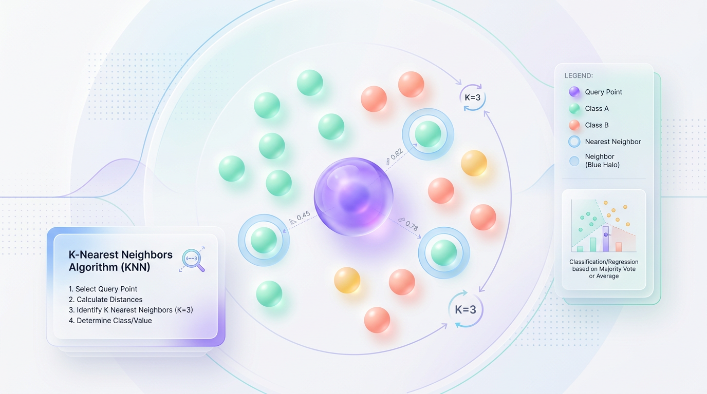
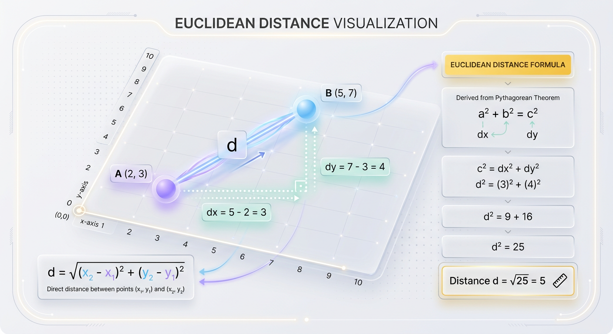
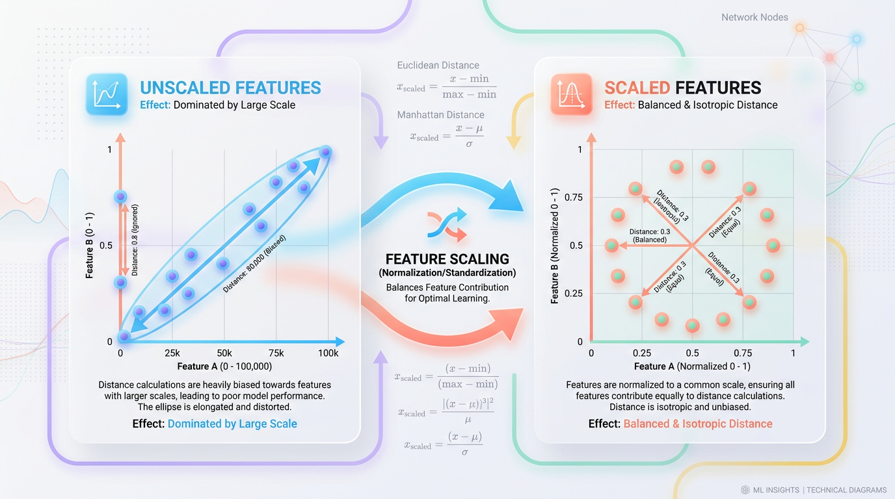

# Build Your Own KNN: A Python Guide From Scratch

*Go beyond scikit-learn and master the core logic of K-Nearest Neighbors by building the popular algorithm yourself in pure Python.*


## From Scratch: How to Build K-Nearest Neighbors in Python
Step beyond black-box libraries to master the core mechanics, trade-offs, and production pitfalls of this fundamental machine learning algorithm.



*Figure 1: The core intuition of KNN: a query point identifying and voting with its closest neighbors in a multi-dimensional feature space.*


It takes exactly two lines of code to import and fit a K-Nearest Neighbors (KNN) model using modern libraries. While this convenience is a superpower for rapid prototyping, it easily creates a dangerous illusion of mastery. By treating algorithms as magical black boxes, we miss the vital mechanics, structural trade-offs, and critical failure modes that occur under the hood.

Relying solely on `scikit-learn` hides how an algorithm scales, why it slows down with high-dimensional data, and how distance metrics alter the decision boundary. To truly master machine learning, you must step behind the abstraction layer. Building KNN from scratch transforms you from a code-consumer into an engineer who can debug, optimize, and customize models for production environments.


## The KNN Blueprint: An Intuitive Approach
At its heart, KNN is one of the most intuitive algorithms in machine learning. Think of it as deciding whether to buy a house in a new city by asking your five closest neighbors about their experience. You do not poll the entire city; you rely on the opinions of those physically closest to you.


*Figure 3: The step-by-step pipeline of a KNN classification query, from distance calculation to majority voting.*


In data science, this concept of proximity translates directly to feature space. To classify an unlabeled data point, you look at its nearest neighbors in a multi-dimensional grid and let them vote on the correct label. Proximity implies similarity, meaning points close to each other in feature space are highly likely to share the same category.

To turn this human intuition into working code, we must translate these spatial relationships into mathematical steps. The entire KNN pipeline can be broken down into three elegant, sequential phases:

1.  **Distance Calculation**: We mathematically define "closeness" between points using a distance formula.
2.  **Neighbor Identification**: We sort the calculated distances to pinpoint the `K` data points that are closest to our target query.
3.  **Voting Consensus**: We extract the labels of these `K` neighbors and conduct a majority vote to assign the final class classification.

Before building a full classifier, let's start with the first and most crucial building block: measuring distance.


## Step 1: Measuring Closeness with Euclidean Distance
To make decisions based on "similarity," a KNN algorithm must have a concrete way to measure how near data points are to one another. We need a mathematical ruler that can output a single number representing the space between them. The most common ruler used is the **Euclidean distance**.



*Figure 2: Euclidean distance illustrated as the straight-line hypotenuse between two coordinate points.*


At its core, Euclidean distance is simply the shortest, straight-line distance between two points in a geometric space, rooted in the classic Pythagorean theorem. For two points `p` and `q`, the formula generalizes to any number of dimensions:

`Distance = sqrt( sum( (p_i - q_i)^2 ) )`

To implement this efficiently from scratch, we use NumPy. Its vectorized array operations allow us to bypass slow Python loops, which is critical since KNN must calculate distances rapidly across thousands of data points.

```python
import numpy as np

def euclidean_distance(point1, point2):
    """
    Calculates the Euclidean distance between two multi-dimensional points.
    
    Parameters:
    point1 (array-like): Coordinates of the first data point.
    point2 (array-like): Coordinates of the second data point.
    
    Returns:
    float: The straight-line distance between the two points.
    """
    p1 = np.array(point1)
    p2 = np.array(point2)
    
    # Calculate element-wise differences, square them, sum, and take the square root.
    return np.sqrt(np.sum((p1 - p2) ** 2))

# Verification using a simple 2D example
point_a = [2, 3]
point_b = [5, 7]

distance = euclidean_distance(point_a, point_b)
print(f"The calculated distance is: {distance}")  # Expected output: 5.0
```

> 💡 **Tip:** While Euclidean distance is the intuitive default, it is not always the best choice. Consider other metrics like **Manhattan Distance** for grid-like data or **Cosine Similarity** for text analysis, where the angle between vectors is more important than their magnitude.


## Step 2: Building the KNN Classifier From Scratch
With our distance function defined, we can now assemble the complete KNN algorithm into a clean, reusable Python class. Our implementation will mimic the familiar interface of industry-standard libraries like scikit-learn, utilizing `fit` and `predict` methods.

Our class needs to handle three distinct operations:

*   **Initialization (`__init__`)**: We define the hyperparameter `k`, which controls how many neighbors we poll.
*   **Training (`fit`)**: Because KNN is a **lazy learner**, this step is simple. We just store the training data in memory without any computation.
*   **Inference (`predict`)**: For each new query point, we execute our three-step pipeline: calculate distances, find the top `k` neighbors, and conduct a majority vote.

Here is the complete, runnable implementation using NumPy for calculations and Python's built-in `Counter` to handle voting.

```python
import numpy as np
from collections import Counter

class KNN:
    """
    A clean, scratch-built K-Nearest Neighbors Classifier
    designed to mimic the scikit-learn API.
    """
    def __init__(self, k=3):
        self.k = k
        self.X_train = None
        self.y_train = None

    def fit(self, X, y):
        """
        Fits the model by storing the training data.
        In KNN, 'fitting' is simply memorizing the dataset.
        """
        self.X_train = np.array(X)
        self.y_train = np.array(y)

    def predict(self, X):
        """
        Predicts labels for an array of input query points.
        """
        predictions = [self._predict_single(x) for x in np.array(X)]
        return np.array(predictions)

    def _predict_single(self, x):
        """Helper method to predict the label for a single query point."""
        # 1. Compute Euclidean distance from the query point to all training points
        distances = [np.sqrt(np.sum((x - x_train) ** 2)) for x_train in self.X_train]

        # 2. Get the indices of the k-smallest distances
        k_indices = np.argsort(distances)[:self.k]

        # 3. Extract the labels of the k-nearest neighbor indices
        k_nearest_labels = [self.y_train[i] for i in k_indices]

        # 4. Perform a majority vote to find the most common label
        most_common = Counter(k_nearest_labels).most_common(1)
        return most_common[0][0]

# --- Putting our class to the test ---
if __name__ == "__main__":
    # Create a simple, synthetic 2D dataset
    # 0 represents 'Red Class', 1 represents 'Blue Class'
    X_train_dummy = np.array([[1, 2], [1, 4], [2, 2], [10, 12], [11, 14], [12, 12]])
    y_train_dummy = np.array([0, 0, 0, 1, 1, 1])

    # Instantiate our KNN classifier with k=3
    clf = KNN(k=3)
    clf.fit(X_train_dummy, y_train_dummy)

    # Define new, unseen test coordinates
    X_test_dummy = np.array([[1.5, 2.5], [10.5, 13.0]])
    predictions = clf.predict(X_test_dummy)

    # Print results
    for test_point, pred in zip(X_test_dummy, predictions):
        class_name = "Blue Class" if pred == 1 else "Red Class"
        print(f"Query Point {test_point} predicted as: {class_name}")
```


## Deploying KNN: Production Pitfalls and Best Practices
While implementing KNN from scratch is a fantastic learning exercise, deploying it to production requires navigating several subtle traps. A naive implementation can easily fail in real-world scenarios if you don't account for its unique characteristics.



*Figure 4: How unscaled features distort distance metrics, and how feature scaling restores geometric proportion.*


### The Silent Killer: Unscaled Features
KNN relies entirely on calculating the distance between data points. If your features are on different scales (e.g., `age` from 1-100 and `salary` from 30,000-300,000), the distance calculation will be completely dominated by the feature with the larger range, essentially ignoring the others.

> ⚠️ **Common Mistake:** Feeding raw, unscaled data into a KNN model. The feature with the largest numeric range will disproportionately influence the distance metric, leading to nonsensical results. A difference of 100 in salary will appear much larger than a difference of 10 in age.

> ✅ **Best Practice:** Always apply a feature scaler before training. Use `StandardScaler` (Z-score normalization) to give each feature a mean of 0 and a standard deviation of 1, ensuring all features contribute equally to the distance calculation. Fit the scaler on your training data only, and use it to transform your test and production data.

### Choosing the Ideal 'k': The Bias-Variance Trade-Off
Selecting the value of `k` is the primary hyperparameter tuning step in KNN, and it represents a classic balance between model sensitivity and stability.

*   **Small `k` (e.g., `k = 1`)**: Leads to low bias but high variance. The decision boundary is complex and jagged, making the model highly sensitive to noise and outliers. This is a classic sign of overfitting.
*   **Large `k` (e.g., `k = N`)**: Leads to high bias but low variance. The model simply predicts the majority class of the entire dataset, creating an overly simplistic decision boundary. This causes underfitting.

> ✅ **Best Practice:** Use cross-validation to find the optimal `k`. Plot the error rate against different values of `k` (often called an "elbow" plot) to find the point where the error rate is minimized. Choose an odd number for `k` to avoid ties in binary classification.

### The Curse of Dimensionality
As you add more features to your dataset, the volume of the feature space grows exponentially. As a result, your data points become incredibly sparse and spread out. In high-dimensional spaces, the concept of a "close" neighbor loses its meaning because every point is far away from every other point.

> ⚠️ **Common Mistake:** Applying KNN to datasets with hundreds or thousands of features. As dimensionality increases, the distance to the nearest neighbor approaches the distance to the farthest neighbor, making the distance metric less informative.

> ✅ **Best Practice:** For high-dimensional data, use dimensionality reduction techniques like **PCA (Principal Component Analysis)** or aggressive feature selection *before* feeding the data to KNN. This helps concentrate the signal and makes the distance metric meaningful again.

### High Prediction Latency: The Pain of "Lazy Learning"
KNN does no work during the `.fit()` call except for storing data in RAM. All the computation is deferred to prediction time. This makes training instantaneous (`O(1)`) but prediction incredibly slow.

To make a single prediction, a brute-force KNN must calculate the distance from the query point to every single one of the `N` points in your training set across `D` dimensions. This gives it a prediction time complexity of `O(N * D)`.

> 🚀 **Production Tip:** For low-latency applications, a brute-force search is not viable. Replace the linear scan with optimized spatial index structures like **KD-Trees** (for low-to-medium dimensions) or **Ball-Trees** (for higher dimensions). These can reduce the average prediction time from `O(N*D)` to `O(D * log(N))`, making KNN practical for real-time services.


## Key Takeaways
*   **Lazy Learner with High Prediction Cost:** KNN's `fit` operation is `O(1)` as it only stores data, but its brute-force `predict` is `O(N * D)`, making it computationally expensive at inference time as the dataset size (`N`) grows.
*   **Feature Scaling is Non-Negotiable:** Because KNN is distance-based, features must be scaled (e.g., with `StandardScaler`) to prevent attributes with larger numeric ranges from dominating the distance metric and biasing the model.
*   **The 'k' Hyperparameter Controls Bias-Variance:** A small `k` leads to high variance and overfitting (sensitive to noise), while a large `k` leads to high bias and underfitting (oversimplified model). Use cross-validation to find the optimal balance.
*   **Beware the Curse of Dimensionality:** KNN's performance degrades significantly in high-dimensional spaces where the concept of "closeness" becomes meaningless. Use dimensionality reduction techniques like PCA for datasets with many features.
*   **Optimize Prediction with Spatial Trees:** In production, replace the `O(N)` linear scan for neighbors with efficient index structures like KD-Trees or Ball-Trees to reduce average search time to `O(log N)` and enable low-latency predictions.