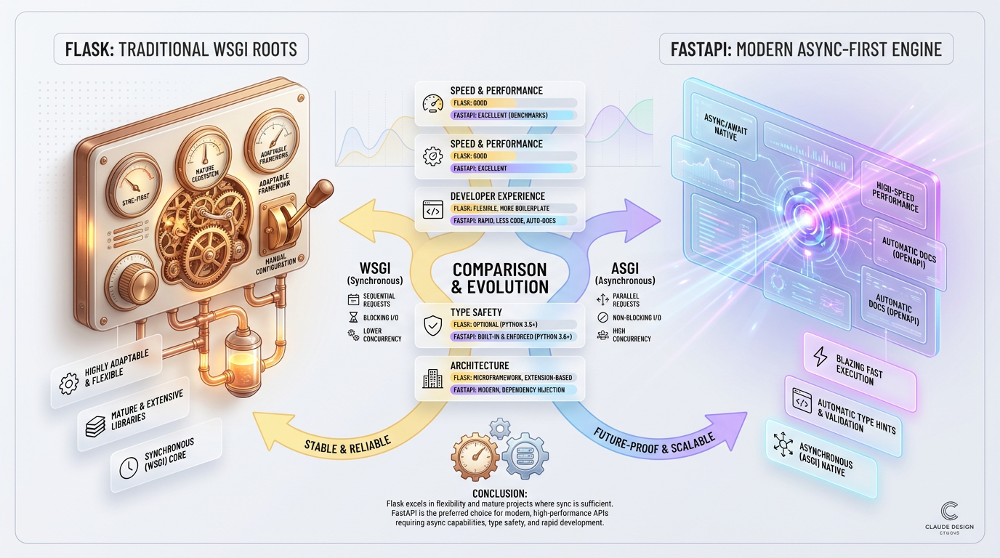
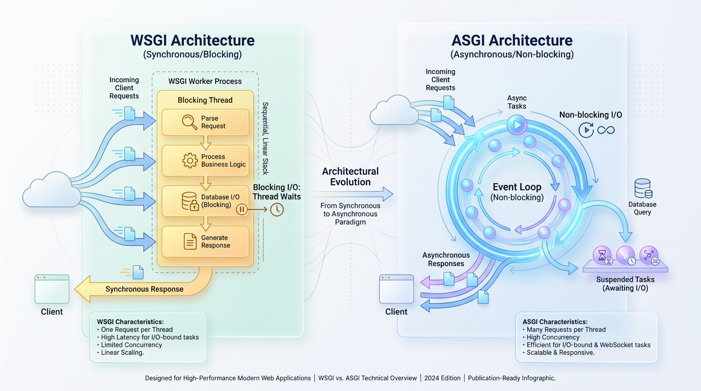
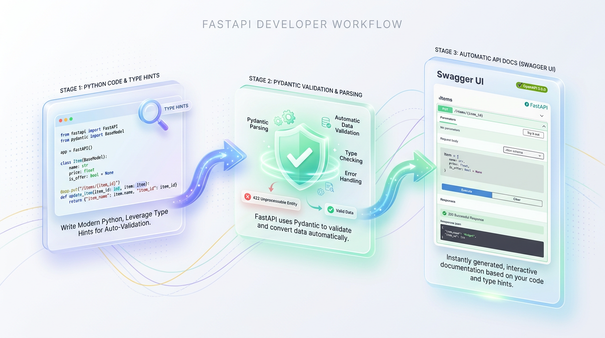

# FastAPI vs. Flask: Which Python Framework Should You Choose?

*Discover the key differences in performance, async support, and data validation to select the right Python web framework for your next API.*


## Flask vs. FastAPI: An Architectural Showdown
A senior engineer's guide to choosing between Python's workhorse and its high-performance successor.



*Figure 1: Flask (Flexible, Classical Micro-framework) versus FastAPI (High-performance, Modern ASGI API Engine).*


Every modern web framework looks identical when you are building a "Hello, World" endpoint. But when your application scales to handle thousands of concurrent users, complex database transactions, and real-time data streams, that initial choice transforms from a minor detail into a defining architectural constraint.

Choosing between Flask and FastAPI is not a matter of finding the "better" tool. It is a strategic decision about resource management, developer velocity, and how your application interacts with the modern Python ecosystem.

To understand this divide, consider an automotive analogy. Flask is like a classic, manual-transmission sports car: lightweight, transparent, and giving you absolute control. If you want new features, you must source and install those aftermarket parts yourself. FastAPI is a high-performance smart EV: it comes equipped with instant torque, built-in driver assists, and a digital dashboard, but you must operate within its opinionated, high-tech ecosystem to get the best results.


## Under the Hood: Synchronous WSGI vs. Asynchronous ASGI
The core architectural conflict between these two frameworks lies in how they communicate with web servers. This is a battle between the traditional WSGI (Web Server Gateway Interface) standard and the modern ASGI (Asynchronous Server Gateway Interface) standard.



*Figure 2: Architecture Deep Dive: WSGI multi-threaded request processing versus ASGI non-blocking event loops.*


### Flask's Foundation: Synchronous WSGI
WSGI is the long-standing standard for Python web applications, designed for a synchronous world where a single request maps directly to a single response in a linear path.



*Figure 3: FastAPI Developer Experience: The unified Pydantic data validation and Swagger/OpenAPI documentation pipeline.*


Think of a WSGI server like a traditional bank with a row of tellers. Each customer is an incoming request. If a customer asks a teller for a complex task, that teller must stand there and wait, unable to serve anyone else in line until the transaction is complete.

In a Flask application deployed with a server like Gunicorn, concurrency is achieved by running multiple worker processes or threads. When a request triggers a slow database query, that worker thread is **blocked**, unable to process other requests. If you have four workers and all four are waiting on a slow database, your server stops accepting new connections entirely.

> ✅ **Best Practice:** In a WSGI model, concurrency for `N` blocking requests requires `N` worker processes or threads, leading to higher memory overhead at scale. This model is well-understood, stable, and excellent for CPU-bound tasks.

### FastAPI's Engine: Asynchronous ASGI
ASGI is the modern successor to WSGI, designed to handle asynchronous, non-blocking Python code. It enables a single-threaded server to handle thousands of concurrent connections using an **event loop**.

Think of an ASGI server like a smart restaurant with a single, highly efficient waiter. The waiter takes your table's order and sends it to the kitchen. Instead of standing by your table, the waiter immediately moves to the next table to take their order, only returning when the kitchen signals that your food is ready.

FastAPI leverages ASGI to coordinate tasks using Python’s native `asyncio` library. When an application encounters a slow I/O operation (like a database query), it uses the `await` keyword to yield control back to the event loop. The loop then processes other tasks and resumes the original one only when it's complete.

### Code Blueprint: Blocking vs. Non-Blocking I/O
This architectural difference becomes clear when comparing how both frameworks handle a simulated two-second database delay.

The Flask example uses `time.sleep()`, a synchronous call that blocks the entire worker thread. No other requests on this thread can be processed during this time.

```python
# flask_app.py
import time
from flask import Flask

app = Flask(__name__)

@app.route("/data")
def get_data():
    # This blocks the entire worker thread for 2 seconds.
    time.sleep(2.0)
    return {"status": "success", "engine": "Flask/WSGI"}
```

The FastAPI example uses `asyncio.sleep()`, which signals the ASGI server that it can safely pause this task and use the processor to handle other pending requests in the queue.

```python
# fastapi_app.py
import asyncio
from fastapi import FastAPI

app = FastAPI()

@app.get("/data")
async def get_data():
    # This non-blocking call yields control back to the event loop.
    await asyncio.sleep(2.0)
    return {"status": "success", "engine": "FastAPI/ASGI"}
```

This fundamental difference in handling I/O is what gives FastAPI its massive performance advantage in highly concurrent, I/O-bound applications like chat apps, streaming services, and microservice gateways.


## Developer Experience: From Boilerplate to Batteries-Included
Developer velocity depends heavily on how quickly you can validate incoming requests and document your endpoints. FastAPI fundamentally changed this landscape by making validation and documentation native, first-class citizens of the framework.

In traditional web development, validating JSON payloads is a tedious, manual process. FastAPI, powered by Pydantic, automates this entire workflow. In FastAPI, Python type hints are not just passive labels; they are executable code instructions that create strict validation boundaries.

### FastAPI: Native Validation with Pydantic
FastAPI uses Pydantic models to define request bodies, simultaneously serving as the validation schema, the type-safety contract, and the documentation source.

This endpoint validates an incoming user creation request with zero boilerplate logic. If a client sends an invalid email or an age under 18, FastAPI automatically intercepts the request and returns a detailed `422 Unprocessable Entity` JSON error.

```python
# fastapi_app.py
from typing import Optional
from fastapi import FastAPI, HTTPException
from pydantic import BaseModel, EmailStr, Field

app = FastAPI()

# Define the Pydantic schema for input validation
class UserCreate(BaseModel):
    username: str = Field(..., min_length=3, max_length=20)
    email: EmailStr  # Automatically validates email format
    age: Optional[int] = Field(None, ge=18)

@app.post("/users/", status_code=201)
def create_user(user: UserCreate):
    # If data reaches here, it is already 100% validated and typed
    return {"message": "User created", "user": user.dict()}
```

### The Flask Equivalent: The Manual Assembly Line
Flask, designed before type hints were a core part of Python, does not have built-in data validation. To achieve the same safety, you must integrate third-party libraries like Marshmallow and write significant boilerplate to handle validation.

```python
# flask_app.py
from flask import Flask, request, jsonify
from marshmallow import Schema, fields, ValidationError

app = Flask(__name__)

class UserSchema(Schema):
    username = fields.Str(required=True, validate=lambda x: 3 <= len(x) <= 20)
    email = fields.Email(required=True)
    age = fields.Int(required=False, validate=lambda x: x >= 18)

@app.route("/users/", methods=["POST"])
def create_user():
    json_data = request.get_json()
    if not json_data:
        return jsonify({"message": "No input data provided"}), 400
    
    try:
        validated_data = UserSchema().load(json_data)
    except ValidationError as err:
        return jsonify({"errors": err.messages}), 422
        
    return jsonify({"message": "User created", "user": validated_data}), 201
```

This manual setup increases the surface area for bugs and requires developers to write and maintain parsing logic, exception handlers, and error formatting for every endpoint.

### Instant, Interactive API Documentation
Because FastAPI uses standard OpenAPI specifications, it automatically hosts interactive documentation for your API. Simply by running your server, you get two documentation sites for free:

*   **Swagger UI** (at `/docs`): For interactively testing API endpoints in the browser.
*   **ReDoc** (at `/redoc`): For clean, readable, public-facing API documentation.

This ensures your documentation never falls out of sync with your code, a common pain point in large-scale projects.


## Production Tips & Common Mistakes
Moving from a local server to a production environment reveals the true architectural differences between these frameworks. Both are capable, but they require different mental models to scale successfully.

### Blocking the Event Loop in FastAPI
The most dangerous mistake a developer can make with FastAPI is to use blocking, synchronous code inside an `async def` route. This will destroy your application's performance by freezing the entire event loop.

> ⚠️ **Common Mistake:** Never use blocking libraries like `requests`, `time.sleep()`, or synchronous database drivers inside an `async def` route. These calls halt the event loop, preventing the server from handling any other incoming requests.

Instead, always use `async`-compatible libraries (like `httpx` instead of `requests`). If you must use a blocking library, declare your route with a standard `def` instead of `async def`. FastAPI is smart enough to run synchronous routes in a separate thread pool, protecting the main event loop.

```python
# fastapi_app.py
import time
import httpx
from fastapi import FastAPI

app = FastAPI()

# GOOD: Using a proper non-blocking async client.
@app.get("/good-async")
async def good_async_route():
    async with httpx.AsyncClient() as client:
        response = await client.get("https://api.github.com")
    return response.json()

# ALSO GOOD: Letting FastAPI handle blocking code in a thread pool.
@app.get("/safe-sync")
def safe_sync_route():
    # Because this is a standard 'def', FastAPI runs it in a separate thread.
    time.sleep(2) # Simulating a blocking operation
    return {"status": "done"}
```

### Structuring Flask for Scale with Blueprints
As a Flask application grows, keeping all routes in a single file becomes unmaintainable. Flask solves this modularity problem with **Blueprints**. A Blueprint is a mini-application that lets you group related routes, templates, and static files together.

> ✅ **Best Practice:** Use Flask Blueprints to organize your application by feature. This keeps your main `app.py` clean and allows teams to work on separate modules independently.

```python
# auth_routes.py
from flask import Blueprint

auth_bp = Blueprint('auth', __name__, url_prefix='/auth')

@auth_bp.route('/login', methods=['POST'])
def login():
    return {"message": "Logged in"}

# app.py
from flask import Flask
from auth_routes import auth_bp 

app = Flask(__name__)
app.register_blueprint(auth_bp) # Register the blueprint
```

### Mastering FastAPI's Dependency Injection
One of FastAPI’s most powerful features is its built-in Dependency Injection system. Using the `Depends` utility, you can declare what resources a route needs (like a database session or user authentication), and FastAPI will provide them.

This decouples your business logic from the underlying resource management, making your code cleaner, easier to test, and more maintainable.

> 🚀 **Production Tip:** Use FastAPI's `Depends` for managing database connections, verifying authentication tokens, and handling other cross-cutting concerns. This allows you to easily swap dependencies during testing (e.g., using an in-memory database).

```python
# fastapi_app.py
from fastapi import FastAPI, Depends, HTTPException

app = FastAPI()

# 1. Define a dependency (e.g., a reusable security check)
def verify_api_token(token: str = Depends(some_token_header_scheme)):
    if token != "secret-token":
        raise HTTPException(status_code=401, detail="Invalid Credentials")
    return {"user": "admin"}

# 2. Inject the dependency into your route
@app.get("/secure-data")
def read_data(user: dict = Depends(verify_api_token)):
    # This logic only runs if the token is valid.
    return {"data": "Top secret information", "user": user}
```


## Key Takeaways
*   **Core Architecture:** Flask uses the synchronous WSGI standard, handling concurrency with memory-intensive threads or processes. FastAPI uses the asynchronous ASGI standard, handling thousands of concurrent I/O-bound connections on a single-threaded event loop.
*   **Performance Pitfall:** The most critical mistake in FastAPI is using blocking I/O (e.g., `requests.get`, `time.sleep`) inside an `async def` route. This freezes the entire server's event loop and must be avoided by using async libraries or running synchronous code in standard `def` routes.
*   **Developer Experience:** FastAPI offers a superior developer experience for APIs through native Pydantic integration, providing automatic request validation, serialization, and interactive OpenAPI documentation (`/docs`) with zero boilerplate code.
*   **Structuring for Scale:** Scalable Flask applications require manual structuring using Blueprints to modularize routes. FastAPI provides a built-in Dependency Injection system (`Depends`) for managing resources like database connections and authentication, simplifying testing and maintenance.
*   **Decision Criteria:** Choose Flask for traditional server-rendered web applications, projects with extensive synchronous dependencies, or when maximum architectural flexibility is paramount. Choose FastAPI for high-concurrency, I/O-bound JSON APIs where performance, type safety, and developer velocity are critical.