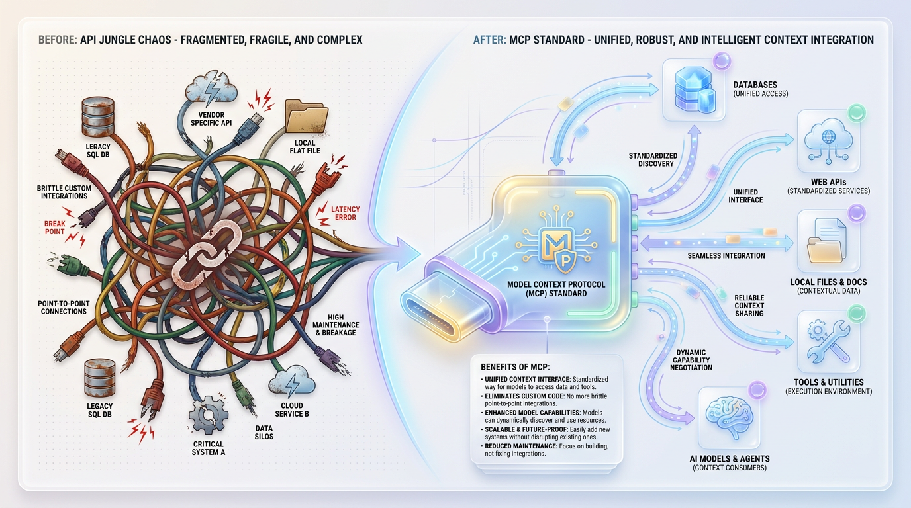
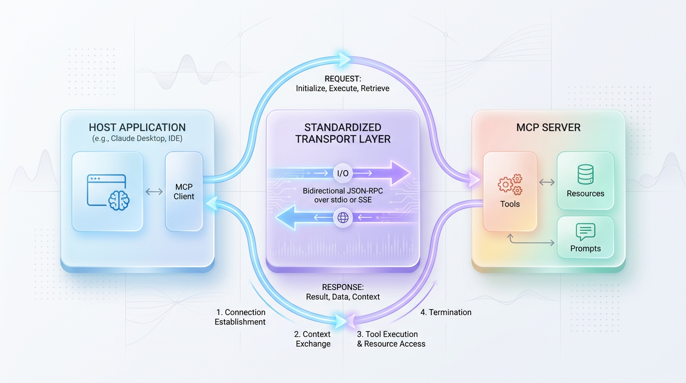
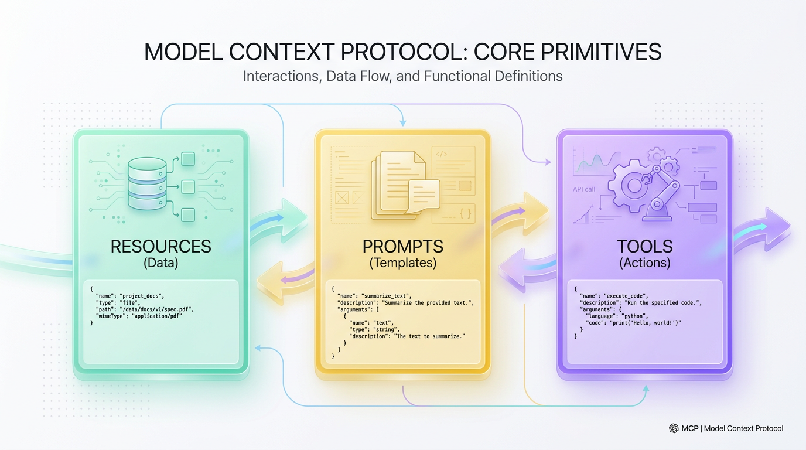

# Model Context Protocol: Why MCP is the USB-C for AI

*Learn how this open standard unifies AI tool and data integration, moving beyond brittle custom APIs to a universal, secure, and interoperable future.*


## MCP: The Universal Connector for AI Agents
The Model Context Protocol (MCP) is an open standard, initiated by Anthropic, that creates a universal language for Large Language Models to securely access data and execute tools, ending the era of brittle, custom integrations.



*Figure 1: Resolving the API Jungle—MCP serves as the unified 'USB-C' port for AI integrations.*


Every time a developer wants a Large Language Model (LLM) to interact with the real world, they enter the "API Jungle." To read a Postgres database, scan a Slack channel, or search a GitHub repository, we must write custom, brittle integration code. This chaotic state of integration is the single biggest bottleneck preventing AI agents from scaling, forcing developers to spend more time writing glue code than designing core agent logic.



*Figure 2: The MCP Client-Server Architecture and message communication flow.*


This problem isn't new. Remember the early 2000s, when every cell phone required a unique, proprietary charging cable? The tech world solved this chaos with USB-C—a single, open, standardized connector. The Model Context Protocol (MCP) is exactly that: a universal port designed for the age of machine intelligence.



*Figure 3: The three modular primitives that define the MCP standard.*


## Unifying the AI Ecosystem with MCP

The Model Context Protocol is an open-source specification that establishes a secure, uniform way for LLMs to read data and execute tools. Rather than a proprietary product, MCP is a public standard that allows developers to build universal **MCP Servers**. Any **MCP Client**, like a desktop AI assistant or a custom agent framework, can then immediately understand and query these servers.

This model-agnostic approach directly contrasts with the legacy patterns that lock developers into specific ecosystems.

*   **Legacy Tool Calling:**
    *   Highly model-specific, with schemas from OpenAI differing from Anthropic or Google.
    *   Requires rewriting tool definitions if you switch model providers.
    *   Often centralized in proprietary, vendor-managed marketplaces.

*   **The MCP Protocol:**
    *   Model-agnostic standard where a single tool implementation works across Claude, GPT-4, Gemini, or local models.
    *   Open and decentralized, allowing developers to run secure MCP servers behind their own corporate firewalls.
    *   Provides direct, real-time contextual access via standardized JSON-RPC 2.0 primitives.

Architecturally, MCP replaces the N-to-M integration nightmare. In a world with five models and five tools, you no longer need 25 distinct integration paths. With MCP, you only need to connect your five models to the MCP client standard and your five tools to the MCP server standard, reducing complexity to a simple linear scale.

```text
[ Legacy: The N-to-M Integration Jungle ]
Model A  <---->  Custom Glue Code  <---->  Tool A (SQL Database)
Model B  <---->  Custom Glue Code  <---->  Tool B (Slack API)
Model C  <---->  Custom Glue Code  <---->  Tool C (GitHub API)
(Result: High maintenance, fragile connections, proprietary lock-in)

[ Modern: The MCP Standardized Architecture ]
Model A (Client) \
Model B (Client)  ---- [ Standardized MCP Protocol ] ----> [ MCP Server ] ----> Tool A, B, C
Model C (Client) /         (JSON-RPC over SSE/Stdio)
(Result: Build once, plug in anywhere. Secure, decoupled, and scalable)
```

This decoupled architecture allows AI developers to finally stop writing repetitive connector code and focus on building production-grade agentic workflows that scale.


## Under the Hood: The Client-Server Architecture

At its heart, MCP splits responsibilities cleanly between two main components: the client and the server. This division of labor is the key to its security and modularity.

*   **The MCP Client**: This is the host application running alongside the LLM, such as a code editor, a desktop assistant, or your custom AI app. The client acts as the ultimate gatekeeper, controlling user permissions, managing session state, and deciding whether to execute a tool.
*   **The MCP Server**: This is a lightweight, isolated service designed to expose specific capabilities. It can run locally on your machine or remotely in the cloud. The server never communicates directly with the LLM; instead, it exposes structured APIs that the client can query on the model's behalf.

This interaction is governed by a few key primitives:

*   **Resources**: Read-only data sources that provide context to the model. Examples include database schemas, file contents, or API documentation.
*   **Tools**: Write-enabled, executable actions that allow the model to interact with the world. Examples include running a database query, sending an email, or triggering a remote webhook.
*   **Prompts**: Pre-defined templates exposed by the server to help users frame queries effectively for a specific domain.

> ✅ **Best Practice:** MCP enforces a strict security boundary. The server defines *what* can be done, but the client retains full authority over *if* and *when* those actions are executed based on user consent.

The communication itself relies on the lightweight **JSON-RPC 2.0** protocol, which typically operates over local standard input/output (stdio) or web-based Server-Sent Events (SSE). This ensures low-latency communication without the overhead of traditional HTTP APIs.


## Building a Universal MCP Server in Python

Let's move from theory to practice and build a simple MCP server. We'll use the official `mcp` Python SDK to create a server that can securely query a local SQLite database. This single server will be instantly compatible with any MCP-enabled AI client.

First, ensure you have the SDK installed:

```bash
pip install mcp
```

Now, let's create our server. This script exposes a single, secure tool that allows an LLM to look up customer orders from a database.

```python
# db_mcp_server.py
# This script spins up a fully compliant MCP server that exposes 
# a secure database tool. Any MCP-enabled LLM client can instantly 
# discover and use this tool without custom integration code.

import sqlite3
from mcp.server.fastmcp import FastMCP

# Initialize FastMCP, which automatically handles the JSON-RPC protocol
mcp = FastMCP("Secure Database Service")

@mcp.tool()
def query_customer_orders(customer_id: int) -> str:
    """
    Queries the enterprise database to retrieve order history for a specific customer.
    The LLM reads this docstring to understand WHEN and HOW to call this tool.
    """
    try:
        # Establish a secure, read-only connection to a local database
        conn = sqlite3.connect("file:enterprise.db?mode=ro", uri=True)
        cursor = conn.cursor()
        
        # Execute the query safely using parameterized inputs to prevent injection
        cursor.execute(
            "SELECT order_id, product, total_amount FROM orders WHERE customer_id = ?", 
            (customer_id,)
        )
        results = cursor.fetchall()
        conn.close()
        
        if not results:
            return f"No orders found for customer ID {customer_id}."
            
        # Format the structured data as a readable string for the LLM
        formatted_orders = [
            f"Order #{row[0]}: {row[1]} (${row[2]})" for row in results
        ]
        return "\n".join(formatted_orders)
        
    except Exception as e:
        return f"Database query failed: {str(e)}"

if __name__ == "__main__":
    # Run the server over standard input/output (Stdio), a common MCP transport
    mcp.run()
```

When an MCP client connects to this running script, it automatically inspects the `@mcp.tool()` decorator, reads the function signature (`customer_id: int`), and parses the docstring to understand the tool's purpose. The developer doesn't need to write any complex prompt engineering or system instructions; the SDK handles the discovery and schema generation automatically.


## Production-Ready MCP: Best Practices and Pitfalls

Moving an MCP integration from a prototype to a production environment requires a focus on security, performance, and robust design.

> ⚠️ **Common Mistake:** Exposing overly broad, generic tools like `run_sql_query(sql: str)`. This is a massive security risk that exposes your system to prompt-injection-driven data deletion or exfiltration. Instead, always expose highly specific, parameterized tools like our `query_customer_orders` example.

For systems that handle high-throughput requests, performance becomes critical. LLMs can be "chatty," leading to inefficient data-fetching patterns.

> 🚀 **Production Tip:** Avoid N+1 data fetching problems. If a model needs to get information for 15 customers, it might call a single-lookup tool 15 times in a row. To prevent this, always provide bulk-processing alternatives that can handle multiple entities in a single request.

Here is an advanced example demonstrating a batch-optimized, asynchronous tool with caching to handle production-level load.

```python
import asyncio
import logging
from typing import Dict, Any, List
from mcp.server.fastmcp import FastMCP

mcp = FastMCP("HighPerformanceCustomerService")

# In-memory cache for frequently accessed, slow-changing data
tier_cache: Dict[str, str] = {}

async def fetch_tier_from_db(customer_id: str) -> str:
    # Simulate a slow database lookup (e.g., 50ms)
    await asyncio.sleep(0.05)
    return "Enterprise" if customer_id.startswith("ent_") else "Standard"

@mcp.tool()
async def get_customer_tiers_batch(customer_ids: List[str]) -> Dict[str, Any]:
    """
    Fetches the service tier for multiple customers in a single batch.
    Use this to avoid calling single-lookup tools repeatedly.
    """
    results = {}
    missing_ids = [cid for cid in customer_ids if cid not in tier_cache]

    if missing_ids:
        # Execute all database lookups concurrently using asyncio
        tasks = [fetch_tier_from_db(cid) for cid in missing_ids]
        fetched_tiers = await asyncio.gather(*tasks)
        for cid, tier in zip(missing_ids, fetched_tiers):
            tier_cache[cid] = tier  # Populate cache for next time

    # Combine cached and newly fetched results
    for cid in customer_ids:
        results[cid] = tier_cache.get(cid)

    return {"success": True, "data": results}
```
This production-hardened pattern uses `asyncio.gather` for concurrent database calls and an in-memory cache to serve repeated requests instantly, dramatically reducing latency.


## The Bigger Picture: An Ecosystem of Interoperable Tools

MCP is poised to become for AI what standards like JDBC and OpenAPI became for databases and web services. By creating a universal language for context exchange, it enables a true "AI Tool Economy"—a marketplace of plug-and-play, AI-ready data sources and services.

Just as OpenAPI (Swagger) fueled the API economy by standardizing how machines consume REST APIs, MCP will fuel a new wave of innovation. Software vendors will no longer need to build and maintain dozens of custom AI integrations for their platforms. Instead, they can simply expose an MCP server, and every major LLM will immediately gain the ability to securely read, write, and reason over their product's data.

For this vision to be realized, MCP must be managed by a neutral, multi-stakeholder governance body, similar to the World Wide Web Consortium (W3C) or the Linux Foundation. Open governance ensures that the protocol evolves transparently and remains a level playing field for all, solidifying its place as a permanent, invisible layer of the global AI infrastructure.


## Key Takeaways

*   **Universal Standard:** MCP replaces brittle, custom AI integrations with a single, open standard, acting as a "USB-C for AI" that allows any model to connect to any tool.
*   **Secure by Design:** The client-server architecture creates a strong security boundary. The LLM client never directly accesses databases or APIs; it sends requests to a secure MCP server that runs within your own trusted environment.
*   **Reduced Complexity:** MCP changes the integration problem from an exponential N-to-M challenge to a linear one. Developers build to the MCP standard once, and their tools become compatible with the entire ecosystem.
*   **Model Agnostic:** Applications are no longer locked into a specific LLM provider’s proprietary tool-calling format. Swapping the underlying model becomes a simple configuration change without affecting downstream tools.
*   **Simplified Development:** Using official SDKs, developers can expose tools by writing standard functions with type hints and docstrings, while the framework automatically handles protocol-level discovery and communication.