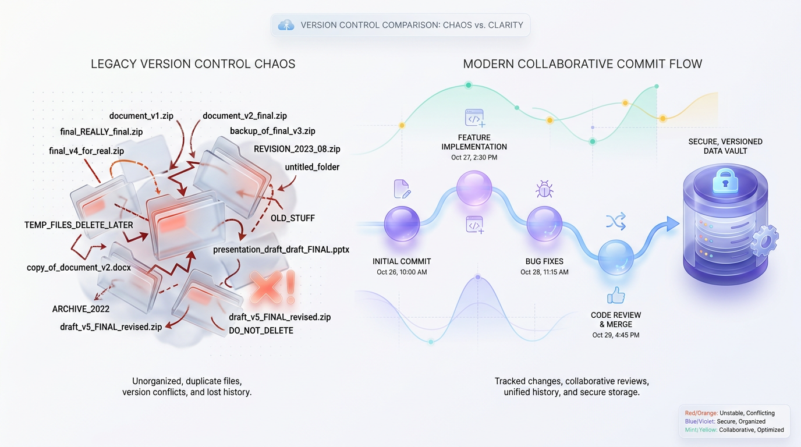
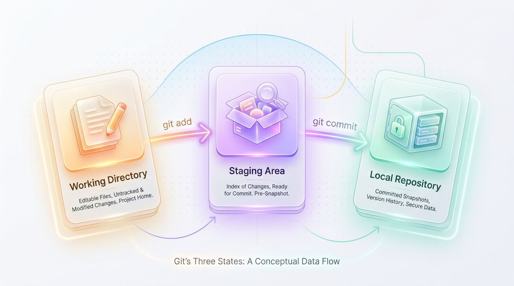
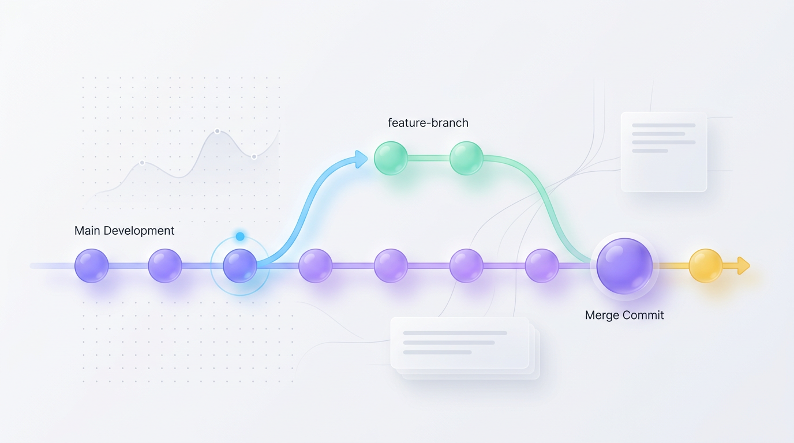
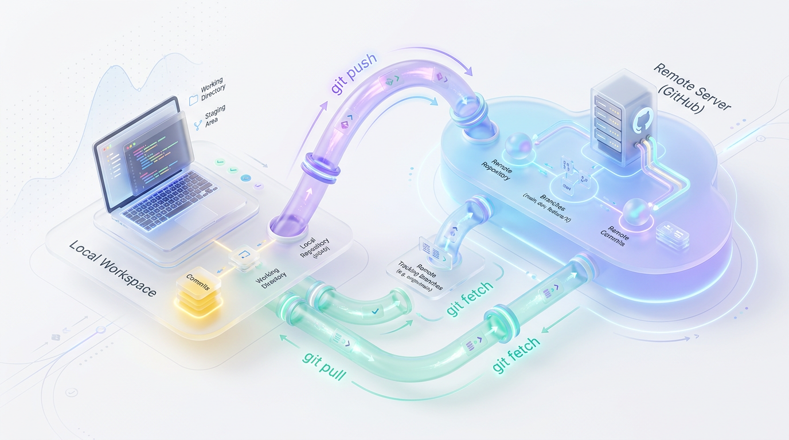

# Understanding Git: A Guide to Version Control

*Discover how Git empowers developers to track changes, collaborate on code, and manage project history without chaos or confusion.*


## A Developer's Guide to Git: From Chaos to Collaboration
Master the essential concepts of version control, from local repositories and branching to team collaboration and production best practices.



*Figure 1: Transitioning from manual versioning chaos to Git's structured, snapshot-based commit history.*


Software development is rarely a linear, single-person effort. Without a system to track changes, it quickly devolves into chaos. Imagine multiple architects drawing on the same blueprint simultaneously—one erases a wall while another adds a window, completely unaware of the other's actions. This is precisely what happens when developers try to build software without a way to manage their work.

This article breaks down the fundamental architecture and workflows of Git. You will learn why version control is non-negotiable, how Git manages your project's history, and how to collaborate effectively with a team using production-ready best practices.


## The Problem: Unmanaged Code and "Last Save Wins"
Before we dive into Git's mechanics, it is crucial to understand the chaos it was designed to prevent. We have all experienced the nightmare of managing files manually, both in and out of a coding context.



*Figure 2: The Three States of Git and how code transitions between them.*


### The "Final_Final_V2" Problem
Think back to collaborating on a project using a shared folder. You start with `report.docx`, but after a few rounds of uncoordinated edits, your folder becomes a graveyard of confusion:



*Figure 3: Parallel development using branching and merging to integrate features safely.*


*   `report_v2_final.docx`
*   `report_v2_final_REALLY_final.docx`
*   `report_v2_final_EDITED_BY_BOB.docx`

Which version is correct? What did Bob change? How do you revert to a clean version from three hours ago if Bob's edits broke the formatting? When applied to thousands of lines of source code, this manual approach is not just inefficient—it is catastrophic. Without a structured system, you risk data loss, have no record of why changes were made, and cannot hold anyone accountable for breaking the application.



*Figure 4: The synchronization model between your local repository and a remote server like GitHub.*


### Code Demonstration: The Overwrite Collision
The most critical failure of manual file management is the risk of overwriting work. To see why this happens, consider a Python script simulating two developers, Alice and Bob, editing the same configuration file at the same time.

```python
import os

# 1. Initialize a shared configuration file
original_config = "PORT=8080\nDATABASE=production_db\n"
with open("server_config.txt", "w") as f:
    f.write(original_config)

# 2. Alice wants to update the port to 9000
alice_edit = "PORT=9000\nDATABASE=production_db\n"

# 3. Bob wants to switch the database to a test database
bob_edit = "PORT=8080\nDATABASE=test_db\n"

# 4. Alice saves her changes first
with open("server_config.txt", "w") as f:
    f.write(alice_edit)

# 5. Bob saves his changes a split-second later
with open("server_config.txt", "w") as f:
    f.write(bob_edit)

# 6. Let's read the final state of the file
with open("server_config.txt", "r") as f:
    final_state = f.read()

print("--- Final Configuration File ---")
print(final_state)

# Clean up the simulated file
if os.path.exists("server_config.txt"):
    os.remove("server_config.txt")
```

When you run this script, Alice's update to `PORT=9000` is completely wiped out because Bob saved his file last.

```text
--- Final Configuration File ---
PORT=8080
DATABASE=test_db
```

This happens because standard file systems don't understand a file's content; they simply replace the entire file on save. This "last save wins" behavior is a silent destroyer of work.


## The Solution: How Version Control Systems Work
A **Version Control System (VCS)** is the definitive solution to this chaos. A VCS acts as an automated notary and digital time machine for your codebase. Instead of tracking files as static entities, a VCS tracks the **changes** made to those files over time, curating a living, searchable history of your project’s evolution.

While early tools relied on a central server, **Git** revolutionized the industry by popularizing a **Distributed Version Control System (DVCS)**. In a distributed model, every developer gets a full, independent copy of the project's entire history on their local machine. This architecture makes Git incredibly fast, allows for offline work, and enables the powerful branching workflows that have become a global standard.


## Git's Core Architecture: The Three States
At its core, Git is a state management engine. To master Git, you must first understand how it moves files through three distinct architectural zones: the Working Directory, the Staging Area, and the Repository.

### The Office Desk Analogy
Imagine a traditional paper-based office to visualize this flow:
*   **The Working Directory (Your Desk):** This is your active, messy workspace where you write, erase, and draft new documents.
*   **The Staging Area (The "Ready to File" Box):** This is a folder on the corner of your desk. You only place finished, organized documents here when they are ready for permanent archiving.
*   **The Repository (The Filing Cabinet):** This is the secure, locked filing cabinet where archived documents are stored permanently with a unique tracking number.

### The Technical Workflow: From Modified to Committed
Git maps these physical spaces to three specific states: **Modified**, **Staged**, and **Committed**. Your files move through this lifecycle as you build your features.

```text
+--------------------+           +----------------+           +-------------------+
|  Working Directory | --add-->  |  Staging Area  | --commit->|    .git Repository  |
|  (Modified State)  |           | (Staged State) |           |  (Committed State)  |
+--------------------+           +----------------+           +-------------------+
```
*   **Modified:** You have changed files in your local project folder, but Git is not yet tracking these changes as part of its official history.
*   **Staged:** You have marked a modified file in its current version to be included in your next historical save point. The staging area (also called the **Index**) lets you carefully craft what goes into your next commit.
*   **Committed:** The data is safely and permanently stored as a snapshot in your local `.git` repository database.

> 💡 Tip: Git does not save your work automatically. You must explicitly curate your changes by first moving them to the staging area with `git add`, then creating a permanent record with `git commit`.

### Commits Are Snapshots, Not Diffs
Unlike older systems that store a list of file differences (diffs), Git takes a fundamentally different approach. **Git stores its data as a stream of snapshots.**

Each time you commit, Git essentially takes a picture of what all your files look like at that moment and stores a reference to that state. For efficiency, if a file has not changed since the last commit, Git does not copy it again. Instead, it simply links to the previous identical file it has already stored, making history traversal and branch switching incredibly fast.

### Hands-on: Moving Through the Three States
Let's walk through these state transitions in your terminal. We will create a new file, check its status, stage it, and finally commit it.

```bash
# Step 1: Create a new file in your working directory (Modified State)
echo "Hello World" > index.html

# Step 2: Check the status of your project
# Git will show index.html in red as an "untracked" file.
git status

# Step 3: Add the file to the Staging Area (Staged State)
# The 'git add' command tells Git to include this file in the next snapshot.
git add index.html

# Step 4: Verify the file is staged
# Git will now show index.html in green as a "change to be committed".
git status

# Step 5: Commit the snapshot to the Local Repository (Committed State)
# The '-m' flag attaches a descriptive, immutable message to this snapshot.
git commit -m "Initialize project with index.html"
```
In this cycle, `git add` is your curation tool, and `git commit` packages your staged changes into a permanent snapshot of your project's history.


## Parallel Universes: Branching and Merging Explained
Imagine you want to test a radical new design for your application. Modifying the live codebase directly is risky—you could break everything for your users. **Branching** solves this by letting you step into a safe, parallel universe to experiment.

### The Sci-Fi Analogy: Splitting the Timeline
Think of branching like a sci-fi movie where a character creates a separate timeline. In this parallel reality, you can safely experiment, build new features, and fix bugs without affecting the primary `main` timeline. If your experiment fails, you simply discard the branch. If it succeeds, you can merge your changes back, updating the main timeline with your new work.

### Under the Hood: Branches as Lightweight Pointers
In older version control systems, creating a branch was slow because it meant duplicating the entire project folder. Git revolutionized this process.

> ✅ Best Practice: In Git, a **branch** is not a copy of your codebase. It is simply a lightweight, movable pointer to a specific commit.

Because a branch is just a tiny file containing a 40-character SHA-1 hash, creating one is nearly instantaneous. When you make a new commit on a branch, the pointer automatically moves forward to that new commit, while the `main` branch pointer remains untouched.

### Visualizing the Timeline
Here is how commits on separate branches evolve and are eventually combined back together using `git merge`:

```text
A --- B --- C --- F --- G (main)
       \             /
        D --------- E (feature)
```
*   **Commit B:** The point where the `feature` branch splits off from the `main` timeline.
*   **Commits D and E:** Work happening independently on your new feature.
*   **Commit F:** Another developer's work committed directly to `main` while you were away.
*   **Commit G:** The **merge commit**, which safely integrates your feature branch work back into the `main` timeline.

### Branching and Merging in Action
Let's execute this workflow from the command line. We will create a branch, make a change, and merge it back into `main`.

```bash
# 1. Create and switch to a new branch named 'new-feature' in one step
git checkout -b new-feature

# 2. Work on your feature safely in this parallel timeline
echo "New feature code" >> feature.txt
git add feature.txt
git commit -m "Implement amazing new feature"

# 3. Switch back to the main branch to prepare for integration
git checkout main

# 4. Pull the changes from 'new-feature' back into the 'main' timeline
git merge new-feature

# 5. Clean up by deleting the temporary branch pointer
git branch -d new-feature
```
Isolating work in branches ensures your production-ready code remains stable. A simple merge brings your new features into the main codebase when they are complete.


## Team Collaboration with Remote Repositories
While Git works perfectly on your local machine, software development is a team sport. To collaborate, developers use a **remote repository**—a copy of the project hosted on a server via platforms like GitHub, GitLab, or Bitbucket.

Your local repository is where you write and commit code privately. The remote repository is the team's shared "single source of truth" where everyone synchronizes their work.

### What is 'Origin'?
When you copy a remote repository to your computer using `git clone`, Git automatically creates a connection back to the source URL. It gives this connection a default nickname: **origin**. It is simply a convenient alias so you do not have to type a long URL every time you sync your work.

### The Collaboration Workflow: Push, Pull, and Fetch
Data flows between your local machine and the remote server using a few key commands.

```text
+------------------------------------------+           +------------------------+
|              LOCAL MACHINE               |           |     REMOTE SERVER      |
|                                          |           |   (e.g., GitHub)       |
|  [ Working Dir ] -> git add -> [ Stage ] |           |                        |
|                     |                    |           |                        |
|                git commit                |           |                        |
|                     v                    |           |                        |
|  [ Local Repo ] <---- git pull/fetch ----|-----------|-----> [ Remote Repo ]    |
|       |                                  |           |          (origin)        |
|       +-------------- git push -----------|-----------+                        |
+------------------------------------------+           +------------------------+
```
When bringing changes from the remote server to your local machine, you have two primary options that behave very differently.

*   **`git fetch` (The Safe Scout):** This command contacts the remote repository and downloads all new history and branches. However, it does **not** modify your current working files. It lets you safely inspect what others have done before you decide how to integrate their work.
*   **`git pull` (The Direct Merger):** This is a compound command that first runs `git fetch` to download new data, then immediately runs `git merge` to integrate those changes into your current local branch.

> 🚀 Production Tip: Use `git fetch` to review remote changes before merging them. A direct `git pull` can sometimes lead to unexpected merge conflicts in your working directory if you are not careful.

### Step-by-Step Collaboration
Here is a typical workflow for contributing to a team project:

```bash
# 1. Clone the remote repository to create a local copy on your machine
git clone https://github.com/example-org/team-dashboard.git
cd team-dashboard

# [Developer makes changes to code files here...]

# 2. Stage the modified files to prepare them for a commit
git add .

# 3. Commit the changes to your local history with a descriptive message
git commit -m "feat: add user profile widget to dashboard"

# 4. Push your local commits up to the 'main' branch on the 'origin' remote
git push origin main
```
Running `git push` uploads your locally committed snapshots, making your work available to the rest of the team.


## Git Like a Pro: Production Best Practices
Professional Git usage is about more than commands; it is about establishing habits that create a clean, searchable history and a reliable safety net for your team.

### Create Atomic Commits
An **atomic commit** is a small, focused change that represents a single logical task. If you are fixing a typo and optimizing a database query, these should be two separate commits. This practice makes it easy to find where a bug was introduced and safely revert a change without affecting unrelated features.

> ✅ Best Practice: If a commit message requires the word "and" to explain what it does (e.g., "Fix typo *and* refactor API"), it is likely too big and should be split.

### Write Semantic Commit Messages
Vague messages like "fixed stuff" are useless. Professional teams use a standardized format like **Conventional Commits** to add structural meaning to their history. This format allows for automated changelog generation and makes the project log instantly searchable.

```text
# General Format: <type>(<scope>): <short description>

# Real-World Examples:
feat(auth): implement Google OAuth2 login API
fix(cart): resolve race condition in item quantity counter
docs(readme): update deployment instructions for AWS
```

### Keep Secrets Out of Version Control with `.gitignore`
One of the most dangerous mistakes is committing sensitive data—like API keys or database passwords—into a repository. Once a secret is in your Git history, it is there forever, even if you delete the file in a later commit.

> ⚠️ Common Mistake: Forgetting to create a `.gitignore` file can lead to accidentally committing sensitive `.env` files, large `node_modules` folders, or system-specific files.

To prevent this, create a `.gitignore` file in your project's root directory to tell Git which files and folders to ignore completely.
```
# .gitignore

# Ignore environment variables and credentials
.env
credentials.json

# Ignore massive dependency folders
node_modules/
venv/

# Ignore system-specific files
.DS_Store
```

### Keep Branches Short-Lived and Frequently Synced
Long-lived feature branches are a recipe for "merge hell." The longer your branch exists in isolation, the more the `main` branch evolves, leading to massive, painful merge conflicts when you finally try to integrate.

To minimize this friction, keep branches focused on a single task and aim to merge them back into `main` within a few days, or even hours. Frequently sync your local branch with remote changes to stay up-to-date.
```bash
# While on your feature branch, fetch the latest remote changes
git fetch origin

# Merge the latest main branch into your current feature branch
git merge origin/main
```


## Your Git Journey Continues
You now have a solid grasp of Git's core mechanics, moving you from memorizing commands to confidently navigating a project's history. By embracing its distributed, snapshot-based model, you can experiment safely with branches and collaborate seamlessly with remotes.

### Actionable Next Steps: Your First Repository
The best way to master Git is to use it daily. You can initialize your first local playground in under two minutes. Open your terminal and run these commands:

```bash
# 1. Create a new directory for your project
mkdir git-playground
cd git-playground

# 2. Configure your Git identity (only needs to be done once per machine)
git config --global user.name "Your Name"
git config --global user.email "your.email@example.com"

# 3. Initialize a new local Git repository
git init

# 4. Create a file, stage it, and commit it
echo "# My Git Journey" > README.md
git add README.md
git commit -m "initial commit: add readme"
```

### Recommended Learning Path
As you grow, focus on these essential intermediate topics to deepen your expertise:
*   **Resolving Merge Conflicts:** Learn to safely reconcile divergent histories when two developers edit the same line of code.
*   **Interactive Rebasing (`git rebase -i`):** Master the art of rewriting and squashing your local commits into a clean history before sharing them.
*   **Git Branching Strategies:** Explore industry workflows like Git Flow or GitHub Flow to manage features, hotfixes, and releases in a structured way.
*   **Visual GUI Clients:** Use tools like the VS Code Source Control panel, GitKraken, or Sourcetree to visualize complex branch histories.


## Key Takeaways
*   **Three-Stage Architecture:** Git manages files across three states: the **Working Directory** (your live files), the **Staging Area** (files prepared for commit), and the **Repository** (your project's permanent history).
*   **Commits as Snapshots:** Every `git commit` creates an immutable snapshot of your entire project at a specific moment, not just a list of file differences (diffs).
*   **Branches as Lightweight Pointers:** A branch is not a copy of your project but a simple, movable pointer to a commit, enabling fast and cheap parallel development.
*   **Remotes for Collaboration:** The remote repository (e.g., on GitHub) acts as the central source of truth for a team, synchronized using `git push`, `git pull`, and `git fetch`.
*   **Professional Hygiene:** Production-ready Git workflows rely on atomic commits, semantic commit messages, and a `.gitignore` file to keep secrets and unnecessary files out of the repository.