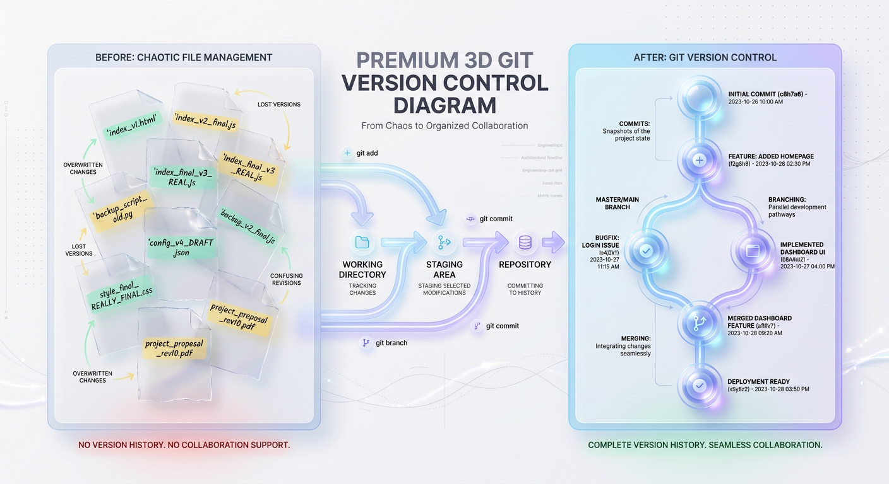
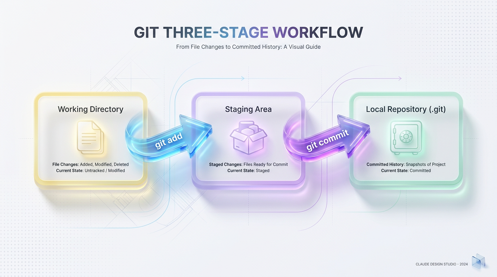
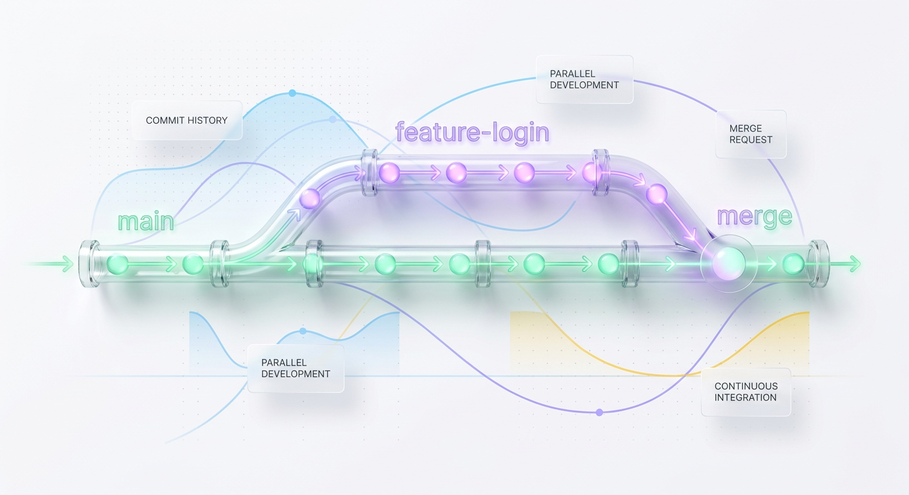
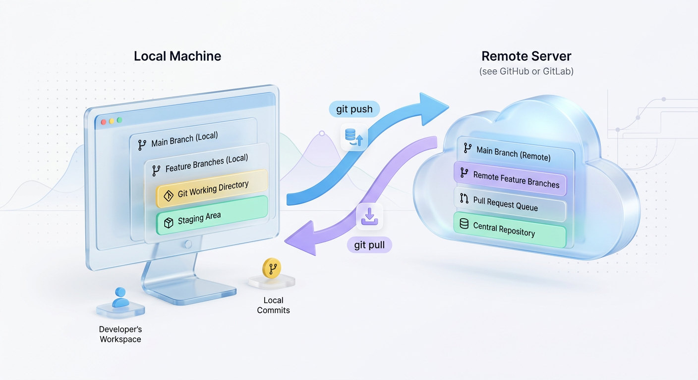

# Git Version Control: A Complete Beginner's Guide

*Learn how Git empowers developers by tracking every code change, enabling seamless collaboration, and providing a safety net for your projects.*

## What is Git? The Ultimate Visual Guide to Version Control

Every software developer, at some point in their early coding journey, encounters a moment of sheer panic. You make a small change to a working program, save the file, hit run, and everything breaks. You try to undo your changes, but you’ve already saved over your previous code. 

Before you know it, you are manually duplicating folders, naming them things like `project_v1`, `project_v2_final`, and `project_v3_REAL_final_dont_touch`. There is a better way to live. That way is **Git**.



*Figure 1: Moving from chaotic manual file duplication to Git's elegant, historical save points.*


In this guide, we will break down exactly what Git is, why it is an absolute superpower for your codebase, and how its key workflows operate under the hood.

---

## Section 1: Why Your Code Needs a Time Machine

At its core, **Git is a distributed version control system (VCS)**. It acts like a highly sophisticated, automatic "save point" system for your software projects. Instead of managing static, disconnected copies of files, Git tracks every tiny modification made to your source code over time.

Without version control, collaborating with other developers is a nightmare of copy-pasting, overwriting work, and sending ZIP files back and forth. With Git:

* **You get a complete time-machine:** You can roll your entire project back to exactly how it looked last Tuesday at 3:15 PM.
* **You can experiment without fear:** Want to test a complex feature that might break your app? You can do it in isolation without modifying your stable, working production code.
* **You know who did what:** Every change is accompanied by an author's name, a timestamp, and a description (a commit message) explaining *why* the change was made.

---

## Section 2: Git's Core Workflow: The Three Trees Explained

To understand Git, you must understand its three central environments. Developers often refer to these as the "Three Trees." Think of them as physical stages your files move through before they are permanently saved into your project's history.

1. **The Working Directory (Your Desk):** This is where you write and edit code. It contains the actual files on your computer's hard drive that you are currently working on.
2. **The Staging Area (The Packing Box):** This is a middle-ground index. It’s where you place files you’ve modified that you want to include in your next save point. Think of it like a packing box—you select which items go in before taping it shut.
3. **The Local Repository (The Secure Vault):** This is where Git permanently stores your project's history. Once files are committed here, they are assigned a unique cryptographic ID (a commit hash) and sealed away safely.



*Figure 2: The classic Git workflow—staging modifications on your 'desk' before committing them to the 'vault'.*


### The Step-by-Step Transition

When you modify a file on your computer, Git notices that your **Working Directory** has changed. 

First, you run the command:
```bash
git add index.js
```
This moves `index.js` into the **Staging Area**. You are telling Git: *"This file is ready. Keep it prepared for the next snapshot."*

Next, you run:
```bash
git commit -m "Fix navigation bar styling on mobile viewports"
```
This packages everything currently in your Staging Area and writes it to the **Local Repository** as a new, immutable "commit". If something breaks in the future, this commit is your guaranteed safe return point.

---

## Section 3: Parallel Universes: Branching & Merging Magic

Imagine you are building an e-commerce website. The checkout system is working perfectly. Suddenly, you get a request to add a new "Promo Code" feature. If you edit the main codebase directly, you risk breaking checkout for existing customers.

This is where **branching** comes in. In Git, a branch is not a full copy of all your files. Instead, it is a lightweight, moveable pointer to a specific commit. 



*Figure 3: Creating an isolated branch allows developers to build and test features without disrupting the production-ready code.*


By default, your primary, production-ready branch is called `main` (or historically, `master`). When you want to work on something new, you create a branch:

```bash
# Create and switch to a new branch
git checkout -b feature-promo-codes
```

You are now in a parallel universe! You can write, delete, and modify files at will. Your changes only exist on `feature-promo-codes`. Meanwhile, the `main` branch remains perfectly stable. 

Once your feature is complete and thoroughly tested, you can merge those changes back into your primary pipeline:

```bash
# Return to the main branch
git checkout main

# Pull the promo code changes into main
git merge feature-promo-codes
```

---

## Section 4: Collaboration with Remotes: Beyond Your Local Machine

So far, we have discussed Git running entirely on your local computer. But what happens when you work in a team? How do multiple developers sync their parallel universes?

This is where platforms like **GitHub**, **GitLab**, or **Bitbucket** enter the picture. They host **Remote Repositories**—clones of your project stored in the cloud that serve as a central "source of truth."



*Figure 4: The bridge between local work and remote synchronization, forming the foundation of modern team collaboration.*


To share and synchronize work across machines, Git relies on two primary operations:

### 1. Pushing Changes (`git push`)
When you have made several commits locally and want to share them with your team, you "push" those commits up to the remote cloud server:
```bash
git push origin main
```

### 2. Pulling Changes (`git pull`)
If your teammates have written new code and pushed it to the cloud, your local environment will be out of sync. To download and integrate their changes into your working directory, you "pull" the latest updates:
```bash
git pull origin main
```

---

## Section 5: Production Tips, Best Practices & Common Mistakes

As you begin using Git in professional environments, adhering to industry conventions will save you and your teammates hours of debugging and merge conflicts.

### Write Clean, Imperative Commit Messages
A commit message should state what the commit *does* when applied, not what you *did*. 
* **Bad:** "fixed some bugs and styled stuff"
* **Good:** "Fix user login authentication timeout issue"

### Commit Small, Commit Often
Avoid working for five days straight and committing a massive wall of 2,000 modified lines. Instead, commit in small, logical steps (e.g., commit when you finish writing the database schema, commit when you connect the API, and commit when you write the tests).

### Keep Secrets Out of Your Vault
Never, ever commit passwords, API keys, or database credentials. Once they are committed, they are recorded in the history forever. Use a `.gitignore` text file in your project root folder to tell Git which files or folders (like `node_modules/` or `.env`) to completely ignore.

---

## Section 6: Summary & Your Next Steps

Git is much more than a developer tool—it is the safety net that allows modern engineering teams to move fast, collaborate seamlessly, and build robust software.

### Quick Cheat Sheet:
* **`git init`**: Turn a local folder into a Git repository.
* **`git status`**: Check what has changed in your working directory.
* **`git add <file>`**: Stage changes to prepare them for a save point.
* **`git commit -m "message"`**: Permanently save staged changes with a descriptive label.
* **`git push`** / **`git pull`**: Synchronize with remote servers like GitHub.

To get started, download Git onto your machine, create a free account on GitHub, and start making your first commits. Your future self will thank you!