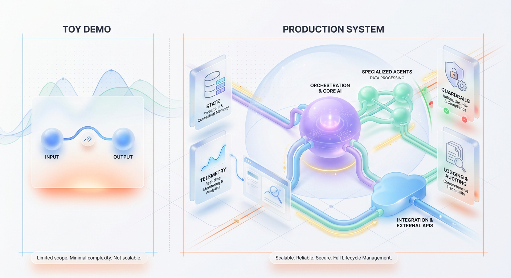
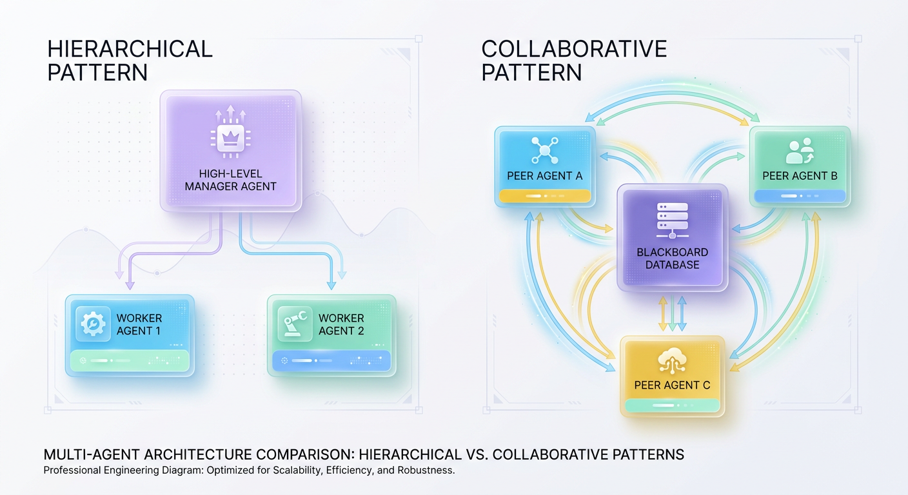
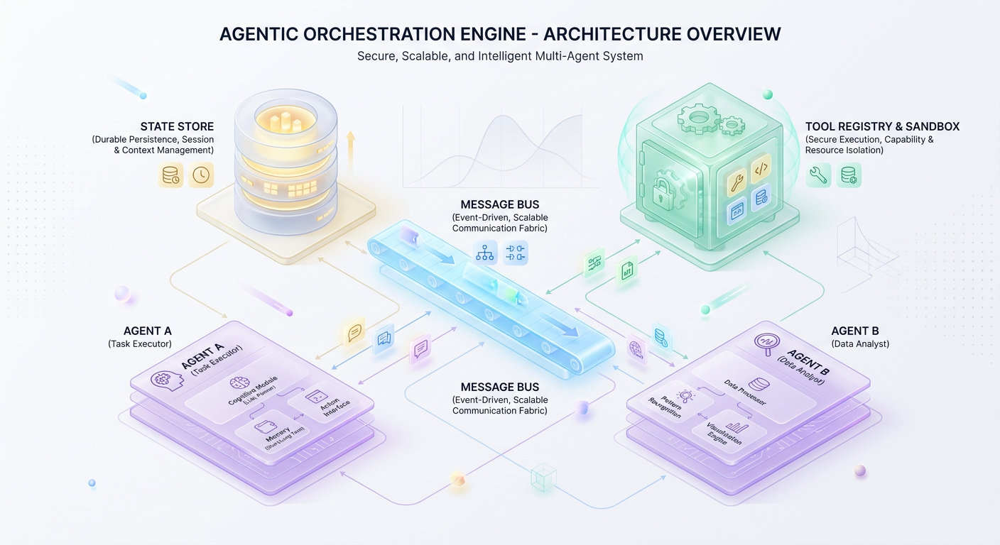

# Shipping Multi-Agent Systems: A Production Architecture Guide

*Move beyond toy demos by learning the essential architectural patterns and operational guardrails for building scalable, production-grade multi-agent AI systems.*

## Production Multi-Agent Architecture: A Guide for Systems Architects

Building a multi-agent system on your laptop is deceptively simple. With twenty lines of Python and a popular framework, you can orchestrate a group of agents that chat with one another, divide labor, and solve a toy coding problem. 

However, migrating this configuration to a production ecosystem reveals a harsh truth: the architectures that make for brilliant local demos almost always break down under the weight of real-world scale, state management requirements, and unpredictability.

*Figure 1: The Multi-Agent Illusion — Toy Demo vs. Production-Grade Reality*

## Section 1: The Multi-Agent Illusion: Why Demos Don't Ship

In a local prototype, agents run sequentially, state is kept in memory, and network latency is negligible. If an agent loops infinitely or fails to parse a payload, you hit `Ctrl+C` and restart the terminal. 

In production, this naive model collapses. A production-grade multi-agent system is, first and foremost, a **distributed system**. It inherits every classic problem of distributed software engineering: partial failures, race conditions, state drift, and network partitionings.

When we transition from a single LLM call to an orchestrated multi-agent network, we are effectively moving from a **monolithic process to a microservices architecture**. The core challenges are no longer about prompt engineering; they shift entirely to the infrastructure surrounding the agents:

* **Orchestration & Coordination:** How do agents dynamically coordinate without spinning into endless circular loops?
* **Durable State Management:** How does the system preserve the context of a 50-turn execution chain if a single container restarts midway through?
* **Cost & Rate Control:** How do you guarantee that a small user request doesn't trigger a cascading, recursive wave of agent interactions that consumes thousands of dollars of API credits in minutes?

To build resilient agent networks, we must stop thinking of agents as intelligent entities and start treating them as asynchronous microservices that require structured communication protocols, explicit routing tables, and hard infrastructure boundaries.

---

## Section 2: Foundational Patterns: Hierarchical vs. Collaborative Agents

Before writing code, architects must decide how control and communication flow through the system. Most production architectures align with one of two core topology patterns: **Hierarchical** or **Collaborative**.

*Figure 2: Architectural Topologies — Hierarchical Control vs. Collaborative Swarms*

### 1. The Hierarchical (Manager-Worker) Pattern
In a hierarchical system, a centralized controller agent (the Manager) receives the user query, breaks it down into structured subtasks, and assigns those subtasks to specialized sub-agents (the Workers). The workers execute their specific tasks and report back only to the Manager. Workers do not communicate with each other directly.

* **When to use:** Use this pattern for deterministic, business-critical workflows where predictability is paramount—such as financial report generation, automated code generation, and structured customer onboarding.
* **Key Advantage:** High controllability. The manager agent acts as a natural gatekeeper, verifying work quality and preventing chaotic emergent loops.

### 2. The Collaborative (Swarm/Blackboard) Pattern
In a collaborative topology, agents function as peers. They communicate directly via a shared event queue or a centralized memory board (the Blackboard). An agent reads the blackboard, determines if its specific capabilities are required, performs its work, and writes the output back to the board for other agents to consume.

* **When to use:** Use this pattern for highly creative, multi-disciplinary, or open-ended problems where the exact sequence of steps cannot be determined ahead of time—such as game asset generation, deep exploratory research, and dynamic threat modeling.
* **Key Advantage:** Extreme flexibility. Agents can step in dynamically as the state of the problem evolves.

### Trade-Off Matrix

| Feature | Hierarchical Pattern | Collaborative Pattern |
| :--- | :--- | :--- |
| **Control Flow** | Deterministic, top-down | Dynamic, emergent |
| **Communication** | Direct (Parent-to-Child) | Pub/Sub or Shared State |
| **Debugging** | Straightforward tracing | Complex tracing (high entropy) |
| **Resilience** | Central point of failure (Manager) | Decentralized resilience |

---

## Section 3: The Agentic Nervous System: Designing the Orchestration Engine

If agents are microservices, they need a robust, fault-tolerant infrastructure layer to live in. We call this the **Agentic Nervous System**. It consists of three primary layers: the State Store, the Message Bus, and the Tool Registry.

*Figure 3: The Orchestration Engine — State, Messaging, and Tooling Guardrails*

### 1. Durable State Store
Agents are inherently stateless. Every API call to an underlying LLM must be populated with historical context. To prevent data loss during long-running tasks, we must externalize this state.

Your state layer (typically built on top of high-performance stores like **Redis** or relational DBs like **PostgreSQL**) must track:
* **Short-term Memory:** The current conversation history, agent thinking steps, and immediate task variables.
* **Long-term Memory:** Vector databases storing semantic embeddings of previous tasks, user preferences, and cross-session knowledge.
* **System State:** The overall execution graph, task statuses (`PENDING`, `RUNNING`, `COMPLETED`), and active leases.

### 2. Message Bus & Router
Rather than letting agent frameworks handle communication via in-memory Python queues, production systems route tasks through a decoupled message broker like **Apache Kafka** or **RabbitMQ**. 

When an agent completes a task, it publishes an event (e.g., `invoice.processed`). The router determines which agent (or agents) are subscribed to this event type and forwards the payload safely. This ensures backpressure handling, message retries, and dead-letter queueing if an agent node goes offline.

### 3. Tool Registry & Sandboxed Execution
Agents are powerful because they can invoke tools (databases, third-party APIs, local scripts). However, allowing an agent to execute arbitrary code or API calls directly from a production pod is an existential security risk. 

An enterprise orchestration engine must decouple tool definitions from agent logic. Tools must reside in a secure, sandboxed execution environment (e.g., microVMs like **Firecracker** or isolated **Docker** containers) with strict egress rules, rate limits, and authentication controls. The Tool Registry acts as the gatekeeper, resolving which agent has the permission to invoke which API.

---

## Section 4: Production Guardrails: Best Practices & Common Mistakes

Deploying multi-agent systems without operational boundaries is a recipe for catastrophic failures. Below are three non-negotiable architectural guardrails required for production environments.

### Mistake 1: Lacking Distributed Observability
When a single agent call fails or yields a garbage response, understanding *why* is incredibly difficult if you only have standard application logs. A single user query can trigger a web of dozens of secondary agent invocations.

* **Solution:** Implement distributed tracing using **OpenTelemetry**. Every user request should generate a parent `Trace ID`. Every subsequent agent invocation, database query, and tool execution must be recorded as child spans under that same trace. This allows developers to visualize the entire execution path, pinpointing exactly where a chain of reasoning collapsed.

### Best Practice: Cost Control Circuit Breakers
Because multi-agent systems operate dynamically, they can fall victim to