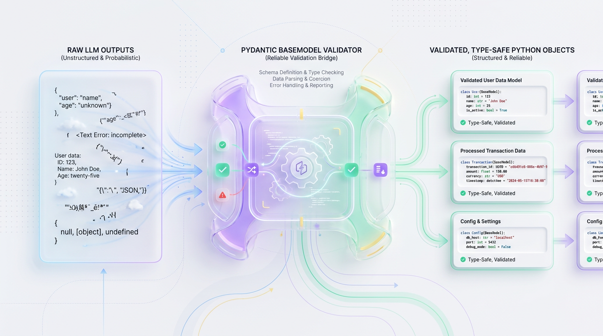
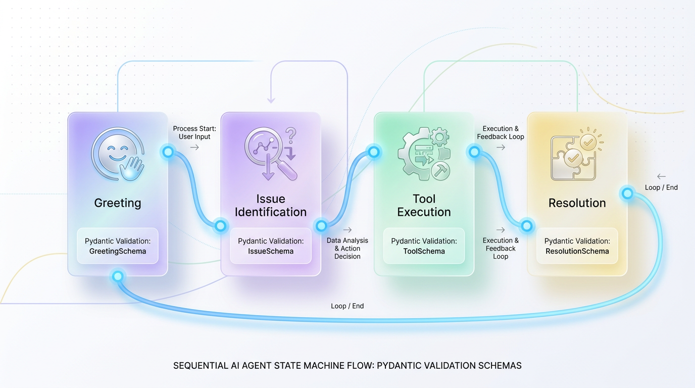

# Pydantic: The Tool for Building Bulletproof AI Agents

*Stop wrestling with unpredictable JSON from your LLMs. Learn to leverage Pydantic to enforce strict data schemas, making your AI agents reliable, predictable, and production-ready from day one.*


## From Chaos to Control: Building Reliable AI Agents with Pydantic

*Discover how to transform unpredictable LLM outputs into production-ready, deterministic data structures using Pydantic, moving beyond the fragile "parse-and-pray" anti-pattern to build robust and scalable AI systems.*


## The Chaos of Unstructured LLM Outputs

Large Language Models (LLMs) are probabilistic engines. They don't think in database schemas or API contracts; they predict the next most likely token in a sequence. This creativity is a double-edged sword. While it makes them powerful conversationalists, it creates a massive challenge for software systems that demand absolute predictability.

When developers connect LLMs to deterministic systems like backend databases or payment gateways, they encounter a fundamental impedance mismatch. Your APIs require validated JSON and precise data types, not unstructured natural language. Without a robust validation layer, engineers inevitably adopt the **"parse-and-pray"** anti-pattern: prompting an LLM for a specific format and then writing brittle, custom logic to clean up the output, hoping the model behaves as expected.

This approach is like building a skyscraper on a foundation of sand. Your agent's planning loops and tool-calling logic might be flawless, but the moment the model's output deviates—a missing quote, an extra comma, or a string where a number should be—the entire structure collapses. A single unhandled exception can crash the user's session and leave your system in an inconsistent state.

> ⚠️ **Common Mistake:** An agentic workflow is only as reliable as its weakest validation step. Relying on unvalidated string slicing or regex matching from an LLM output is a guarantee of production failure.

### The Fragility of Manual Parsing

Let's examine a typical, brittle attempt to manually parse an LLM response for a customer refund. The following script is a ticking time bomb, designed to fail with the slightest change in the LLM's output style.

```python
import json

# Simulated LLM output containing common formatting quirks
raw_llm_response = """
```json
{
    "customer_id": "USR-9482",
    "refund_amount": "$49.99",
    "reason": "Accidental duplicate purchase"
}
```
"""

def process_refund_legacy(raw_output: str):
    """Manually parses and cleans LLM outputs. This is highly brittle."""
    try:
        # Step 1: Manually strip markdown fences
        cleaned_output = raw_output.replace("```json", "").replace("```", "").strip()
        data = json.loads(cleaned_output)
        
        # Step 2: Extract and manually cast values
        customer_id = data.get("customer_id")
        
        # Fragile: This will break if the LLM returns '49.99 USD' or 'forty-nine dollars'
        raw_amount = data.get("refund_amount")
        refund_amount = float(raw_amount.replace("$", "").strip()) 
        
        reason = data.get("reason", "No reason provided")
        
        print(f"Success! Processed refund of {refund_amount} for {customer_id}.")
        return {"customer_id": customer_id, "amount": refund_amount, "reason": reason}
        
    except (json.JSONDecodeError, ValueError, AttributeError) as e:
        print(f"Error: Agent pipeline broke. Raw response was unparseable. Details: {e}")
        return None

# Execute the brittle parser
process_refund_legacy(raw_llm_response)
```

This code is unsustainable. As an agent's capabilities grow, manual error handling becomes a nightmare for debugging, testing, and maintenance. We need a firewall between the LLM's probabilistic output and our application's deterministic logic.


## Pydantic: The API Contract for Your LLM

Pydantic bridges the chasm between probabilistic LLMs and deterministic software. It allows you to define a declarative schema that acts as a formal **API contract** for your LLM, guaranteeing the shape, types, and constraints of data before it ever touches your application code.

Think of it this way: two microservices communicate via a strict API contract to ensure they speak the same language. Pydantic brings this same rigor to human-computer interaction. If the LLM’s output violates the contract, Pydantic acts as an automated gatekeeper, blocking the invalid data and raising a clear error.



*Figure 1: The Pydantic Bridge — Converting probabilistic LLM outputs into deterministic, validated Python data models.*


```text
[ LLM Raw Response ] --(Unstructured JSON String)--> [ Pydantic Gatekeeper ] --(Validated Python Object)--> [ Your App Logic ]
                                                              │
                                                     (Enforces API Contract)
```

### From Passive Dataclasses to Active Guardrails

While Python's native `@dataclass` is useful for simple data grouping, it is entirely passive; its type hints are mere suggestions that are not enforced at runtime. Pydantic transforms these hints into active validation rules, aggressively parsing and coercing data into the correct format.

Let's compare them directly with a messy LLM payload.

```python
from dataclasses import dataclass
from typing import List
from pydantic import BaseModel, ValidationError

# --- The Passive Way: Standard Python Dataclass ---
@dataclass
class ClassicAgentConfig:
    agent_id: int
    system_prompt: str
    temperature: float
    tools: List[str]

# --- The Active Way: Pydantic BaseModel ---
class PydanticAgentConfig(BaseModel):
    agent_id: int
    system_prompt: str
    temperature: float
    tools: List[str]

# Simulated messy payload from an LLM
messy_llm_payload = {
    "agent_id": "101",          # Problem: String, not integer
    "system_prompt": "You are a helpful assistant.",
    "temperature": "0.7",       # Problem: String, not float
    "tools": ["web_search", "calculator"]
}

print("--- Testing Python Dataclass (Unsafe) ---")
# Dataclass accepts invalid types silently, creating downstream bugs
dataclass_config = ClassicAgentConfig(**messy_llm_payload)
print(f"Dataclass agent_id type: {type(dataclass_config.agent_id)}") # <class 'str'>, a hidden bug!

print("\n--- Testing Pydantic BaseModel (Safe) ---")
try:
    # Pydantic actively parses and coerces data into the correct types
    pydantic_config = PydanticAgentConfig(**messy_llm_payload)
    print(f"Pydantic agent_id type: {type(pydantic_config.agent_id)}") # <class 'int'>, successfully coerced!
    print(f"Pydantic temperature type: {type(pydantic_config.temperature)}") # <class 'float'>, successfully coerced!
    
except ValidationError as e:
    print(f"Validation failed: {e.json()}")
```

Pydantic not only validates data coming *from* the LLM but also automatically generates a JSON Schema representation of your model. This schema can be passed *to* the LLM, instructing it on the exact format to generate.

> 💡 **Tip:** Don't treat Pydantic as a simple type-checker. It's a high-performance parsing engine that guarantees your AI agent's state remains free of corruption.


## Structuring Agent Tools for Reliable Function Calling

Modern AI agents don't just talk; they act. They use **tools** to search the web, query databases, or call external APIs. Pydantic is the foundational layer for this interaction, translating an LLM's natural language intent into the structured, type-safe arguments your code requires.

Think of a Pydantic model as a digital form an assistant must fill out. The assistant is forced to enter data into specific, labeled boxes (like `query` and `max_results`) with the correct data types before the "Submit" button is enabled.

Frameworks like `instructor` leverage this by converting Pydantic models into a JSON Schema using `model_json_schema()`. This schema is sent to the LLM as a strict blueprint for its response, ensuring near-perfect structural reliability and eliminating the need for fragile prompt engineering.

### Implementing a Web Search Tool

This example demonstrates how to define a web search tool with Pydantic. The model's docstring and field descriptions serve as direct instructions for the LLM.

```python
from typing import Optional
from pydantic import BaseModel, Field

# 1. Define the tool's input schema using a Pydantic model
class WebSearchTool(BaseModel):
    """
    Search the web for real-time information based on a user query.
    The description of this class and its fields are automatically sent to the LLM.
    """
    query: str = Field(
        ..., 
        description="A concise and specific search query."
    )
    domain: Optional[str] = Field(
        None, 
        description="Optional domain to restrict the search (e.g., 'wikipedia.org')."
    )
    max_results: int = Field(
        default=5, 
        ge=1, 
        le=10, 
        description="The number of results to return (must be between 1 and 10)."
    )

# 2. Simulate a validated tool call from the LLM
simulated_llm_payload = {
    "query": "Latest advances in nuclear fusion",
    "domain": "nature.com",
    "max_results": 3
}

try:
    # 3. Instantiate and validate the data into a ready-to-use Python object
    validated_tool_call = WebSearchTool(**simulated_llm_payload)
    print("Successfully parsed LLM tool arguments!")
    print(f"Query: {validated_tool_call.query}")
    print(f"Target Domain: {validated_tool_call.domain}")
    print(f"Result Limit: {validated_tool_call.max_results}")
except Exception as e:
    print(f"Validation failed: {e}")
```

This structured approach is superior to manual parsing in every way: it's more reliable, provides clearer error handling, and automatically updates the LLM's instructions whenever you modify the Pydantic model.


## Orchestrating Complex Workflows with State Machines

As agents become more autonomous, managing their execution path is a major challenge. A single, monolithic prompt chain is doomed to fail. To build resilient and predictable agents, we must model their workflows as **Finite State Machines (FSMs)**, where each state is represented by a dedicated Pydantic model.

This graph-based architecture constrains the agent's journey to a predefined set of nodes and edges. Think of it like a subway system: data can only travel between established stations (states) on validated tracks (transitions). The agent can't jump randomly from "Greeting" to "Process Refund" without first passing through the "Issue Identification" state with a valid payload.



*Figure 2: AI Agent Finite State Machine (FSM) managed and validated at each step with Pydantic.*


```text
[ GreetingState ] 
       │
       ▼ (Validates Customer Identity)
[ IssueIdentificationState ] 
       │
       ▼ (Validates Issue Category)
[ ToolExecutionState ] 
       │
       ▼ (Validates Tool Outputs)
[ ResolutionState ]
```

### Modeling States with Pydantic

Here's how to implement a type-safe customer support state machine. Each state is a Pydantic model, and a router class manages the transitions, ensuring data integrity at every step.

```python
from typing import Literal, Union
from pydantic import BaseModel, Field, EmailStr

# --- State Data Schemas ---
class GreetingState(BaseModel):
    customer_name: str = Field(..., description="The name of the customer.")
    email: EmailStr = Field(..., description="Validated customer email address.")

class IssueIdentificationState(BaseModel):
    customer_name: str
    email: EmailStr
    issue_summary: str = Field(..., min_length=10, description="Detailed summary of the problem.")
    category: Literal["billing", "technical", "account_access"]

# --- The State Machine Router ---
class AgentStateMachine(BaseModel):
    """Manages the current active state of the support agent."""
    current_state: Union[GreetingState, IssueIdentificationState]

    def transition_to_issue_id(self, issue_summary: str, category: str) -> "AgentStateMachine":
        """Transitions from Greeting to Issue Identification with validated data."""
        if not isinstance(self.current_state, GreetingState):
            raise ValueError("Can only transition from GreetingState!")
        
        new_state = IssueIdentificationState(
            customer_name=self.current_state.customer_name,
            email=self.current_state.email,
            issue_summary=issue_summary,
            category=category
        )
        return AgentStateMachine(current_state=new_state)

# --- Execution Example ---
# 1. Initialize the state machine with verified data
initial_flow = AgentStateMachine(
    current_state=GreetingState(customer_name="Alice Dev", email="alice@example.com")
)
print(f"Current State: {type(initial_flow.current_state).__name__}")

# 2. Transition safely to the next state
updated_flow = initial_flow.transition_to_issue_id(
    issue_summary="My database connection is timing out.",
    category="technical"
)
print(f"Updated State: {type(updated_flow.current_state).__name__}")
print(f"Validated Category: {updated_flow.current_state.category}")
```

This pattern provides deterministic safety, granular debugging, and preserves context far more effectively than a monolithic prompt chain.


## Production-Ready Pydantic Patterns

Deploying agents to production requires defensive engineering. Here are key practices for turning fragile prototypes into bulletproof systems.

### ✅ Best Practice: Keep Schemas Flat for LLMs

Engineers often design Pydantic models that mimic deeply nested database schemas. While Python handles this easily, LLMs struggle to reason over complex structural hierarchies. This increases cognitive load, latency, and the likelihood of schema violations.

-   **Flat Schemas:** Lead to higher accuracy, lower latency, and fewer parsing failures.
-   **Nested Schemas:** Increase the risk of hallucinations, high token costs, and parsing errors.

Keep your schemas as flat as possible. If nesting is unavoidable, limit it to a single level.

### ✅ Best Practice: Enforce Business Logic with Validators

Type safety ensures a field is a string, but it can't enforce your business rules. Use the `@field_validator` decorator to inspect and sanitize data *after* type checking but *before* it's bound to the model.

```python
from pydantic import BaseModel, Field, field_validator

class UserConfig(BaseModel):
    user_id: str = Field(description="Must start with the 'usr_' prefix.")

    @field_validator("user_id")
    @classmethod
    def validate_user_id_prefix(cls, value: str) -> str:
        if not value.startswith("usr_"):
            raise ValueError("user_id must start with the 'usr_' prefix.")
        return value

try:
    UserConfig(user_id="usr_jbond") # Success
    print("Validation Succeeded!")
    UserConfig(user_id="agent_jbond") # Fails
except ValueError as e:
    print(f"Validation Failed as expected: {e}")
```

This encapsulates domain rules directly within your data schema, preventing invalid data from ever polluting your application.

### 🚀 Production Tip: Build a Self-Correction Loop

When an LLM fails to generate a valid Pydantic model, don't just crash. Catch the `ValidationError`, extract its human-readable explanation, and feed it back to the LLM in a retry attempt. This allows the model to correct its own mistakes.

```python
from pydantic import BaseModel, ValidationError

class Model(BaseModel):
    temperature: float
    max_tokens: int

def run_self_correction_loop(raw_output: str, max_retries: int = 2):
    for i in range(max_retries):
        try:
            return Model.model_validate_json(raw_output)
        except ValidationError as e:
            print(f"Validation failed. Retrying with feedback...")
            # In a real app, you would send this feedback to the LLM
            # raw_output = llm.generate(prompt_with_error_feedback) 
            # For this example, we'll manually correct it for the next loop
            raw_output = '{"temperature": 0.7, "max_tokens": 100}'
    raise ValueError("Failed to validate after multiple retries.")

# Simulate an initial bad response from the LLM
bad_llm_output = '{"temperature": 1.5, "max_tokens": "one hundred"}'
validated_model = run_self_correction_loop(bad_llm_output)
print(f"Successfully Validated Output: {validated_model.model_dump()}")
```
This resilient pattern saves compute cycles and creates a much smoother user experience.


## Key Takeaways

-   **Stop "Parse-and-Pray":** Relying on manual string parsing and regex for LLM outputs is brittle and unscalable. This anti-pattern is a leading cause of failures in production AI systems.

-   **Pydantic is Your API Contract:** Use Pydantic models to define a strict, enforceable schema for LLM outputs. This acts as a validation firewall between the probabilistic model and your deterministic application code.

-   **Structure Tools for Reliability:** Define agent tools using Pydantic models. This allows frameworks to auto-generate JSON Schemas, providing clear instructions to the LLM and guaranteeing type-safe arguments for your functions.

-   **Orchestrate with State Machines:** For complex, multi-step agent workflows, model the process as a Finite State Machine (FSM). Use distinct Pydantic models for each state to ensure data integrity at every transition.

-   **Implement Self-Correction Loops:** When a Pydantic `ValidationError` occurs, catch the error, format it as feedback, and send it back to the LLM. This enables the agent to learn from its mistakes and correct its own output in real-time.