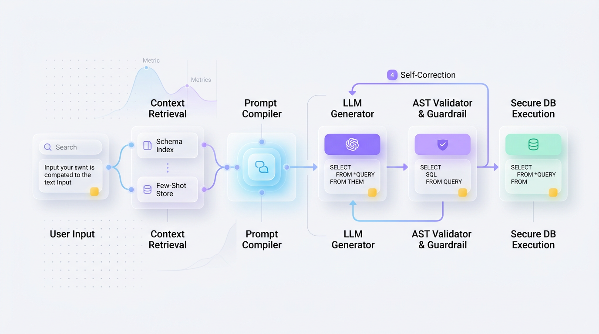
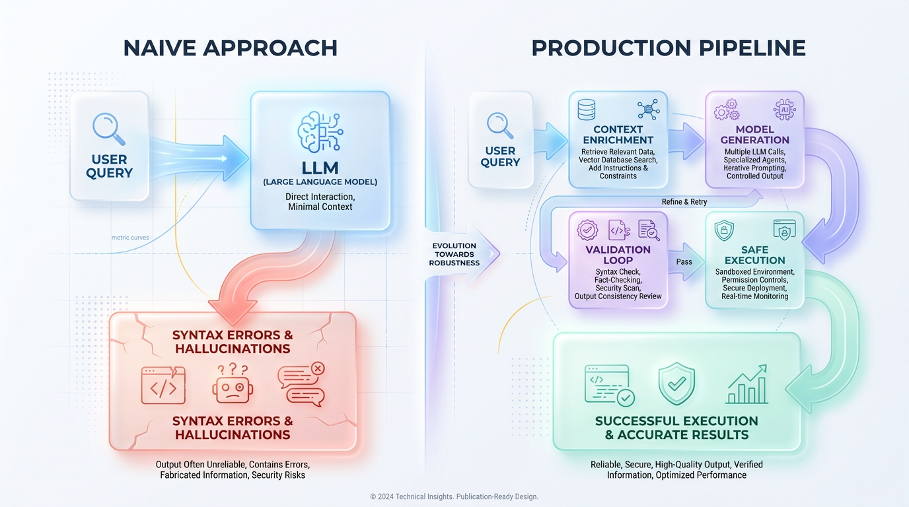

# Text-to-SQL: From LLM Prototype to Production System

*Stop just prompting LLMs. Learn to build a robust, production-ready Text-to-SQL system that reliably converts natural language questions into accurate, secure, and performant SQL queries for your applications.*


## Beyond the Demo: Architecting Production-Ready Text-to-SQL

*Why simple LLM prompts fail against real-world database complexity and how to build a robust agentic system with retrieval, validation, and security guardrails to succeed.*

Text-to-SQL sounds like the ultimate developer cheat code. The promise is incredibly alluring: plug a Large Language Model (LLM) into your database, expose a natural language interface, and let business users query complex data warehouses without ever writing a line of code. In simple tutorials with toy databases, this setup works flawlessly.



*Figure 2: Comprehensive architectural blueprint of a secure, production-grade Text-to-SQL agent pipeline.*


However, this naive approach quickly crumbles when deployed to production environments. The gap between a hobbyist demo and an enterprise-grade solution is vast and fraught with execution failures. The reality is that a raw LLM, without significant guidance and support, is not equipped to handle the complexities of a real-world enterprise database.

> A raw LLM is like a brilliant, newly hired intern who graduated at the top of their class but has never seen your company's actual database. They are highly intelligent but completely lack business context. Left unsupervised, they will confidently hallucinate table names, misinterpret cryptic legacy columns, and write highly inefficient queries that can lock production tables or spike your data warehouse bill.


## Why Naive Text-to-SQL Fails

To understand why simple prompting fails, we must look at the difference between textbook databases and real-world schemas. In a tutorial, a table is named `customers` with a column called `status`. In an enterprise database, however, that same information might be spread across `tbl_user_v4_prod` and `acct_status_history_archive`, requiring complex joins and strict filtering rules.

Without explicit guidance, an LLM has to guess these relationships, leading to catastrophic logic failures. The Python script below simulates how a naive, direct prompting approach fails when confronted with a realistic, messy database structure.

```python
import sqlite3

# Initialize an in-memory database representing a realistic, messy schema
conn = sqlite3.connect(':memory:')
cursor = conn.cursor()

# Create tables with cryptic legacy names typical of real production systems
cursor.execute("""
CREATE TABLE tbl_ledger_v2 (
    acct_id INTEGER PRIMARY KEY,
    cust_full_name TEXT,
    state_code TEXT, -- 'A' for Active, 'I' for Inactive, 'S' for Suspended
    dt_registered TEXT
)
""")
cursor.execute("INSERT INTO tbl_ledger_v2 VALUES (101, 'Alice Smith', 'A', '2023-01-15')")
conn.commit()

# The Naive LLM Generation
# Without domain context, the LLM assumes a standard, clean schema design
user_question = "Show me all active customers"
naive_generated_sql = "SELECT * FROM customers WHERE status = 'active';"

print(f"User Input: {user_question}")
print(f"Naive SQL Output: {naive_generated_sql}\n")

try:
    cursor.execute(naive_generated_sql)
except sqlite3.OperationalError as error:
    print(f"❌ Database Execution Failed: {error}")
    print("Why it failed: The LLM guessed the table name 'customers' and column 'status'")
    print("instead of using 'tbl_ledger_v2' and mapping 'active' to 'state_code = A'.")

conn.close()
```

This simple example highlights several critical failure modes, including a lack of schema context, blindness to domain-specific terminology (like `'A'` for "Active"), and the potential for severe performance or security risks.


## The Solution: An Agentic Architecture for Text-to-SQL

To bridge the gap between human intent and correct SQL, we must abandon simple, direct prompting. Instead, we must build a **multi-component agentic architecture** that surrounds the LLM with specialized tools, guardrails, and validation feedback loops. This system-level approach breaks the task down into distinct, manageable stages.

```text
[ User Query ]
      │
      ▼
[ Context Retrieval ] (Fetches Schema + Few-Shot Examples via RAG)
      │
      ▼
[ Dynamic Prompt Assembly ] (Combines context, instructions, and query)
      │
      ▼
[ SQL Generation ] (LLM generates draft SQL)
      │
      ▼
[ Validation & Correction Loop ] <─── (Syntax/Security Errors?)
      │                                      │
      ├───────────────── Yes ────────────────┘
      │ No
      ▼
[ Secure Execution ] (ReadOnly connection executes and returns results)
```

This pipeline carefully prepares the LLM’s context, guides its logical reasoning, and aggressively verifies its output before it ever touches live data.



*Figure 1: The gap between naive LLM query generation and a production-ready agent architecture.*


### Context Retrieval: Dynamic Schema and Few-Shot RAG

The LLM context window is a precious and expensive resource. Injecting your entire database schema—which could consist of hundreds of tables—degrades model performance and increases latency. Instead, a production system uses **Retrieval-Augmented Generation (RAG)** to dynamically pull only the most relevant information.

This involves fetching the targeted table schemas, column data types, and key relationships relevant to the user's intent. Crucially, it also involves querying a vector database of historical "Natural Language to SQL" pairs to retrieve a few highly similar, verified examples.

> ✅ **Best Practice:** High-quality context retrieval is 80% of the battle. When an LLM has access to exact table definitions and highly similar past examples, its syntax and logical errors drop dramatically.

### The Validation and Self-Correction Loop

Never execute LLM-generated SQL directly on a production database. The **Validation & Correction Loop** acts as an automated safety net by performing three critical tasks before any execution occurs:

1.  **AST Parsing:** Use a library like `sqlglot` to parse the generated query into an Abstract Syntax Tree (AST), validating its structure without running it.
2.  **Security Guardrails:** Scan the query against a denylist to block data mutation commands (`DROP`, `DELETE`, `UPDATE`) and prevent SQL injection.
3.  **Error Handling:** If any check fails, the error message is caught and fed back to the LLM in a structured "healing prompt," allowing the model to analyze its mistake and automatically correct the SQL.

### Dynamic Prompt Assembly

The following Python example demonstrates how to assemble these dynamic components into a cohesive, production-ready prompt template.

```python
# Simulating database metadata and few-shot example retrieval
DB_SCHEMAS = {
    "sales": """
    CREATE TABLE sales_transactions (
        transaction_id INT PRIMARY KEY,
        customer_id INT,
        amount DECIMAL(10, 2),
        purchase_date DATE
    );
    """
}
FEW_SHOT_EXAMPLES = [
    {
        "question": "Show total sales for last month",
        "sql": "SELECT SUM(amount) FROM sales_transactions WHERE purchase_date >= DATE_SUB(CURDATE(), INTERVAL 1 MONTH);"
    }
]

def assemble_prompt(user_query: str, domain: str) -> str:
    """Dynamically assembles a secure, context-rich prompt for the LLM."""
    # 1. Retrieve the relevant schema (static or dynamic)
    schema = DB_SCHEMAS.get(domain, "Schema not found.")
    
    # 2. Retrieve dynamic few-shot examples (simulating vector search)
    example = FEW_SHOT_EXAMPLES[0] 
    
    # 3. Assemble the prompt components
    prompt = f"""You are an expert SQL engineer. Generate a raw SQL query based on the database schema and examples provided below.

### DATABASE SCHEMA ###
{schema.strip()}

### RULE: ALWAYS RETURN ONLY RAW SQL. DO NOT WRAP IN MARKDOWN OR EXPLAIN YOUR CODE.

### EXAMPLE ###
User Query: {example['question']}
SQL Output: {example['sql']}

### CURRENT QUERY ###
User Query: {user_query}
SQL Output:"""
    
    return prompt

# Example usage
assembled_prompt = assemble_prompt("How much revenue did we bring in overall?", "sales")
print(assembled_prompt)
```


## Choosing Your Generation Engine

A foundational architectural choice is what engine will drive your SQL generation: a massive, general-purpose proprietary API or a lightweight, specialized open-source model.

### The Proprietary Giants: Broad Reasoning at a Premium

Models like GPT-4o and Claude 3.5 Sonnet are powerful generalists. They excel at resolving ambiguous user intents, handling complex schema mapping without prior training, and self-correcting errors. However, they come with high API latency, significant operational costs per token, and data privacy concerns, as schemas and queries are sent to third-party services.

### The Open-Source Specialists: Lean and Private

Specialized models like SQLCoder or CodeLlama are targeted, local-first alternatives. Hosted on your own infrastructure, they offer complete data privacy, low marginal cost per query, and can be fine-tuned for near-perfect accuracy on your specific domain. This comes at the cost of higher initial setup and maintenance overhead for managing GPU infrastructure.

> 💡 **Tip:** On standardized tests like the Spider benchmark, specialized open-source models frequently match or exceed the execution accuracy of general-purpose giants like GPT-4. This proves you don't always need the largest model to generate high-quality SQL.

### The Pragmatic Solution: A Hybrid Routing Architecture

Instead of choosing one engine, premier AI engineering teams use a **Hybrid Routing Architecture**. This approach uses a lightweight, local model for simple, routine queries and routes highly complex or ambiguous requests to a powerful proprietary model, optimizing for cost, speed, and accuracy. A routing engine can analyze the user's prompt for signals like joins or complex aggregations to make this decision automatically.

```python
class SQLRoutingEngine:
    def __init__(self, complexity_threshold: float = 5.0):
        self.threshold = complexity_threshold

    def analyze_query_complexity(self, user_prompt: str, table_count: int) -> float:
        """Analyzes the complexity of a user request to determine the best model route."""
        score = 0.0
        prompt_lower = user_prompt.lower()
        
        # Check for signals of joins or complex relationships
        join_signals = ["combine", "join", "across", "relationship"]
        if any(signal in prompt_lower for signal in join_signals):
            score += 3.0

        # Check for complex aggregations or window functions
        aggregation_signals = ["rank", "average", "median", "rolling", "percentile"]
        if any(signal in prompt_lower for signal in aggregation_signals):
            score += 2.5

        # Factor in the size of the target schema context
        score += table_count * 0.5
        return score

    def route_request(self, user_prompt: str, table_count: int) -> str:
        """Routes the request to the appropriate engine based on the complexity score."""
        score = self.analyze_query_complexity(user_prompt, table_count)
        
        if score > self.threshold:
            print(f"Routing to Generalist (Score: {score:.1f} > Threshold: {self.threshold})")
            return "PROPRIETARY_GENERALIST"
        
        print(f"Routing to Specialist (Score: {score:.1f} <= Threshold: {self.threshold})")
        return "LOCAL_SPECIALIST"

# --- Demonstration of the Routing Engine in Action ---
router = SQLRoutingEngine(complexity_threshold=5.0)

# Case 1: A simple query
router.route_request("Find the email address of the user with ID 492.", table_count=4)

# Case 2: A highly complex analytical query
router.route_request("Calculate the rolling 30-day average transaction size and rank users by total spend.", table_count=4)
```


## Production Guardrails and Best Practices

Moving a Text-to-SQL system from prototype to production demands a rigorous architecture built around security, data quality, and performance.

### Security First: Never Execute Raw SQL Directly

> ⚠️ **Common Mistake:** The most critical error is executing LLM-generated SQL directly against a database without validation. Treat every query generated by an LLM exactly like raw, untrusted user input.

To secure your database, implement a defense-in-depth architecture:
*   **AST Parsing:** Use a library like `sqlparse` or `sqlglot` to programmatically reject destructive commands like `DROP`, `DELETE`, or `UPDATE`.
*   **Read-Only Roles:** Connect to the database using a restricted user account that only has `SELECT` privileges on whitelisted schemas.
*   **Row-Level Security (RLS):** Enforce data access policies at the database level to prevent users from seeing data they are not authorized to view.

### Accuracy Through Rich Metadata

An LLM cannot write accurate SQL for a schema it doesn't understand. If your tables use cryptic abbreviations like `tbl_usr_dtl`, the model will struggle. To maximize accuracy, programmatically inject rich, human-readable metadata into your LLM prompt, including:
*   Table and column descriptions in plain English.
*   Examples of valid categorical values (e.g., `status` can be 'ACTIVE', 'SUSPENDED', or 'PENDING').
*   Explicit foreign key relationships.

### Performance via Semantic Caching

Generating SQL via an LLM on every request is slow and expensive. A **Semantic Cache** solves this by storing previously asked questions and their verified SQL answers.

When a new query arrives, the system calculates its vector embedding and checks for a semantically identical question in the cache. If a high-similarity match (e.g., cosine similarity > 0.97) is found, the system serves the cached SQL, bypassing the LLM entirely.

> 🚀 **Production Tip:** Implementing a semantic cache can reduce average query latency from over 2,000 milliseconds (LLM call) to under 50 milliseconds (cache lookup), while cutting API costs by up to 60%.

### Preventing Regression with a "Golden Dataset"

Prompt drift is a silent killer. A minor tweak to your system prompt can cause previously working queries to fail. To prevent this, create a version-controlled **Golden Dataset**—a curated collection of natural language questions paired with their hand-verified, correct SQL equivalents. Integrate this dataset into your CI/CD pipeline to run automated tests, ensuring that no update can be deployed unless it maintains baseline performance.


## The Future: From Text-to-SQL to Text-to-Insight

The final goal of natural language database interaction is changing. Business users don't just want a raw SQL string or a dry table of values; they want immediate, actionable business understanding. We are witnessing a rapid evolution from simple Text-to-SQL generation to comprehensive **Text-to-Insight** engines.

A future-proof system will not only generate and run the SQL but also pipe the results to an analysis library, generate a clean data visualization, and write a narrative summary explaining the key trend (e.g., *"Sales dipped 15% on Tuesday due to a scheduled payment gateway outage"*). By designing your architecture with this destination in mind, you will build an adaptable foundation capable of driving true, autonomous business intelligence.


## Key Takeaways
- **Build an Agentic System:** Successful Text-to-SQL is a multi-stage system involving context retrieval, generation, and a validation loop—not a single prompt.
- **Context Over Model Size:** The quality and relevance of the schema metadata and few-shot examples provided to the LLM are more critical than the model's parameter count.
- **Security is Non-Negotiable:** Always treat LLM-generated SQL as untrusted input. Use read-only roles, AST parsing, and deny-list filters to prevent destructive operations.
- **Use a Hybrid Model Router:** Optimize for cost, latency, and accuracy by routing simple queries to a local, specialized model and complex queries to a powerful, generalist API.
- **Implement a Semantic Cache:** Drastically reduce latency and API costs by caching query-SQL pairs and serving pre-validated SQL for semantically identical user questions.