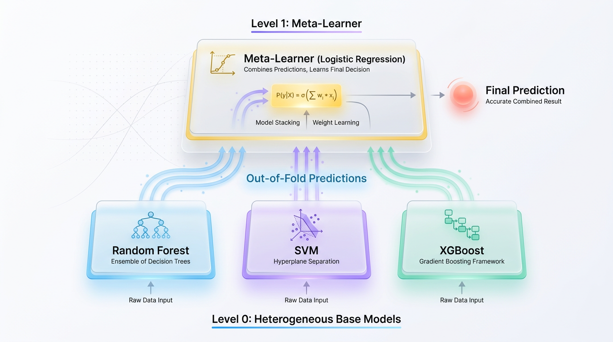
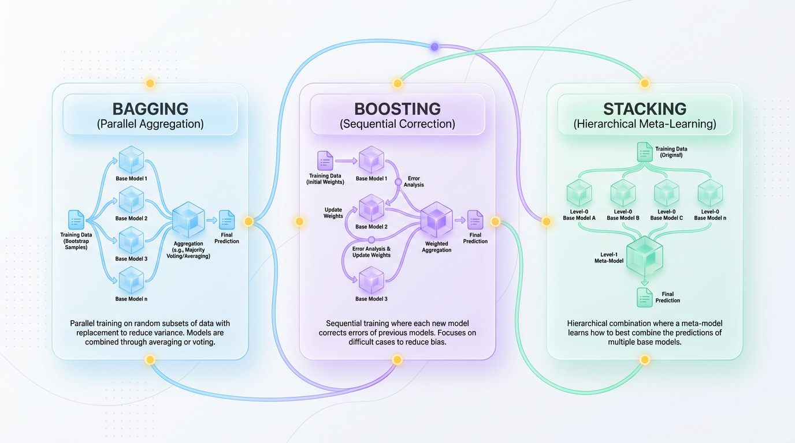
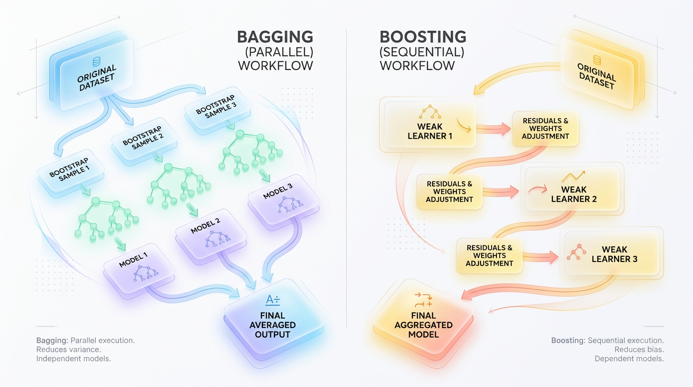

# Beyond a Single Model: Mastering Ensemble Learning in ML

*Discover how combining multiple machine learning models—using techniques like bagging, boosting, and stacking—can dramatically improve prediction accuracy and create more robust, production-ready systems.*


## The Power of Many: A Guide to Ensemble Learning
Instead of relying on a single, fallible model, ensemble learning strategically combines multiple models to achieve superior performance, balancing the bias-variance tradeoff to deliver robust and highly accurate predictions.



*Figure 1: Multi-Layer Stacking Architecture — Diversified Level-0 base models feeding out-of-fold predictions to a Level-1 Meta-Learner.*


## Why One Model Is Never Enough
Imagine putting all your savings into a single volatile stock. If that company succeeds, you win big; if it crashes, you lose everything. Relying on a single machine learning model presents the same hazard. No matter how much hyperparameter tuning you perform, one model is highly susceptible to the quirks and noise of its training data.

This vulnerability stems from the fundamental bias-variance tradeoff. A model’s total error can be decomposed into three parts: `Total Error = Bias^2 + Variance + Irreducible Noise`. **Bias** represents errors from oversimplified assumptions (underfitting), while **Variance** represents sensitivity to small fluctuations in the training data (overfitting).

Single models are perpetually trapped in a tug-of-war between these two forces. If you make a model complex enough to lower its bias, its variance typically skyrockets. Ensemble learning acts as a mathematical loophole to this tradeoff. By combining multiple imperfect models, their individual weaknesses cancel out, leaving only their collective strengths.


## The Three Pillars of Ensemble Learning
To build an effective "committee" of models, we can organize them using three distinct strategies. Each strategy targets a different aspect of model error to create a final prediction that is more robust and accurate than any single component could achieve on its own.

1.  **Bagging (Bootstrap Aggregating):** Trains multiple models in parallel on different random subsets of the data. It focuses on reducing **variance** by averaging out their predictions, making it ideal for taming unstable, overfitted models.



*Figure 2: The Three Pillars of Ensemble Learning — Parallel, Sequential, and Hierarchical paradigms.*


2.  **Boosting:** Trains models sequentially, where each new model is specifically built to correct the mistakes made by the previous one. This method focuses on reducing **bias**, turning a chain of weak predictors into a single, powerful unit.

3.  **Stacking (Stacked Generalization):** Trains a diverse set of different base models and uses a final "meta-model" to learn how to best weigh and combine their predictions. This heterogeneous approach focuses on finding the optimal blend of different algorithmic strengths.

Let's dive into how each of these powerful techniques works in practice.


## Bagging: Reducing Variance Through a Democratic Vote
Imagine asking a single expert for a high-stakes prediction. If that expert has a personal bias or is simply having an off day, their decision could be wildly incorrect. Bagging, short for Bootstrap Aggregating, solves this by consulting a diverse panel of experts instead of relying on just one.

Think of it like a courtroom jury. Instead of one judge deciding a case, we assemble twelve jurors. Each has a unique background and interprets evidence differently. When they vote, their individual biases tend to cancel each other out, leading to a much more stable and fair collective verdict.



*Figure 3: Architectural Comparison — Parallel bootstrap aggregating (Bagging) versus sequential step-wise error correction (Boosting).*


### How Bootstrap Sampling Creates Diversity
At the heart of Bagging is **bootstrap sampling**. Instead of giving every model the same training data, we create multiple random subsets by sampling **with replacement**. This means a single data point can be selected multiple times in one subset, while others might not be selected at all.

For a dataset of size `N`, drawing `N` samples with replacement means that, on average, each bootstrap sample contains about 63.2% of the original data. The remaining 36.8% is called the **Out-of-Bag (OOB)** data, which serves as a free, built-in validation set to evaluate model performance without a separate data split.

> ✅ **Best Practice:** The OOB score provides a reliable, unbiased estimate of the ensemble's performance on unseen data, making it an excellent metric for model evaluation and hyperparameter tuning during development.

### The Premier Bagging Algorithm: Random Forest
Because each model trains on an independent data subset, Bagging is an "embarrassingly parallel" process, making it highly efficient. The most famous implementation of Bagging is the **Random Forest**, which adds another layer of randomness to further improve performance.

In addition to bootstrap sampling, a Random Forest also randomly selects a subset of features at each split in its decision trees. This "feature bagging" decorrelates the trees, preventing a few dominant features from controlling all the models and ensuring the ensemble is diverse and robust.

### Bagging in Action with Scikit-Learn
The following code demonstrates how a `BaggingClassifier` significantly improves the accuracy of a single, high-variance `DecisionTreeClassifier` on a noisy, non-linear dataset.

```python
import numpy as np
from sklearn.datasets import make_moons
from sklearn.tree import DecisionTreeClassifier
from sklearn.ensemble import BaggingClassifier
from sklearn.model_selection import train_test_split
from sklearn.metrics import accuracy_score

# Generate a noisy, non-linear dataset
X, y = make_moons(n_samples=1000, noise=0.4, random_state=42)
X_train, X_test, y_train, y_test = train_test_split(X, y, test_size=0.2, random_state=42)

# 1. Train a single high-variance Decision Tree (prone to overfitting)
single_tree = DecisionTreeClassifier(random_state=42)
single_tree.fit(X_train, y_train)
tree_acc = accuracy_score(y_test, single_tree.predict(X_test))

# 2. Train a Bagging Classifier with 500 trees in parallel
bagging_clf = BaggingClassifier(
    estimator=DecisionTreeClassifier(),
    n_estimators=500,
    bootstrap=True,
    n_jobs=-1,  # Use all available CPU cores
    oob_score=True,
    random_state=42
)
bagging_clf.fit(X_train, y_train)
bagged_acc = accuracy_score(y_test, bagging_clf.predict(X_test))

print(f"Single Decision Tree Accuracy: {tree_acc:.4f}")
print(f"Bagged Ensemble Accuracy:      {bagged_acc:.4f}")
print(f"Out-of-Bag (OOB) Score:        {bagging_clf.oob_score_:.4f}")
```
By averaging the votes of 500 decorrelated trees, the ensemble smooths out the noise and creates a far more generalized decision boundary, resulting in higher accuracy on the test set.


## Boosting: Learning Sequentially from Mistakes
Imagine solving a puzzle with a group of friends. Instead of everyone yelling out answers at once, you work in order. The first person takes a guess, identifies what they got wrong, and passes those specific mistakes to the second person, who focuses entirely on solving them. This is the core philosophy of Boosting.

Boosting is a sequential ensemble technique that converts a collection of simple, underperforming models—known as **weak learners**—into a single, highly accurate strong learner. Each new model is specifically trained to correct the errors made by its predecessors, dramatically reducing the ensemble's overall **bias**.

### How Boosting Differs from Bagging
While both methods combine multiple models, they approach the problem from opposite directions.

*   **Training Style:** Bagging trains models in **parallel** and independently. Boosting trains them **sequentially**, where each model depends on the performance of the one before it.
*   **Primary Goal:** Bagging’s main goal is to reduce **variance**. Boosting’s main goal is to reduce **bias**.
*   **Model Weighting:** Bagging treats all models equally in the final vote. Boosting assigns a higher weight to models that performed better during training.

### The Boosting Family Tree
Several powerful algorithms have been built on this sequential error-correction framework, each with a unique approach.

*   **AdaBoost (Adaptive Boosting):** The original boosting algorithm. It works by progressively increasing the weights of misclassified data points, forcing the next model to master the difficult cases.
*   **Gradient Boosting (GBM):** Instead of adjusting data weights, GBM trains new models to predict the **residuals** (the leftover errors) of the current ensemble, using gradient descent to minimize a loss function.
*   **XGBoost, LightGBM, and CatBoost:** Highly optimized, production-ready implementations of Gradient Boosting that add features like regularization, parallel processing, and automatic handling of missing values.

### Boosting in Action with Scikit-Learn
This example shows how a `GradientBoostingClassifier` turns a series of weak, shallow decision trees into a powerful classifier.

```python
from sklearn.datasets import make_moons
from sklearn.tree import DecisionTreeClassifier
from sklearn.ensemble import GradientBoostingClassifier
from sklearn.model_selection import train_test_split
from sklearn.metrics import accuracy_score

# Generate a complex, non-linear dataset
X, y = make_moons(n_samples=1000, noise=0.30, random_state=42)
X_train, X_test, y_train, y_test = train_test_split(X, y, test_size=0.2, random_state=42)

# 1. Train a single Weak Learner (a shallow Decision Tree with high bias)
weak_learner = DecisionTreeClassifier(max_depth=2, random_state=42)
weak_learner.fit(X_train, y_train)
weak_acc = accuracy_score(y_test, weak_learner.predict(X_test))

# 2. Train a Gradient Boosting Ensemble of 100 weak learners
boosting_ensemble = GradientBoostingClassifier(
    n_estimators=100,
    learning_rate=0.1,
    max_depth=2,
    random_state=42
)
boosting_ensemble.fit(X_train, y_train)
boosting_acc = accuracy_score(y_test, boosting_ensemble.predict(X_test))

# 3. Compare the results
print(f"Single Weak Learner Accuracy: {weak_acc * 100:.2f}%")
print(f"Gradient Boosting Ensemble Accuracy: {boosting_acc * 100:.2f}%")
```
The single weak learner is too simple to capture the dataset's complexity. However, by sequentially training 100 of these trees to correct each other's errors, the boosting algorithm achieves a significantly higher accuracy.


## Stacking: The Ultimate Committee of Experts
We often find ourselves choosing between different algorithms. A Random Forest might capture non-linearities, while a Support Vector Machine excels at finding complex boundaries. Stacking, or stacked generalization, asks a different question: why not use all of them and train another model to learn how to combine their strengths?

Think of a project manager who consults a risk analyst, a growth marketer, and a software architect. The manager doesn't just average their opinions. Instead, they learn from experience when to trust each expert. In this analogy, the specialized employees are the **base models**, and the project manager is the **meta-model** making the final, informed decision.

### The Two-Level Architecture
Stacking organizes algorithms into a two-tiered hierarchy:
*   **Level-0 (Base Models):** A diverse set of models (e.g., Random Forest, SVM, Gradient Boosting) that train on the raw input data.
*   **Level-1 (Meta-Model):** A single model (often a simple one like Logistic Regression) that takes the predictions of the Level-0 models as its input features and outputs the final prediction.

> 💡 **Tip:** Stacking works best when the base models are as different as possible (e.g., tree-based, linear, distance-based). This diversity ensures they make uncorrelated errors, giving the meta-model more signal to learn from.

### The Silent Killer: Avoiding Data Leakage
A critical challenge in stacking is preventing **data leakage**. If you train the base models on your data and use their predictions on that same data to train the meta-model, you will get an artificially perfect score. The base models will be over-optimistic, and the meta-model will learn to trust them blindly, only to fail on new, unseen data.

To solve this, we must use **Out-of-Fold (OOF) predictions** generated via K-Fold cross-validation. The training data is split into `K` folds. For each fold, we train the base models on the other `K-1` folds and make predictions on the hold-out fold. These OOF predictions, which are generated on data the models have never seen, are then used to train the meta-model.

### Stacking in Action with Scikit-Learn
Fortunately, Scikit-learn's `StackingClassifier` handles all the complex cross-validation logic automatically, making it easy to build a leak-free stacking pipeline.

```python
from sklearn.datasets import make_classification
from sklearn.model_selection import train_test_split
from sklearn.ensemble import RandomForestClassifier, StackingClassifier
from sklearn.svm import SVC
from sklearn.ensemble import GradientBoostingClassifier
from sklearn.linear_model import LogisticRegression
from sklearn.metrics import accuracy_score

# 1. Generate a synthetic classification dataset
X, y = make_classification(n_samples=2000, n_features=20, random_state=42)
X_train, X_test, y_train, y_test = train_test_split(X, y, test_size=0.2, random_state=42)

# 2. Define diverse Level-0 base models
level_0_models = [
    ('rf', RandomForestClassifier(n_estimators=100, random_state=42)),
    ('svm', SVC(probability=True, kernel='rbf', random_state=42)),
    ('gb', GradientBoostingClassifier(n_estimators=100, random_state=42))
]

# 3. Define the Level-1 Meta-Model
meta_model = LogisticRegression()

# 4. Initialize the Stacking Classifier
# cv=5 ensures that 5-fold out-of-fold predictions are used to train the meta-model
stacking_clf = StackingClassifier(
    estimators=level_0_models,
    final_estimator=meta_model,
    cv=5,
    n_jobs=-1
)

# 5. Fit the model and evaluate
stacking_clf.fit(X_train, y_train)
y_pred = stacking_clf.predict(X_test)
print(f"Stacking Ensemble Test Accuracy: {accuracy_score(y_test, y_pred):.4f}")
```


## Production-Ready Ensembles: Best Practices and Pitfalls
Deploying ensembles into production requires balancing raw predictive power with system maintainability, latency, and cost. While complex architectures can win competitions, they can also introduce technical debt.

> ⚠️ **Common Mistake:** Chasing a 0.1% accuracy gain with a complex stacked ensemble that doubles your cloud bill and adds 200ms of latency to user requests is often a net loss for the business.

In most real-world scenarios, a single, finely tuned **Gradient Boosting** model (XGBoost, LightGBM) provides the ideal balance of performance and practicality. Only move to a more complex stacked ensemble if the marginal gain clearly outweighs the increased infrastructure and maintenance overhead.

> 🚀 **Production Tip:** Start with a single optimized LightGBM or XGBoost model. Their low latency, small memory footprint, and high accuracy make them the pragmatic sweet spot for most production use cases.

### Interpretability: Demystifying the Black Box with SHAP
Ensembles are often "black boxes," making it difficult to explain *why* a prediction was made. This is a problem for regulatory compliance and building trust with stakeholders. We can use **SHAP (SHapley Additive exPlanations)** to peer inside.

SHAP assigns each feature an importance value for a particular prediction, providing a locally accurate and consistent explanation. This converts an uninterpretable model into a transparent system.

```python
import shap
import pandas as pd
from sklearn.ensemble import RandomForestClassifier
from sklearn.datasets import make_classification

# Train an ensemble model
X_raw, y_raw = make_classification(n_samples=500, n_features=5, random_state=42)
feature_names = ['Income', 'Credit_Score', 'Age', 'Debt_Ratio', 'Employment_Length']
X = pd.DataFrame(X_raw, columns=feature_names)
model = RandomForestClassifier(n_estimators=100, random_state=42).fit(X, y_raw)

# Initialize the SHAP Explainer and calculate SHAP values
explainer = shap.TreeExplainer(model)
shap_values = explainer.shap_values(X)

# Visualize the first prediction's explanation
shap.force_plot(explainer.expected_value[1], shap_values[1][0,:], X.iloc[0,:])
```


## Conclusion: Think Systems, Not Just Models
As you design your next machine learning pipeline, shift your mindset from finding a single "perfect" algorithm to designing a cooperative system. The goal of ensemble learning is not just to build one great model, but a great system of models that work together to overcome individual flaws. By strategically balancing Bagging, Boosting, and Stacking, you can build systems that are truly greater than the sum of their parts.


## Key Takeaways
*   **Ensembles Overcome the Bias-Variance Tradeoff:** By combining multiple models, ensembles can reduce either bias or variance (or both), achieving a lower total error than any single model could.
*   **Bagging Reduces Variance:** It trains models in parallel on bootstrapped data samples and averages their predictions. Random Forest is the most popular Bagging algorithm.
*   **Boosting Reduces Bias:** It trains models sequentially, with each new model focusing on correcting the errors of its predecessor. Gradient Boosting (XGBoost, LightGBM) is the state-of-the-art for tabular data.
*   **Stacking Optimizes Model Combination:** It uses a meta-model to learn the optimal way to combine predictions from a diverse set of base models, but requires careful handling to avoid data leakage.
*   **Start Simple in Production:** For most applications, a well-tuned Gradient Boosting model (like LightGBM or XGBoost) offers the best balance of performance, latency, and maintainability. Reserve more complex ensembles for when marginal accuracy gains are critical.