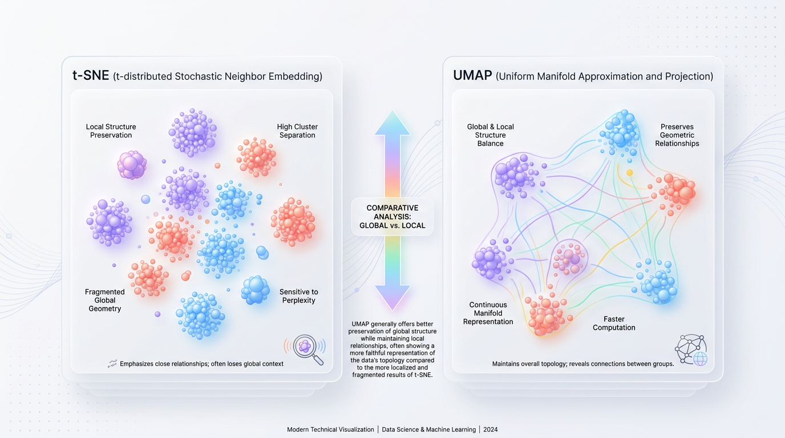
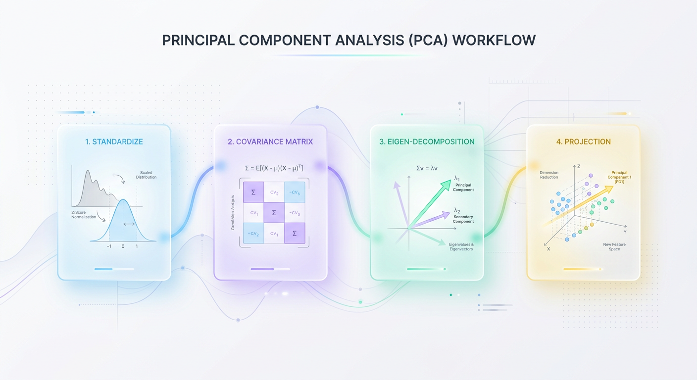
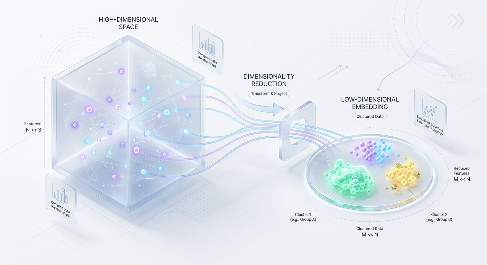

# Mastering Dimensionality Reduction for Smarter ML Models

*Discover how to combat the 'curse of dimensionality.' Learn key techniques like PCA and UMAP to build faster, more accurate, and less complex machine learning models by simplifying your data.*


## A Practical Guide to Dimensionality Reduction in Machine Learning
From PCA to UMAP, learn how to combat the Curse of Dimensionality, choose the right algorithm, and build production-ready pipelines that are both fast and accurate.

In machine learning, we often believe that more data is the key to better models. We collect every metric, user action, and sensor reading, assuming more features will naturally yield more accurate predictions. However, there comes a point where adding more features actually degrades your model's performance. This counterintuitive phenomenon is known as the **Curse of Dimensionality**.



*Figure 1: Geometric structure preservation comparison between t-SNE and UMAP.*


As you add more dimensions (features), your data space expands so rapidly that your dataset becomes functionally empty. The volume explodes, but your data points remain constant, drifting far apart into a sparse, featureless void.


## The Curse of Dimensionality: Why More Isn't Always Better
Imagine you lose your keys in a small, single-room studio apartment. Finding them is relatively easy because you only have a tiny floor area to search. Now, imagine those keys are lost somewhere in a 100-story skyscraper. The search space has exploded exponentially. Even though the keys are still there, the effort required to locate them is astronomical.

In high-dimensional space, your data points are like those lost keys. They become incredibly isolated, making it nearly impossible for machine learning algorithms to find meaningful patterns. This causes two major mathematical headaches:

*   **Distance Metric Collapse:** In high dimensions, the distance between any two random points becomes almost identical. Algorithms that rely on distance (like K-Nearest Neighbors or K-Means clustering) can no longer distinguish between "near" and "far" points.
*   **Overfitting:** With too many features and too few samples, models easily latch onto random noise that looks like a pattern, leading to terrible generalization on new, unseen data.

### Visualizing Distance Collapse in Python
This Python script demonstrates the mathematical reality of distance collapse. As dimensions increase, the ratio between the minimum and maximum distance between points converges toward 1.0, proving that all points become equidistant.

```python
import numpy as np

def analyze_dimension_sparsity(num_points=500, max_dim=100):
    """Calculates how distance metrics degrade as dimensions increase."""
    print(
        f"{'Dimensions':<12} | {'Min Distance':<12} | {'Max Distance':<12} | {'Ratio (Min/Max)':<16}"
    )
    print("-" * 60)

    for dim in [1, 2, 5, 10, 50, max_dim]:
        # Generate random data points in a hypercube [0, 1]
        data = np.random.rand(num_points, dim)

        # Compute pairwise Euclidean distances
        diff = data[:, np.newaxis, :] - data[np.newaxis, :, :]
        distances = np.sqrt(np.sum(diff**2, axis=-1))

        # Exclude self-distance (diagonal is 0)
        mask = ~np.eye(num_points, dtype=bool)
        valid_distances = distances[mask]

        min_dist = np.min(valid_distances)
        max_dist = np.max(valid_distances)
        ratio = min_dist / max_dist

        print(
            f"{dim:<12} | {min_dist:<12.4f} | {max_dist:<12.4f} | {ratio:<16.4f}"
        )

# Run the simulation
analyze_dimension_sparsity()
```
Notice how the ratio rapidly approaches `1.0`. This proves that in high-dimensional spaces, every point becomes almost equally distant from every other point, rendering distance-based algorithms ineffective.

To combat this, we must reduce the dimensionality of our dataset. This is achieved through two primary strategies.

*   **Feature Selection:** We select a subset of the most impactful original features and discard the rest. This preserves the interpretability of the variables (e.g., keeping "Age" and "Income" while dropping "Zip Code").
*   **Feature Extraction:** We project the high-dimensional data into a completely new, lower-dimensional space. This creates synthetic features that are combinations of the original ones (e.g., combining "Age" and "Income" into a single "Wealth Index").

This article focuses on feature extraction, which involves finding a compact representation of our data while preserving as much of its original structure as possible.


## PCA: Finding Your Data's Most Important Directions
Principal Component Analysis (PCA) is the workhorse of linear dimensionality reduction. It simplifies your data by finding a new set of axes—the **Principal Components**—that align with the directions of maximum variance in your dataset.

Think of PCA like taking a 2D photograph of a 3D bicycle. To capture the most information, you must find the perfect diagonal angle that shows the frame, wheels, and seat in a single shot. PCA does this mathematically: it rotates your high-dimensional data until it finds the optimal "viewing angles" that preserve the most variance.



*Figure 2: The step-by-step mathematical pipeline of Principal Component Analysis (PCA).*


### The Mathematical Pipeline
To find these optimal axes, PCA executes a precise four-step pipeline.

1.  **Standardization:** PCA is sensitive to feature scales. If one feature (e.g., home price) has a much larger variance than another (e.g., bedroom count), it will dominate the analysis. We standardize the data to give every feature a mean of 0 and a standard deviation of 1.
2.  **Covariance Matrix Computation:** We calculate a square Covariance Matrix to understand how features vary together. This helps identify redundant, highly correlated relationships.
3.  **Eigen-Decomposition:** We decompose the Covariance Matrix to find its **eigenvectors** and **eigenvalues**. Eigenvectors represent the directions of the new axes (the Principal Components), while eigenvalues represent the amount of variance captured by each eigenvector.
4.  **Projection:** We sort the eigenvectors by their corresponding eigenvalues in descending order. We then select the top `k` eigenvectors and project our original standardized data onto them to create our new, lower-dimensional dataset.

> 💡 **Tip:** The first Principal Component (PC1) is guaranteed to capture the maximum possible variance in a single dimension. PC2 captures the next highest variance while being mathematically orthogonal (perpendicular) to PC1.

### Implementing PCA in Python
The following code demonstrates how to use `scikit-learn` to apply PCA, inspect the **explained variance ratio**, and determine the optimal number of components (`k`).

```python
import numpy as np
import pandas as pd
from sklearn.datasets import load_breast_cancer
from sklearn.preprocessing import StandardScaler
from sklearn.decomposition import PCA

# 1. Load a high-dimensional dataset (30 features)
data = load_breast_cancer()
X = pd.DataFrame(data.data, columns=data.feature_names)

# 2. Standardize the features (A crucial step for PCA)
scaler = StandardScaler()
X_scaled = scaler.fit_transform(X)

# 3. Initialize PCA to inspect the variance of all components
pca = PCA()
X_pca = pca.fit_transform(X_scaled)

# 4. Calculate the cumulative explained variance
cumulative_variance = np.cumsum(pca.explained_variance_ratio_)

# Find how many components are needed to retain 90% of the variance
components_needed = np.argmax(cumulative_variance >= 0.90) + 1

print(f"Original Feature Count: {X.shape[1]}")
print(f"Components needed for 90% variance: {components_needed}")
print(f"Variance explained by first 2 components: {cumulative_variance[1]:.2%}")

# 5. Fit a final PCA model with the optimal number of components (k=7)
pca_final = PCA(n_components=components_needed)
X_reduced = pca_final.fit_transform(X_scaled)
print(f"Reduced Data Shape: {X_reduced.shape}")
```
While PCA is highly effective, it assumes data structures are linear. When dealing with complex, curved manifolds, we must turn to non-linear techniques.


## UMAP and t-SNE: Visualizing Complex Structures
When data lies on intricate, winding surfaces, linear methods like PCA fail to capture the true underlying patterns. **UMAP** (Uniform Manifold Approximation and Projection) and **t-SNE** (t-Distributed Stochastic Neighbor Embedding) are non-linear techniques designed specifically for this challenge.

Imagine you're trying to create a flat map of a 3D wire sculpture of a tree. PCA is like casting a shadow—you see the outline, but overlapping branches lose their spatial relationships. UMAP and t-SNE are like expert cartographers who carefully untangle the branches, ensuring that leaves close to each other on the 3D tree remain neighbors on the 2D map.



*Figure 3: The transition from a sparse, high-dimensional space to a dense, structured low-dimensional embedding.*


### UMAP vs. t-SNE
While both algorithms focus on preserving local structures, UMAP has emerged as the modern standard.

*   **Speed:** UMAP is significantly faster than t-SNE, which scales quadratically (`O(N^2)`) and becomes prohibitively slow on large datasets.
*   **Global Structure:** t-SNE excels at preserving local neighborhoods but often distorts the global structure; the distance between two far-apart clusters is meaningless. UMAP does a much better job of preserving both local and global structures.
*   **Tuning:** UMAP's hyperparameters (`n_neighbors`, `min_dist`) are more intuitive and robust than t-SNE's `perplexity`, which can be difficult to tune.

> 🚀 **Production Tip:** While t-SNE is a classic for creating beautiful visualizations, UMAP is generally the better choice for modern data science due to its speed, scalability, and superior preservation of global structure.

### Code Example: Projecting MNIST with UMAP
Let's use UMAP to project the 784-dimensional MNIST dataset of handwritten digits into a clean 2D plot for visualization.

```python
import matplotlib.pyplot as plt
import numpy as np
from sklearn.datasets import fetch_openml
import umap

# 1. Load a subset of the MNIST dataset (784 dimensions)
print("Loading MNIST data...")
mnist = fetch_openml("mnist_784", version=1, as_frame=False, parser="auto")
X, y = mnist.data[:5000], mnist.target[:5000].astype(int)

# 2. Initialize and fit the UMAP reducer
reducer = umap.UMAP(n_neighbors=15, min_dist=0.1, random_state=42)
print("Fitting UMAP on 784-dimensional data...")
embedding = reducer.fit_transform(X)

# 3. Plot the resulting 2D projection
plt.figure(figsize=(10, 8))
scatter = plt.scatter(
    embedding[:, 0], embedding[:, 1], c=y, cmap="Spectral", s=5, alpha=0.8
)
plt.colorbar(scatter, label="Digit Label", ticks=range(10))
plt.title("UMAP Projection of MNIST (784D to 2D)", fontsize=14)
plt.xlabel("UMAP Dimension 1")
plt.ylabel("UMAP Dimension 2")
plt.grid(True, linestyle="--", alpha=0.5)
plt.show()
```
The resulting plot will show distinct, well-separated clusters for each digit, demonstrating UMAP's ability to find meaningful structure in high-dimensional space. Notice how visually similar digits, like `7` and `9`, often appear closer together.


## Production-Ready Pipelines: Best Practices and Pitfalls
Moving dimensionality reduction from a notebook to a production pipeline requires careful engineering to avoid common mistakes that can degrade model performance.

### Best Practice: Always Standardize Your Features
Variance-based algorithms like PCA are extremely sensitive to feature scales. If features are on different scales, the one with the largest variance will dominate the analysis, and the algorithm will ignore the others.

> ⚠️ **Common Mistake:** Applying PCA or other variance-based methods to unscaled data. If you have a feature for home price (in millions) and another for bedroom count (1-5), PCA will incorrectly conclude that price is the only thing that matters, ignoring the valuable information in the bedroom count.

Always use a `StandardScaler` to give your features a mean of 0 and a standard deviation of 1 before applying dimensionality reduction.

### Best Practice: Choosing the Right Number of Components (`k`)
Selecting the optimal number of dimensions, `k`, is a balancing act between compression and information loss. A common method is to analyze the **cumulative explained variance ratio**.

Plot the cumulative variance against the number of components and look for the "elbow"—the point where adding more components provides diminishing returns. A good rule of thumb is to choose the number of components that preserves 85-95% of the total variance.

> ✅ **Best Practice:** Don't guess the number of components. Use the cumulative explained variance plot to make an informed, data-driven decision about how many dimensions to keep.

### Production Tip: Prevent Data Leakage with Pipelines
Data leakage is a silent killer in ML systems. It occurs when information from your test set accidentally "leaks" into your training process, leading to overly optimistic validation scores and poor real-world performance.

In dimensionality reduction, this happens if you fit your scaler or reducer on the entire dataset *before* splitting it. This allows the model to "peek" at the test data's distribution.

> 🚀 **Production Tip:** Always split your data into training and test sets *first*. Then, use a `scikit-learn` `Pipeline` to ensure your scaler and reducer are `.fit()` only on the training data and are only `.transform()` on the test data. This prevents any information from the test set from influencing the training process.

```python
from sklearn.model_selection import train_test_split
from sklearn.pipeline import Pipeline
from sklearn.linear_model import LogisticRegression
from sklearn.datasets import make_classification

X, y = make_classification(n_samples=1000, n_features=20, random_state=42)

# STEP 1: Split the data first!
X_train, X_test, y_train, y_test = train_test_split(X, y, test_size=0.2, random_state=42)

# STEP 2: Use a Pipeline to encapsulate scaling and reduction safely
pipeline = Pipeline([
    ('scaler', StandardScaler()),
    ('reducer', PCA(n_components=5)),
    ('classifier', LogisticRegression())
])

# The pipeline fits the scaler and PCA ONLY on X_train
pipeline.fit(X_train, y_train)

# It then transforms X_test using the parameters learned from X_train
accuracy = pipeline.score(X_test, y_test)
print(f"Leak-free Test Accuracy: {accuracy:.4f}")
```


## Key Takeaways
*   **The Curse of Dimensionality:** As features increase, data becomes sparse, distances become meaningless, and models are more likely to overfit.
*   **PCA for Linear Data:** Use Principal Component Analysis (PCA) as a fast, scalable workhorse for linear feature extraction, noise reduction, and data whitening in preprocessing pipelines.
*   **UMAP for Non-Linear Visualization:** Use UMAP for exploratory data analysis and visualization to uncover complex, non-linear structures and clusters that linear methods would miss.
*   **Scale Before You Reduce:** Always standardize your features to have a mean of 0 and a standard deviation of 1 before applying variance-sensitive algorithms like PCA.
*   **Prevent Data Leakage:** Split your data into training and test sets *before* any preprocessing. Use `scikit-learn` Pipelines to ensure your reducer is fit only on the training data.