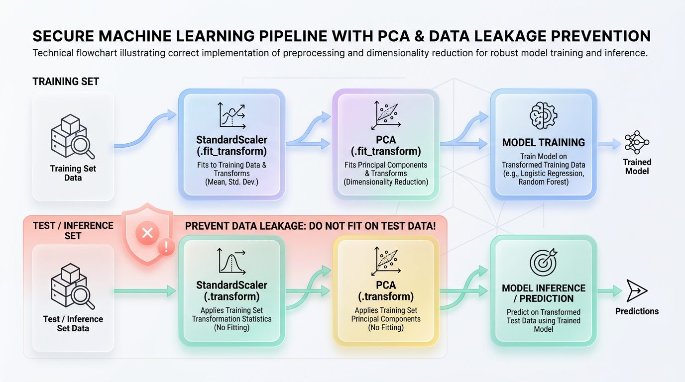
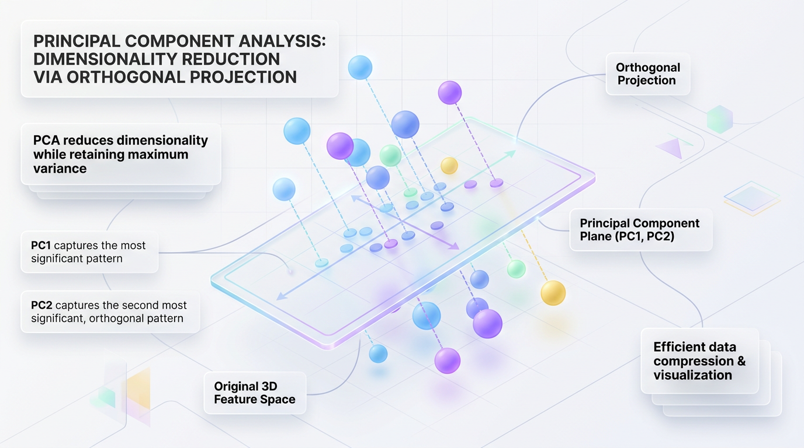

# A Practical Guide to PCA for High-Performance ML Models

*Learn how Principal Component Analysis (PCA) compresses high-dimensional datasets, enabling faster model training and powerful data visualization without significant information loss.*


## Taming High-Dimensional Data with Principal Component Analysis

*A practical guide to using PCA to combat the "Curse of Dimensionality," speed up model training, and build faster, more robust machine learning systems without losing critical information.*

In machine learning, we are often taught that more data leads to better models. However, this advice has a critical catch: "more data" often means adding more features, or columns, to our dataset. When the number of features—or dimensions—grows too large, our data points drift apart, and algorithms begin to struggle. This costly phenomenon is known as the **Curse of Dimensionality**.



*Figure 1: The production-ready PCA pipeline showing how the Scaler and PCA parameters are learned strictly from the Training dataset and applied downstream.*


## The Curse of Dimensionality: When More Features Hurt

Imagine trying to find a friend in a tiny, one-street village. Because the search space is essentially one-dimensional, locating them is simple. Now, imagine searching for that same friend in a massive, multi-level futuristic city. With three spatial dimensions plus thousands of rooms and corridors, the search space becomes exponentially vast. Your friend is now a needle in a colossal, empty haystack.

In high-dimensional space, our data points become like isolated citizens in that massive city. They grow incredibly sparse and distant from one another, making it nearly impossible for distance-based algorithms to find meaningful patterns. This mathematical inflation creates severe engineering bottlenecks.

*   **Slower Model Training:** Algorithms that rely on distance calculations take drastically longer to execute as dimensions scale.
*   **Increased Resource Consumption:** High-dimensional matrices consume massive amounts of RAM and CPU/GPU compute power, rapidly driving up cloud costs.
*   **Overfitting to Noise:** With too many features, models can easily find random, meaningless patterns (noise) that do not generalize to new data.

Mathematically, as the number of dimensions `N` increases, the ratio of the distance to the nearest neighbor versus the distance to the furthest neighbor approaches 1. When every data point is equally far from every other point, classification and clustering algorithms completely break down.

### A Quick Demonstration in Python

This simple script uses `scipy` to prove how distances become uniform as dimensions increase. We generate 100 random samples and calculate the pairwise distances between them across different dimensional spaces.

```python
import numpy as np
from scipy.spatial.distance import pdist

# Generate 100 random samples across different dimensions
samples = 100
dimensions = [2, 10, 100, 1000]

print("Dimension | Min Distance | Max Distance | Ratio (Min/Max)")
print("-" * 55)

for dim in dimensions:
    # Create random data points in the specified dimension
    data = np.random.rand(samples, dim)
    
    # Compute pairwise Euclidean distances between all points
    distances = pdist(data)
    
    min_dist = np.min(distances)
    max_dist = np.max(distances)
    ratio = min_dist / max_dist
    
    # As the ratio approaches 1, distance-based algorithms lose their effectiveness
    print(f"{dim:9d} | {min_dist:12.4f} | {max_dist:12.4f} | {ratio:15.4f}")
```

As the output shows, the `Ratio (Min/Max)` rapidly approaches 1, confirming that in high-dimensional space, everything is far away from everything else.


## Introducing PCA: Your High-Dimensional Flashlight

So, how do we solve this problem without blindly deleting features and risking information loss? This is where dimensionality reduction, and specifically **Principal Component Analysis (PCA)**, becomes essential.

PCA is an unsupervised learning technique that projects high-dimensional data into a lower-dimensional space while retaining the maximum amount of original variance.

Imagine holding a 3D wireframe teapot. If you shine a flashlight on it, it casts a 2D shadow on the wall. A random angle might produce an unidentifiable blob. But if you rotate the teapot, you'll find the optimal angle where the shadow clearly reveals its handle, spout, and body. PCA does this mathematically, finding the "angles" that cast the most informative low-dimensional shadow of your data.


## How PCA Finds the "Best" Shadow: The Mechanics of Variance

To find these optimal angles, PCA rotates the dataset's coordinate system so that the new axes align with the directions of maximum data spread. You don't need a degree in linear algebra to grasp the core concepts:

*   **Variance ("The Spread"):** A measure of how spread out your data is. PCA hunts for the directions of highest variance.
*   **Eigenvectors ("The Directions"):** These are the pointing arrows that define the new axes, called **Principal Components**. The first principal component (PC1) always points along the direction of maximum variance.
*   **Eigenvalues ("The Magnitude"):** These are the lengths or "strengths" of the eigenvectors. An eigenvalue tells you how much variance (information) is captured along its corresponding eigenvector.

The new axes PCA creates are linear combinations of the original features. For example, a principal component might be calculated as `PC1 = (0.707 * Height) + (0.707 * Weight)`. Because each principal component is mathematically perpendicular (orthogonal) to the others, they are guaranteed to be uncorrelated, solving the common machine learning headache of multicollinearity.


## A Practical Guide to Implementing PCA in Python

Let's walk through a complete example using the classic Iris dataset, which has four features. Our goal is to reduce its dimensionality while retaining most of its informational content.

### Step 1: Find the Optimal Number of Components

First, we use the **Cumulative Explained Variance** plot to find the "elbow"—the point where adding more components provides diminishing returns.

```python
import numpy as np
import matplotlib.pyplot as plt
from sklearn.datasets import load_iris
from sklearn.preprocessing import StandardScaler
from sklearn.decomposition import PCA

# Load the classic Iris dataset (4 features)
data = load_iris()
X = data.data

# Standardize features, as PCA is sensitive to scale
X_scaled = StandardScaler().fit_transform(X)

# Fit PCA to calculate variance for all features
pca_full = PCA().fit(X_scaled)
cumulative_variance = np.cumsum(pca_full.explained_variance_ratio_)

# Plot the "Elbow" curve
plt.figure(figsize=(8, 5))
plt.plot(range(1, 5), cumulative_variance, marker='o', linestyle='--', color='b')
plt.axhline(y=0.95, color='r', linestyle=':', label='95% Explained Variance')
plt.title('Cumulative Explained Variance by Number of Components')
plt.xlabel('Number of Principal Components')
plt.ylabel('Cumulative Explained Variance')
plt.legend(loc='best')
plt.grid(True)
plt.show()
```

The plot clearly shows an "elbow" after the second component, indicating that the first two components capture over 95% of the total variance. We can safely reduce our 4D dataset to 2D.

### Step 2: Transform and Visualize the Data

Now, we apply PCA with `n_components=2` and plot the result.

```python
# Apply PCA to reduce to 2 components
pca = PCA(n_components=2)
X_pca = pca.fit_transform(X_scaled)

# Visualize the 2D projection
plt.figure(figsize=(8, 6))
for target_val, target_name, color in zip([0, 1, 2], data.target_names, ['red', 'blue', 'green']):
    plt.scatter(
        X_pca[data.target == target_val, 0], 
        X_pca[data.target == target_val, 1], 
        color=color, 
        alpha=0.8, 
        label=target_name
    )

plt.xlabel('Principal Component 1')
plt.ylabel('Principal Component 2')
plt.title('2D PCA Projection of the Iris Dataset')
plt.legend()
plt.grid(True)
plt.show()
```

The visualization confirms that PCA successfully collapsed four dimensions into two. The three Iris species, which were intertwined in 4D space, now form distinct, easily separable clusters in 2D.


## Production Guardrails: Avoiding Common PCA Pitfalls

Moving PCA from a notebook to a production service introduces subtle but critical challenges. Implementation errors can silently degrade model performance or cause outages.

> ⚠️ **Common Mistake: Forgetting to Scale Your Features**
> PCA is driven by variance. If one feature (e.g., annual income) has a much larger scale than another (e.g., age), PCA will incorrectly assume the larger-scale feature is more important, ignoring the other's contribution. Always use `StandardScaler` to give every feature equal footing.

> ⚠️ **Common Mistake: Data Leakage During Preprocessing**
> Your preprocessing steps must only learn from the training data. If you fit your `StandardScaler` or `PCA` object on the entire dataset (including test data), your model is "cheating" by seeing the test set's distribution. This leads to overly optimistic metrics that fail in production.

> ✅ **Best Practice: Use `sklearn.pipeline.Pipeline`**
> Manually managing `fit` and `transform` calls for scalers and PCA is error-prone. A `Pipeline` object chains these steps into a single, atomic unit. It automatically prevents data leakage during training and cross-validation, ensuring a robust and reproducible workflow.

```python
from sklearn.datasets import make_classification
from sklearn.model_selection import train_test_split
from sklearn.linear_model import LogisticRegression
from sklearn.pipeline import Pipeline
from sklearn.metrics import accuracy_score

# 1. Generate synthetic high-dimensional data
X, y = make_classification(n_samples=1000, n_features=20, n_informative=10, random_state=42)
X_train, X_test, y_train, y_test = train_test_split(X, y, test_size=0.2, random_state=42)

# 2. Construct the production pipeline
production_pipeline = Pipeline([
    ('scaler', StandardScaler()),              
    ('pca', PCA(n_components=0.95)),  # Automatically select components for 95% variance
    ('classifier', LogisticRegression())       
])

# 3. Fit the entire pipeline on training data
production_pipeline.fit(X_train, y_train)

# 4. Predict on the unseen test set
predictions = production_pipeline.predict(X_test)
accuracy = accuracy_score(y_test, predictions)

print(f"Pipeline executed successfully. Model Accuracy: {accuracy:.4f}")
```


## Beyond the Basics: Choosing the Right Reduction Strategy

PCA is a powerful default, but it's not a silver bullet. Its core assumption is that your data lies on a flat, linear subspace. If your data contains complex, non-linear patterns (like concentric circles or a spiral), standard PCA can fail by crushing distinct groups together.

Use this decision matrix to guide your choice:

| Goal | Recommended Technique | Reason |
| --- | --- | --- |
| **Speed up training** on correlated numeric features. | **Standard PCA** | Computationally efficient and excels at creating uncorrelated components. |
| **Visualize clusters** in a high-dimensional dataset. | **t-SNE / UMAP** | Superior at preserving local neighborhood structures for 2D/3D visual analysis. |
| **Retain feature interpretability** for business reports. | **Feature Selection** | PCA creates abstract components, while selection methods keep original, understandable features. |
| **Reduce dimensions** in highly **non-linear** data. | **Kernel PCA** or **Autoencoders** | These methods can map and preserve complex, curved data structures where linear PCA fails. |


## Real-World Applications of PCA

In production, high-dimensional data is a silent killer of system performance. PCA acts as an engineering lever to build faster, cheaper, and more robust systems.

*   **NLP Embeddings:** Modern models like BERT generate 768-dimension vectors. PCA can compress these to 128 dimensions, drastically reducing memory usage in vector databases and speeding up similarity search.
*   **Recommendation Systems:** PCA condenses massive, sparse user-item matrices into a dense format, accelerating collaborative filtering algorithms and mitigating noise from anomalous user interactions.
*   **Computer Vision:** In "Eigenfaces" for facial recognition, PCA extracts key facial variations (jawline, eye spacing) and ignores noise like lighting changes, making matching orders of magnitude faster.
*   **Fraud Detection:** By consolidating hundreds of correlated transaction features, PCA helps isolate the subtle signals of fraud from the overwhelming noise of typical user behavior.

> 🚀 **Production Tip:** While PCA speeds up model training, it adds a matrix multiplication step `O(B * D * K)` to inference. For ultra-low-latency systems (sub-10ms), always benchmark to ensure this transformation overhead doesn't violate your service-level agreements.


## Final Thoughts

Principal Component Analysis is far more than a simple preprocessing step; it's a fundamental tool for making machine learning practical and cost-effective. By intelligently compressing high-dimensional data, PCA allows us to fight the "Curse of Dimensionality," accelerate model training, and deploy leaner, more focused systems. However, its power comes with responsibility. A successful implementation depends on a disciplined approach: always scaling features to prevent bias, rigorously separating training and test sets to avoid data leakage, and using `Pipeline` objects to create robust, reproducible workflows.

While standard PCA is your go-to for linear data, understanding its limitations is equally important. Knowing when to switch to non-linear alternatives like Kernel PCA or visualization-focused tools like t-SNE will set you apart as a thoughtful practitioner. The ultimate goal isn't just to reduce dimensions but to do so with purpose—retaining the signal that matters while discarding the noise that confuses. By mastering PCA, you gain a powerful lever to build models that are not only accurate in a notebook but also efficient and reliable in the real world.



*Figure 2: Geometric intuition of PCA—projecting high-dimensional data points onto a lower-dimensional principal component plane while maximizing variance.*