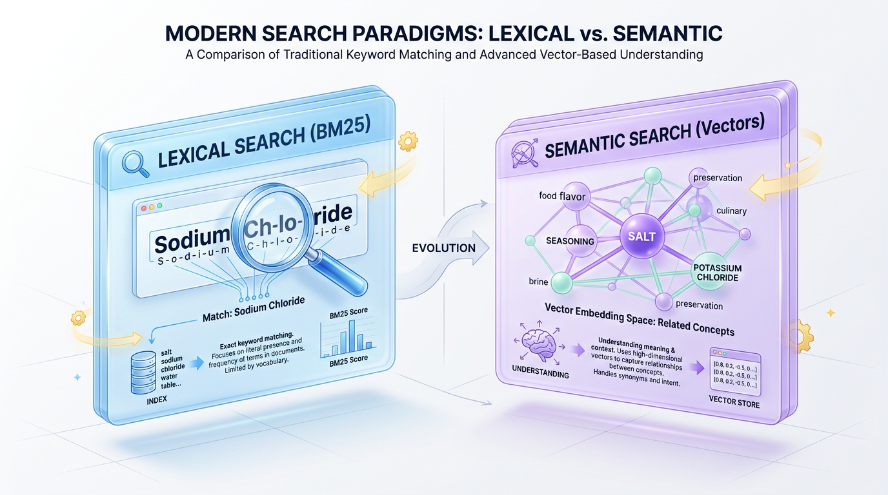
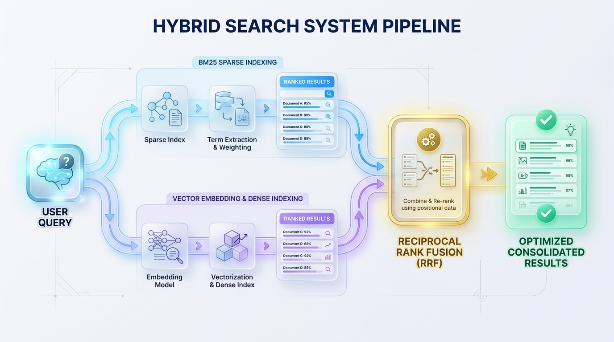

# Beyond Keywords: Mastering Hybrid Search with BM25 & Vectors

*Stop choosing between keyword precision and semantic recall. Learn to combine BM25 and vector search to build superior, context-aware retrieval systems for any modern application, from RAG to e-commerce.*


## Why Your Search Fails: The Keyword vs. Semantics Dilemma

*Modern search engines fail because they rely on a single approach. Building a robust system requires combining the precision of keyword matching with the contextual awareness of semantic understanding.*

Have you ever searched an e-commerce store for a specific product serial number, only to receive unrelated "recommended" items? Or perhaps you searched a knowledge base for a conceptual answer but got zero results because you didn't use the author's exact terminology?



*Figure 1: The Search Spectrum - Exact Keyword Precision vs. Semantic Contextual Awareness.*


These frustrating experiences highlight a fundamental flaw in many search systems. To build a system that truly understands user intent, we must first dissect the critical divide between keyword matching and semantic understanding.


## The Chef’s Dilemma: Sodium Chloride vs. Salt

To understand why search fails, imagine a world-class chef preparing a complex recipe. If the recipe calls for **"sodium chloride,"** a literal-minded assistant will search the pantry and stop, unable to retrieve the container labeled **"salt"** because the letters don't match.

Conversely, if the chef asks for "something to make this dish taste savory," a creative assistant might bring soy sauce, seaweed, or MSG—entirely missing the simple table salt the chef actually needed.

> 💡 **Tip:** A truly skilled search system needs both abilities: the absolute precision to find "sodium chloride" when specified and the conceptual intuition to understand that "salt" matches the user's culinary intent.

This brings us to the two foundational pillars of modern information retrieval: sparse and dense search.


## The Two Worlds of Retrieval

Keyword and semantic search process information through entirely different mathematical lenses, which is why they generate vastly different results. Relying on only one creates a massive retrieval gap.

### BM25: The Precision-Focused Keyword Specialist

Traditional search relies heavily on **BM25 (Best Matching 25)**, a sparse retrieval algorithm. An evolution of TF-IDF, BM25 scores documents based on how often search terms appear relative to the rest of the document collection. It treats text as a **sparse vector**, where every unique word in your vocabulary represents a dimension.

```python
# Conceptual representation of a Sparse Vector (BM25)
# Only the exact words present in the query get a non-zero score.
document_vocabulary = ["salt", "sodium", "chloride", "pepper", "water"]
query = "sodium chloride"

# Representation: [salt, sodium, chloride, pepper, water]
sparse_vector = [0.0, 1.45, 1.82, 0.0, 0.0] 
```

BM25 is unmatched at finding exact matches. It instantly retrieves unique product SKUs, rare medical jargon, and precise serial numbers. However, it's completely blind to synonyms and intent. If a user searches for "automobile repairs" and your document contains "car mechanics," BM25 will score that document as a zero match.

### Vector Search: The Context-Aware Semantic Reader

Modern AI-driven search solves this vocabulary mismatch using **Vector Search** (dense retrieval). Instead of matching literal strings, deep learning models convert words or documents into **dense vectors**, also known as embeddings. These embeddings map human language into a high-dimensional space where mathematically close vectors represent semantically similar concepts.

```python
# Conceptual representation of a Dense Vector (Semantic Embedding)
# Every dimension is a continuous float representing abstract concepts.
dense_vector = [-0.124, 0.892, 0.311, -0.450, 0.089, 0.712] # ... up to 1536 dimensions
```

Vector search excels at understanding human intent, synonyms, and multilingual concepts. Searching for "how to fix a flat tire" will successfully return articles about "repairing punctured wheels," even if the word "flat" never appears. Its weakness is a lack of literal precision, sometimes leading it to miss exact matches like serial numbers or specific names.


## Hybrid Search: Uniting Precision and Context

To build a search engine that understands both literal keywords and abstract human intent, we cannot rely on a single retrieval mechanism. Instead, we must construct a dual-channel architecture that processes queries through two separate pipelines, merging their outputs into a single, highly relevant list of results.

Imagine you are looking for a book in a massive library. You employ two assistants: one looks for books with your exact phrase on the cover (Sparse Search), while the other understands the vibe of your request and finds books on the same topic (Dense Search). By combining their findings, you get the absolute best selection.



*Figure 2: Architecture of a Dual-Track Hybrid Search System with Reciprocal Rank Fusion (RRF).*


### Dual-Path Indexing and Querying

At the core of a production-grade hybrid system lies a dual-indexing process. When a document is ingested, it is simultaneously routed down two distinct paths.

```text
                        ┌─────────────────────────┐
                        │    Incoming Document    │
                        └────────────┬────────────┘
                                     │
                     ┌───────────────┴───────────────┐
                     ▼                               ▼
          [ Sparse Index Path ]            [ Dense Index Path ]
                     │                               │
            Text Preprocessing              Embedding Generation
         (Tokenization, Stemming)          (Transformer/Bi-Encoder)
                     │                               │
                     ▼                               ▼
           BM25 Inverted Index               Vector Database
```

When a user submits a query, the system executes both strategies in parallel. Each engine returns its own list of top matches, which are then fused into a unified ranking.

### Reciprocal Rank Fusion: The Great Unifier

Combining the results presents a major hurdle: their relevance scores are fundamentally incompatible. BM25 scores are unbounded, while vector search scores are typically bounded (e.g., -1 to 1 for cosine similarity).

> ⚠️ **Common Mistake:** Never add or average raw BM25 and vector scores. Because their scales are radically different, the larger BM25 score will completely drown out your semantic vector scores, rendering your vector database useless.

To solve this, we use **Reciprocal Rank Fusion (RRF)**, an elegant algorithm that ignores raw scores and focuses strictly on the *rank* of the documents within each list.

The RRF formula computes a unified score for each document `d`:
`RRF Score(d) = Σ (1 / (k + rank(d)))`

Here, `rank(d)` is the 1-based position of the document in a result list, and `k` is a constant (typically 60) that ensures highly ranked documents are rewarded without overwhelming the final score. Because it relies on relative positioning, RRF is exceptionally robust and requires no complex score normalization.


## Code Deep Dive: Implementing Hybrid Search in Python

Let's build a hybrid search system from scratch to see how these two distinct mathematical spaces—lexical frequencies and high-dimensional vectors—converge. This Python implementation runs two search tracks in parallel and merges the results using RRF.

```python
import numpy as np
from rank_bm25 import BM25Okapi
from sentence_transformers import SentenceTransformer, util

class HybridSearcher:
    """A hybrid search system combining BM25 (sparse) and semantic (dense) retrieval."""
    
    def __init__(self, corpus: list[str]):
        self.corpus = corpus
        
        # 1. Initialize Sparse Index (BM25)
        self.tokenized_corpus = [doc.lower().split(" ") for doc in corpus]
        self.bm25 = BM25Okapi(self.tokenized_corpus)
        
        # 2. Initialize Dense Index (Vector Search)
        self.encoder = SentenceTransformer("all-MiniLM-L6-v2")
        self.doc_embeddings = self.encoder.encode(corpus, convert_to_tensor=True)

    def search(self, query: str, top_n: int = 5, k: int = 60) -> list[tuple[int, float]]:
        """Performs a full hybrid search by running sparse and dense queries in parallel and fusing the results."""
        
        # Perform sparse and dense search
        sparse_ranks = self._search_sparse(query, top_n)
        dense_ranks = self._search_dense(query, top_n)
        
        # Fuse the results using Reciprocal Rank Fusion
        return self._rrf(sparse_ranks, dense_ranks, k)

    def _search_sparse(self, query: str, top_n: int) -> list[tuple[int, float]]:
        """Performs BM25 keyword search."""
        tokenized_query = query.lower().split(" ")
        scores = self.bm25.get_scores(tokenized_query)
        ranked_indices = np.argsort(scores)[::-1][:top_n]
        return [(int(idx), float(scores[idx])) for idx in ranked_indices if scores[idx] > 0]

    def _search_dense(self, query: str, top_n: int) -> list[tuple[int, float]]:
        """Performs semantic vector search using Cosine Similarity."""
        query_embedding = self.encoder.encode(query, convert_to_tensor=True)
        cos_scores = util.cos_sim(query_embedding, self.doc_embeddings)[0]
        scores = cos_scores.cpu().numpy()
        ranked_indices = np.argsort(scores)[::-1][:top_n]
        return [(int(idx), float(scores[idx])) for idx in ranked_indices]

    def _rrf(self, sparse_results: list[tuple[int, float]], dense_results: list[tuple[int, float]], k: int) -> list[tuple[int, float]]:
        """Combines rankings using Reciprocal Rank Fusion (RRF)."""
        rrf_scores = {}
        
        def add_ranks(results):
            for rank, (doc_id, _) in enumerate(results, start=1):
                if doc_id not in rrf_scores:
                    rrf_scores[doc_id] = 0.0
                rrf_scores[doc_id] += 1.0 / (k + rank)

        add_ranks(sparse_results)
        add_ranks(dense_results)
        
        sorted_docs = sorted(rrf_scores.items(), key=lambda item: item[1], reverse=True)
        return sorted_docs

# --- Execution & Verification ---
if __name__ == "__main__":
    documents = [
        "How to build a web crawler using Python and Beautiful Soup.", # Doc 0
        "A guide to scraping modern websites and extracting elements.", # Doc 1
        "Python programming basics, variables, loops, and concepts.", # Doc 2
        "Deep learning and neural networks using PyTorch." # Doc 3
    ]
    
    search_engine = HybridSearcher(documents)
    query = "Python web scraping tool"
    
    hybrid_ranks = search_engine.search(query, top_n=4)
    
    print(f"Query: '{query}'\n")
    print("--- Hybrid Search Results (RRF Merge) ---")
    for rank, (idx, rrf_score) in enumerate(hybrid_ranks, 1):
        print(f"Rank {rank}: [Doc {idx}] (Score: {rrf_score:.6f}) -> '{documents[idx]}'")
```

### Analyzing the Output

The code demonstrates why hybrid search outperforms its individual components. For the query "Python web scraping tool," a pure BM25 search would rank Document 2 ("Python programming basics...") highly just for the word "Python," ignoring the "scraping" intent. A pure vector search would correctly identify Documents 0 and 1 as semantically relevant.

RRF combines these signals. Document 0 gets the top spot because both systems ranked it highly. Crucially, Document 1 ("A guide to scraping...") rises to the second position. The RRF algorithm recognizes that while sparse search missed it, its high semantic relevance makes it a far better result than the basic Python overview.

```text
Query: 'Python web scraping tool'

--- Hybrid Search Results (RRF Merge) ---
Rank 1: [Doc 0] (Score: 0.032787) -> 'How to build a web crawler using Python and Beautiful Soup.'
Rank 2: [Doc 1] (Score: 0.016393) -> 'A guide to scraping modern websites and extracting elements.'
Rank 3: [Doc 2] (Score: 0.016129) -> 'Python programming basics, variables, loops, and concepts.'
Rank 4: [Doc 3] (Score: 0.015625) -> 'Deep learning and neural networks using PyTorch.'
```

> ✅ **Best Practice:** Hybrid search acts as a self-correcting system. The sparse component ensures exact terms are never ignored, while the dense component salvages conceptual matches even when different vocabularies are used.


## Choosing the Right Retrieval Strategy

Building a modern search system isn't about finding a single "best" algorithm. It's about matching your retrieval strategy to your user's intent. The following matrix outlines when to leverage specific techniques based on your engineering objectives.

| Goal                                                | Recommended Technique   | Reason                                                          |
| :-------------------------------------------------- | :---------------------- | :-------------------------------------------------------------- |
| **Locate exact identifiers** (SKUs, error codes)    | **BM25 (Sparse)**       | Unbeatable precision for known-item searches.                   |
| **Understand natural language questions**           | **Vector Search (Dense)** | Captures underlying user intent, synonyms, and context.         |
| **Build a robust, general-purpose search**          | **Hybrid Search (RRF)** | Melds exact matching with conceptual understanding for max relevance. |
| **Rank a small, pre-filtered set of documents**     | **Cross-Encoder**       | Highest accuracy but too slow for initial retrieval; used for re-ranking. |
| **Ensure zero-day threat detection in logs**        | **Hybrid Search (RRF)** | Instantly connects known indicators with anomalous behavior patterns. |
| **Power a Retrieval-Augmented Generation (RAG) app**| **Hybrid Search (RRF)** | Provides the LLM with both factually precise and contextually rich information. |


## Production Guardrails and Best Practices

Scaling a hybrid system introduces subtle architectural traps that can quietly degrade search quality. Here are a few key practices to keep in mind.

### ✅ Use Managed Services for Simplicity

Avoid building, hosting, and coordinating separate lexical and vector databases yourself. Synchronizing data in real-time across an Elasticsearch cluster and a standalone vector database creates immense operational overhead.

> 🚀 **Production Tip:** Leverage modern managed databases that support native hybrid search. Platforms like Pinecone, Weaviate, and MongoDB Atlas handle the complex query routing, normalization, and RRF calculations under a single API, letting you focus on product logic.

### ✅ Evaluate, Evaluate, Evaluate

You cannot optimize what you do not measure. Before deploying, establish a **golden dataset**—a static evaluation set containing representative user queries mapped to the "correct" document IDs.

Track industry-standard metrics like **Recall@K** (how many relevant documents are found) and **NDCG** (ranking quality) to prove that your hybrid system objectively outperforms single-method approaches. Only deploy changes when these metrics show a statistically significant lift.


## Final Thoughts

Hybrid search has transitioned from an experimental pattern to the industry standard for state-of-the-art information retrieval. For years, architects debated whether keyword-based systems like BM25 or semantic vector search would win. Today, the consensus is clear: the most resilient systems don't choose—they execute both in parallel. By merging the precision of keyword matching with the contextual depth of vector embeddings, we build systems that are deeply resilient to query ambiguity and inherently aligned with human intent.

The elegance of hybrid search lies in its simple, robust architecture. Queries are dispatched simultaneously to sparse and dense retrievers, and the results are deterministically merged using Reciprocal Rank Fusion. This approach eliminates the classic trade-off between precision and recall, ensuring users find exactly what they're looking for, even when they don't know the exact words to use. As you build your next search or RAG application, don't force your system to choose between vocabulary and semantics. Start with a hybrid foundation to deliver the most accurate, intuitive, and powerful results possible.