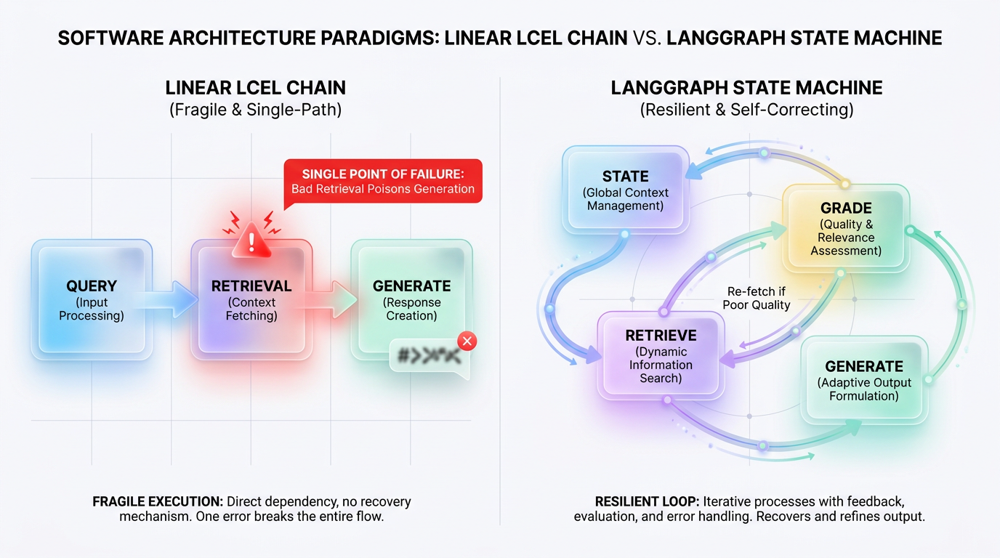
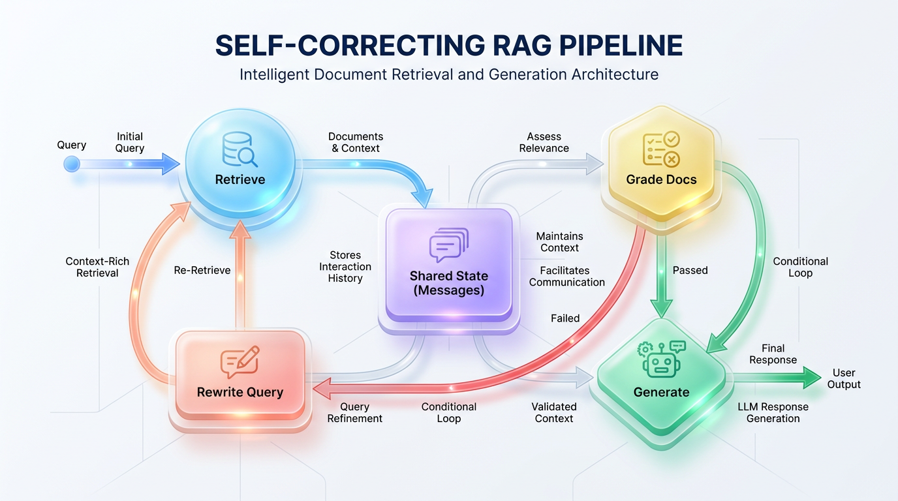

# From Prototype to Production: Building RAG with LangGraph

*Go beyond simple chains. Build robust, stateful, and adaptive retrieval agents using LangGraph's cyclical graph architecture for scalable, production-ready AI applications.*


## Beyond Linear RAG: Architecting Resilient LLM Applications with LangGraph

*Linear chains are fast for prototypes but fail in production. Learn to build robust, self-correcting RAG systems using LangGraph's stateful, cyclic graphs to handle real-world complexity and eliminate hallucinations.*

Most developers begin their Retrieval-Augmented Generation (RAG) journey with a simple, linear pipeline. They orchestrate a clean sequence: ingest a user query, retrieve relevant documents, stuff those documents into a prompt, and generate an answer. This approach works beautifully in a controlled prototype but quickly crumbles under the chaos of production data.



*Figure 1: The Evolution of RAG — From Brittle Linear Chains to Resilient, State-Driven Loop Architectures*


In the real world, standard RAG pipelines are incredibly brittle. If your vector database returns irrelevant documents or noisy distractors, the entire pipeline is poisoned. The Language Model (LLM) is forced to generate an answer based on bad context, leading to inevitable hallucinations with no way to self-correct.

To build reliable RAG systems, we must abandon rigid, one-way pipelines and embrace state machines. **LangGraph** is a framework designed specifically for building multi-agent and stateful applications using cyclic graphs, giving your system the power to reason, correct, and retry.


## The Assembly Line vs. The Adaptive Workshop

To understand why linear chains fail, contrast a rigid factory assembly line with an adaptive artisan workshop.

*   **The Assembly Line (Linear Chains):** Picture a conveyor belt where a product moves strictly in one direction. If a robotic arm installs a cracked screen at Step 1, the conveyor belt keeps moving. By the end of the line, you ship a broken device because no step has the authority to stop, evaluate, and send the product back for repairs.
*   **The Adaptive Workshop (LangGraph State Machine):** Now, picture a master craftsman. They inspect the raw materials before assembly. If a wooden plank is warped, they reject it and fetch a better one. They use different tools as needed and ask for feedback before polishing the final product.

This adaptive workshop is exactly what we build when we transition from simple linear chains to stateful, cyclic graphs. By structuring your RAG pipeline as a state machine, you unlock cycles, loops, and conditional logic.


## Anatomy of a LangGraph Agent: State, Nodes, and Edges

Instead of treating your application as a single execution chain, LangGraph models your workflow as a collection of **Nodes** (actions), **Edges** (decisions), and a shared, mutable **State**.

### 1. State: The Shared Source of Truth

At the core of every LangGraph agent is the **State**. It's the shared memory or "patient chart" of your application, passed continuously from one step to the next. Every node reads from the state, performs its job, and writes its results back, ensuring that all decisions are grounded in the historical context of the run. In LangGraph, you define this state using a `TypedDict` or a Pydantic model.

### 2. Nodes: The Engines of Action

If the state is the shared memory, **Nodes** are the specialized workers that act upon it. Each node is a Python function or runnable object that accepts the current state as its sole argument and returns a dictionary containing the updated state fields. Nodes perform discrete jobs, like retrieving documents, grading their relevance, or calling an LLM.

### 3. Edges: The Logic Gates of Control Flow

If nodes are the actors, **Edges** are the script. They define how control moves from one node to another, turning isolated functions into a cohesive system. LangGraph supports two primary types:

*   **Static Edges:** These establish a direct, unconditional path from Node A to Node B.
*   **Conditional Edges:** These use a routing function to inspect the current state and dynamically return the name of the next node to execute. This is how you build self-correction loops.



*Figure 2: Architectural blueprint of a Self-Correcting RAG pipeline with conditional edges and state updates*


## Building a Self-Correcting RAG Agent

Let's build a RAG agent that embodies the "adaptive workshop" principle. The agent will retrieve documents, grade their relevance, and decide whether to generate an answer or rewrite the query and try again. This self-correction loop is the key to mitigating hallucinations.

The control flow follows a cycle: if retrieved documents are graded as irrelevant, the graph reroutes execution to a query-reformulation node instead of proceeding to generate a faulty answer.

```ascii
                  ┌──────────────────┐
                  │    User Query    │
                  └────────┬─────────┘
                           │
                           ▼
                  ┌──────────────────┐
                  │  Retrieve Node   │◄─────────────────┐
                  └────────┬─────────┘                  │
                           │                            │
                           ▼                            │
                  ┌──────────────────┐                  │
                  │ Grade Docs Node  │                  │
                  └────────┬─────────┘                  │
                           │                            │
         [ Irrelevant ] ───┤                            ├── [ Relevant ]
                           │                            │
                           ▼                            ▼
                  ┌──────────────────┐        ┌──────────────────┐
                  │ Reformulate Query│        │  Generate Node   │
                  └──────────────────┘        └────────┬─────────┘
                                                       │
                                                       ▼
                                              ┌──────────────────┐
                                              │  Final Response  │
                                              └──────────────────┘
```

Here is how you can implement this stateful, cyclic graph using LangGraph.

```python
from typing import List, Dict, Any
from typing_extensions import TypedDict
from langgraph.graph import StateGraph, END

# 1. Define the shared state object
class AgentState(TypedDict):
    query: str
    documents: List[str]
    generation: str
    relevance: str  # Router flag: "relevant" or "irrelevant"
    loop_count: int # Prevents infinite loops

# 2. Define the nodes (the "workers")
def retrieve_docs(state: AgentState) -> Dict[str, Any]:
    print("--- RETRIEVING DOCUMENTS ---")
    # Simulated vector search based on state["query"]
    retrieved_docs = ["Document: Deep learning architectures benefit from residual connections."]
    return {"documents": retrieved_docs, "loop_count": state.get("loop_count", 0) + 1}

def grade_documents(state: AgentState) -> Dict[str, Any]:
    print("--- GRADING DOCUMENTS ---")
    # Simulate an LLM grader evaluating relevance
    has_keywords = any("learning" in doc.lower() for doc in state["documents"])
    return {"relevance": "relevant" if has_keywords else "irrelevant"}

def reformulate_query(state: AgentState) -> Dict[str, Any]:
    print("--- RE-FORMULATING QUERY ---")
    # Simulate an LLM refining the search query
    better_query = f"Optimized search for: {state['query']} architecture"
    return {"query": better_query}

def generate_answer(state: AgentState) -> Dict[str, Any]:
    print("--- GENERATING ANSWER ---")
    docs = ", ".join(state["documents"])
    answer = f"Based on the retrieved context, we resolve the query: {docs}"
    return {"generation": answer}

# 3. Define the router (the conditional edge)
def route_after_grading(state: AgentState) -> str:
    # If we've looped too many times, force generation to avoid getting stuck
    if state.get("loop_count", 0) >= 2:
        print("--- LOOP LIMIT REACHED: FORCING GENERATION ---")
        return "generate"
    
    if state["relevance"] == "relevant":
        return "generate"
    else:
        return "reformulate"

# 4. Build the graph
workflow = StateGraph(AgentState)

# Add nodes
workflow.add_node("retrieve", retrieve_docs)
workflow.add_node("grade", grade_documents)
workflow.add_node("reformulate", reformulate_query)
workflow.add_node("generate", generate_answer)

# Set entry point and static edges
workflow.set_entry_point("retrieve")
workflow.add_edge("retrieve", "grade")
workflow.add_edge("reformulate", "retrieve") # This creates the self-correction loop
workflow.add_edge("generate", END)

# Add the conditional edge
workflow.add_conditional_edges(
    "grade",
    route_after_grading,
    {
        "generate": "generate",
        "reformulate": "reformulate"
    }
)

# Compile the graph into a runnable application
app = workflow.compile()
```

> ✅ **Best Practice:** Self-correction trades immediate speed for guaranteed quality. It shields end-users from hallucinations by spending extra compute cycles to verify information upfront.


## Production Guardrails and Operational Tips

While agentic loops provide flexibility, they also introduce challenges like non-deterministic paths and the risk of infinite loops. To run these systems reliably, you must build operational guardrails directly into your graph.

### Observability with LangSmith

When your RAG system uses conditional loops, you cannot treat it like a black-box API. You need a detailed, step-by-step log of every node execution, state change, and model prompt to debug production anomalies.

> 🚀 **Production Tip:** Integrate LangSmith from day one. It acts as a real-time GPS and flight recorder for every state transition in your graph, helping you trace token costs, pinpoint latency bottlenecks, and debug incorrect routing decisions.

### Scalable State Management

By default, LangGraph keeps the state in ephemeral memory, which fails at scale. To handle concurrent users across multiple server instances, your backend must be stateless.

> 🚀 **Production Tip:** Externalize your graph's state to a durable persistence layer like Postgres or Redis. LangGraph provides built-in `PostgresSaver` and `RedisSaver` checkpointers that allow any server instance to seamlessly resume a graph session without data loss.

### Resilience and Error Handling

In production, external tools fail, APIs time out, and LLMs return malformed outputs. Your graph must be resilient to these issues.

> ⚠️ **Common Mistake:** Failing to implement loop counters. An agent can easily get stuck in an endless cycle of retries, burning tokens and increasing latency. Always track execution counts in your state and use a conditional edge to force a fallback path after a set number of attempts.

The code example below shows a production-ready node with explicit error handling and loop protection.

```python
# A robust node function with built-in resilience
def retrieve_with_guardrails(state: AgentState) -> dict:
    current_loops = state.get("loop_count", 0)
    
    # Guardrail: Prevent infinite loops
    if current_loops > 3:
      return { "error_message": "Loop limit exceeded." }

    try:
        # Simulate a retrieval call that might fail
        if not state["query"]:
            raise ValueError("Query cannot be empty.")
        
        # Actual retrieval logic...
        retrieved_docs = ["Document snippet 1", "Document snippet 2"]
        return {
            "documents": retrieved_docs, 
            "loop_count": current_loops + 1,
            "error_message": ""
        }
    except Exception as e:
        # Capture the error to route to a fallback path
        return {
            "error_message": str(e),
            "loop_count": current_loops + 1
        }
```


## Choosing the Right Architecture

Not every problem requires a complex graph. Choosing the wrong path too early leads to over-engineering, while choosing it too late results in fragile, unmaintainable prompt spaghetti.

| Goal | Recommended Technique | Reason |
| :--- | :--- | :--- |
| **Rapid Prototyping & Simple Q&A** | Linear LCEL Chain | Fastest path to a working demo. Ideal for single-shot, stateless tasks where retrieval is reliable and latency is critical. |
| **Building a Conversational Agent** | LangGraph with State Reducers | Natively handles chat history (`add_messages`) and state, enabling complex, multi-turn dialogue and long-term memory. |
| **High-Accuracy, Self-Correcting RAG** | LangGraph with Conditional Edges | Allows for cyclical logic like retrieving, grading, and re-querying to ensure high-quality context before generation. |
| **Multi-Tool/API Orchestration** | LangGraph with `ToolNode` | Manages complex workflows where the model must decide which tool to use next based on prior results and available inputs. |
| **Ensuring High Availability** | LangGraph with a `RedisSaver` | Keeps state in a durable database, letting stateless application containers scale out horizontally without losing user session data. |

> 💡 **Tip:** Don't use a graph where a simple chain will do. If your data flow never needs to look backward, ask a question, or validate its own work, a standard linear chain will be faster to deploy, easier to debug, and run with lower latency.


## Final Thoughts

LangGraph represents a fundamental paradigm shift in how we architect LLM-powered applications. It’s not just another utility library; it’s a mental model for building resilient, autonomous systems by treating LLMs as governable runtime engines within a structured environment. The transition from linear chains to stateful graphs is a transition from hope to engineering. By defining explicit states, nodes, and conditional edges, you regain deterministic control over non-deterministic LLM behavior.

When adopting this framework, start small. Implement a basic Adaptive RAG loop: retrieve documents, grade their relevance with a router, and only generate an answer if the quality threshold is met. As your production telemetry reveals edge cases, you can progressively add self-correction nodes and more sophisticated routing paths.

By embracing a graph-based architecture, you are establishing a standardized, stateful foundation designed for the future of agentic AI. As models evolve, your structured routing, state management, and error-recovery patterns will remain the bedrock of your enterprise intelligence systems.