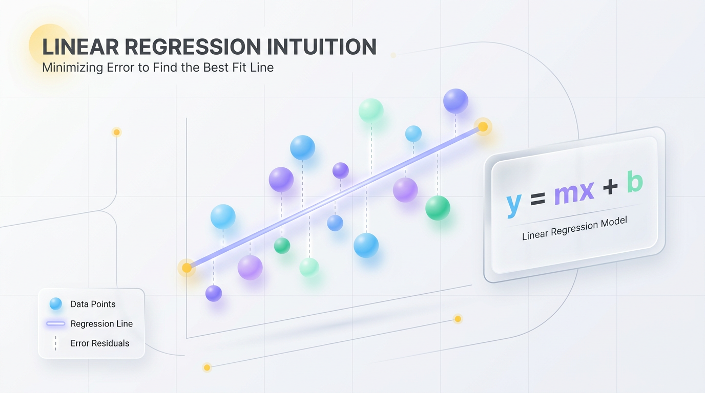
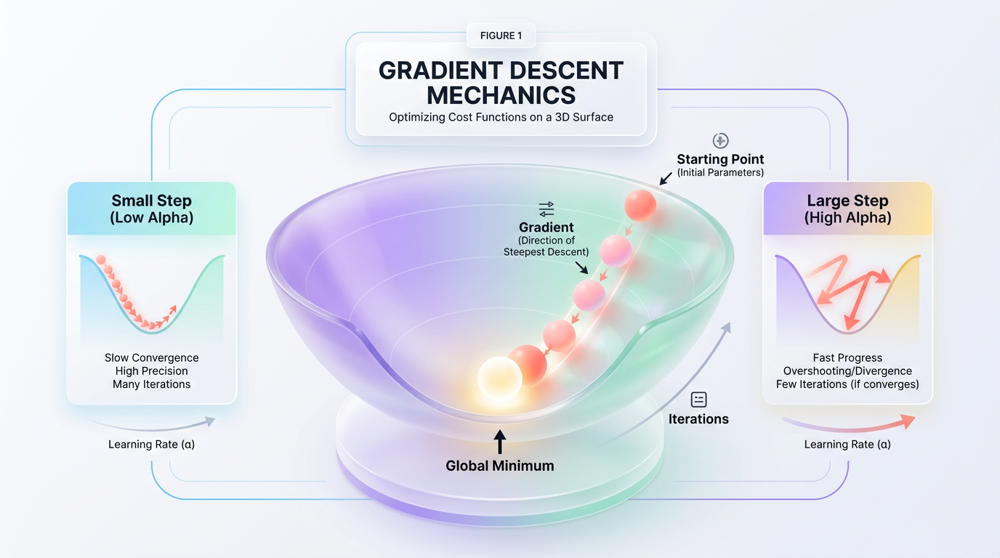
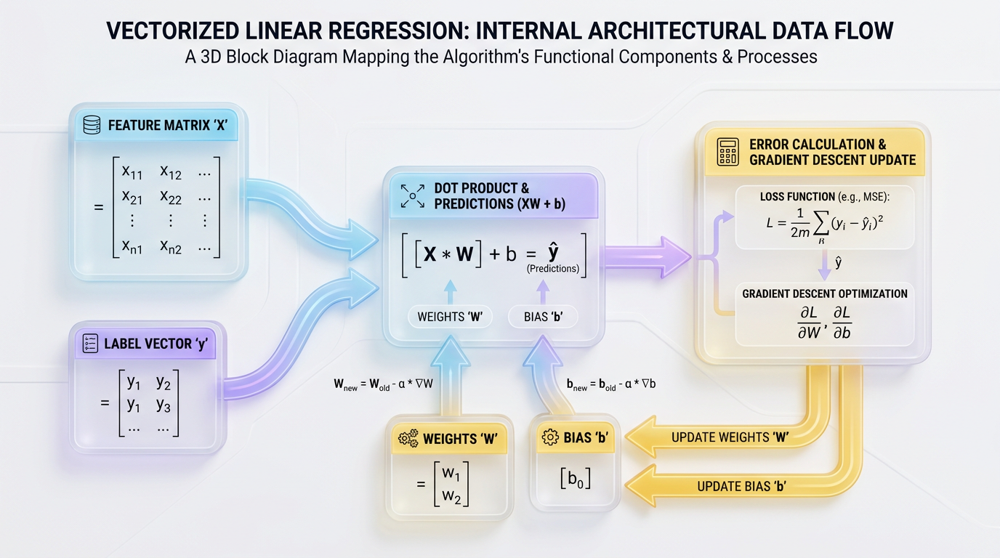

# Python Linear Regression: Build Your First Model From Scratch

*Go beyond library calls. Understand the core mechanics of Linear Regression by building a functional model from the ground up using only Python and NumPy. Gain deep intuition into how machine learning works.*


## Linear Regression From Scratch: A Code-First Guide to the Math and Mechanics

*Go beyond library calls by building your own regression engine. This guide breaks down the core math, vectorized Python code, and production pitfalls of the most foundational algorithm in machine learning.*


## The Intuition: Finding the Best-Fit Line

Imagine you are looking at home prices in a neighborhood. You quickly notice an obvious pattern: as the square footage of a house increases, its price generally goes up. You don’t need a complex neural network to see this relationship; your brain intuitively draws an invisible straight line through the data points to summarize the trend.

This simple act of fitting a line to data is the foundation of **Linear Regression**. At its core, the algorithm seeks a single, optimal straight line that best describes the relationship between your input features and your target predictions. Finding this line is like stretching a string through a cloud of data points—your goal is to position it so it rests as close to the center of the entire cluster as possible.



*Figure 1: Conceptualizing the best-fit line through a scatter of multi-colored data points, minimizing total error.*


### The Hypothesis Function

In machine learning, we formalize this line with a simple mathematical formula called the **hypothesis function**:

`y = m * x + b`

Let's translate this to our housing example:

*   **`y` (Dependent Variable):** The target value we want to predict, like the house price.
*   **`x` (Independent Variable):** The input feature we use for prediction, such as the square footage.
*   **`m` (Slope/Weight):** The steepness of the line. It tells us how much the price changes for every one-unit increase in square footage.
*   **`b` (Y-intercept/Bias):** The starting point of the line, representing the baseline house price if the square footage were zero.

The entire goal of training a linear regression model is to discover the optimal values for `m` and `b` that produce the most accurate line.

### Measuring Error with Residuals

To evaluate our line's performance, we measure the gap between its predictions and reality. The vertical distance between an actual data point and our predicted line is called the **residual**, or error.

```text
Price ($)
  ^
  |                                * Actual Data (y)
  |                              . |
  |                            .   | <--- Residual (Error)
  |     *                    .     |
  |      .                 .       v
  |        .             * (Prediction: y = mx + b)
  |          .         .
  |            .     .
  |              *
  |
  +---------------------------------------------> Size (Sq Ft)
```

If we can make these vertical distances as small as possible across all data points, we have successfully trained our model.


## The Learning Engine: Cost Functions and Gradient Descent

To make a machine "learn," we must first give it a way to measure its own mistakes. We can then use an optimization algorithm to systematically update the model's parameters to minimize that error.

### Quantifying Error: The Mean Squared Error (MSE) Cost Function

The **Mean Squared Error (MSE)** is a cost function that quantifies how far our predicted line is from the actual data. It works by calculating the error for each data point, squaring it, and then finding the average of all squared errors.

`MSE = (1 / N) * sum( (y_actual - y_predicted)^2 )`



*Figure 2: The visual journey of Gradient Descent down a parabolic error surface to find the optimal minimum.*


We square the errors for two key reasons:
1.  **Removes Negatives:** Squaring ensures that positive and negative errors don't cancel each other out.
2.  **Penalizes Large Errors:** Squaring gives disproportionately more weight to large errors, forcing the model to fix significant deviations.

> 💡 **Tip:** The cost function acts as a mathematical compass. It outputs a single number representing our model's total error; the lower the number, the better the fit.

### Finding the Minimum: The Gradient Descent Algorithm

Now that we can measure our error, how do we reduce it? We use an optimization algorithm called **Gradient Descent**.

Imagine you are a hiker lost in a thick fog at the top of a mountain basin. You can't see the valley floor (the point of minimum error), but you can feel the slope of the ground beneath your feet. To find your way down, you take small, deliberate steps in the direction where the ground slopes downward most steeply.

```text
      Cost
       \
        \  <- High Error (Start)
         \
          \__
             \
              \__ <- Iterative Steps Downward
                 \
                  \______ <- Minimum Error (Optimal Line)
```

In machine learning, the mountain is our cost surface. By calculating the slope of the cost surface at our current position, Gradient Descent tells us whether to increase or decrease our parameters (`m` and `b`) to move closer to the lowest possible error. The size of each step is controlled by a hyperparameter called the **learning rate** (alpha).

> ⚠️ **Common Mistake:** Choosing the wrong learning rate is a delicate balance. If it's too small, training will be incredibly slow. If it's too large, the algorithm will overshoot the minimum and fail to converge, causing the error to increase.

### The Mathematics of a Single Step

To find the direction of the steepest slope, we use calculus to compute the **partial derivatives** of the MSE cost function with respect to our two parameters: slope (`m`) and bias (`b`). These derivatives tell us how much the total error changes with a tiny nudge to either parameter.

*   `dm (Derivative for slope m) = (-2 / N) * sum( x * (y_actual - y_predicted) )`
*   `db (Derivative for bias b) = (-2 / N) * sum( y_actual - y_predicted )`

Once we have these gradients (`dm` and `db`), we update our parameters by moving them in the *opposite* direction of the gradient, scaled by the learning rate (`alpha`):

*   `m = m - (alpha * dm)`
*   `b = b - (alpha * db)`

By repeating this update cycle hundreds or thousands of times, our line gradually pivots and shifts until it settles at the point of minimum error.


## Implementation: Building a Regressor in Python with NumPy

Let's translate this theory into a reusable Python class. Building our own estimator from scratch strips away the "magic" of high-level libraries and exposes the elegant engine underneath. We'll use **NumPy**, Python's core scientific computing library, to perform fast, vectorized operations.

### The Power of Vectorization

In native Python, calculating the error for a million data points requires a `for` loop that iterates through each point one by one. This creates a massive performance bottleneck. **Vectorization** solves this by mapping our mathematical equations directly to optimized C code under the hood, allowing us to perform operations on entire arrays at once.

Instead of looping, we compute the gradients across all `N` samples simultaneously:



*Figure 3: High-level architectural data flow within the vectorized fit method of our custom NumPy regressor.*

`y_pred = (m * X) + b`
`dj_dm = (-2 / N) * sum(X * (y - y_pred))`
`dj_db = (-2 / N) * sum(y - y_pred)`

This approach is dramatically faster and leads to cleaner, more readable code.

### The Complete Python Class

Here is the complete implementation of our `LinearRegressor` class. It uses vectorized NumPy operations to train the model with Gradient Descent and make predictions.

```python
import numpy as np
import matplotlib.pyplot as plt

class LinearRegressor:
    """
    A simple 1D Linear Regression model built from scratch using NumPy.
    Optimizes weights using Gradient Descent.
    """
    def __init__(self, learning_rate=0.01, epochs=1000):
        self.lr = learning_rate
        self.epochs = epochs
        self.m = 0.0  # Slope (weight)
        self.b = 0.0  # Y-intercept (bias)
        
    def fit(self, X, y):
        """
        Train the model using Gradient Descent.
        X and y must be NumPy arrays of the same length.
        """
        N = len(X)
        
        for epoch in range(self.epochs):
            # 1. Generate predictions using current weights (Vectorized)
            y_pred = (self.m * X) + self.b
            
            # 2. Compute the gradients (vectorized element-wise operations)
            dj_dm = (-2 / N) * np.sum(X * (y - y_pred))
            dj_db = (-2 / N) * np.sum(y - y_pred))
            
            # 3. Update parameters simultaneously
            self.m -= self.lr * dj_dm
            self.b -= self.lr * dj_db
            
            # Optional: Print progress
            if epoch % (self.epochs // 10) == 0:
                cost = (1 / N) * np.sum((y - y_pred) ** 2)
                print(f"Epoch {epoch:4d} | Cost: {cost:.4f} | m: {self.m:.4f} | b: {self.b:.4f}")

    def predict(self, X):
        """
        Predict target values for new input data using y = mx + b.
        """
        return (self.m * X) + self.b

# --- Verification Script ---
if __name__ == "__main__":
    # 1. Generate synthetic data with a known relationship: y = 2.5x + 5.0 + noise
    np.random.seed(42)
    X_train = np.linspace(0, 10, 100)
    true_slope = 2.5
    true_intercept = 5.0
    noise = np.random.normal(0, 2.0, size=X_train.shape)
    y_train = true_slope * X_train + true_intercept + noise

    # 2. Instantiate and train our custom model
    model = LinearRegressor(learning_rate=0.01, epochs=1500)
    model.fit(X_train, y_train)

    # 3. Print and compare the results
    print("\n--- Parameter Validation ---")
    print(f"Ground Truth Formula: y = {true_slope}x + {true_intercept}")
    print(f"Learned Formula:      y = {model.m:.4f}x + {model.b:.4f}")

    # 4. Plot the data points and the regression line
    plt.figure(figsize=(10, 6))
    plt.scatter(X_train, y_train, color='#3498db', alpha=0.7, label='Noisy Data Points')
    plt.plot(X_train, model.predict(X_train), color='#e74c3c', linewidth=3, 
             label=f'Learned Line (y = {model.m:.2f}x + {model.b:.2f})')
    plt.title('Linear Regression Model Converging on Truth', fontsize=14, fontweight='bold')
    plt.xlabel('X (Feature)', fontsize=12)
    plt.ylabel('y (Target)', fontsize=12)
    plt.legend(loc='upper left')
    plt.grid(True, linestyle='--', alpha=0.5)
    plt.show()
```

When you run this script, you'll see the learned slope and intercept are remarkably close to the ground-truth values of `2.5` and `5.0`. The red line successfully cuts through the center of the noisy data, visually confirming that our algorithm found the optimal solution.


## Real-World Applications and Interpretability

Linear regression isn't just an academic exercise; it's the mathematical workhorse behind critical business decisions. Its true power lies in its **interpretability**—unlike complex "black-box" models, regression coefficients tell leaders exactly *how much* each business driver impacts an outcome.

*   **Sales & Demand Forecasting:** Retail giants use regression to predict future sales based on marketing spend, seasonal trends, and competitor pricing. This allows for optimized inventory management, preventing both stockouts and costly overstock.

*   **Financial & Economic Analysis:** In finance, the Capital Asset Pricing Model (CAPM) uses linear regression to measure a stock's volatility relative to the market (its "Beta"). Economists use it to forecast how interest rate changes might affect GDP growth.

*   **Operational Efficiency:** Logistics companies estimate fuel consumption based on cargo weight and distance. Manufacturing plants use it for predictive maintenance, correlating machine temperature with component wear to schedule repairs before failures occur.

To handle these scenarios, we often use **Multiple Linear Regression**, which models a target using several input features:

`Y = b0 + (b1 * X1) + (b2 * X2) + ... + (bn * Xn)`

Here, each `b` coefficient represents the independent contribution of its corresponding feature `X`.

> ✅ **Best Practice:** The interpretability of regression coefficients is a key business advantage. A coefficient of `+150` for `Marketing_Spend` means that for every additional dollar spent on marketing, you can expect sales to increase by $150, holding all else constant.


## From Notebook to Production: Common Pitfalls

Moving a model from a clean notebook to a messy production environment introduces new challenges. To build resilient systems, you must guard against common pitfalls that can degrade model performance.

### Feature Scaling: The Unsung Hero of Convergence

When features exist on vastly different scales (e.g., house size in thousands of sq. ft. vs. number of bedrooms from 1-5), the cost function becomes a steep, narrow canyon. Without scaling, Gradient Descent will bounce violently between the canyon walls, dramatically slowing down convergence.

**Feature scaling** normalizes all features to a similar range (e.g., with a mean of 0 and a standard deviation of 1). This reshapes the cost function into a symmetrical bowl, allowing the algorithm to march smoothly and directly to the minimum.

> 🚀 **Production Tip:** Always fit your scaler (e.g., `StandardScaler`) on the **training data only**. Save the calculated mean and standard deviation, and use them to transform validation, test, and live inference data to prevent data leakage.

### The Assumption of Linearity: When Straight Lines Fail

Linear regression fundamentally assumes the relationship between your features and target is linear. If the underlying data follows a curve, forcing a straight line through it will result in high error and poor predictions.

If you plot your model's residuals and see a clear pattern (e.g., a U-shape), it's a sign that your data is non-linear. To fix this, you can either apply mathematical transformations (like log or square root) to your features or switch to a more complex model like **Polynomial Regression**.

### Build vs. Buy: Choosing Your Implementation Strategy

Every developer faces a classic crossroads: build from scratch or import a library like **scikit-learn**? The right choice depends entirely on your goal.

| Goal | Recommended Technique | Reason |
| :--- | :--- | :--- |
| **Deeply Understand ML Mechanics** | **Build From Scratch (NumPy)** | Forces you to internalize concepts like cost functions, gradients, and vectorization. |
| **Build a Production Application** | **Use scikit-learn** | Highly optimized, bug-tested, offers more features (e.g., regularization), and is the industry standard. |
| **Rapidly Prototype & Compare Models** | **Use scikit-learn** | A consistent API (`.fit`, `.predict`) allows for fast experimentation with many different algorithms. |

> ✅ **Best Practice:** Build from scratch to master the *theory*; use libraries to scale the *execution*. Understanding the fundamentals will make you a far better debugger, even when using high-level frameworks.


## Final Thoughts

Linear regression is far more than just a simple line-fitting tool; it's the gateway to understanding the core principles of machine learning. By building it from scratch, we transform abstract concepts like cost functions and gradient descent from textbook definitions into tangible lines of code. This journey demystifies the "black box," revealing an elegant engine driven by calculus and linear algebra. You learn that vectorization isn't just a coding trick but a fundamental technique for achieving performance at scale. This foundational knowledge is invaluable. While production systems demand the robustness of libraries like scikit-learn, the intuition gained from your own implementation equips you to diagnose, debug, and deploy any model with greater confidence. Mastering the simple straight line is the first and most critical step toward mastering the complex curves of modern AI.