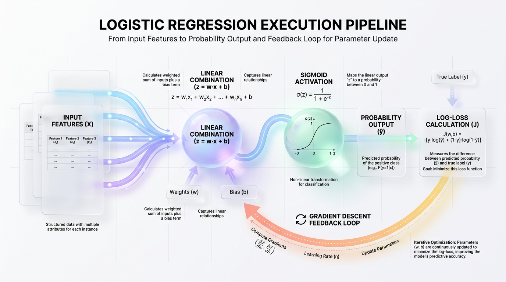
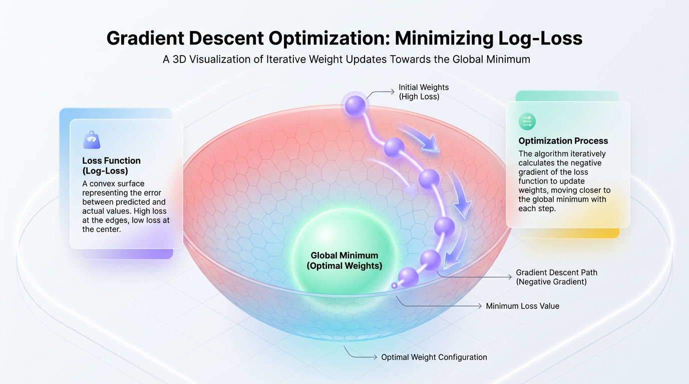

# Build Logistic Regression From Scratch with Python

*Go beyond library calls to truly master classification. This guide demystifies Logistic Regression by building it step-by-step with Python, covering the core math, code, and intuition.*


## Logistic Regression from Scratch: A Masterclass in Machine Learning Fundamentals

*Dive deep into the mathematics of classification by building a logistic regression model from the ground up. This guide bridges theory and practice, making you an architect of machine learning systems, not just a user.*

In just a single line of Python, `scikit-learn` allows you to train a highly optimized classifier: `model = LogisticRegression().fit(X, y)`. It is fast, robust, and battle-tested. Yet, relying solely on this abstraction can make you a passive consumer of machine learning rather than an active architect. To build systems that scale and debug them when they fail, you must understand the mechanics driving them under the hood.

Think of it as the difference between a microwave user and a master chef. A microwave user can heat a pre-packaged meal by pressing a few buttons, but if the meal is bland, they cannot easily fix it. A chef, however, understands how raw ingredients interact at a chemical level. They know how acid balances fat, how salt enhances sweetness, and how to rescue a broken emulsion.

Building algorithms from scratch makes you a machine learning chef. When your model fails to converge, you won’t blindly guess hyperparameters; you will know exactly how the loss landscape, learning rate, and gradients are interacting. Furthermore, logistic regression is the fundamental building block of deep learning—a single-layer neural network with a sigmoid activation is mathematically identical. By implementing it, you master the core concepts that power state-of-the-art AI.

Our goal is not to replace `scikit-learn` in your production pipeline. Instead, we are building the mental models and mathematical intuition required to use libraries with absolute confidence and precision.


## The Core Math: Sigmoid and Log-Loss

Linear regression predicts unbounded, continuous values, which works perfectly for forecasting house prices but fails when we need to predict binary outcomes like "spam" or "not spam." To classify effectively, we must constrain our model's outputs into a clean, interpretable probability between 0 and 1.

This requires a mathematical bridge that maps any real-valued number into this range.



*Figure 1: The Inner Mechanics of Logistic Regression — From Input Features to Gradient Optimization.*


### The Sigmoid Function: Mapping Infinity to Probability

The **Sigmoid Function**, also known as the logistic function, acts as this mathematical bridge. It takes any raw output from a linear model and squashes it into a tight, accessible range. Think of it as a dimmer switch for a light bulb. A standard switch is binary (on/off), but a dimmer allows for a smooth transition from fully dark (0) to fully bright (1).

The Sigmoid function is defined as: `g(z) = 1 / (1 + e^(-z))`.

Here, `z` represents the raw linear output (`z = w * x + b`), and `e` is Euler's number.
*   If `z` is a large positive number, `e^(-z)` approaches 0, and `g(z)` moves toward 1.
*   If `z` is a large negative number, `e^(-z)` becomes massive, and `g(z)` moves toward 0.
*   If `z` is exactly 0, `e^0` is 1, resulting in `g(z) = 0.5`, our decision threshold.

Here is a clean implementation in Python using NumPy:

```python
import numpy as np

def sigmoid(z):
    """
    Computes the sigmoid of z.
    
    Parameters:
    z (ndarray or float): The log-odds/logits from our linear step.
    
    Returns:
    ndarray or float: Probability scores mapped between 0 and 1.
    """
    return 1 / (1 + np.exp(-z))
```

> 🚀 Production Tip: For production code, use a numerically stable sigmoid that handles extreme positive and negative inputs separately to avoid overflow errors from `np.exp()`.

### The Log-Loss Function: Penalizing Confident Errors

In linear regression, we use Mean Squared Error (MSE) to measure error. However, combining MSE with a non-linear Sigmoid function creates a non-convex loss landscape filled with local minima. This means an optimizer like gradient descent can get trapped, failing to find the best possible solution.

| Criteria | Mean Squared Error (MSE) | Binary Cross-Entropy (Log-Loss) |
| :--- | :--- | :--- |
| **Output Shape** | Non-convex when paired with Sigmoid | Convex when paired with Sigmoid |
| **Gradient Behavior** | Leads to "vanishing gradients" on confident errors | Maintains strong gradients for bad predictions |
| **Primary Use Case** | Continuous value prediction (Regression) | Probability-based classification |

To preserve a smooth, convex error surface, we use **Binary Cross-Entropy**, or **Log-Loss**. This cost function measures the performance of a classification model whose output is a probability. The formula for a single training example is:

`Loss = - (y * log(p) + (1 - y) * log(1 - p))`

Here, `y` is the true label (0 or 1) and `p` is the predicted probability. If the true label is 1, the loss simplifies to `-log(p)`. If the model confidently predicts a low probability (e.g., `p = 0.01`), the loss (`-log(0.01)`) becomes very large. Conversely, if the true label is 0, the loss is `-log(1 - p)`, which spikes as the model confidently and incorrectly predicts a probability near 1. This structure heavily penalizes models that are confidently wrong, forcing them to make significant corrections.


## The Learning Engine: Gradient Descent

At the heart of every modern learning algorithm is a mechanism to correct errors. For logistic regression, that mechanism is **Gradient Descent**. It is the optimization engine that systematically tunes the model's weights and bias, turning random initial guesses into accurate predictions.

Imagine you are standing on a mountain in a dense fog, trying to find the lowest point in the valley. You cannot see the path, but you can feel the slope of the ground beneath your feet. By identifying the steepest downward direction and taking a small step, you can repeat this process to eventually navigate to the bottom.



*Figure 2: Visualizing Gradient Descent Optimization on a Convex Loss Surface.*


In machine learning, the mountain is our loss surface, and the valley floor is the point of minimum error. Gradient descent executes this search through a continuous feedback loop:
1.  **Initialize Parameters:** Start with random or zero-initialized weights (`w`) and bias (`b`).
2.  **Compute Predictions:** Generate probability scores using the sigmoid function.
3.  **Calculate Loss:** Measure the error using the Log-Loss function.
4.  **Find the Gradient:** Calculate the slope of the loss function with respect to each weight and the bias.
5.  **Update Parameters:** Adjust `w` and `b` in the opposite direction of the gradient to reduce the error.

### The Mathematics of the Gradient

To find the direction of steepest ascent (the gradient), we calculate the partial derivative of the Log-Loss function. This tells us how a tiny adjustment to a parameter will affect the total loss. For a dataset with `m` samples, the gradients are calculated as:

`dw = (1 / m) * X_transpose * (predictions - y)`
`db = (1 / m) * sum(predictions - y)`

The term `(predictions - y)` represents the raw prediction error. A large error generates a strong gradient, pushing the parameters more aggressively in the correct direction. A small error results in a tiny update, signaling that we are close to the optimal solution.

> 💡 Tip: The gradient's magnitude tells us how large our update step should be. The farther we are from the solution, the steeper the slope and the larger the corrective step.

### Implementing a Single Update Step

The following Python function demonstrates how we use these gradients to perform a single parameter update.

```python
import numpy as np

def update_parameters(X, y, weights, bias, learning_rate):
    """Performs a single gradient descent update step."""
    m = X.shape[0]
    
    # 1. Compute predictions (probability outputs)
    linear_output = np.dot(X, weights) + bias
    y_pred = 1 / (1 + np.exp(-linear_output))
    
    # 2. Compute the gradients
    dw = (1 / m) * np.dot(X.T, (y_pred - y))
    db = (1 / m) * np.sum(y_pred - y)
    
    # 3. Update parameters by stepping in the opposite direction of gradients
    weights -= learning_rate * dw
    bias -= learning_rate * db
    
    return weights, bias
```

### Optimizing the Descent Path

To ensure our descent is efficient, we must manage how we traverse the loss landscape. If our steps are too large, we risk overshooting the minimum; if they are too small, the journey will take forever.

| Goal | Recommended Technique | Reason |
| :--- | :--- | :--- |
| **Avoid Overshooting** | Small Learning Rate | Prevents weights from oscillating across the valley instead of reaching the bottom. |
| **Accelerate Convergence** | Learning Rate Decay | Starts with large steps and shrinks them as the model approaches the minimum. |
| **Stabilize Updates** | Feature Scaling | Rescales features to create a symmetrical loss landscape, preventing zigzagging. |


## Putting It All Together: A LogisticRegression Class in Python

Translating mathematical formulas into clean, modular code is the bridge between theoretical knowledge and production engineering. By wrapping our logic in a Python class that mimics the familiar `scikit-learn` API, we create a tool that is both educational and functional.

This object-oriented design cleanly separates our model's configuration and learned state. The hyperparameters (`learning_rate`, `n_iterations`) direct how the machine learns, while the parameters (`weights`, `bias`) represent what it has learned. Our class will be structured around three primary methods:
*   `__init__`: Initializes the model with its hyperparameters.
*   `fit`: Orchestrates the gradient descent loop to learn the model parameters.
*   `predict`: Uses the learned parameters to make predictions on new data.

> ✅ Best Practice: Scaling features before training is critical. Gradient descent updates parameters based on feature magnitudes, so disparate scales can cause the optimization path to oscillate wildly and converge slowly.

### The Complete Python Implementation

The script below contains our custom `LogisticRegressionScratch` class and a pipeline to verify its performance on a synthetic dataset.

```python
import numpy as np
from sklearn.datasets import make_classification
from sklearn.model_selection import train_test_split


class LogisticRegressionScratch:
    """A clean, numpy-only implementation of Logistic Regression."""

    def __init__(self, learning_rate: float = 0.01, n_iterations: int = 1000):
        """Initializes the model with configuration hyperparameters."""
        self.learning_rate = learning_rate
        self.n_iterations = n_iterations
        self.weights = None
        self.bias = None

    def _sigmoid(self, z: np.ndarray) -> np.ndarray:
        """Computes the sigmoid activation function with clipping."""
        z = np.clip(z, -500, 500) # Prevents overflow
        return 1 / (1 + np.exp(-z))

    def fit(self, X: np.ndarray, y: np.ndarray) -> "LogisticRegressionScratch":
        """Runs the batch gradient descent loop to optimize weights and bias."""
        n_samples, n_features = X.shape
        self.weights = np.zeros(n_features)
        self.bias = 0.0

        for _ in range(self.n_iterations):
            linear_model = np.dot(X, self.weights) + self.bias
            y_predicted = self._sigmoid(linear_model)

            dw = (1 / n_samples) * np.dot(X.T, (y_predicted - y))
            db = (1 / n_samples) * np.sum(y_predicted - y)

            self.weights -= self.learning_rate * dw
            self.bias -= self.learning_rate * db
        return self

    def predict_proba(self, X: np.ndarray) -> np.ndarray:
        """Returns the raw probability of the positive class (1)."""
        linear_model = np.dot(X, self.weights) + self.bias
        return self._sigmoid(linear_model)

    def predict(self, X: np.ndarray, threshold: float = 0.5) -> np.ndarray:
        """Classifies input data into binary labels based on a threshold."""
        probabilities = self.predict_proba(X)
        return np.where(probabilities >= threshold, 1, 0)


# --- Verification Pipeline ---
if __name__ == "__main__":
    X, y = make_classification(
        n_samples=1000, n_features=5, n_informative=3, random_state=42
    )
    X_train, X_test, y_train, y_test = train_test_split(
        X, y, test_size=0.2, random_state=42
    )

    model = LogisticRegressionScratch(learning_rate=0.1, n_iterations=1500)
    model.fit(X_train, y_train)

    predictions = model.predict(X_test)
    accuracy = np.mean(predictions == y_test) * 100

    print("Successfully trained Logistic Regression from scratch.")
    print(f"Learned Weights: {np.round(model.weights, 4)}")
    print(f"Learned Bias:    {model.bias:.4f}")
    print(f"Model Accuracy on Test Set: {accuracy:.2f}%")
```


## Production Guardrails and Best Practices

Building a model from scratch is a fantastic educational exercise. However, transitioning it into a production system requires moving beyond clean math to address real-world operational challenges like numerical instability and unscaled features.

### The Critical Role of Feature Scaling

When features exist on vastly different scales (e.g., age from 18-80 vs. annual income from 20k-2M), the loss function becomes an elongated ellipse. Gradient descent will oscillate inefficiently, requiring a tiny learning rate and thousands of extra iterations to converge.

Standardizing features to a mean of 0 and a standard deviation of 1 transforms the loss landscape into a symmetrical bowl, allowing the gradient to point directly toward the optimal weights.

```python
class StandardScalerFromScratch:
    """Standardizes features by removing the mean and scaling to unit variance."""
    def __init__(self):
        self.mean_ = None
        self.scale_ = None

    def fit(self, X):
        self.mean_ = np.mean(X, axis=0)
        self.scale_ = np.std(X, axis=0) + 1e-8 # Add epsilon for stability
        return self

    def transform(self, X):
        return (X - self.mean_) / self.scale_

    def fit_transform(self, X):
        return self.fit(X).transform(X)
```
> ⚠️ Common Mistake: Never fit your scaler on the test set. Always fit the scaler on the *training data only* and use the learned `mean_` and `scale_` to transform the training, validation, and test sets to prevent data leakage.

### The Danger of Perfect Separation

Perfect separation occurs when a feature perfectly splits the target classes (e.g., all fraudulent transactions are over $10,000 and all legitimate ones are under). In this case, the model tries to assign a probability of exactly 1.0 or 0.0. Since the sigmoid function only reaches these values at infinity, the model's weights will grow without bound, and the optimization will fail to converge.

> ✅ Best Practice: To prevent weight explosion from perfect separation, introduce L1 or L2 regularization. Regularization adds a penalty to the loss function that grows with the magnitude of the weights, forcing them to remain finite.

### Mitigating Numerical Instability

Computers have finite floating-point precision. The Log-Loss formula involves `log(p)` and `log(1 - p)`. If the model predicts a probability of exactly `1.0` or `0.0`, the system will attempt to calculate `log(0)`, which is negative infinity. This produces `NaN` (Not a Number) errors that corrupt the gradient updates.

To prevent this, you must clip predicted probabilities to a tiny distance away from 0 and 1.

```python
def robust_log_loss(y_true, y_pred, eps=1e-15):
    """Computes Log-Loss safely by clipping predicted probabilities."""
    y_pred_clipped = np.clip(y_pred, eps, 1.0 - eps)
    loss = -np.mean(y_true * np.log(y_pred_clipped) + (1.0 - y_true) * np.log(1.0 - y_pred_clipped))
    return loss
```


## Real-World Applications and Strategy

In an era dominated by massive neural networks, logistic regression remains one of the most widely deployed algorithms in production. Its speed, interpretability, and low computational cost make it invaluable for many business-critical systems.

The real power of logistic regression is not just classification but probability estimation. Instead of a binary "yes" or "no," it provides a nuanced confidence score, like a weather forecast predicting an "82% chance of rain." This allows businesses to make risk-adjusted decisions.

| Goal | Recommended Strategy | Reason |
| :--- | :--- | :--- |
| **Real-Time Fraud Detection** | Lower the decision threshold (e.g., to 0.20). | It's safer to flag a legitimate transaction for review (a false positive) than to miss a fraudulent one (a false negative). |
| **Customer Churn Prediction** | Sort by top-K probabilities. | Focus expensive retention offers only on the customers with the highest probability of churning to maximize ROI. |
| **Clinical Risk Modeling** | Convert weights to odds ratios (`e^w`). | Provides doctors with a transparent, quantifiable explanation of how each risk factor multiplies a patient's probability of illness. |

> 🚀 Production Tip: Always store the raw predicted probabilities in your production database, not just the final `0` or `1` classification. This allows product teams to adjust decision thresholds post-deployment without re-running the model.


## Key Takeaways

Building logistic regression from scratch demystifies the core components of modern machine learning. It solidifies your understanding of how a model learns by bridging the gap between abstract mathematics and concrete code. You learn firsthand that classification is not about creating rigid boundaries but about calculating the probability of an event, which is achieved by mapping a linear model's output through the **Sigmoid function**. You also learn why an error metric like Mean Squared Error fails for classification and why **Log-Loss** is essential for creating a smooth, convex optimization landscape.

The learning process itself is powered by **Gradient Descent**, an iterative algorithm that acts like a compass, guiding the model's parameters toward the point of minimum error. By calculating the gradient—the slope of the loss function—and taking steps in the opposite direction, the model systematically reduces its prediction error with each iteration. This foundational process is the engine behind even the most complex deep learning models. While a from-scratch implementation is invaluable for learning, production systems demand the reliability, speed, and safety of battle-tested libraries.

Here are the essential takeaways for any aspiring ML engineer:

*   **Build to Learn, Import to Produce:** Implement algorithms from scratch to build deep, foundational knowledge. Use optimized libraries like `scikit-learn` or `statsmodels` for robust, scalable, and maintainable production applications.
*   **Probability is Power:** Logistic regression's primary output is a probability, not a class. This continuous score is often more valuable for business decisions than a binary label, enabling risk-adjusted strategies like custom thresholding.
*   **Data Preparation is Critical:** Real-world data is messy. Neglecting to scale features, handle numerical instability, or apply regularization will cause even a theoretically perfect model to fail in production.
*   **The Math is the Map:** Understanding the underlying mathematics of loss functions and optimizers gives you a map of the training process. When a model fails, you can diagnose the root cause instead of relying on guesswork.