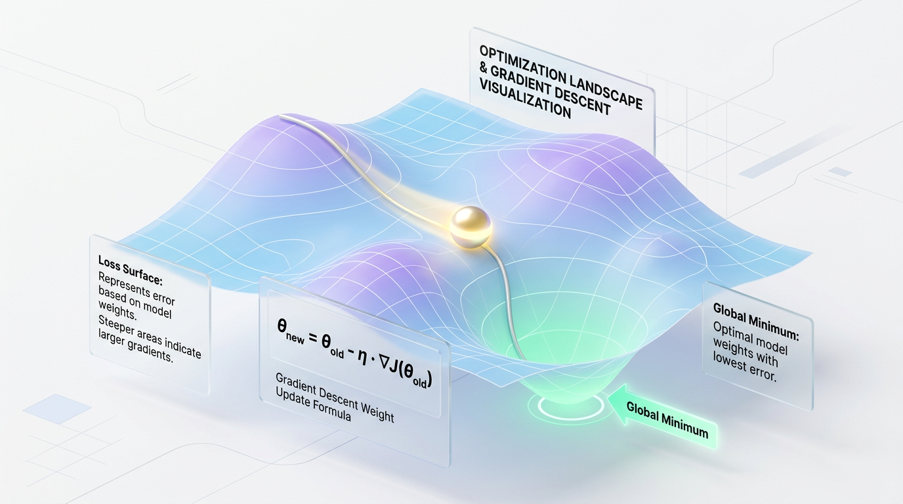
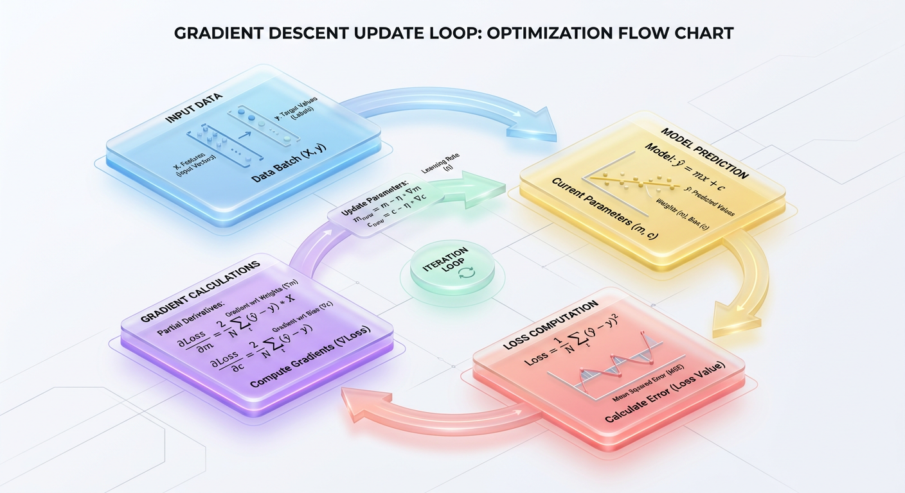
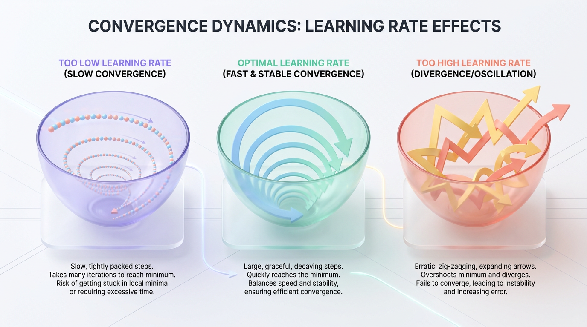

# Mastering Gradient Descent: A Step-by-Step Python Guide

*Go beyond the theory and build the foundational optimization algorithm of machine learning from scratch. This guide provides a runnable Python implementation to solidify your core ML concepts.*


## Why Gradient Descent is the Engine of Modern Machine Learning

*Discover the core optimization algorithm that powers everything from simple linear regression to large language models by iteratively minimizing error, one step at a time.*

How do computer programs actually "learn" from data? They don’t possess human intuition, nor do they experience moments of sudden clarity. Instead, machine learning models improve through a rigorous, iterative process of trial, error, and mathematical correction.



*Figure 1: The visual landscape of mathematical optimization, where a model iteratively navigates a high-dimensional cost surface toward a global minimum.*


At the heart of this learning process is an optimization algorithm called **Gradient Descent**. It is the mathematical engine that drives nearly every modern AI system, enabling models to find the optimal parameters that best map inputs to outputs.


## The Quest to Minimize Error

To train a model, we first need a way to measure how wrong it is. We do this using a **Loss Function** (or Cost Function), which calculates the mathematical distance between the model's predictions and the actual ground-truth data.

A common example is the Mean Squared Error (MSE), defined as:



*Figure 2: The iterative feedback loop of supervised learning, converting inputs and predictions into exact gradient steps.*

`Loss = (1/N) * Σ(Predicted_y - Actual_y)^2`

If the loss is high, the model's predictions are inaccurate. If the loss is zero, the model is perfect. Therefore, "learning" is simply the process of adjusting the model's internal parameters to minimize this loss.

### The Hiker in the Fog Analogy

To understand how Gradient Descent works, imagine you are a hiker lost on a foggy mountain range. Your goal is to reach the absolute bottom of the deepest valley, but the thick fog completely blocks your vision. You cannot see the path down, let alone the destination.

How do you survive and reach the bottom? You must rely on the ground beneath your feet.

You feel the slope of the terrain through your boots. If the ground slopes sharply downward to your left, you take a step in that direction. You take another step, feel the slope again, and adjust. By continuously taking small steps in the direction of the steepest descent, you will eventually reach the lowest point of the valley.

### The Three Mathematical Ingredients

Translating this physical journey into a mathematical algorithm requires three key concepts: a starting point, a compass, and a stride length.

1.  **The Starting Point (Initial Weights):** This is where our hiker is dropped onto the mountain. In practice, we initialize our model's weights and biases with small, random numbers.
2.  **The Direction (The Gradient):** This is the slope of the ground. Mathematically, the gradient is a vector of partial derivatives that points in the direction of the steepest *ascent*. To find the bottom of the valley, we must move in the exact opposite direction of the gradient.
3.  **The Step Size (The Learning Rate):** This is the length of the hiker's stride, typically denoted by the Greek letter alpha. It determines how large of an update we make to our weights at each step.

> ⚠️ **Common Mistake:** Choosing the wrong learning rate can break the entire training process. If it's too small, training will take forever. If it's too large, you might leap right over the lowest point of the valley and diverge, causing the loss to explode.


## A Simple Simulation in Python

Let's simulate this process to find the minimum of a simple U-shaped cost function: `Cost(w) = w^2`. The derivative (or gradient) of this function with respect to `w` is `2w`. We want to find the value of `w` that minimizes the cost, which we know mathematically is `w = 0`.

```python
# A simple simulation of Gradient Descent on a quadratic cost function
def compute_loss(w):
    """Calculates the current error of our system."""
    return w ** 2

def compute_gradient(w):
    """Calculates the slope (derivative) of the cost function at weight 'w'."""
    return 2 * w

# Initialize our three key ingredients
current_weight = 10.0  # Our starting point (initial weight)
learning_rate = 0.1    # Our step size (alpha)
epochs = 5             # Number of steps to take

print(f"Starting Weight: {current_weight:.4f} | Initial Loss: {compute_loss(current_weight):.4f}\n")

# Run the optimization loop
for step in range(1, epochs + 1):
    # Feel the slope under our feet
    gradient = compute_gradient(current_weight)
    
    # Update our weight: Move in the opposite direction of the gradient
    # New_Weight = Old_Weight - (Learning_Rate * Gradient)
    current_weight = current_weight - (learning_rate * gradient)
    
    current_loss = compute_loss(current_weight)
    print(f"Step {step}: Weight updated to {current_weight:.4f} | Current Loss: {current_loss:.4f}")
```

In just five steps, the weight rapidly moves from `10.0` down to `3.2768`, and the loss drops from `100.0` to `10.73`. If we continue this loop, the weight will converge to almost exactly `0.0`, successfully finding the bottom of our valley.



*Figure 3: Visual comparison of convergence paths under different learning rates (the Goldilocks problem).*


## From Theory to Practice: Building a Robust Optimizer

While the simulation is illustrative, real-world models require more sophisticated implementations. Let's build a linear regression model from scratch and equip it with production-grade guardrails to ensure it trains efficiently and reliably.

Our goal is to find the optimal slope (`m`) and intercept (`c`) for a line `y = mx + c`.

### The Core Optimization Loop

The training process involves iterating through a three-step loop: making a prediction, calculating the gradients based on the error, and updating the parameters. We repeat this process for a set number of `epochs`.

```python
import numpy as np

def gradient_descent(X, y, learning_rate=0.1, epochs=100):
    """Optimizes weight (m) and bias (c) using Gradient Descent."""
    # Initialize parameters randomly
    m = 0.0
    c = 0.0
    n = len(y)
    cost_history = []
    
    for epoch in range(epochs):
        # 1. Forward Pass: Calculate predictions
        y_pred = (m * X) + c
        
        # 2. Compute Cost: Mean Squared Error (MSE)
        cost = (1 / n) * np.sum((y_pred - y) ** 2)
        cost_history.append(cost)
        
        # 3. Calculate Gradients (Partial Derivatives)
        dm = (2 / n) * np.dot(X, (y_pred - y))
        dc = (2 / n) * np.sum(y_pred - y)
        
        # 4. Update Parameters
        m = m - (learning_rate * dm)
        c = c - (learning_rate * dc)
        
        if epoch % 10 == 0 or epoch == epochs - 1:
            print(f"Epoch {epoch:02d}: Cost = {cost:.6f} | m = {m:.4f}, c = {c:.4f}")
            
    return m, c, cost_history

# Generate dummy data: y = 2x + 1 + noise
np.random.seed(42)
X_dummy = np.random.rand(100)
noise = np.random.normal(0, 0.05, 100)
y_dummy = 2 * X_dummy + 1 + noise

# Execute the optimizer
print("Starting Gradient Descent Optimization...")
final_m, final_c, costs = gradient_descent(X_dummy, y_dummy, learning_rate=0.2, epochs=80)
```

> ✅ **Best Practice:** Always log your cost values over time. If your code is working correctly, the cost should decrease rapidly at first and then gradually level off near zero as the model converges. This "learning curve" is a critical diagnostic tool.

### Production Guardrail 1: Feature Scaling

When input features exist on vastly different scales (e.g., "square footage" from 500-5,000 vs. "number of bedrooms" from 1-5), the cost function's surface becomes a highly distorted, elliptical valley. This causes the optimizer to oscillate inefficiently instead of moving directly toward the minimum.

To fix this, we apply **Feature Scaling** as a mandatory preprocessing step. By rescaling features to have a mean of 0 and a standard deviation of 1 (Standardization), we transform the cost surface into a symmetric, spherical bowl, which dramatically accelerates convergence.

### Production Guardrail 2: Regularization

A model that minimizes loss too well can **overfit**, memorizing noise in the training data instead of learning generalizable patterns. We prevent this by adding a **regularization** penalty to the cost function.

**L2 Regularization (Ridge)** adds a penalty proportional to the sum of the squared weights. This discourages any single feature from dominating the model by keeping all weight values small and evenly distributed.

### Production Guardrail 3: Dynamic Stopping Criteria

Running training for a fixed number of epochs is inefficient. Instead, production systems use dynamic **convergence criteria**. A common method is to stop training when the change in loss between epochs falls below a small threshold (`tolerance`), ensuring you only compute as long as necessary.

### The Final Code: A Robust Implementation

Here is a Python class that incorporates all three guardrails: feature scaling, L2 regularization, and early stopping.

```python
import numpy as np

class RobustLinearRegression:
    def __init__(self, learning_rate=0.01, l2_penalty=0.1, max_epochs=1000, tol=1e-6):
        self.lr = learning_rate
        self.l2_penalty = l2_penalty
        self.max_epochs = max_epochs
        self.tol = tol
        self.weights = None
        self.bias = None
        
    def _scale_features(self, X):
        """Standardizes features to have mean=0 and std=1."""
        mean = np.mean(X, axis=0)
        std = np.std(X, axis=0)
        std[std == 0] = 1.0 # Prevent division by zero
        return (X - mean) / std

    def fit(self, X, y):
        # Guardrail 1: Scale features
        X_scaled = self._scale_features(X)
        n_samples, n_features = X_scaled.shape
        
        self.weights = np.zeros(n_features)
        self.bias = 0.0
        prev_cost = float('inf')
        
        for epoch in range(self.max_epochs):
            y_pred = np.dot(X_scaled, self.weights) + self.bias
            
            # Compute gradients with L2 Regularization penalty
            dw = (1 / n_samples) * np.dot(X_scaled.T, (y_pred - y)) + (self.l2_penalty * self.weights)
            db = (1 / n_samples) * np.sum(y_pred - y)
            
            self.weights -= self.lr * dw
            self.bias -= self.lr * db
            
            mse_cost = (1 / (2 * n_samples)) * np.sum((y_pred - y) ** 2)
            l2_cost = (self.l2_penalty / 2) * np.sum(self.weights ** 2)
            current_cost = mse_cost + l2_cost
            
            # Guardrail 3: Check for convergence
            if abs(prev_cost - current_cost) < self.tol:
                print(f"Converged early at epoch {epoch}.")
                break
                
            prev_cost = current_cost
            
        return self
```


## Choosing a Strategy: Batch vs. Mini-Batch vs. SGD

The frequency of gradient updates is controlled by a critical hyperparameter: the **batch size**. This determines how many training examples the model sees before updating its weights, creating a trade-off between computational efficiency and update stability.

| Goal | Recommended Technique | Reason |
| :--- | :--- | :--- |
| **Stable convergence & exact gradient** | Batch Gradient Descent | Uses the entire dataset for each update. This is deterministic and smooth but computationally expensive for large datasets. |
| **Fast prototyping & out-of-core learning** | Stochastic Gradient Descent (SGD) | Processes one sample at a time. This is extremely fast per update but results in a noisy, volatile convergence path. |
| **Optimal training speed & GPU utilization** | Mini-Batch Gradient Descent | Processes balanced chunks (e.g., 32, 64, 128 samples). This is the industry standard, leveraging hardware acceleration for stable, high-throughput training. |

> 🚀 **Production Tip:** Always use **Mini-Batch Gradient Descent** for deep learning. Set your batch size to a power of 2 (e.g., 32, 64, 128) to align with GPU memory architecture, maximizing processing efficiency.


## Real-World Applications

Gradient descent is not just a theoretical concept; it's the optimization engine driving nearly every production AI system today.

-   **Recommendation Engines (Netflix, Spotify):** Gradient descent learns latent user and item "embedding" vectors by minimizing the error between predicted and actual user ratings. This allows platforms to recommend content with characteristics similar to what you've liked before.
-   **Natural Language Processing (LLMs):** Massive models like GPT are trained using advanced optimizers (e.g., Adam) that are fundamentally variants of gradient descent. They adjust billions of parameters to minimize the error in predicting the next word in a sequence.
-   **Computer Vision (CNNs):** Convolutional Neural Networks learn to "see" by using gradient descent to tune the weights of image filters. The algorithm backpropagates errors to teach filters how to detect low-level edges, mid-level textures, and high-level objects.
-   **Fraud Detection:** Financial systems use classifiers trained with gradient descent to minimize a loss function called **Binary Cross-Entropy**. This forces the model to create a tight decision boundary around normal transaction behavior, flagging anomalous activity in real-time.


## Key Takeaways

Gradient Descent is the foundational optimization algorithm that enables machine learning models to "learn" from data. It's an iterative process that systematically finds the set of parameters that minimizes a model's error.

To recap the core concepts:
*   **The Goal:** Find the lowest point of a **Loss Function**, which measures the difference between model predictions and actual outcomes.
*   **The Method:** Imagine a hiker in a foggy valley. At each point, they feel the slope (**Gradient**) and take a step in the steepest downward direction.
*   **The Update Rule:** The algorithm updates the model's weights by subtracting the gradient, scaled by a **Learning Rate**. The formula `New_Weight = Old_Weight - (Learning_Rate * Gradient)` is the heart of the entire process.
*   **Practicality:** In production, we use **Mini-Batch Gradient Descent** combined with guardrails like **Feature Scaling**, **Regularization**, and **Early Stopping** to ensure efficient, stable, and generalizable training.

By understanding this fundamental loop, you have the conceptual toolkit to debug training issues, tune hyperparameters, and confidently build sophisticated AI systems. Every advanced optimizer—from Adam to RMSprop—is simply a clever evolution of this elegant, powerful idea.