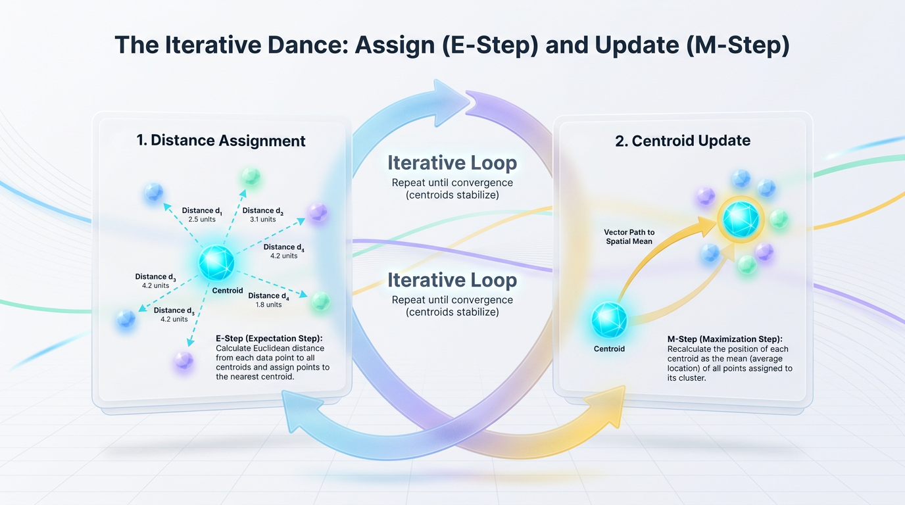
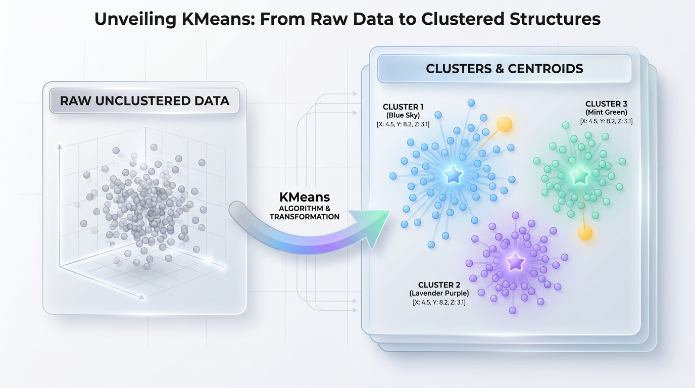

# Build KMeans From Scratch: A Practical Python Guide

*Go beyond scikit-learn. Understand the core mechanics of KMeans by implementing the algorithm from the ground up in Python, gaining deep intuition into how it finds structure in your data.*


## Why Build KMeans When scikit-learn Exists?

*Building algorithms from scratch is more than an academic exercise; it's how you unlock the black box, debug production models with confidence, and move from a user to a creator of machine learning systems.*

It takes just three lines of code to import, initialize, and fit a KMeans model using scikit-learn. For most production environments, relying on these optimized, battle-tested libraries is the industry standard. However, leaning exclusively on high-level APIs can turn machine learning into a "black box" where you understand the inputs and outputs but have no grasp of the mechanics inside.

When a production clustering model behaves erratically—perhaps by creating empty clusters, failing to converge, or producing unstable groupings—a simple `.fit()` method offers no help. Without understanding the underlying mathematics of Euclidean distance and centroid updates, you cannot diagnose why your model is failing. Writing KMeans from scratch equips you with the diagnostic intuition needed to troubleshoot real-world data anomalies.


## The "Why": Beyond Black Box APIs

Think of using a pre-packaged library like heating a microwave meal. It is fast, efficient, and gets the job done. Building an algorithm from scratch, however, is like learning to cook a gourmet meal. Only by chopping the ingredients, balancing the seasoning, and controlling the heat yourself do you understand how each component alters the final dish. When a recipe fails, a cook knows how to rescue it; a microwave user can only start over.

This deep, mechanical understanding is what separates a practitioner from an expert. It's the difference between merely running a model and being able to build, customize, and defend your architectural choices in a technical setting.

| Goal | Recommended Technique | Reason |
| :--- | :--- | :--- |
| **Rapid Prototyping** | Pre-packaged Libraries (scikit-learn) | Optimized for speed, scale, and immediate integration. |
| **System Debugging** | From-Scratch Mental Models | Vital for diagnosing poor convergence, scaling issues, and metric failures. |
| **Custom Architecture** | Tailored Implementations | Necessary when modifying loss functions or distance metrics for niche domain data. |

By the end of this article, you will possess a production-style Python class that you can explain, modify, and defend with confidence. We will build a fully functional `KMeans` class using only NumPy, designed to save its state at every iteration. This will allow us to visualize the dynamic movement of cluster centroids as they converge.


## The KMeans Algorithm: From Theory to Code

At its core, KMeans doesn't find the perfect clusters instantly. Instead, it relies on an elegant, iterative loop known as **Expectation-Maximization (E-M)**. This two-step dance continuously refines the position of cluster centers until they optimally partition the data.

### The Two-Step Dance: Expectation-Maximization

Imagine you want to position three food trucks in a massive park to serve hungry visitors efficiently. You start by parking the trucks in three random spots. At lunchtime, visitors walk to whichever truck is closest, forming three distinct crowds. Seeing where their customers gathered, the truck drivers move to the exact center of their respective crowds to minimize walking times.

Because the trucks moved, some visitors find that a different truck is now closer, causing the crowds to shift again. This process repeats until the trucks land in the absolute center of their local populations, and no one needs to change lines. This iterative "assign and update" process is the essence of KMeans.



*Figure 1: The iterative cycle of KMeans: calculating Euclidean distances to assign points, followed by shifting the centroids to their new spatial means.*


### Phase 1: The Assignment Step (E-Step)

In the **Assignment Step**, we hold the cluster centers (centroids) stationary. Each data point in the dataset calculates its distance to every available centroid and "joins" the cluster of the nearest one. We use **Euclidean Distance**—the standard "straight-line" distance between two points—to determine which centroid is closest.

`Distance = sqrt( (x1 - y1)^2 + (x2 - y2)^2 + ... + (xn - yn)^2 )`

For every data point, we compute this distance to all `K` centroids and assign the point to the cluster index that yields the smallest value.

> 💡 **Core Principle:** During the Assignment Step, the cluster assignments for data points change, but the coordinates of the centroids remain completely fixed.

### Phase 2: The Update Step (M-Step)

Once every data point has been assigned to a cluster, the **Update Step** begins. We now freeze the cluster assignments and recalculate the coordinates of our centroids. To do this, we compute the arithmetic mean (the average) of all data points assigned to each cluster.

`New Centroid = (1 / N) * sum(X_i)`

Here, `N` is the number of points in a cluster, and `X_i` are the coordinate vectors of those points. By moving the centroid to this new mean, we mathematically minimize the sum of squared distances within that cluster.

> ⚠️ **Common Mistake:** If a centroid ends up with zero assigned data points, it becomes an "orphan." A robust implementation must handle this by re-initializing the dead centroid, often to a random data point, to keep it active in the clustering process.

The interaction between these two steps can be summarized as follows:

| Phase | Mathematical Operation | Core Objective |
| :--- | :--- | :--- |
| **Assignment (E-Step)** | Calculate Euclidean distance to find the minimum index. | Minimize the distance from individual points to their assigned centers. |
| **Update (M-Step)** | Compute the coordinate mean of all assigned points. | Reposition the centroid to the absolute center of its current cluster. |

### Implementing a Custom KMeans Class

Translating these steps into executable code turns theory into a production-ready tool. We will encapsulate the state (centroids, labels) and behavior (assignment, updates) within a clean, object-oriented design that mimics the scikit-learn API.

Our `KMeans` class will be initialized with key hyperparameters: `n_clusters`, `max_iter`, and a convergence `tol` (tolerance). The core logic is broken into helper methods for assigning clusters and updating centroids, all orchestrated by the main `fit` method.

```python
import numpy as np

class CustomKMeans:
    """
    A clean, object-oriented implementation of KMeans from scratch.
    Designed to mimic the scikit-learn API while exposing the inner mechanics.
    """
    def __init__(self, n_clusters=3, max_iter=300, tol=1e-4):
        self.n_clusters = n_clusters
        self.max_iter = max_iter
        self.tol = tol
        self.centroids = None
        self.labels = None

    def _assign_clusters(self, X):
        """Calculates distance from each point to each centroid and assigns to the nearest."""
        # Calculate pairwise Euclidean distances using vectorization
        # Broadcasting: (n_samples, 1, features) - (1, n_clusters, features)
        distances = np.linalg.norm(X[:, np.newaxis] - self.centroids, axis=2)
        
        # Return the index of the minimum distance for each data point
        return np.argmin(distances, axis=1)

    def _update_centroids(self, X, labels):
        """Calculates the mean of points in each cluster to find the new centroid."""
        new_centroids = np.zeros((self.n_clusters, X.shape[1]))
        for k in range(self.n_clusters):
            # Extract all points assigned to the current cluster
            cluster_points = X[labels == k]
            
            # If a cluster is empty, reinitialize its centroid to a random point
            if len(cluster_points) == 0:
                new_centroids[k] = X[np.random.choice(X.shape[0])]
            else:
                new_centroids[k] = np.mean(cluster_points, axis=0)
                
        return new_centroids

    def fit(self, X):
        """Fits the KMeans model to the input data X."""
        # 1. Initialize centroids randomly from the dataset points
        np.random.seed(42)  # for reproducibility
        random_idx = np.random.choice(X.shape[0], self.n_clusters, replace=False)
        self.centroids = X[random_idx]
        
        for i in range(self.max_iter):
            # Keep a copy of the old centroids to check for convergence
            old_centroids = self.centroids.copy()
            
            # 2. Assignment Step (E-Step)
            self.labels = self._assign_clusters(X)
            
            # 3. Update Step (M-Step)
            self.centroids = self._update_centroids(X, self.labels)
            
            # 4. Convergence Check
            # Calculate the total shift in centroid positions
            shift = np.linalg.norm(self.centroids - old_centroids)
            if shift < self.tol:
                break
                
        return self
```

### Verifying and Visualizing the Implementation

Let's verify our implementation by running it on a synthetic, two-dimensional dataset. This allows us to observe the class in action and ensure it correctly groups the data.

```python
if __name__ == "__main__":
    # Generate mock data with two distinct groups
    group_1 = np.random.normal(loc=[2.0, 2.0], scale=0.5, size=(50, 2))
    group_2 = np.random.normal(loc=[8.0, 8.0], scale=0.5, size=(50, 2))
    data = np.vstack((group_1, group_2))
    
    # Initialize and fit our custom model
    clf = CustomKMeans(n_clusters=2)
    clf.fit(data)
    
    print(f"Algorithm converged successfully.")
    print(f"Final Centroids:\n{clf.centroids}")
```

The `fit` method orchestrates the entire process in a closed feedback loop. This loop continues until the centroids stop shifting, at which point the algorithm has reached a stable local optimum.

```
[ Input Data ]
      │
      ▼
[ Initialize Centroids ]
      │
┌─────┴─────────────────┐
│ Assignment Step (E)   │ ◄────┐
│ (Points -> Centroids) │      │
└──────────┬────────────┘      │ Loop until
           │                   │ centroids
           ▼                   │ stop shifting
┌──────────┴────────────┐      │ or max_iter
│   Update Step (M)     │ ─────┘
│ (Centroids -> Mean)   │
└───────────────────────┘
           │
           ▼
[  Final Clusters  ]
```


## Real-World Applications of KMeans

KMeans is more than an elegant mathematical exercise; it's a workhorse algorithm that bridges the gap between raw data and actionable business strategy. By grouping unlabeled data based on proximity, it powers critical systems across modern industry.

### Customer Segmentation for Targeted Marketing

Many businesses struggle to communicate effectively with a diverse user base. Customer segmentation solves this by partitioning users into distinct groups based on purchasing behavior, browsing history, or demographics. This allows marketing teams to create highly personalized campaigns designed for specific user archetypes.

Technically, this is achieved by feeding customer metrics—such as Recency, Frequency, and Monetary value (RFM)—into the KMeans algorithm. The algorithm treats each customer as a point in a multi-dimensional space and groups those with similar habits, revealing clusters that represent high-value loyalists, occasional shoppers, or churn-risk users.

### Image Compression via Vector Quantization

Digital images can require massive amounts of storage and bandwidth. Image compression using KMeans, also called **Vector Quantization**, reduces file size by limiting the number of unique colors in an image. By representing an image with a smaller, optimized palette, you can achieve significant compression with almost no visible loss in quality.

In technical terms, every pixel in an RGB image is a 3D coordinate. By passing these pixels into KMeans with a target of `K = 16` clusters, the algorithm finds the 16 most representative color centroids. We then replace every pixel's color with its nearest centroid color, drastically reducing the data size.

> 🚀 **Production Tip:** To speed up color quantization, first downsample your image and run KMeans on the smaller version to find the color centroids. Then, use those centroids to map the colors of the original, high-resolution image, saving significant computation time.

### Anomaly and Fraud Detection

Fraudulent transactions and system intrusions cost companies billions annually. KMeans helps security systems flag suspicious activities by identifying data points that do not fit into any normal behavior patterns. It does this by clustering historical, legitimate transactions into stable groups.

For any new transaction, the system calculates its Euclidean distance to the nearest cluster centroid. If this distance exceeds a predefined threshold, the data point is flagged as a potential outlier for review by a fraud analyst. This allows systems to catch novel attack vectors that rule-based systems might miss.

### Document Clustering and Topic Discovery

Online platforms are flooded with thousands of unstructured articles, emails, and customer support tickets daily. Document clustering automatically organizes large bodies of text into coherent thematic groups without requiring pre-labeled training data, making it easier to route content to the correct teams.

To do this, text documents are first converted into numerical vectors using techniques like TF-IDF or dense embeddings. KMeans then clusters these vectors in high-dimensional space, grouping documents with similar vocabularies together to reveal natural, overarching topics.


## Production Guardrails: Common Pitfalls and Best Practices

Deploying KMeans to production requires more than calling a library function. Because the algorithm is unsupervised, it will always output results, even if the underlying clusters are mathematically meaningless. To build robust pipelines, you must actively guard against its inherent limitations.

### The k Dilemma: Finding the Optimal Cluster Count

A primary challenge with KMeans is selecting the number of clusters, `k`, before the algorithm runs. Choosing the wrong `k` can lead to misleading results. We can solve this by measuring cluster quality with two key metrics: the **Elbow Method** and the **Silhouette Score**.

The Elbow Method tracks **Inertia**, the within-cluster sum of squares. As `k` increases, Inertia naturally decreases. We look for the "elbow" point where the rate of decrease abruptly flattens. The Silhouette Score measures both cohesion (how close a point is to its own cluster) and separation (how far it is from the nearest neighboring cluster). A score near +1 indicates well-defined, isolated clusters.



*Figure 2: The overall process of KMeans clustering from unclustered raw data points to clearly separated, centroid-centered clusters.*


```python
import numpy as np
from sklearn.cluster import KMeans
from sklearn.metrics import silhouette_score
from sklearn.datasets import make_blobs

X, _ = make_blobs(n_samples=500, centers=4, cluster_std=0.60, random_state=42)
k_values = range(2, 9)
inertias = []
silhouette_scores = []

for k in k_values:
    model = KMeans(n_clusters=k, init='k-means++', n_init=10, random_state=42)
    labels = model.fit_predict(X)
    inertias.append(model.inertia_)
    silhouette_scores.append(silhouette_score(X, labels))

# Display the evaluation metrics
print("k | Inertia   | Silhouette Score")
print("-" * 32)
for k, inertia, sil in zip(k_values, inertias, silhouette_scores):
    print(f"{k} | {inertia:8.2f} | {sil:.4f}")
```

> ✅ **Best Practice:** Evaluate both metrics together. The optimal `k` is often found where the Silhouette Score peaks and the Inertia curve forms a distinct "elbow." In the code above, `k=4` achieves both, confirming it as the best choice.

### Initialization Matters: The Fragility of Random Centroids

The final clusters depend heavily on the initial centroid positions. A poor random start can trap the algorithm in a suboptimal local minimum. If two initial centroids land too close together, they might split a single natural cluster, leading to inaccurate results.

To solve this, the industry standard is **KMeans++**. Instead of placing all centroids randomly, KMeans++ spreads them out systematically. It chooses the first centroid randomly, then selects subsequent centroids with a probability proportional to their squared distance from the nearest existing centroid.

> ✅ **Best Practice:** Always set `init='k-means++'` in your clustering pipelines. This simple change reduces convergence time, prevents getting trapped in local minima, and ensures more consistent and reproducible clustering results.

### The Absolute Necessity of Feature Scaling

KMeans is a distance-based algorithm, meaning the scale of your input features directly influences the outcome. If one feature (e.g., annual income) has a numerical range thousands of times larger than another (e.g., age), it will dominate the distance calculations.

This forces the algorithm to cluster data almost entirely along the axis of the larger-scale feature, ignoring valuable patterns in others. To prevent this, you must normalize your features before clustering so that each contributes equally.

```python
import numpy as np
from sklearn.preprocessing import StandardScaler
from sklearn.cluster import KMeans

# Dataset with two features on different scales
data = np.array([[25, 35000], [27, 40000], [50, 110000], [52, 115000]])

# Scenario A: Clustering WITHOUT scaling
kmeans_unscaled = KMeans(n_clusters=2, n_init=10, random_state=42).fit(data)

# Scenario B: Clustering WITH scaling
scaler = StandardScaler()
data_scaled = scaler.fit_transform(data)
kmeans_scaled = KMeans(n_clusters=2, n_init=10, random_state=42).fit(data_scaled)

print(f"Unscaled Cluster Assignments: {kmeans_unscaled.labels_}")
print(f"Scaled Cluster Assignments:   {kmeans_scaled.labels_}")
```

> ⚠️ **Common Mistake:** Forgetting to scale features is one of the most frequent errors when using KMeans. Always apply a technique like `StandardScaler` to ensure all features have a mean of 0 and a standard deviation of 1.

### Handling High-Dimensional Data: The Curse of Dimensionality

As you add more features to your dataset, the performance of distance-based algorithms like KMeans degrades due to the **Curse of Dimensionality**. In high-dimensional spaces, data becomes extremely sparse, and the distance between any two points starts to converge to the same value.

When every point is nearly equidistant from every other point, the concept of a "cluster" breaks down. To combat this, you must reduce the dimensionality of your data before running KMeans.

| Goal | Recommended Technique | Reason |
| :--- | :--- | :--- |
| **Linear Dimensionality Reduction** | Principal Component Analysis (PCA) | Projects data into orthogonal directions of maximum variance, filtering out noise. |
| **Non-Linear Dimensionality Reduction** | t-SNE or UMAP | Preserves local neighbor relationships (ideal for visual validation). |
| **Sparse Data Handling** | Truncated SVD | Safely reduces dimensions of sparse matrices from text data. |


## When to Use KMeans (And When Not To)

No single clustering algorithm fits every dataset. While KMeans is an excellent starting point, applying it blindly can lead to poor groupings. Selecting the right tool requires matching your data's geometry and scale to the algorithm's mathematical assumptions.

KMeans assumes your data groups into symmetrical, spherical shapes. If your data contains elongated, non-convex, or nested structures, you need an algorithm that can adapt to its natural contours.

### The Clustering Decision Matrix

Use this high-level decision matrix to guide your choice of algorithm based on your data characteristics and project goals.

| Goal | Recommended Technique | Reason |
| :--- | :--- | :--- |
| Fast, scalable clustering for spherical clusters. | **KMeans** | Low computational complexity `O(n*k*i*d)` makes it a strong, efficient baseline for large datasets. |
| Discovering clusters of arbitrary shapes (e.g., crescents). | **DBSCAN or Spectral Clustering** | Density-based (DBSCAN) or graph-based (Spectral) methods do not assume clusters are convex or isotropic. |
| Automatic detection of cluster count. | **DBSCAN or Hierarchical Clustering** | DBSCAN determines clusters based on density parameters. Hierarchical clustering produces a dendrogram for flexible choices. |
| Handling categorical or mixed-type data. | **K-Prototypes** | Combines KMeans (for numeric) and K-Modes (for categorical) to handle mixed data types correctly. |

### Code Demonstration: Where KMeans Fails

The following script demonstrates why KMeans fails on non-spherical data and how a density-based approach like DBSCAN succeeds. We will cluster a "noisy moons" dataset with both techniques to highlight the difference.

```python
import numpy as np
import matplotlib.pyplot as plt
from sklearn.datasets import make_moons
from sklearn.cluster import KMeans, DBSCAN

# 1. Generate non-spherical, crescent-shaped data
X, y = make_moons(n_samples=300, noise=0.05, random_state=42)

# 2. Apply KMeans (assumes spherical clusters)
kmeans = KMeans(n_clusters=2, n_init='auto', random_state=42)
kmeans_labels = kmeans.fit_predict(X)

# 3. Apply DBSCAN (finds clusters based on local density)
dbscan = DBSCAN(eps=0.2, min_samples=5)
dbscan_labels = dbscan.fit_predict(X)

# 4. Plot the comparison side-by-side
fig, (ax1, ax2) = plt.subplots(1, 2, figsize=(12, 5))

ax1.scatter(X[:, 0], X[:, 1], c=kmeans_labels, cmap='viridis', edgecolor='k')
ax1.set_title("KMeans Clustering (Fails on Moons)")
ax1.set_xlabel("Feature 1")
ax1.set_ylabel("Feature 2")

ax2.scatter(X[:, 0], X[:, 1], c=dbscan_labels, cmap='coolwarm', edgecolor='k')
ax2.set_title("DBSCAN Clustering (Succeeds on Moons)")
ax2.set_xlabel("Feature 1")
ax2.set_ylabel("Feature 2")

plt.tight_layout()
plt.show()
```

The resulting plots reveal a stark contrast. KMeans draws a straight line that incorrectly cuts through both crescent shapes. DBSCAN, however, successfully traces the high-density pathways, correctly identifying the true underlying geometry.

> ✅ **Best Practice:** Always visualize your data with dimensionality reduction techniques like PCA or t-SNE before choosing a clustering algorithm. If your visualizations show complex, non-spherical shapes, opt for a density-based or graph-based model.


## Key Takeaways

Building this algorithm is not about replacing production libraries like scikit-learn. It is about developing the intuition required to select the right tool, prepare your data correctly, and debug models when they fail. This exercise transforms abstract concepts into a concrete mental model.

-   **Demystify the Black Box:** Writing KMeans from scratch reveals its simple, iterative core: the Expectation-Maximization (E-M) loop. This "Assign and Update" dance is fundamental to many machine learning algorithms, and understanding it empowers you to diagnose and solve convergence issues.

-   **Preparation is Everything:** The success of a clustering pipeline depends far more on data preparation than on the algorithm itself. Proper feature scaling, intelligent centroid initialization (`k-means++`), and methodical selection of the optimal cluster count (`k`) are non-negotiable steps for producing meaningful results.

-   **Know the Algorithm's Limits:** KMeans is fast and effective but makes rigid assumptions about data geometry. It works best on well-separated, spherical clusters. For data with complex shapes, arbitrary densities, or non-linear structures, alternative algorithms like DBSCAN or Gaussian Mixture Models are necessary.

-   **Become a Confident Practitioner:** Real-world mastery is not about memorizing API calls. It's about understanding the mechanics behind the models you deploy. This foundational knowledge allows you to confidently justify your architectural choices, troubleshoot failures, and deliver robust, reliable machine learning systems.