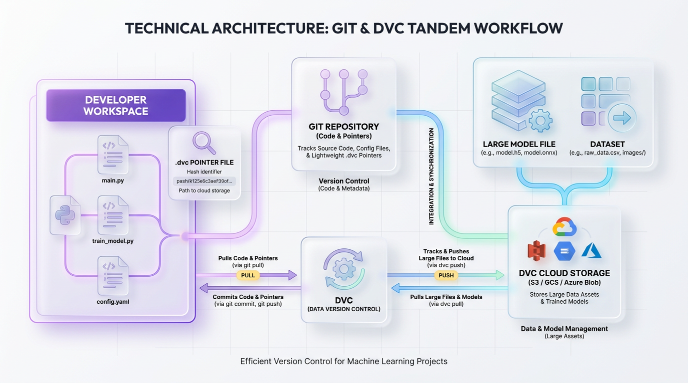
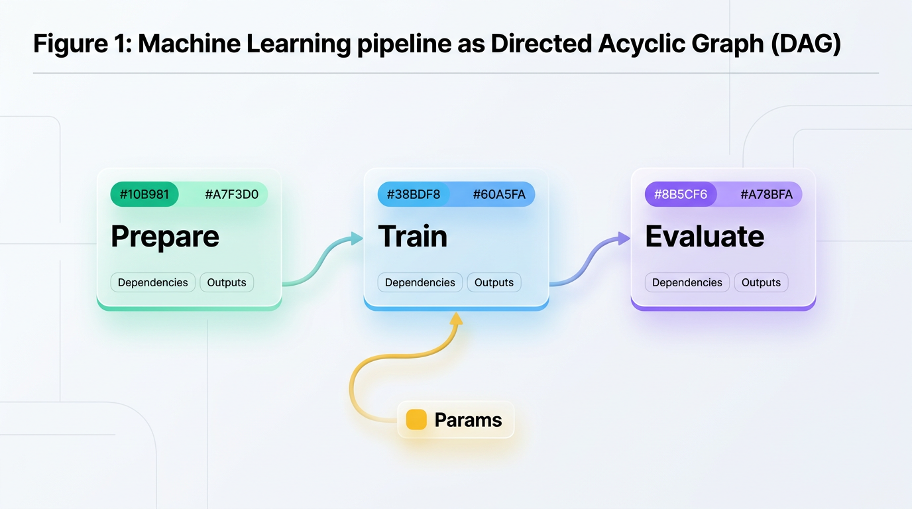

# Build Reproducible ML Pipelines with DVC and Git

*Go beyond Git to version your large datasets and models. This guide shows you how to use DVC to build fully reproducible MLOps pipelines, from data preparation to deployment.*


## Why Your Git Workflow Is Failing Your ML Projects

*Git excels at versioning code, but it wasn't built for the massive datasets and models in modern AI. Learn how Data Version Control (DVC) extends Git to create scalable, reproducible, and production-ready MLOps pipelines.*

---

Git is the undisputed king of software version control. It tracks lines of code flawlessly, manages branches with ease, and enables seamless collaboration across global engineering teams. However, Git was designed for lightweight text files, not the heavy lifting required by modern artificial intelligence. When you force Git to manage multi-gigabyte datasets or massive model weights, the system quickly breaks down.

This mismatch leads to bloated repositories, broken development environments, and the dreaded `.gitignore` chaos. Team members end up tracking critical model assets on shared cloud drives, destroying reproducibility and making it impossible to determine which exact dataset trained a specific model. DVC solves this bottleneck by acting as an orchestrator that extends Git's capabilities to large files.

To understand DVC, imagine walking into a massive library to borrow a research book. Instead of forcing you to carry the entire library inventory in your backpack, the librarian hands you a tiny index card. This card contains a unique shelf location code that points directly to the book you need. Git keeps the lightweight "index cards" (pointer files), while the heavy data volumes are stored safely in an external cloud warehouse.


## Getting Started with DVC

Setting up a DVC project involves initializing both Git and DVC in your project directory. This establishes the tracking metadata directories where both systems log historical changes, allowing them to work in tandem without bloating your source code repository.

### Step 1: Project Initialization

First, install DVC and initialize it alongside Git in your project folder. This creates the internal `.dvc` and `.git` directories that manage your version history.

Run the following commands in your terminal to set up the environment:



*Figure 1: The dual-tracking model of Git and DVC, separating lightweight code tracking from heavy data storage.*


```bash
# Initialize a new Git repository
git init

# Install DVC with AWS S3 support (or use 'gcs', 'azure', etc.)
pip install "dvc[s3]"

# Initialize DVC in the current directory
dvc init
```

The `dvc init` command creates a local cache, configurations, and internal ignore files, similar to how Git uses the `.git` directory to track code changes.

### Step 2: Configure Remote Storage

DVC needs to know where to store your large data files. You define this location by adding a remote storage target, such as an AWS S3 bucket, Google Cloud Storage, or an Azure Blob Storage container.

Execute the following command to configure your default remote:

```bash
# Define a default remote named 'myremote' pointing to your S3 bucket
dvc remote add -d myremote s3://my-mlops-bucket/dvc-store

# Commit the generated DVC configuration to Git
git add .dvc/config
git commit -m "Configure DVC with S3 remote storage"
```

The `-d` flag sets `myremote` as your default target. Now, when you run data synchronization commands, DVC will automatically push or pull data from this S3 path.

### Step 3: Track Your First Large Asset

With your remote configured, you can begin tracking large assets. Let's create a simulated 50MB model file and hand its tracking responsibility over to DVC.

```bash
# Create a simulated large model file (e.g., 50MB of dummy data)
dd if=/dev/zero of=model.onnx bs=1M count=50

# Instruct DVC to track the large model file
dvc add model.onnx
```

When you execute `dvc add`, DVC moves the actual data into its local cache, generates a tiny `model.onnx.dvc` pointer file, and automatically adds `model.onnx` to your `.gitignore`. Now, you can commit this lightweight pointer to Git without bloating the repository.

```bash
# Commit the lightweight DVC pointer file to Git
git add model.onnx.dvc .gitignore
git commit -m "Add tracking for trained ONNX model"

# Push the actual data to your configured remote storage
dvc push
```

By decoupling code from data, you permanently solve the mystery of which dataset version trained which model, enabling full reproducibility for your entire team.


## Building Reproducible Pipelines

Machine learning workflows are notoriously fragile. A change in data preparation cascades into training, which alters the final evaluation. Without structure, you are left running disjointed Python scripts, hoping you executed them in the correct order. DVC solves this by defining your workflow as a **Directed Acyclic Graph (DAG)** in a `dvc.yaml` file.

Think of `dvc.yaml` as an automated recipe book. It detects which ingredients are ready, which steps are done, and exactly what needs to be cooked next. If you change one part of the recipe, it only re-runs the affected steps, not the entire process.



*Figure 2: A multi-stage DVC pipeline defined by dvc.yaml, establishing dependencies, outputs, and strict execution lineages.*


### Defining Pipeline Stages with dvc.yaml

A DVC pipeline is split into computational steps called **stages**. Each stage declares its command, dependencies, parameters, and outputs. Before writing the pipeline, it's a best practice to manage hyperparameters in a separate `params.yaml` file to decouple configuration from code.

```yaml
# params.yaml
prepare:
  split_ratio: 0.2
  random_state: 42
train:
  epochs: 10
  learning_rate: 0.01
```

With your parameters isolated, you can construct your `dvc.yaml` file to connect your Python scripts into a single, unified pipeline.

```yaml
# dvc.yaml
stages:
  prepare:
    cmd: python src/prepare.py
    deps:
      - src/prepare.py
      - data/raw_data.csv
    params:
      - prepare
    outs:
      - data/prepared/
  train:
    cmd: python src/train.py
    deps:
      - src/train.py
      - data/prepared/
    params:
      - train
    outs:
      - models/model.pkl
  evaluate:
    cmd: python src/evaluate.py
    deps:
      - src/evaluate.py
      - models/model.pkl
      - data/prepared/
    metrics:
      - metrics.json:
          cache: false
```

> ✅ **Best Practice:** Always commit `dvc.yaml`, `dvc.lock`, and `params.yaml` to Git. Never commit generated outputs like `models/model.pkl` to Git; let DVC track them instead.

### Leveraging Smart Caching and Reproduction

To run this entire pipeline, you execute a single command: `dvc repro`. DVC reads the DAG, checks its cache, and executes only the steps whose dependencies, parameters, or code have changed. If you run `dvc repro` a second time with no changes, DVC intelligently skips all stages, confirming the pipeline is up to date.

This smart caching saves significant computational time. If you modify a training hyperparameter in `params.yaml`, DVC will skip the `prepare` stage and only re-run the `train` and `evaluate` stages.


## Real-World Applications and Use Cases

In production, ML systems face challenges that code-only version control cannot solve. Data drift, massive media datasets, and regulatory compliance all require a unified approach. DVC bridges this gap by acting as the data plane for modern MLOps pipelines.

### Rapid Rollbacks in Recommendation Systems

Recommendation systems rely on high-dimensional models and rapidly shifting user data. If a new model degrades performance, teams must restore system health within minutes. DVC acts as an "undo" button, letting you swap the active model and its training data to a previous, verified state with a single command.

This is possible because DVC decouples metadata from binary payloads. When performance degrades, running `git checkout <commit-hash>` followed by `dvc checkout` swaps the local pointer files and instantly restores the correct model weights from cache or remote storage.

```python
# rollback_model.py
# This script simulates an automated recovery system rolling back a production model.
import os
from dvc.api import read

def restore_production_model(git_commit_hash: str, model_path: str):
    """Retrieves a historical version of a model from remote DVC storage."""
    print(f"Initiating rollback to Git Commit: {git_commit_hash}")
    try:
        model_bytes = read(
            path=model_path,
            repo="https://github.com/org/recommendation-pipeline",
            rev=git_commit_hash,
            mode="rb"
        )
        with open("production_models/latest.onnx", "wb") as f:
            f.write(model_bytes)
        print("Rollback successful. Production model updated.")
    except Exception as e:
        print(f"Rollback failed: {e}")
```

### Efficient Caching for CV and NLP Pipelines

Computer Vision (CV) and Natural Language Processing (NLP) models require massive datasets. Running complete preprocessing pipelines for every minor experiment is incredibly expensive. DVC's caching mechanism tracks what has changed and automatically skips steps that have already been computed, saving thousands of hours of GPU time.

> ✅ **Best practice:** Keep your pipeline stages modular. Isolating computationally heavy data steps (like image resizing or text tokenization) from modeling steps maximizes DVC's caching efficiency.

### Auditing and Compliance in Regulated Industries

In finance and healthcare, models cannot be black boxes. When an auditor asks why a model made a specific prediction six months ago, you must be able to recreate the exact environment. DVC creates an immutable audit trail by locking code, configuration parameters, and the exact training data hash together in your Git history.

This linkage allows you to trace any prediction back to the exact model artifact, training dataset, and hyperparameters used, proving that your process was fair, reproducible, and compliant.

### Collaborative Feature Engineering

In large organizations, teams often require access to the same processed features. Instead of duplicating feature extraction logic, one engineer can build the features once and register them with DVC. The rest of the team can then pull the pre-calculated, versioned features instantly, ensuring consistency and saving on redundant computation.

```python
# load_shared_features.py
# A data scientist imports a versioned, pre-computed feature matrix.
import pandas as pd
import dvc.api

def load_features() -> pd.DataFrame:
    """Retrieves a shared feature set from a centralized DVC repository."""
    feature_url = dvc.api.get_url(
        path="data/features/customer_churn_matrix.parquet",
        repo="https://github.com/org/shared-feature-store",
        rev="v2.1.0" # Bind to a specific feature version
    )
    df = pd.read_parquet(feature_url)
    return df
```


## Production Guardrails and Best Practices

Scaling ML systems demands operational discipline. As teams move from local prototyping to collaborative MLOps, minor errors can break reproducibility. Avoiding these common pitfalls ensures a fast, secure, and reliable development lifecycle.

### Avoiding the Git Bloat Trap

> ⚠️ **Common Mistake:** The most frequent error is accidentally committing large files directly to Git with `git add data.csv` instead of `dvc add data.csv`. This permanently bloats the repository history. If this happens, you must purge the file from Git history using a tool like `git-filter-repo` to restore performance.

Git is optimized for text diffs, not multi-gigabyte binaries. Always use `dvc add` to track large files, which generates a lightweight `.dvc` pointer for Git while keeping the heavy data out of the repository.

### Atomizing Pipeline Stages for Caching

> 🚀 **Production Tip:** Monolithic scripts are the enemy of fast iteration. By splitting your ML pipeline into decoupled, modular stages in `dvc.yaml`, you allow DVC to selectively reuse cached results for any steps that have not changed. If you modify a training hyperparameter, DVC intelligently skips data preprocessing and starts directly at the training stage.

### Automating Validation with CI/CD

Relying on developers to manually verify reproducibility is a recipe for silent failures. Instead, integrate DVC directly into your Continuous Integration (CI) pipeline to automate validation. Running `dvc pull` and `dvc repro` in a CI job on every pull request ensures that every code change is fully reproducible before it is merged.

```yaml
# .github/workflows/reproducibility.yml
name: Validate Model Reproducibility
on: [pull_request]
jobs:
  verify-pipeline:
    runs-on: ubuntu-latest
    steps:
      - uses: actions/checkout@v3
      - uses: actions/setup-python@v4
      - name: Install Dependencies and Configure DVC
        run: |
          pip install "dvc[s3]" -r requirements.txt
          dvc pull -r myremote # Authenticate and pull data
      - name: Validate Pipeline Integrity
        run: dvc repro
```

### Establishing a Team Synchronization Policy

In a collaborative environment, code and data must travel together. If a team member pushes code to GitHub but forgets to push the corresponding data to cloud storage, pipelines will break for everyone else. To avoid this, establish a strict write-and-sync policy.

| Goal | Recommended Command Sequence | Reason |
| :--- | :--- | :--- |
| **Share New Work** | `git commit && git push && dvc push` | Uploads code and pointers to Git, then sends heavy data files to the DVC remote. |
| **Fetch Team Updates** | `git pull && dvc pull` | Aligns your local workspace code first, then downloads the matching binary data files. |
| **Verify Local State** | `dvc status` | Checks for differences between your local data and the versions recorded in Git. |


## Key Takeaways

Implementing Data Version Control (DVC) marks a crucial shift from ad-hoc experimentation to systematic, reproducible engineering. By managing data and code through separate but coordinated pipelines, you build a production-ready environment that treats datasets with the same rigor as source code. This integration ensures that every experiment is tracked, shareable, and fully reproducible by any member of your team, creating a virtual time machine for your entire model development lifecycle.

- **Decouple Code and Data:** Use Git to version your source code and lightweight DVC pointer files. Use DVC to manage the heavy lifting of storing, transferring, and versioning large datasets and model artifacts in remote cloud storage.

- **Define Pipelines as Code:** Structure your entire workflow in a `dvc.yaml` file. This creates a Directed Acyclic Graph (DAG) that formally defines dependencies, commands, and outputs, making your process transparent and reproducible.

- **Leverage Intelligent Caching:** Run your pipeline with `dvc repro` to automatically skip any stage whose code, data, or parameters have not changed. This saves immense computational time and cost, especially in complex CV and NLP workflows.

- **Standardize Collaboration:** Enforce a clear team workflow where `git push` is always paired with `dvc push`, and `git pull` is followed by `dvc pull`. This ensures that code and data always remain in perfect synchronization across the team.

- **Automate for Reliability:** Integrate DVC commands into your CI/CD pipeline to automatically validate that every pull request is fully reproducible. This practice catches errors early and prevents "it works on my machine" issues from reaching production.