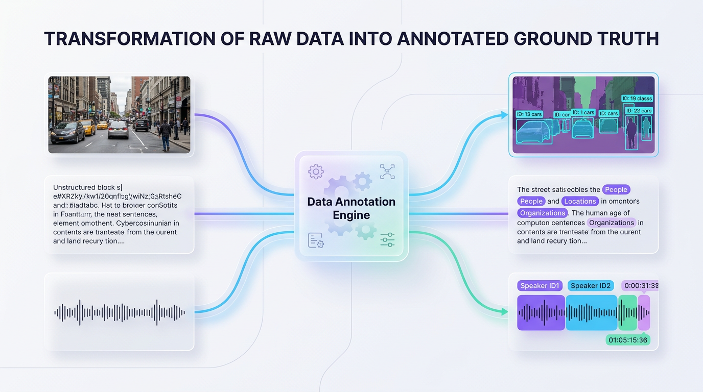
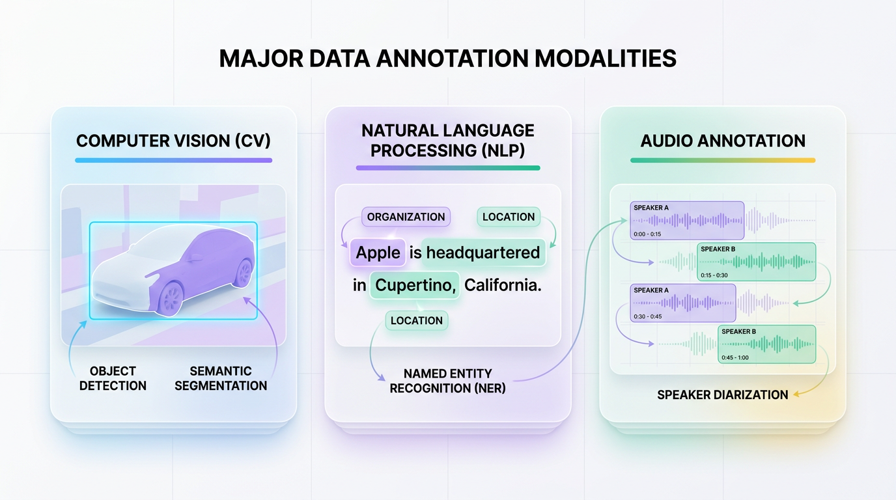
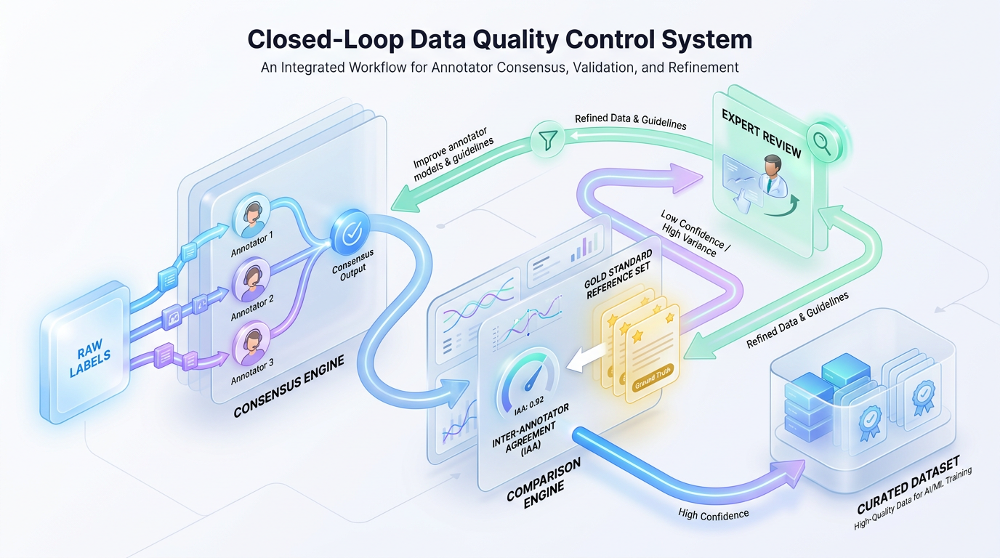

# Data Annotation: Fueling High-Performance AI Models

*Learn how data annotation transforms raw data like images and text into structured, labeled information that machine learning models need to train effectively. This is the foundation for building any successful AI system.*


## Why Raw Data Isn't Enough for Machine Learning
Raw data is functionally silent. Data annotation is the critical translation step that turns unstructured noise into the structured ground truth that defines your model's performance ceiling.

Raw data is abundant, but in its native state, an algorithm cannot inherently understand pixels, acoustic frequencies, or text strings without context. Data annotation is the translation mechanism that turns this unstructured raw data into structured learning signals for machine learning models. Without it, even the most advanced architectures are flying blind.



*Figure 1: The data annotation engine transforms raw, unstructured data (images, text, audio) into highly structured, model-ready ground truth datasets using structured schemas.*


### The Analogy of the Pointing Finger
Think of how you would teach a child to recognize a cat. You would not simply show them millions of random, unorganized photographs. Instead, you would point directly to a specific animal in a picture and say, "Look, that is a cat."

Data annotation is this exact pointing-and-labeling process for algorithms. By isolating objects and defining their boundaries, we show the model precisely what it should look at and what it should ignore. Without this human-guided context, a model might look at a photo of a cat on a couch and mistake the couch fabric for the animal itself.

### Establishing the Ground Truth
Technically, **data annotation** is the process of appending structured metadata—such as labels, tags, or spatial coordinates—to unstructured raw data. This annotated dataset establishes the **ground truth**, the empirical reality your model uses to measure its accuracy and learn. During training, supervised learning models rely entirely on this ground truth to calculate loss, backpropagate errors, and optimize their weights.

Before annotation, an image is merely a flat matrix of RGB pixel values. After annotation, this matrix is paired with structured metadata that localizes and identifies the target object, making it intelligible to a machine learning pipeline.

```json
{
  "image_filename": "golden_retriever.jpg",
  "image_dimensions": {
    "width": 1024,
    "height": 768
  },
  "annotations": [
    {
      "class_label": "dog",
      "annotation_type": "bounding_box",
      "coordinates": {
        "xmin": 142,
        "ymin": 210,
        "xmax": 580,
        "ymax": 730
      }
    }
  ]
}
```

This structured output tells the training pipeline exactly which pixel coordinate boundaries map to the semantic concept of "dog." This is the precise translation step that makes raw data learnable.

> 💡 Tip: The quality, precision, and consistency of your data annotation directly determine the mathematical performance ceiling of your model. The classic engineering adage "Garbage in, garbage out" begins at the labeling phase, not during model training.


## A Guide to Core Annotation Techniques
Data annotation is not a singular task but a suite of specialized techniques tailored to different data modalities and machine learning goals. Selecting the wrong schema can lead to inefficient training or model convergence failure. The underlying annotation style must match the target task, whether your model is processing video, reading contracts, or listening to audio.

### Computer Vision: Teaching Machines to See
Computer vision relies heavily on spatial annotation. To understand visual data, models must learn not just *what* is in an image, but *where* it is located. The main techniques vary in precision and cost:

*   **Bounding Boxes**: Drawing rectangular coordinates (`[x_min, y_min, x_max, y_max]`) around objects. This is the standard for **object detection** tasks, balancing labeling speed with spatial accuracy.
*   **Semantic Segmentation**: Assigning a class label to every individual pixel in an image. This provides complete **scene understanding** for applications where boundaries are irregular, such as identifying a drivable road surface.
*   **Keypoint Annotation**: Pinpointing specific coordinate joints on an object, like a person's shoulders or knees. This is crucial for **pose estimation** in applications like fitness or sports analytics.

The code below shows how these spatial coordinates are structured for an object detection and pose estimation pipeline.



*Figure 2: Major annotation modalities and their corresponding techniques, mapping unstructured features to precise metadata schemas.*


```python
# Representation of a computer vision annotation payload
annotation_payload = {
    "image_id": "img_00129",
    "dimensions": {"width": 1920, "height": 1080},
    "annotations": [
        {
            # Bounding box for Object Detection
            "type": "bounding_box",
            "label": "pedestrian",
            "bbox": [452, 210, 80, 240]  # [x_min, y_min, width, height]
        },
        {
            # Keypoints for Pose Estimation
            "type": "keypoints",
            "label": "human_pose",
            "points": [
                {"joint": "left_shoulder", "coords": [462, 230], "visible": True},
                {"joint": "right_shoulder", "coords": [478, 231], "visible": True}
            ]
        }
    ]
}

# Pipelines parse these arrays to calculate loss metrics
for annot in annotation_payload["annotations"]:
    print(f"Verified {annot['type']} annotation for {annot['label']}")
```

### Natural Language Processing: Teaching Machines to Read
Text annotation bridges the gap between raw human speech patterns and structured linguistic data. Computers do not inherently understand syntax or intent, so annotators must map structural labels directly onto raw text at different levels of granularity:

*   **Named Entity Recognition (NER)**: Identifying and classifying specific spans of text (e.g., people, organizations, dates). This is fundamental for **information extraction** systems.
*   **Sentiment Analysis**: Categorizing a block of text based on its emotional polarity (positive, negative, neutral). This is widely used for **user feedback classification**.
*   **Text Categorization**: Assigning macro-level labels to long-form documents. This powers automated spam filters and **topic modeling**.

The following snippet shows how character indices are used to train a Named Entity Recognition (NER) model.

```python
# Named Entity Recognition (NER) training data format
ner_training_example = {
    "text": "Acme Corp acquired DeltaLabs in San Francisco on November 12, 2023.",
    "entities": [
        {"start": 0, "end": 9, "label": "ORGANIZATION"},
        {"start": 19, "end": 28, "label": "ORGANIZATION"},
        {"start": 32, "end": 45, "label": "LOCATION"},
        {"start": 49, "end": 66, "label": "DATE"}
    ]
}

# The character offsets force the NLP model to learn contextual boundaries
text = ner_training_example["text"]
for ent in ner_training_example["entities"]:
    print(f"Entity: '{text[ent['start']:ent['end']]}' -> Label: {ent['label']}")
```

### Audio Processing: Teaching Machines to Hear
Audio annotation transforms unstructured acoustic waves into organized, time-stamped event logs. Because sound changes continuously, these annotations must link specific acoustic features to precise timestamps.

*   **Acoustic Transcription**: Converting spoken language into text, forming the foundation of **speech-to-text** technology.
*   **Speaker Diarization**: Segmenting audio by speaker identity to answer "who spoke when?" This converts raw audio into distinct, conversational scripts.
*   **Sound Event Detection (SED)**: Identifying the exact onset and offset times of specific non-speech sounds, such as "glass breaking" or a "siren."

> ⚠️ Common Mistake: Unlike text, audio annotation requires high temporal resolution. Annotators must pinpoint event boundaries down to the millisecond to prevent model alignment drift and ensure accurate event detection.

### Tabular Data: Defining the Target Variable
While tabular data is already structured, the critical process of defining and labeling the target column is itself a form of annotation. Without a domain expert defining the ground truth, a raw ledger of transactions is useless for supervised learning.

For tabular data, this often takes two forms:
*   **Classification Labeling**: A domain expert manually defines the target variable, such as flagging transactions with an `is_fraud` label (0 or 1) or assigning a `customer_churn_risk` tier (high, medium, low).
*   **Feature Enrichment**: Manually tagging or enriching columns with missing categorical variables to resolve ambiguities before a model begins training.

To choose the right approach, consider this goal-oriented decision matrix:

| Goal | Recommended Technique | Reason |
| :--- | :--- | :--- |
| **Locate multiple objects in an image** | Bounding Boxes | Fast and cost-effective for identifying the presence and general location of objects. |
| **Understand the precise shape of an object** | Semantic Segmentation | Provides pixel-level accuracy. Essential for safety-critical systems or medical imaging. |
| **Extract specific entities from text** | Named Entity Recognition (NER) | Isolates key information (names, dates) for downstream knowledge graph construction. |
| **Classify an entire document** | Text Classification | Assigns a single label to a text snippet. Perfect for spam detection or sentiment analysis. |
| **Flag anomalous event timestamps** | Sound Event Detection (SED) | Pins transient sounds to exact millisecond ranges in security or industrial monitoring. |


## Production Guardrails for High-Quality Annotation
Moving from a toy dataset to a production pipeline requires treating data annotation as an active engineering discipline. Without rigorous guardrails, systemic labeling errors will cause silent model failures in production. This shift is crucial in applications from e-commerce recommendation engines to safety-critical autonomous systems.

### Establish a Version-Controlled Labeling Constitution
The single greatest point of failure in any annotation pipeline is ambiguity. When guidelines are vague, annotators rely on intuition, introducing high variance that corrupts the dataset. To prevent this, create a comprehensive, version-controlled **labeling constitution** that acts as your pipeline's source of truth, complete with explicit definitions and visual edge-case examples.

> ⚠️ Common Mistake: Never rely on simple definitions like "Label all vehicles." Instead, specify exact criteria: "Label motorized land vehicles with 4+ wheels; exclude trailers, toy cars, and targets occluded by more than 80%."

### Implement a Quantitative Quality Control Loop
You cannot manage what you do not measure. To guarantee high-quality labels, implement a continuous feedback loop using quantitative metrics like **Inter-Annotator Agreement (IAA)**. By assigning the same data point to multiple annotators, you can calculate an agreement score to flag ambiguity. A standard metric for this is Cohen's Kappa.

```python
from sklearn.metrics import cohen_kappa_score

# Simulated labels from two independent annotators
annotator_a_labels = [0, 2, 1, 0, 0, 2, 1, 0, 1, 2]
annotator_b_labels = [0, 2, 0, 0, 1, 2, 1, 0, 2, 2]

# Cohen's Kappa measures agreement while adjusting for random chance
kappa_score = cohen_kappa_score(annotator_a_labels, annotator_b_labels)
print(f"Inter-Annotator Agreement (Cohen's Kappa): {kappa_score:.3f}")

# Operationalize the metric to trigger workflow alerts
if kappa_score < 0.60:
    print("CRITICAL: Low agreement detected. Pause batch and review guidelines.")
```

### Select the Right Annotation Tooling
Building a pipeline requires balancing flexibility, developer time, and cost. There is no one-size-fits-all annotation tool; the right choice depends on your project's scale and security needs.

| Core Pipeline Goal | Recommended Tooling Strategy | Architectural Reason |



*Figure 3: A production-grade annotation quality control loop ensuring high inter-annotator agreement (IAA) through gold standards and active feedback.*

| :--- | :--- | :--- |
| **Strict Data Privacy** | Custom In-House Tooling | Allows complete security containment and tailored database integration. |
| **Rapid Prototyping** | Open-Source Platforms (e.g., Label Studio) | Extensible UI with active community support reduces time-to-market. |
| **Massive Scalability** | Managed Platforms (e.g., Scale AI) | Outsourcing workforce sourcing and platform maintenance frees up engineering hours. |

### Use Programmatic Quality Gates
Never allow human-annotated data to enter your training pipeline without passing programmatic unit tests. These "quality gates" enforce structural and logical rules, catching errors that humans might miss.

```python
from typing import Dict, Any

def validate_annotation_payload(payload: Dict[str, Any]) -> bool:
    """Validates annotation payloads programmatically before ingestion."""
    image_id = payload.get("image_id")
    annotations = payload.get("annotations", [])
    
    if not annotations:
        print(f"[REJECTED] Image {image_id}: No annotations found.")
        return False
        
    for idx, ann in enumerate(annotations):
        bbox = ann.get("bbox")
        # Rule: Ensure bounding box dimensions are positive and non-zero
        if bbox and (bbox[2] <= 0 or bbox[3] <= 0):
            print(f"[REJECTED] Image {image_id}: Invalid dimension at index {idx}.")
            return False
            
    print(f"[PASSED] Image {image_id}: All structural checks cleared.")
    return True
```

### Accelerate Labeling with Active Learning
Labeling an entire unstructured dataset is often wasteful, as models don't benefit from learning from thousands of near-identical examples. **Active Learning** optimizes this process. Start by labeling a small, representative subset to train an initial model. Then, use that model to prioritize labeling only the data points where it yields low-confidence predictions.

> ✅ Best Practice: Target samples where class prediction probability is closest to uniform (maximum entropy). This ensures your labeling budget is spent exclusively on data that maximizes your model's information gain.


## From Chore to Core: Engineering the Data Annotation Engine
Historically, engineering treated data labeling as a low-skill, one-off chore. This mental model is a primary driver of production machine learning failures. Modern AI requires us to view data annotation not as a manual task but as a continuous, version-controlled **data annotation engine**—a core piece of software infrastructure with built-in quality assurance and automated feedback loops.

In classical programming, engineers write explicit logic (rules) to transform inputs. In machine learning, the data and its labels *are* the source code. Just as a compiler translates source code into machine instructions, data annotation translates human domain knowledge into mathematical optimization constraints. Inconsistent labels act as buggy code that compiles into a broken, unpredictable model.

Your annotation schema—the definitions, classes, and rules you establish—is your model’s entire universe. If you define a schema with ambiguous classes, you raise the **Bayes Error Rate**, the theoretical minimum error achievable. If your human annotators disagree 15% of the time due to a vague schema, your model's accuracy is mathematically capped near 85%, regardless of its architecture.

To build reliable systems, you must shift your perspective from evaluating algorithms to engineering data pipelines.
*   **Embrace a Data-Centric Mindset:** If your annotators cannot agree on a label with 95% consistency, your model cannot either. The root cause of poor performance is often a fuzzy schema, not a weak architecture. Spend more time refining your edge-case annotation guidelines than tuning hyperparameters.
*   **Acknowledge That Data Drifts:** Your labels will decay in accuracy as real-world distributions shift. Your datasets require active curation, versioning, and patching just like any other production codebase. Establish automated feedback loops that surface low-confidence predictions back to human annotators for review.
*   **Treat Annotation as a Software Lifecycle:** Build automated quality gates, track annotator consensus metrics, and maintain a version-controlled data pipeline. Treating data annotation as an iterative, metrics-driven software system is the single most effective way to guarantee the long-term reliability of your models.