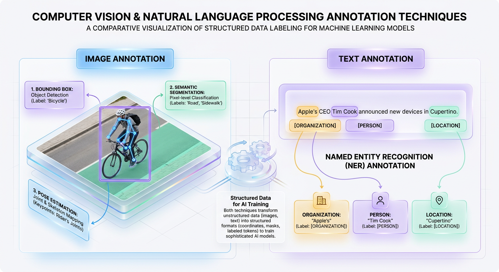
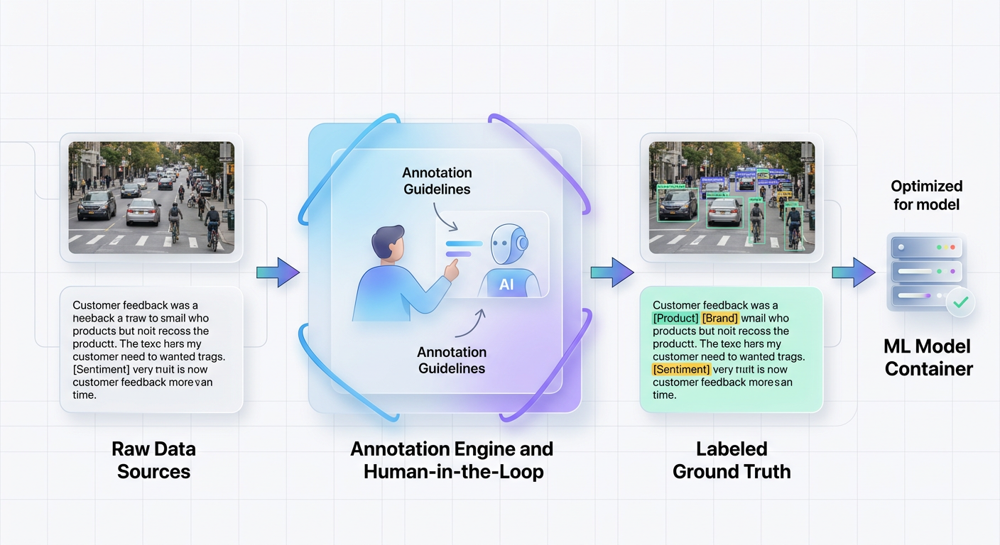
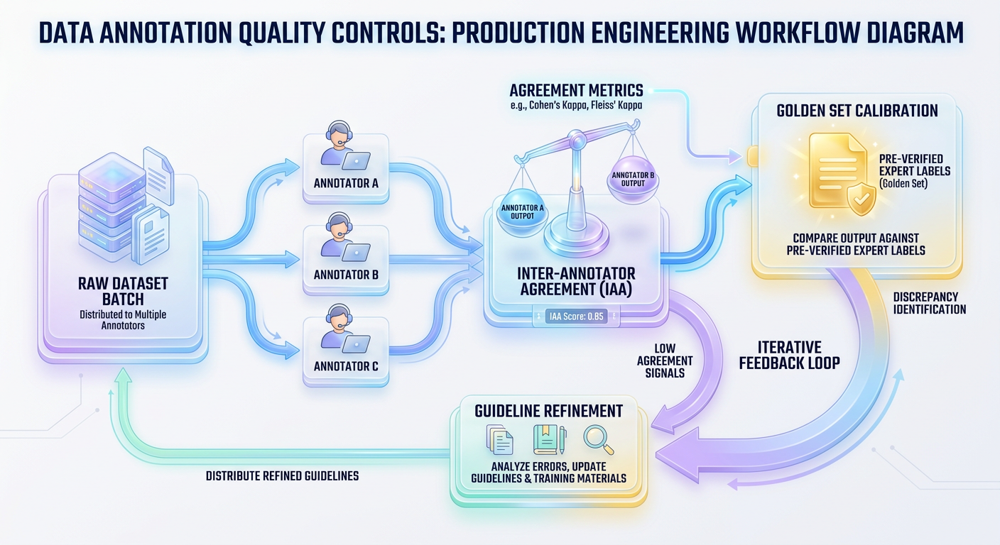

# Data Annotation: The Practical Engine Behind Modern AI

*Explore the crucial process of labeling data to build high-performance AI. Understand the techniques and tools that transform raw information into machine-readable intelligence for any ML project.*


## Data Annotation: The Practical Guide to Building High-Quality Training Data
Raw data is just noise. Learn how to transform unstructured inputs into high-fidelity training signals through a rigorous, engineering-driven approach to data annotation and quality assurance.


## Why Annotation Is the Foundation of AI
Raw data is often called the new oil, but this comparison misses a fundamental truth. Crude oil must be refined to be useful; raw data must be structured and labeled before an AI model can draw a single meaningful conclusion from it. To a machine, an unlabeled dataset is a chaotic sea of pixels, numbers, or characters. Without a guide, a machine learning model cannot distinguish between signal and noise.

Imagine teaching a toddler to recognize a "cat." If you hand them an album of thousands of random animal photos without guidance, they will struggle. Instead, you point to specific pictures and say, "This is a cat." By pairing the visual image with an explicit label, the child learns to correlate features—like pointed ears and whiskers—with that concept. AI models learn in the exact same way.

In technical terms, supervised machine learning models learn by finding mathematical patterns that map inputs (`x`) to outputs (`y`). We represent this relationship as `y = f(x)`, where `y` is the target label, or **ground truth**. Data annotation is the process of adding these `y` labels to your raw `x` data. Without them, the algorithm cannot calculate its error or optimize its performance.


## Core Annotation Techniques: A Practical Overview
Data annotation is not a one-size-fits-all task. The technique you choose must balance computational cost, annotation budget, and the level of precision your model requires. Selecting the wrong method can lead to bloated budgets, prolonged training cycles, or models that fail in production.

### Computer Vision: From Localization to Pixel Precision
In computer vision, machines translate a grid of raw pixel values into structured, spatial understanding. The primary trade-off is between annotation speed and spatial accuracy.

*   **Bounding Boxes** are rectangular frames drawn around objects. They are fast to create and provide a model with a simple spatial constraint: `[x_min, y_min, x_max, y_max]` coordinates defining where an object is located. This is the foundation of most object detection tasks.

*   **Semantic & Instance Segmentation** requires classifying every single pixel in an image. This provides the model with exact object contours, which is essential for tasks like autonomous navigation or medical image analysis. However, this pixel-perfect approach can take up to 15 times longer to annotate than a simple bounding box.

The following code shows how a bounding box is represented in the standard YOLO format, using normalized coordinates for model training.



*Figure 1: Common annotation modalities showing spatial labels (bounding boxes, segmentation) for computer vision alongside token labels (NER, classification) for NLP.*


```python
# YOLO annotation format: [class_id, x_center, y_center, width, height]
# Normalized relative to image dimensions (values range from 0.0 to 1.0)
pedestrian_annotation = [0, 0.452, 0.612, 0.085, 0.210]
vehicle_annotation    = [1, 0.781, 0.550, 0.320, 0.450]

# Why this matters: The training pipeline parses these floats to calculate 
# localized loss without worrying about the raw image scale.
print(f"Pedestrian Box Center: ({pedestrian_annotation[1]}, {pedestrian_annotation[2]})")
```

### Natural Language Processing: From Broad Topics to Specific Entities
While computer vision maps spatial coordinates, Natural Language Processing (NLP) maps meaning and structure to unstructured text. The choice of technique depends on whether you need macro-level understanding or micro-level extraction.

*   **Text Classification** assigns a single label to an entire document, such as categorizing an email's sentiment as "positive," "negative," or "neutral." This approach is computationally inexpensive and ideal for sorting or routing tasks.

*   **Named Entity Recognition (NER)** operates at the individual word or token level. Annotators highlight specific character spans to identify entities like names, dates, or locations. NER provides rich, structured data but requires more complex annotation protocols.

This Python dictionary shows how raw text is transformed into a structured training example that an NER model can digest.

```python
# Raw input text: "Book a flight to Paris for Jane on Friday"

annotated_training_example = {
    "text": "Book a flight to Paris for Jane on Friday",
    "entities": [
        {"start": 17, "end": 22, "label": "GPE", "text": "Paris"},      # Geopolitical Entity
        {"start": 27, "end": 31, "label": "PERSON", "text": "Jane"},   # Person's Name
        {"start": 35, "end": 41, "label": "DATE", "text": "Friday"}      # Date
    ]
}

# The model uses these character offsets to learn the context of words 
# representing locations, people, and dates.
```

The table below summarizes how to align your project goals with the right annotation technique.

| Goal | Recommended Technique | Reason |
| :--- | :--- | :--- |
| Quickly locate distinct objects in an image. | **Bounding Boxes** | Fast to label and computationally efficient. Ideal when an object's precise shape is not critical. |
| Understand the exact boundary of every object. | **Semantic Segmentation** | Provides pixel-level accuracy. Essential for robotics or medical imaging where shape is critical. |
| Classify the overall topic of a text document. | **Text Classification** | Simple and low-cost. Perfect for sorting reviews, news articles, or support tickets into broad categories. |
| Extract specific pieces of info from text. | **Named Entity Recognition (NER)** | Identifies and categorizes key data points. Used for knowledge graphs and information retrieval. |


## From Theory to Practice: Annotation in Real-World Systems
Data annotation is the translator that converts unstructured digital exhaust into a high-fidelity training signal. To understand why enterprises invest billions in labeling pipelines, we must look at how structured metadata transforms raw inputs into business value.

### Autonomous Vehicles and Robotics
An autonomous vehicle must understand the physical boundaries of every object in its path to navigate safely. If a model cannot distinguish between a plastic bag and a pedestrian, the system fails. Annotation converts a chaotic stream of pixels from cameras and LiDAR sensors into distinct, labeled entities that the car's computer can track. This is achieved using **bounding boxes** for dynamic objects and **semantic segmentation** for navigable spaces like "road" or "sidewalk."

> ✅ **Best Practice:** For safety-critical applications like robotics, always enforce double-blind annotation. Multiple labelers must independently tag the same data, with consensus algorithms resolving discrepancies to eliminate human bias.

### Healthcare and Medical Diagnostics
In clinical settings, AI models augment radiologists by identifying life-threatening anomalies in medical scans. Without highly precise pixel-level labels, an AI might flag benign structures as malignancies. Medical annotation involves specialists using **polygon annotation** or **3D volume segmentation** to trace the exact contours of tumors or organs in DICOM files. This trains a neural network to spot those same microscopic boundaries in seconds.

### E-Commerce and Smart Retail
In e-commerce, search relevance and recommendations are key. If a customer searches for a "vintage leather jacket," the system must understand visual styles and materials from product imagery, not just text descriptions. Images undergo **multi-attribute labeling**, where annotators tag photos with hierarchical attributes like "sleeve length," "neckline style," and "fabric." These annotations are converted into vector embeddings that power similarity search and catalog filtering.

### Customer Support Automation
Modern support centers process millions of unstructured emails and chat logs daily. To automate this, systems must instantly comprehend customer intent and route tickets to the correct resolution path. This process relies on **Intent Classification** and **Named Entity Recognition (NER)**. Annotators highlight text spans within logs to label product IDs, dates, and sentiment, training models to understand context and trigger automated workflows.

```python
# A Named Entity Recognition (NER) annotation structures raw text so an NLP 
# model can learn to extract key operational parameters.

ner_annotation = {
    "text": "My order number 99281-A is delayed. I need a refund immediately.",
    "annotations": [
        {"start_char": 16, "end_char": 23, "label": "ORDER_ID"},
        {"start_char": 45, "end_char": 51, "label": "INTENT_KEYWORD"},
        {"start_char": 27, "end_char": 34, "label": "STATUS"}
    ]
}
```



*Figure 2: The Data Annotation lifecycle transforms unstructured raw inputs into structured ground-truth datasets to train supervised machine learning models.*


## Production Guardrails: Building a High-Quality Labeling Pipeline
In machine learning, the "garbage in, garbage out" principle is absolute. If your pipeline ingests noisy or incorrect labels, even the most sophisticated model will fail. Building reliable AI requires a rigorous quality control process for data annotation that runs continuously throughout the ML lifecycle.

### The Iterative Refinement Loop: Start Small, Scale Smart
The most expensive mistake is launching a massive annotation project without a pilot phase. Ambiguous instructions will result in thousands of wasted hours. Instead, production teams use an iterative loop: annotate a small batch, review the labels, clarify the instructions in a formal **Annotation Guideline** document, and then scale the operation.

> ✅ **Best Practice:** A robust guideline must contain concrete edge cases. For instance, it should clarify: "Do we label partially occluded objects?" or "Do we label 'Apple' as an Organization only when it refers to the tech company?"

### Measuring Consensus with Inter-Annotator Agreement (IAA)
How do you know if your guidelines are clear enough? You measure **Inter-Annotator Agreement (IAA)**, which quantifies how often different human annotators assign the same label to the same piece of data. We use metrics like **Cohen's Kappa**, which cleverly accounts for the probability that annotators agree by random chance.

The formula is `Kappa = (Po - Pe) / (1 - Pe)`, where `Po` is the observed agreement and `Pe` is the probability of chance agreement. A score of 1.0 indicates perfect agreement, while 0.0 indicates agreement no better than random guessing.



*Figure 3: Quality assurance loops in production annotation pipelines leverage consensus checks and golden benchmarks to ensure reliable model inputs.*


```python
from sklearn.metrics import cohen_kappa_score

# Annotator A and B labeled 10 images as "Cat" (0), "Dog" (1), or "Other" (2)
annotator_a_labels = [0, 1, 0, 2, 1, 1, 0, 2, 2, 1]
annotator_b_labels = [0, 1, 0, 2, 2, 1, 0, 2, 1, 1] # Note the disagreements

# Calculate Cohen's Kappa to measure agreement beyond random chance
kappa_score = cohen_kappa_score(annotator_a_labels, annotator_b_labels)
print(f"Calculated Cohen's Kappa: {kappa_score:.3f}")

if kappa_score > 0.80:
    print("Result: Excellent agreement. The data is ready for training.")
elif kappa_score >= 0.60:
    print("Result: Substantial agreement. Consider reviewing guideline edge cases.")
else:
    print("Result: Poor agreement! Pause labeling and refine instructions.")
```

### Calibrating Quality with Golden Sets
A **Golden Set** (or honeypot) is a curated collection of data where the ground-truth labels have been verified by domain experts. These samples are secretly mixed into annotators' queues. An annotator's performance on this set serves as an unbiased, real-time audit of their quality, allowing you to filter out underperforming labelers and ensure consistency.

> 🚀 **Production Tip:** Never allocate 100% of your data budget to raw labeling. Reserve at least 20-30% for quality assurance activities like expert reviews, consensus scoring, and auditing.


## The Engineer's Mental Model for Data Annotation
Many engineers treat data annotation as a tedious chore to be outsourced cheaply. This is a critical mistake. Data annotation is the process of writing the concrete specifications for your machine learning system. The quality of your labels sets a mathematical ceiling on your model's performance. No amount of tuning or compute can fix a foundation built on flawed labels.

Think of your training data as source code and the annotation process as your compiler. If you write buggy, ambiguous code, the compiler will faithfully produce a buggy, unpredictable program. This reframing shifts your role from a passive consumer of datasets to an active system architect. When you design an annotation schema, you are defining the exact boundaries of what your AI can perceive.

This process is about encoding human expertise. When a radiologist highlights a tumor, they are translating years of diagnostic experience into structured coordinates. Resolving ambiguities in this process is a core design decision. Inconsistent labels introduce mathematical noise into the model's loss function, degrading its ability to generalize and making it fragile in production.

To build resilient systems, you must move from fragile academic models to robust production pipelines with these principles in mind:
*   **The Labeling Schema is Your API:** Treat your annotation guidelines with the same versioning and change-management rigor as a public API contract.
*   **Systemic Bias is Born in Annotation:** Downstream model unfairness is not an abstract glitch; it is the direct mathematical projection of skewed or inconsistent annotator decisions.
*   **Continuous Auditing is Mandatory:** Establish a permanent feedback loop where a subset of production data is constantly audited for label drift to catch silent model degradation before it impacts users.