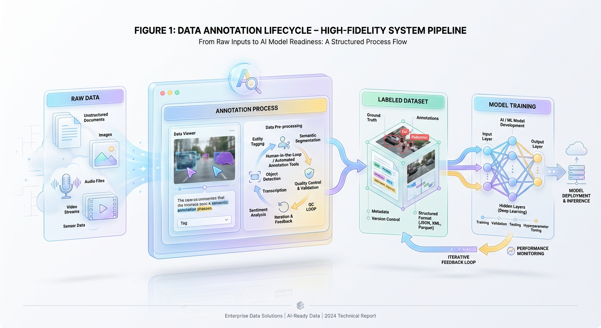
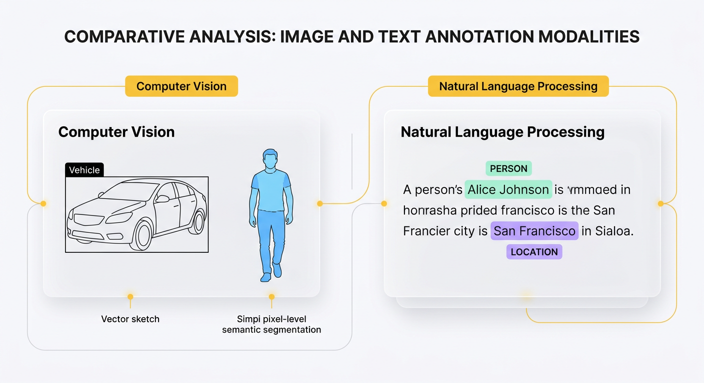

# What is Data Annotation? An Engineer's Illustrated Guide

*Discover the critical process of labeling data for machine learning. We'll explore real-world examples in image, text, and audio to show why annotation is the bedrock of modern AI.*


## Why Machines Need Labeled Data to Learn

A technical guide to the data annotation pipelines that power supervised machine learning.

How does an autonomous vehicle instantly distinguish a pedestrian from a shadow on the asphalt? How does a streaming service predict the exact film you want to watch next? These systems do not possess human intuition. Instead, they rely on pattern recognition engines trained on vast quantities of structured training examples.

The majority of commercial AI applications are built on supervised machine learning. This paradigm operates much like learning with digital flashcards: one side presents a raw input, like an image or text block, while the other reveals the correct, "ground-truth" label. Raw data—unstructured video feeds, audio recordings, or medical scans—is initially meaningless to an algorithm. Data annotation is the systematic process of adding informative labels to this data, creating the "flashcards" machines use to learn.

While model architectures and hyperparameter tuning often dominate engineering discussions, a model's predictive power is fundamentally bounded by its training data. High-quality data annotation is arguably the most critical factor in building reliable, production-grade supervised learning models. Without accurate and consistent labels, even the most sophisticated neural network will fail, learning to codify noise rather than signal.


## The Anatomy of Labeled Data

Data annotation, or data labeling, is the process of identifying raw data samples and adding one or more informative tags to provide the context necessary for machines to learn. Without these labels, a supervised algorithm cannot resolve underlying patterns or establish the ground truth required to make accurate predictions.

Consider how a child learns to identify fruit. Presented with a basket of fruit and no context, the child perceives only shapes and colors. When you point to a red, round object and say "apple," you are performing an annotation. The raw sensory input is the data, and "apple" is the label that establishes a semantic connection. In an engineering pipeline, this transition from unstructured input to structured intelligence follows a systematic lifecycle:



*Figure 1: The Data Annotation Pipeline: Bridging Raw Assets and Machine Learning Models.*


```text
[Raw Data] ---> [Annotation Process] ---> [Labeled Dataset] ---> [Model Training]
```

Mathematically, supervised learning algorithms seek to learn a mapping function ($f$) that translates input variables ($x$) to target output variables ($y$). The raw data elements, known as *features*, represent the independent variables ($x$). In a computer vision task, for example, features are the individual pixel values. The *label* is the dependent target variable ($y$) produced during annotation, such as the classification tag "cat" or a set of bounding box coordinates. This structured pairing of features and labels provides the ground truth an optimization algorithm needs to calculate prediction error and systematically adjust model weights.

The choice of annotation format depends directly on the model's task. Localizing an object in an image requires coordinate boundaries, whereas processing sequential text requires token-level labels. The following sections detail core annotation types across different data modalities.

### Image and Video Annotation

Computer vision models require structured spatial information to interpret pixel arrays. Engineers must choose an annotation method that balances annotation speed with the required level of spatial precision for the task.


#### Bounding Boxes
Bounding boxes are the most common format for object detection. Annotators draw a rectangle over a target object, defined by the minimum and maximum coordinates along the X and Y axes. This method is computationally efficient and fast to execute, but it often includes background pixels that can introduce noise into the training data.

*   **Before (Raw Data):** A 2D array of RGB values representing a street scene.
*   **After (Annotated Data):** The raw image associated with a coordinate payload.
    ```json
    {
      "image_filename": "street_view_08.jpg",
      "annotations": [
        {
          "label": "vehicle",
          "bbox_coordinates": {
            "x_min": 142,
            "y_min": 250,
            "x_max": 310,
            "y_max": 412
          }
        }
      ]
    }
    ```

#### Polygons
For irregularly shaped objects, bounding boxes are too imprecise. Polygons solve this by allowing annotators to place a sequence of vertices around an object's exact boundary. This is critical for applications like autonomous driving (detecting curved lanes) or medical imaging (segmenting tumors), where boundary precision directly impacts system safety and performance.

*   **Before (Raw Data):** An image of a winding highway lane.
*   **After (Annotated Data):** An ordered list of vertex coordinates tracing the lane boundary.
    ```json
    {
      "image_filename": "highway_lane.png",
      "annotations": [
        {
          "label": "active_lane",
          "polygon_vertices": [
            {"x": 110, "y": 450},
            {"x": 185, "y": 320},
            {"x": 240, "y": 320},
            {"x": 310, "y": 450}
          ]
        }
      ]
    }
    ```

#### Semantic Segmentation
Semantic segmentation assigns a class label to every pixel in an image, effectively treating the image as a dense grid classification problem. Unlike bounding boxes or polygons, it does not distinguish between separate instances of a class; it only determines which class each pixel belongs to (e.g., "road," "vehicle," "sky"). This level of detail is necessary for tasks requiring complete environmental awareness, such as robotic navigation or aerial terrain mapping.

*   **Before (Raw Data):** A raw $1920 \times 1080$ pixel matrix of a city street.
*   **After (Annotated Data):** A single-channel mask matrix of the same dimensions, where each pixel's integer value maps to a class ID.

| Pixel Coordinate | Raw RGB Value | Assigned Class ID | Class Name |
| :--- | :--- | :--- | :--- |
| $(450, 200)$ | `#7D7D7D` | `1` | Road |
| $(450, 201)$ | `#3A3A3A` | `2` | Vehicle |
| $(450, 202)$ | `#8FCA5C` | `3` | Vegetation |

### Text Annotation

Natural Language Processing (NLP) models require labels mapped to sequences of characters or words (tokens) to understand semantics, context, and syntax.

#### Named Entity Recognition (NER)
NER models identify and categorize spans of text into predefined classes like names, locations, and organizations. The annotation process involves flagging the exact start and end character offsets of a target phrase, enabling information extraction pipelines to parse structured records from unstructured text.

*   **Before (Raw Data):** `"Tesla built a Gigafactory in Berlin."`
*   **After (Annotated Data):**
    ```json
    {
      "text": "Tesla built a Gigafactory in Berlin.",
      "entities": [
        {
          "start_offset": 0,
          "end_offset": 5,
          "label": "ORGANIZATION",
          "text": "Tesla"
        },
        {
          "start_offset": 29,
          "end_offset": 35,
          "label": "LOCATION",
          "text": "Berlin"
        }
      ]
    }
    ```

#### Sentiment Analysis
Sentiment analysis classifies the subjective intent or emotional tone of a text sequence. Annotators typically evaluate a sentence or document and apply a categorical label such as positive, negative, or neutral. This helps businesses automate customer feedback analysis and monitor brand health at scale.

*   **Before (Raw Data):** `"The system latency spiked to 500ms, which is completely unacceptable."`
*   **After (Annotated Data):**
    ```json
    {
      "text": "The system latency spiked to 500ms, which is completely unacceptable.",
      "document_metadata": {
        "sentiment_label": "NEGATIVE",
        "confidence_score": 1.0,
        "granularity": "sentence-level"
      }
    }
    ```

#### Text Classification
Text classification assigns one or more predefined categories to an entire document. Unlike NER, which flags specific words, text classification summarizes the document's global topic. Common use cases include routing support tickets to the correct engineering queue or filtering spam.

*   **Before (Raw Data):** `"My database connection times out every time I attempt to execute a nested join on the production replica."`
*   **After (Annotated Data):**
    ```json
    {
      "text": "My database connection times out every time I attempt to execute a nested join on the production replica.",
      "classification": {
        "primary_tag": "Database_Infrastructure",
        "secondary_tag": "Performance_Issue",
        "severity": "High"
      }
    }
    ```

### Audio Annotation

Audio processing models operate on continuous waveforms. Annotation tasks translate these temporal acoustic signals into discrete textual or categorical segments.

#### Audio Transcription
Transcription converts spoken audio into text while preserving temporal alignment. This is done by splitting the audio into segments and pairing each with its corresponding text. This mapping is fundamental for training Automatic Speech Recognition (ASR) engines.

*   **Before (Raw Data):** A raw mono-channel audio file (`call_recording.wav`).
*   **After (Annotated Data):**
    ```json
    {
      "audio_source": "call_recording.wav",
      "transcription_segments": [
        {
          "start_time_seconds": 0.0,
          "end_time_seconds": 3.4,
          "transcript": "hello and thank you for calling technical support"
        }
      ]
    }
    ```

#### Speaker Diarization
Speaker diarization answers the question "who spoke when?" in a multi-speaker audio stream. Annotators segment the audio by identifying the precise start and end times for each speaker. This temporal partitioning is critical for generating accurate transcripts of meetings, court proceedings, and interviews.

*   **Before (Raw Data):** A multi-speaker audio file (`boardroom_discussion.wav`).
*   **After (Annotated Data):**
    ```json
    {
      "audio_source": "boardroom_discussion.wav",
      "diarization_timeline": [
        {
          "start_time_seconds": 1.1,
          "end_time_seconds": 4.5,
          "speaker_id": "SPEAKER_01"
        },
        {
          "start_time_seconds": 4.6,
          "end_time_seconds": 8.2,
          "speaker_id": "SPEAKER_02"
        },
        {
          "start_time_seconds": 8.3,
          "end_time_seconds": 12.1,
          "speaker_id": "SPEAKER_01"
        }
      ]
    }
    ```


## The Annotation Production Pipeline

Data annotation is not a one-off task but a systematic production pipeline. Without a structured workflow, labeling efforts quickly succumb to human error, subjective drift, and operational inefficiencies that degrade model performance. Establishing a robust pipeline is essential for creating high-quality datasets at scale.

### Step 1: Defining Annotation Guidelines
Before any labeling begins, engineers must establish precise and unambiguous guidelines. The primary point of failure in many ML projects is subjective interpretation. If three annotators are asked to label "damaged vehicles" without clear criteria, they will produce divergent results based on personal intuition.

To prevent this, teams must document exact class definitions, boundary conditions, and instructions for handling edge cases. For instance, guidelines must specify whether a partially occluded object should be labeled or how to resolve overlapping bounding boxes. Unambiguous, visual instructions reduce annotator cognitive load and ensure dataset consistency.



*Figure 2: Common Modalities of Data Annotation for Vision and Language.*


### Step 2: Selecting Tooling
The right labeling platform balances data privacy, workflow complexity, and development velocity. Teams generally choose between building in-house tools and licensing commercial vendor platforms.

| Tooling Approach | Primary Use Case | Representative Examples | Trade-offs |
| :--- | :--- | :--- | :--- |
| **In-House / Open Source** | Highly proprietary data schemas or strict compliance constraints. | CVAT, Label Studio | High engineering maintenance overhead; limited automated QA tooling. |
| **Commercial Vendors** | Rapid scaling, managed workforces, and advanced automation. | Labelbox, Scale AI, V7 | Licensing costs; potential data egress challenges. |

Building custom tools is rarely cost-effective unless the data format is highly proprietary or governed by strict regulations (e.g., HIPAA) that prohibit external data transmission. Commercial platforms offload the burden of UI performance, database management, and workforce orchestration.

### Step 3: The Iterative Annotation Loop
Once tooling is configured, the operational labeling process begins. This is not a linear pass but a continuous feedback loop designed to refine quality over time.


First, annotators apply labels according to the guidelines. Next, domain experts or senior reviewers inspect a statistical sample of the completed assets. If errors are found, they are routed back to the annotators with specific feedback, triggering a calibration cycle. As new edge cases emerge, the guidelines are updated, and previously labeled data may be refactored to prevent "label drift" and maintain consistency across the entire dataset.

### Step 4: Implementing Quality Assurance
To guarantee the integrity of training and evaluation datasets, engineering teams must deploy automated quality assurance mechanisms beyond manual inspection.

*   **Inter-Annotator Agreement (Consensus):** Multiple annotators label the same asset independently. Software then calculates an agreement metric, such as Fleiss' Kappa or Cohen's Kappa. Low consensus scores flag ambiguous assets or poorly defined guidelines for immediate review.
*   **Gold Sets (Honeypots):** Engineers intersperse pre-labeled, ground-truth assets ("gold sets") into the active annotation queue. The platform automatically tracks annotator performance against these benchmarks to measure accuracy in real-time and detect any degradation in quality.


## Navigating the Complexities of Ground Truth

Data annotation is often mischaracterized as a simple manual task. In reality, establishing and maintaining a clean dataset is one of the most complex operational challenges in the ML lifecycle. It requires balancing budget constraints, human cognitive limits, and the mathematical trade-offs between dataset volume and label fidelity.

### Subjectivity and Semantic Ambiguity
Labeling taxonomies are rarely as clear-cut as they appear in academic datasets. For example, in autonomous driving, distinguishing between a "pedestrian," a "bicyclist," and a "person mounting a bicycle" introduces significant ambiguity. If a person is pushing a stroller, does the stroller belong inside the pedestrian's bounding box, or is it a separate object? Vague guidelines lead to high-variance datasets, while overly complex rules increase cognitive load and human error.

### The Trade-off Between Scale, Cost, and Accuracy
High-fidelity datasets require significant financial and temporal investment. Engineering teams must constantly balance dataset scale against label accuracy.

| Strategy | Advantages | Disadvantages | Best Used For |
| :--- | :--- | :--- | :--- |
| **Single-Pass Labeling** | Lowest cost, rapid turnaround. | High label noise; no cross-verification. | Exploratory data analysis, non-critical models. |
| **Multi-Annotator Consensus** | Minimizes individual error; measures agreement. | Multiplies cost linearly by the number of annotators. | Core training and evaluation sets. |
| **Expert Labeling (e.g., Radiologists)** | Highly accurate; captures domain nuances. | Extremely expensive; severe bottleneck on scaling. | Specialized domains like medical imaging. |

While deep learning models can tolerate a small amount of random label noise, systematic noise—where errors follow a discernible pattern—can severely degrade model convergence and generalization.

### Systematic Annotator Bias
Annotators bring their own cultural, demographic, and geographical contexts to their work. In subjective domains like content moderation or sentiment analysis, these personal biases can directly shape the ground truth. For instance, regional dialects or slang may be misclassified as offensive by annotators unfamiliar with those linguistic nuances. When a model trains on this skewed data, it inherits, formalizes, and amplifies these human biases in its predictions.

### Quality Degradation and Data Drift
Managing annotation consistency across a distributed team is a major operational challenge. Label quality can degrade over time due to annotator fatigue, workforce turnover, or subtle shifts in project requirements. To mitigate this, ML engineers must establish continuous quality pipelines. This involves programmatically calculating Inter-Annotator Agreement (IAA) metrics to detect divergence and injecting hidden "gold-standard" samples into annotator queues to audit performance in real time.


## From Model-Centric to Data-Centric AI

Machine learning architectures, no matter how sophisticated, remain bound by the "Garbage In, Garbage Out" principle. A model's objective is to minimize loss against its training labels. If those labels are noisy, inconsistent, or incorrect, the network will systematically optimize for those defects, translating upstream data errors directly into downstream prediction failures. In high-stakes domains like healthcare or autonomous systems, these errors introduce catastrophic safety and compliance risks.

After reading this, an engineer should understand that the primary bottleneck in modern AI development has shifted from model architecture to dataset curation. Success is no longer defined by marginal gains from hyperparameter tuning, but by the ability to build and maintain high-quality data pipelines. This requires treating data annotation not as a one-time preprocessing step but as a continuous, iterative loop within the ML lifecycle. Production systems inevitably encounter data drift and novel edge cases that degrade performance. System reliability depends on an active learning pipeline where these cases are systematically routed, labeled, validated, and integrated back into the training corpus. Mastering the design, validation, and quality control of labeled datasets is the new core competency of elite AI engineering teams.