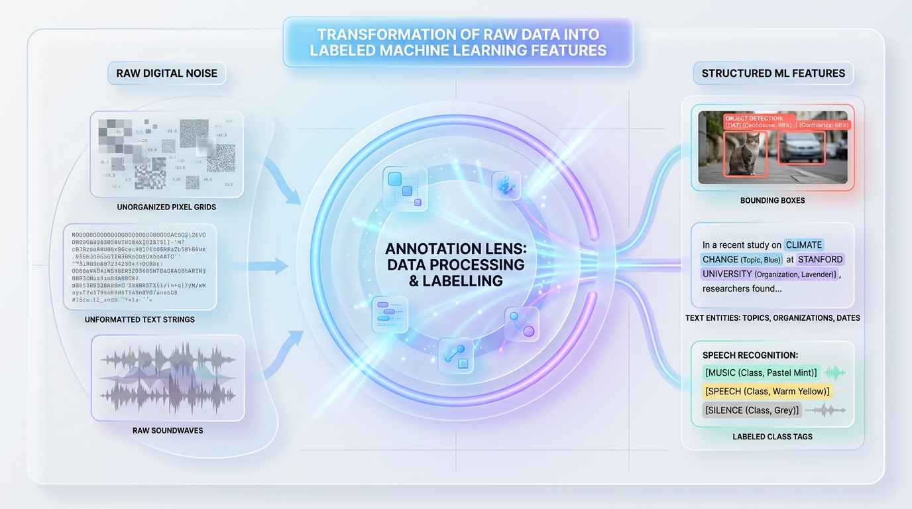
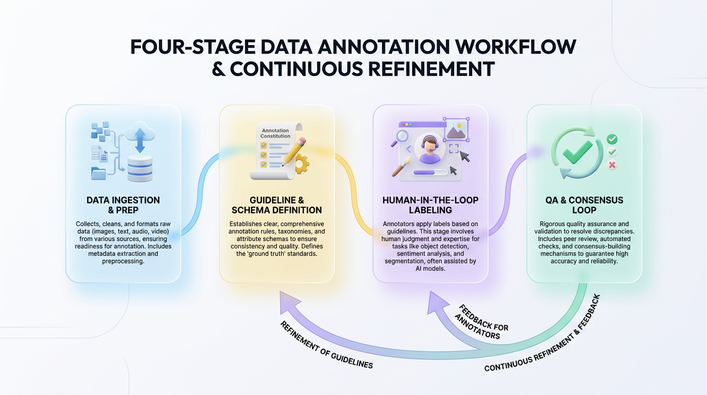
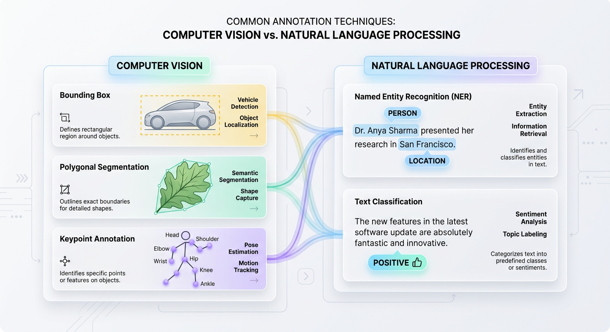

# Data Annotation Explained: From Pixels to Production-Ready AI

*Discover the essential process of data annotation, where raw data is labeled to train machine learning models. Learn the techniques that transform unstructured information into high-quality, AI-ready datasets for real-world applications.*


## A Practical Guide to Data Annotation for Machine Learning

*Discover the essential techniques, best practices, and production workflows for transforming raw, unstructured data into the high-quality training sets that power modern AI systems.*



*Figure 1: The Data Annotation Transformation — Turning unstructured digital noise into high-quality, labeled training data.*


## From Digital Noise to Actionable Insight

Organizations often hoard petabytes of raw data under the assumption that volume equals value. In reality, most of this data is just digital noise. To a machine learning model, an unlabeled database of images, text files, or audio logs is an incomprehensible maze of binary code. To unlock its potential, data must be translated into a language machines can understand. This translation process is data annotation.

To grasp this concept, consider how a child learns. A parent doesn't just show a toddler millions of random objects in silence. Instead, they point to a furry, four-legged animal and say, "Look, that is a dog." This explicit feedback is what enables learning. Data annotation serves as this essential "parental guidance" for artificial intelligence, creating the ground truth that models learn from.

At its mathematical core, supervised machine learning is the process of learning a function that maps a given input `X` to a target output `Y`. Raw datasets provide only the inputs `X`. Data annotation is the deliberate, human-driven process of defining the correct output `Y` for each `X`, enabling the model to calculate its error and iteratively improve its predictions.

| Data State | Representation | Model Usability |
| :--- | :--- | :--- |
| **Unlabeled (Raw)** | Inputs `X` Only | Unusable for Supervised Learning |
| **Labeled (Annotated)** | Input-Output Pairs (`X -> Y`) | Ready for Model Training & Evaluation |

Without this transformation, a pedestrian and a telephone pole are just neighboring clusters of pixels to an autonomous vehicle's sensor. Annotation provides the critical context, wrapping these pixel clusters in precise boundaries labeled "Pedestrian." This turns raw, depreciating data into the high-value, proprietary asset that truly powers modern AI.


## The Annotation Workflow: An Industrial Pipeline for Data

Data annotation is not a chaotic, one-off task but a highly structured, industrial assembly line. It’s a rigorous process designed to convert noisy, unstructured data into the pristine, consistent training signals that machine learning models require.

Think of this workflow like a Michelin-starred kitchen. You don’t simply throw raw ingredients on a plate. You meticulously source ingredients (data), write strict recipes (guidelines), train the chefs (annotators), taste-test every dish (quality assurance), and continuously refine the process based on feedback. This journey from raw data to a model-ready dataset follows a repeatable, four-stage pipeline.



*Figure 2: The End-to-End Data Annotation Lifecycle — A continuous loop from raw data ingestion to high-integrity model training datasets.*


```text
  [Raw Data] ---> [1. Ingestion & Prep]
                         |
                         v
                  [2. Guidelines & Schema] <---------+
                         |                           | (Refinement Loop)
                         v                           |
                  [3. HITL Annotation]               |
                         |                           |
                         v                           |
                  [4. Quality Assurance (QA)] -------+
                         |
                         v
                  [Model-Ready Dataset]
```

### Stage 1: Data Ingestion and Preparation

The pipeline begins by gathering raw assets—such as video frames, medical scans, or customer support logs. This data is then cleaned, deduplicated, and anonymized to protect user privacy before being uploaded to a specialized annotation platform.

### Stage 2: Guideline and Schema Definition

Engineers and domain experts collaborate to define the ontology of the project. This involves creating the **label schema** (the set of all possible labels) and the **annotation guidelines**. This document, often called a "labeling constitution," translates abstract business goals into deterministic, binary rules for human labelers.

> ✅ Best Practice: Never leave edge cases to an annotator's imagination. A robust guideline document is the cornerstone of quality. It must include clear definitions and visual examples of both correct (positive) and incorrect (negative) labels for every target class.

For example, in a self-driving car dataset, is a dusty bicycle on a car rack a "Vehicle," "Bicycle," or "Road Obstacle"? Clear guidelines eliminate this ambiguity, ensuring every annotator makes the same decision.

### Stage 3: Human-in-the-Loop (HITL) Annotation

With clear instructions in hand, human annotators use specialized software to apply labels to the data. This "human-in-the-loop" process is where the raw data is enriched with structured metadata, one asset at a time.

### Stage 4: Quality Assurance (QA) and Iteration

High-quality datasets are forged in the fire of QA. This critical stage involves a tight feedback loop between annotators and reviewers. To systematically eliminate human bias and error, teams rely on several core validation strategies:

*   **Consensus:** The same data asset is assigned to multiple independent annotators. If three annotators label a customer review as "Angry" but one labels it "Neutral," the system flags the asset for a supervisor to review and adjudicate.
*   **Gold Sets:** A set of pre-labeled assets with verified, undisputed ground-truth answers are secretly mixed into annotator queues. This acts as a continuous, automated test of individual annotator accuracy.
*   **Spot-Checking:** Senior domain experts perform random audits on completed batches to identify any systemic drift in labeling quality over time.

When reviewers find frequent disagreements on a specific label, it rarely signals worker error. Instead, it points to a flaw in the guidelines. This discovery triggers a refinement loop: the guidelines are clarified, the schema is updated, and the annotators are retrained. This iterative cycle continues until the dataset meets the target accuracy threshold required for production.


## A Tour of Common Annotation Techniques

Data annotation is not a one-size-fits-all process. The strategy you choose depends directly on your data modality (image, text, audio), your model architecture, and the specific task you aim to solve. Here’s a breakdown of the most prevalent techniques across major AI domains.

### Bounding Boxes

Bounding boxes are the workhorse of object detection. Annotators draw 2D rectangular boundaries around target objects, defining their location with four coordinates. This is the simplest and fastest way to localize discrete, non-overlapping objects, making it ideal for real-time applications like object tracking in video feeds.

Technically, a bounding box is represented as a vector of four numbers: `[x_min, y_min, x_max, y_max]` or `[x_center, y_center, width, height]`. These coordinates are often normalized (scaled between 0 and 1) relative to the image dimensions to ensure consistency across different resolutions.



*Figure 3: Multi-Modal Annotation Techniques — Visualizing spatial bounding methods in Computer Vision alongside semantic token extraction in NLP.*


```text
+--------------------------------------------------+
| (0,0) Image Origin                               |
|                                                  |
|        [Class: Car]                              |
|        +-------------------------+               |
|        | (x_min, y_min)          |               |
|        |                         |               |
|        |                         |               |
|        |          (x_max, y_max) |               |
|        +-------------------------+               |
|                                                  |
+--------------------------------------------(1,1)-+
```

### Polygonal Segmentation

When objects have irregular, non-rectangular shapes, bounding boxes are too imprecise, capturing excessive background noise. Polygonal segmentation solves this by having annotators trace the exact boundary of an object using a series of connected vertices. This is like using digital scissors to carefully cut out an object.

A polygon is represented as an ordered list of coordinate pairs: `[(x1, y1), (x2, y2), ..., (xn, yn)]`. While this method provides high-fidelity masks, the annotation time and cost increase with the object's complexity and the number of vertices required. This technique is critical for tasks requiring high precision, like identifying tumors in medical scans.

```text
             (x2, y2)
             *-------* (x3, y3)
            /         \
  (x1, y1) *           \
            \           * (x4, y4)
             \         /
              *-------* (x5, y5)
```

### Semantic Segmentation

While polygonal segmentation isolates individual object *instances*, semantic segmentation classifies every single pixel in an image into a predefined category (e.g., "Road," "Sky," "Building," "Pedestrian"). The output is not a set of object coordinates but a dense label mask with the same dimensions as the input image.

Imagine a digital paint-by-numbers canvas where every pixel must be colored according to its class. The result is a complete, panoramic understanding of the scene, which is essential for providing environmental context to autonomous vehicles and robots.

```text
Raw Image Matrix           Semantic Label Mask Matrix
+---------------+          +---------------+
|  Sky   | Sky  |    ==>   |   1   |   1   |  (Class 1 = Sky)
+---------------+          +---------------+
|  Road  | Tree |    ==>   |   0   |   2   |  (Class 0 = Road, Class 2 = Tree)
+---------------+          +---------------+
```

### Keypoint Annotation

Keypoint annotation, or landmarking, involves identifying specific points of interest on an object to track its posture, shape, or movement. Think of marking the pivot joints on an artist's mannequin—by tracking just those points, you can reconstruct the figure's entire pose.

Programmatically, keypoints are stored as an array of `(x, y)` coordinates, often with a visibility flag `v` (`[x, y, v]`). The flag indicates whether the point is visible, occluded, or outside the frame. This technique is fundamental for human pose estimation, facial expression analysis, and gesture recognition.

```text
      (Shoulder: x1, y1) *
                          \
                           \
                            * (Elbow: x2, y2)
                             \
                              \
                               * (Wrist: x3, y3)
```

### Text Classification

Moving into Natural Language Processing (NLP), text classification is the task of assigning a categorical label to a whole document, paragraph, or sentence. It’s analogous to sorting physical mail into folders like "Invoices," "Complaints," or "Marketing."

The annotation process maps a string of text to a single class label. This simple but powerful technique is the foundation for spam detection in email, sentiment analysis in social media feeds, and automated routing of customer service tickets.

```text
Raw Input: "I absolutely love this new keyboard layout!"
     |
     v
[Annotation Engine] ---> Label: POSITIVE (Confidence: 0.99)
```

### Named Entity Recognition (NER)

Named Entity Recognition (NER) goes a level deeper than classification. It involves identifying and labeling specific spans of text that represent real-world entities, such as people, organizations, locations, dates, and product names. This is like reading a contract and highlighting names in yellow, dates in green, and monetary values in pink.

NER annotations are typically represented as character-level or token-level offsets within the text, often using a format like the BIO (Begin, Inside, Outside) tagging scheme. It is essential for extracting structured data from unstructured documents, powering knowledge graphs and semantic search.

```text
[Apple Inc.](ORG) announced the release of the [iPhone 15](PRODUCT) in [September](DATE).
```

### Relation Extraction

Relation extraction builds on NER by defining the semantic relationships that exist *between* identified entities. First, you identify the entities (the nodes); then, you define the connections between them (the edges). For example, after identifying "Satya Nadella" as a `PERSON` and "Microsoft" as an `ORG`, relation extraction would establish the link `(Satya Nadella, is_ceo_of, Microsoft)`.

The output is a directed graph of triplets: `(Entity_A, Relation_Type, Entity_B)`. This technique is crucial for building large-scale knowledge bases and powering advanced link-analysis systems.

```text
+------------------+                    +------------------+
| Entity: CEO      |---( employed_by )->| Entity: Company  |
| "Satya Nadella"  |                    | "Microsoft"      |
+------------------+                    +------------------+
```

### Audio and Time-Series Annotation

Audio and time-series data add a temporal dimension, requiring annotations to be anchored to specific timestamps or intervals.

*   **Audio Annotation:** This includes tasks like transcription (what was said) and speaker diarization (who said it and when). Annotators segment an audio file and label each segment with speaker identity and transcribed text.
*   **Time-Series Annotation:** This involves tagging specific windows in a continuous stream of telemetry data. For example, an annotator might label the exact moments an EKG detects an irregular heartbeat or a sensor on an industrial machine shows anomalous readings.

```text
Audio Timeline:
00:00 [Speaker 1]: "Hello, welcome back."
00:03 [Speaker 2]: "Thanks for having me."

Telemetry Timeline:
[120, 122, 121, 500, 505, 120, 122]
                 |________|---> Anomaly Detected (Indices 3-4)
```

### Programmatic Representation in a Pipeline

To build automated ML pipelines, these varied annotations must be standardized into a consistent format, typically JSON. The following Python script shows how different annotation types are structured in a single payload.

```python
import json
from typing import Dict, Any

def create_annotation_payload() -> str:
    """
    Generates a structured annotation payload demonstrating how CV,
    NLP, and temporal data are represented programmatically.
    """
    payload: Dict[str, Any] = {
        "metadata": {
            "dataset_id": "ds_9082",
            "annotator_id": "usr_402",
            "asset_url": "s3://my-bucket/images/frame_1024.jpg"
        },
        "annotations": {
            "computer_vision": {
                # Bounding Box format: [x_min, y_min, width, height]
                "bounding_box": {
                    "label": "car",
                    "bbox_coords": [120, 85, 340, 210],
                    "confidence": 1.0
                },
                # Polygon format: list of [x, y] coordinates
                "polygon_segmentation": {
                    "label": "swimming_pool",
                    "vertices": [[20, 50], [45, 95], [110, 80], [85, 30]]
                }
            },
            "natural_language": {
                "text": "Steve Jobs founded Apple in Cupertino.",
                # NER Entities mapping exact character offsets
                "entities": [
                    {"start": 0, "end": 10, "label": "PERSON", "text": "Steve Jobs"},
                    {"start": 19, "end": 24, "label": "ORG", "text": "Apple"},
                    {"start": 28, "end": 37, "label": "GPE", "text": "Cupertino"}
                ],
                # Relation Extraction mapping links between entities
                "relations": [
                    {"head_entity_id": 0, "relation": "FOUNDED", "tail_entity_id": 1}
                ]
            },
            "time_series": {
                "metric_name": "cpu_utilization",
                # Temporal segments indicating an anomaly
                "anomalies": [
                    {"start_timestamp": 1700000100, "end_timestamp": 1700000180, "severity": "CRITICAL"}
                ]
            }
        }
    }
    return json.dumps(payload, indent=4)

if __name__ == "__main__":
    # Inspect the structured data payload
    structured_data = create_annotation_payload()
    print(structured_data)
```


## Matching Annotation Strategy to Your Application

Selecting the wrong annotation technique can stall a project before it starts. Over-engineering labels with unnecessary precision drains your budget, while under-engineering them starves your model of the context it needs to perform. The key is to match the annotation strategy directly to your business goal and your model's architectural requirements.

### Real-World Applications in Focus

*   **Autonomous Vehicles:** Self-driving cars require a multi-layered approach. **Semantic segmentation** is used to classify every pixel, distinguishing drivable road from sidewalks and sky. Simultaneously, **3D cuboids** are drawn around other vehicles and pedestrians to provide the crucial depth and volume data needed for collision avoidance and path planning.

*   **Medical Diagnostics:** In healthcare, precision is paramount. A simple bounding box around a tumor is often too coarse. Instead, radiologists and AI systems use meticulous **polygonal segmentation** to trace the exact, irregular boundaries of tumors in MRI and CT scans. This pixel-level accuracy enables models to track microscopic changes in volume, directly informing treatment plans.

*   **E-Commerce Search:** Modern retail search engines go beyond keyword matching to understand intent. By applying **Named Entity Recognition (NER)** to search queries like "waterproof blue Patagonia jacket," models extract structured attributes (`{"brand": "Patagonia", "color": "blue", "feature": "waterproof"}`). This allows the search engine to return highly relevant results instead of just a text match.

*   **Customer Support Automation:** Large contact centers face massive operational bottlenecks. By applying **text classification** and **intent recognition** to incoming support tickets, systems can automatically categorize messages ("Billing Issue," "Technical Bug," "Password Reset"). This enables intelligent routing, sending urgent issues to human agents while resolving routine queries with a chatbot.

### A Decision-Making Framework

Use this matrix to align your project's primary goal with the most efficient annotation methodology.

| Goal | Recommended Technique | Reason |
| :--- | :--- | :--- |
| **Quickly locate multiple discrete objects** | **Bounding Boxes** | Fastest to annotate and computationally efficient for real-time detection models like YOLO. |
| **Measure the exact size/shape of an object** | **Polygonal Segmentation** | Provides pixel-level accuracy for medical analysis or background removal, albeit at a higher annotation cost. |
| **Understand the complete scene context** | **Semantic Segmentation** | Classifies every pixel, providing a panoramic understanding required for environmental navigation. |
| **Track human posture or facial features** | **Keypoint Annotation** | Maps skeletal joint coordinates, critical for low-latency gesture tracking or biometric analysis. |
| **Classify the overall meaning of a document** | **Text Classification** | Assigns a single categorical label to text, enabling broad sentiment analysis and intent detection. |
| **Extract structured data from raw text** | **Named Entity Recognition** | Maps unstructured text spans to standardized database fields like names, dates, or product IDs. |

> 🚀 Production Tip: Start with the simplest annotation type that fulfills your minimum viable product (MVP) requirements. Only escalate to more complex, high-precision techniques like polygons or semantic segmentation when error analysis clearly shows that coarse labels are the primary bottleneck limiting your model's performance.


## Annotation Quality: The GIGO Principle in Practice

The performance of any machine learning model is fundamentally capped by the quality of its training data. This is the **Garbage In, Garbage Out (GIGO)** principle. If you feed a state-of-the-art model noisy, inconsistent, or incorrect labels, it will faithfully learn and replicate those errors in production.

> ⚠️ Common Mistake: Focusing on hyperparameter tuning to gain a 1% accuracy boost while ignoring the fact that 10% of the training labels are incorrect. A model cannot outperform the quality of its ground truth.

If your training data for a self-driving car contains images where stop signs are sometimes labeled "Traffic Sign" and other times "Obstacle," the model's loss function will struggle to converge. It will develop high variance, leading to unpredictable and dangerous real-world behavior.

### The Silent Killer: Ambiguous Guidelines

Most labeling errors are not caused by lazy annotators but by ambiguous instructions. When annotators have to guess how to handle an edge case, consistency plummets and dataset noise skyrockets.

*   **Poor Guideline:** "Label all cars in the image."
*   **Robust Guideline:** "Draw a tight bounding box around all four-wheeled passenger vehicles (sedans, SUVs, hatchbacks). Exclude commercial trucks, buses, and two-wheeled vehicles. If a vehicle is more than 50% occluded by a building, do not label it."

The robust guideline removes subjectivity. By providing explicit inclusion criteria, exclusion rules, and examples for edge cases, you ensure that different annotators will label the same asset identically.

### Quantifying Quality with Inter-Annotator Agreement

To systematically detect ambiguity, teams use **Inter-Annotator Agreement (IAA)**. This involves having multiple annotators label the same subset of data independently. By comparing their outputs, you can mathematically identify which labels or instructions are causing confusion. A common metric for this is **Cohen's Kappa**, which measures agreement while correcting for chance.

`Cohen's Kappa = (p_o - p_e) / (1 - p_e)`

Here, `p_o` is the observed proportional agreement among annotators, and `p_e` is the hypothetical probability of chance agreement.

```python
from sklearn.metrics import cohen_kappa_score

# Labels assigned by two independent annotators to 10 image samples
# Legend: 0 = No Hazard, 1 = Hazard
annotator_one = [0, 1, 1, 0, 0, 1, 1, 0, 0, 1]
annotator_two = [0, 1, 0, 0, 0, 1, 1, 1, 0, 1]

# A kappa score above 0.80 indicates excellent agreement.
# A score below 0.60 indicates poor guideline clarity.
kappa_score = cohen_kappa_score(annotator_one, annotator_two)

print(f"Computed Cohen's Kappa: {kappa_score:.3f}")

# Production pipelines can use this score as a circuit breaker.
# If kappa < 0.60, halt labeling and flag the guidelines for refinement.
```

### Choosing Your Tooling and Workforce

Your choice of annotation tools and labor force depends on your project's scale, budget, and data security needs.

| Goal | Recommended Approach | Reason |
| :--- | :--- | :--- |
| **High Security & Domain Expertise** | **In-House Team + Custom/Self-Hosted Tool** | Essential for sensitive IP (medical, financial data) and leverages specialized staff. |
| **Rapid Prototyping & Low Budget** | **Internal Engineers + Open-Source Tool** | Platforms like CVAT or Label Studio offer zero-cost setup for fast iteration cycles. |
| **High Volume & Standard Tasks** | **Fully-Managed Platform + BPO Vendor** | Outsources workforce management and QA overhead, scaling throughput dynamically. |


## Building the Right Mental Model

Data annotation should not be treated as a menial, post-development chore. It is the foundational architecture of your entire machine learning system. The label schema you define establishes the ontology of your model's world. If your schema for an autonomous vehicle fails to define a class for "animal crossing road," your model will remain fundamentally blind to that concept, no matter how large its architecture or how long it trains.

Think of your annotation guidelines as an API contract for human intelligence. The process of creating them is an iterative journey of discovering and resolving edge cases. Those highly ambiguous examples that force your annotators to pause and debate are your most valuable assets—they define the critical decision boundaries where your model will ultimately succeed or fail. When organizations treat labeling as low-effort work, they incur a massive, compounding technical debt that manifests as debugging nightmares in production.

> The goal is not just to label data quickly. The goal is to build a robust, scalable data engine that accurately transfers your domain experts' mental models into clean, machine-readable features.

To truly embrace a data-centric engineering culture, internalize these principles:

*   **Guidelines are Code:** Your annotation documentation is a living asset. It requires version control, peer review, and continuous maintenance just like your application's source code.
*   **QA is Your Test Suite:** Implement multi-annotator consensus and automated heuristic checks as your data's "integration tests" to catch noise and bias before they poison your model.
*   **Tooling is Infrastructure:** Investing in high-quality labeling interfaces and active learning pipelines is not a luxury. It is critical infrastructure that minimizes human cognitive fatigue and maximizes the signal-to-noise ratio of your training data.