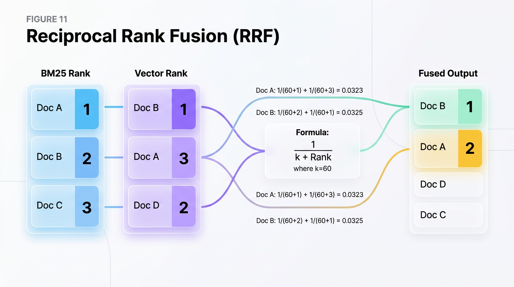
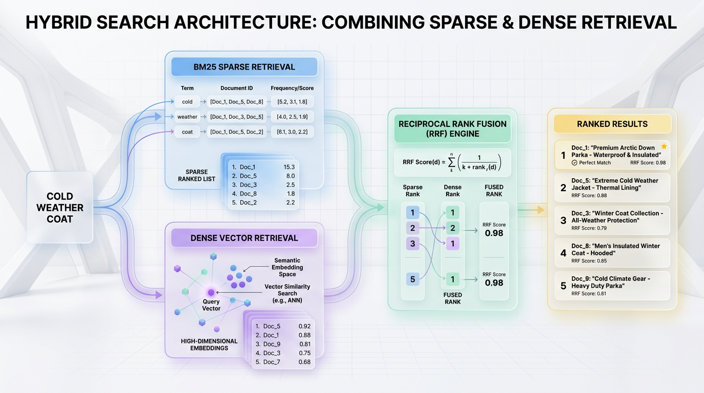

# Beyond Keywords: Building Hybrid Search with BM25 & Vectors

*Combine the precision of keyword-based BM25 with the contextual power of vector embeddings. This guide shows you how to design a superior hybrid search pipeline for truly relevant results.*


## Why Your Search Bar Fails: The Keyword vs. Context Dilemma

Imagine typing "coat for cold weather" into an e-commerce search bar, only to be met with zero results because the inventory lists those items as "winter parkas." Traditional search engines are fragile because they rely on exact character matches, failing the moment a user deviates from the catalog's precise vocabulary. Conversely, modern semantic systems can get lost in abstract meaning, returning "ski goggles" or "thermal socks" instead of an actual coat because they sit in the same conceptual neighborhood.

Think of your search engine as a library database. A pure keyword system is a strict index card catalog that only understands exact titles; if you ask for "tales of stars," it misses *The Constellation Guide*. A pure vector system is an over-enthusiastic librarian who handles your request for "stars" by handing you a telescope, a science fiction novel, and a map of Hollywood. 



*Figure 1: Reciprocal Rank Fusion (RRF) bypasses the problem of mismatched raw scores by evaluating only a document's relative position (rank) within each retriever's output, applying a constant penalty factor (k) to calculate a robust combined rank.*


### The Limits of Lexical and Semantic Isolation

Keyword search (typically powered by the **BM25** algorithm) calculates relevance based on exact term frequency and document length. While BM25 is incredibly fast and excels at finding specific product SKUs, serial numbers, or brand names (e.g., "Levi's 501"), it is entirely blind to synonyms. 

Vector search solves this by projecting text into high-dimensional space using **dense embeddings**, allowing the system to capture conceptual intent. However, vector search lacks a mechanism for hard constraints. A search for "Python 3.11 manual" might return generic Python 3.10 tutorials because they are semantically similar, ignoring the critical version constraint.

The core problem is that users naturally mix specific terms with general intent, and single-engine architectures are optimized for only one or the other. 

*   **Keyword Systems** excel at **precision** (finding "iPhone 15") but fail at **recall** (missing "Apple smartphone").
*   **Vector Systems** excel at **recall** (understanding that "chilly" means "cold") but fail at **precision** (confusing exact serial codes or part numbers).

| Goal | Recommended Technique | Reason |
| :--- | :--- | :--- |
| Find exact SKUs or serials | **BM25 / Keyword Search** | Requires exact token matching without semantic approximation. |
| Understand conceptual intent | **Dense Vector Search** | Maps synonyms and broad user queries to high-dimensional space. |
| Deliver production-grade search | **Hybrid Search** | Merges lexical precision with semantic depth for balanced ranking. |

### Bridging the Gap with Hybrid Search

To build a reliable production search experience, you cannot choose between precision and recall. **Hybrid search** solves this dilemma by executing both BM25 and vector queries in parallel, combining their strengths into a single, unified results list.

> 💡 **Architectural Insight:** By combining the deterministic matching of BM25 with the probabilistic reasoning of vector embeddings, hybrid search ensures your system captures both the exact terms users type and the deeper meaning behind them.


## The Two Pillars: Understanding BM25 and Vector Search

To build an effective hybrid search engine, we must first master the two fundamentally different technologies that power it. Search is no longer just about matching characters, nor is it solely about abstract concepts. It is about balancing surgical precision with deep semantic context.

### BM25: The Master of Exact Matches

**BM25 (Best Matching 25)** is a sparse retrieval algorithm that excels at finding exact keyword matches. It serves as the industry standard for traditional search, ranking documents based on how often search terms appear relative to the document's length. 

Think of BM25 as a **"Ctrl+F" tool on steroids**. Instead of blindly highlighting every match, it understands which words are rare and highly important (like "Kubernetes") versus which words are common and less meaningful (like "the" or "system").

Technically, BM25 relies on an **inverted index**, which is a highly optimized lookup table mapping individual words to the documents containing them. It calculates relevance scores using term frequency (how often a word appears in a specific document) and inverse document frequency (how unique that word is across your entire dataset). It also applies document length normalization, ensuring shorter, concise documents are not penalized simply for having fewer words.

### Vector Search: The Scholar of Semantic Context

**Vector Search** is a dense retrieval mechanism designed to understand user intent and conceptual meaning. It bypasses exact word matches entirely, focusing instead on the underlying ideas behind the language.

Imagine walking into a library organized not by book titles or alphabetical authors, but by **conceptual proximity**. Books about "baking sourdough" and "pastry techniques" are shelved side-by-side, even if they do not share a single word in their titles.

Under the hood, vector search converts raw text into dense, high-dimensional numerical arrays called **embeddings**. These embeddings are generated by deep learning models that place semantically similar concepts close together in a mathematical coordinate space. When a query is executed, the search engine calculates the distance—often using **Cosine Similarity** or **Euclidean Distance**—between the query vector and the document vectors to find the nearest neighbors.

### The Structural Divide: Words vs. Numbers

The core difference between these two technologies lies in how they represent and store data. While BM25 reads literal tokens, Vector Search navigates mathematical coordinates.

| Goal | Recommended Technique | Reason |
| :--- | :--- | :--- |
| **Exact Token Matches** | Sparse Retrieval (BM25) | Leverages an inverted index to instantly pinpoint product codes, serial numbers, or specific names. |
| **Conceptual Queries** | Dense Retrieval (Vector Search) | Uses high-dimensional embeddings to capture synonyms, intent, and cross-lingual meaning. |
| **Hybrid Balance** | Combined Search | Resolves individual weaknesses by blending keyword precision with semantic depth. |

> 💡 **Core Takeaway:** BM25 gives you surgical precision for exact, user-specified terms, while Vector Search provides a broad conceptual net. Combining them ensures you never miss a document due to synonym mismatches or exact-phrase requirements.

The diagram below illustrates how a single user query simultaneously splits into these two parallel architectural paths.

```text
                     [ User Query: "scalability in SQL databases" ]
                                           │
                 ┌─────────────────────────┴─────────────────────────┐
                 ▼                                                   ▼
       [ Sparse Pipeline ]                                 [ Dense Pipeline ]
      (Inverted Index Lookup)                          (Vector Space Distance)
                 │                                                   │
                 ▼                                                   ▼
         [ BM25 Scoring ]                                 [ Vector Similarity ]
     Matches exact term: "SQL"                           Analyzes concept: "scaling"
                 │                                                   │
                 ▼                                                   ▼
        Top-K Sparse Results                                Top-K Dense Results
                 │                                                   │
                 └─────────────────────────┬─────────────────────────┘
                                           ▼
                                [ Hybrid Fusion Layer ]
```


## Architecting a Hybrid Search Pipeline in Python

Modern search architectures must balance precision and recall. 
While keyword-based search excels at finding exact terms, names, and error codes, vector-based search excels at capturing conceptual meaning and synonyms. 



*Figure 2: The Hybrid Search architecture splits incoming user queries across dual pipelines: a BM25 engine for precise sparse keyword matching and a Vector Search engine for dense semantic context, fusing the results via Reciprocal Rank Fusion (RRF).*

Combining these two methodologies into a single, high-performance hybrid pipeline is the gold standard for production retrieval systems.

---

### The Architecture of Hybrid Search

A production-grade hybrid search pipeline operates as a dual-channel retrieval system. 
When a query enters the system, it is executed simultaneously across a lexical engine and a semantic engine.

```
                  ┌──────────────┐
                  │ User Query   │
                  └──────┬───────┘
                         │
         ┌───────────────┴───────────────┐
         ▼                               ▼
  ┌──────────────┐                ┌──────────────┐
  │ BM25 Engine  │                │ Vector Index │
  │ (Lexical)    │                │ (Semantic)   │
  └──────┬───────┘                └──────┬───────┘
         │                               │
         │ Candidate List A              │ Candidate List B
         ▼                               ▼
  ┌──────────────────────────────────────────────┐
  │         Reciprocal Rank Fusion (RRF)         │
  └──────────────────────┬───────────────────────┘
                         │
                         ▼
             ┌───────────────────────┐
             │ Final Ranked Results  │
             └───────────────────────┘
```

Think of this process as hiring two specialists to solve a crime. 
The first is an archivist who searches historical files for exact keyword occurrences. 
The second is a psychologist who evaluates the behavioral patterns of the suspect. 
Independently, both provide valuable but incomplete perspectives. 
The hybrid pipeline acts as the lead detective, merging these disparate insights into a single, cohesive narrative.

---

### Step 1: The Score Mismatch Problem

Before writing code, we must address why we cannot simply add lexical and semantic scores together. 
Lexical algorithms like BM25 calculate scores using term frequency, inverse document frequency, and document length normalization. 
This yields unbounded positive scores, typically ranging from 0 to 30 or higher depending on document length and query complexity.

Conversely, dense vector search calculates similarity using metrics like Cosine Similarity or Inner Product. 
These metrics yield tightly bounded scores, usually between -1 and 1, or 0 and 1. 

If you attempt to sum these raw values, the BM25 scores will completely overwhelm the vector scores. 
A document with a BM25 score of 12.4 and a vector score of 0.85 will behave no differently than a document with a vector score of 0.10. 
The semantic contribution is effectively reduced to background noise.

---

### Step 2: Reciprocal Rank Fusion (RRF)

To solve the score mismatch, we use **Reciprocal Rank Fusion (RRF)**. 
RRF is a scale-invariant algorithm that ignores the absolute scores entirely. 
Instead, it evaluates only the relative position (rank) of a document within each candidate list.

The formula for RRF is mathematically elegant:

`RRF_Score(d) = sum( 1 / (k + rank_m(d)) )`

Where:
* `d` is a document in the union of all retrieved document sets.
* `m` represents the retrieval system (in our case, BM25 and Vector).
* `rank_m(d)` is the 1-based rank of document `d` in system `m`.
* `k` is a smoothing constant, typically set to `60`, which prevents documents ranked at the very top from completely dominating the final score.

> 💡 **Design Choice:** We choose RRF over Min-Max scaling because scaling requires knowing the maximum and minimum possible scores of the active dataset. In real-time search, these bounds fluctuate wildly with every unique query, making Min-Max scaling unstable and sensitive to extreme statistical outliers.

---

### Step 3: Complete Python Implementation

The following complete, runnable Python script implements a dual-retriever pipeline from scratch. 
It defines a simple corpus, implements a BM25 engine using TF-IDF principles, simulates dense vector retrieval using Euclidean embeddings, and fuses them using RRF.

```python
import math
import numpy as np
from typing import List, Dict, Tuple

# 1. Define a sample corpus representing software engineering topics
CORPUS = {
    0: "How to deploy deep learning models on Kubernetes clusters.",
    1: "Optimizing database queries and indexing for high throughput systems.",
    2: "A complete guide to container orchestration and Kubernetes scaling.",
    3: "Modern machine learning model deployment strategies in production.",
    4: "Speeding up raw SQL database queries with indexing techniques."
}

class LexicalBM25:
    """A lightweight BM25 implementation for exact keyword matching."""
    def __init__(self, corpus: Dict[int, str]):
        self.corpus = corpus
        self.doc_lengths = {idx: len(text.lower().split()) for idx, text in corpus.items()}
        self.avg_doc_len = sum(self.doc_lengths.values()) / len(corpus)
        self.df = self._calculate_df()
        self.k1 = 1.5
        self.b = 0.75

    def _calculate_df(self) -> Dict[str, int]:
        df = {}
        for text in self.corpus.values():
            words = set(text.lower().split())
            for word in words:
                df[word] = df.get(word, 0) + 1
        return df

    def score(self, query: str) -> List[Tuple[int, float]]:
        query_words = query.lower().split()
        scores = []
        num_docs = len(self.corpus)

        for doc_id, text in self.corpus.items():
            doc_words = text.lower().split()
            word_counts = {word: doc_words.count(word) for word in query_words}
            score = 0.0
            
            for word in query_words:
                if word not in self.df:
                    continue
                # Calculate Inverse Document Frequency (IDF)
                idf = math.log((num_docs - self.df[word] + 0.5) / (self.df[word] + 0.5) + 1.0)
                # Apply BM25 term frequency scaling formula
                tf = word_counts[word]
                numerator = tf * (self.k1 + 1)
                denominator = tf + self.k1 * (1 - self.b + self.b * (self.doc_lengths[doc_id] / self.avg_doc_len))
                score += idf * (numerator / denominator)
                
            scores.append((doc_id, score))
            
        # Return results sorted by descending BM25 score
        return sorted(scores, key=lambda x: x[1], reverse=True)


class SemanticVectorSearch:
    """Simulates vector search using dense cosine similarity on mock embeddings."""
    def __init__(self):
        # Pre-calculated mock embeddings mapping to our 5 documents
        # Dimension 3: [Cloud/K8s concept, DB concept, AI/ML concept]
        self.embeddings = {
            0: np.array([0.9, 0.1, 0.8]),  # K8s + ML
            1: np.array([0.1, 0.9, 0.2]),  # Database high-throughput
            2: np.array([0.95, 0.1, 0.1]), # Pure K8s
            3: np.array([0.4, 0.1, 0.95]), # Pure ML deployment
            4: np.array([0.1, 0.95, 0.1])  # Pure SQL database
        }

    def search(self, query_vector: np.ndarray) -> List[Tuple[int, float]]:
        scores = []
        for doc_id, doc_vector in self.embeddings.items():
            # Calculate Cosine Similarity
            dot_prod = np.dot(query_vector, doc_vector)
            norm_q = np.linalg.norm(query_vector)
            norm_d = np.linalg.norm(doc_vector)
            similarity = dot_prod / (norm_q * norm_d)
            scores.append((doc_id, float(similarity)))
            
        return sorted(scores, key=lambda x: x[1], reverse=True)


def reciprocal_rank_fusion(
    lexical_results: List[Tuple[int, float]], 
    vector_results: List[Tuple[int, float]], 
    k: int = 60
) -> List[Tuple[int, float]]:
    """Applies Reciprocal Rank Fusion to merge two ranked lists of document IDs."""
    rrf_scores = {}
    
    # Process lexical results
    for rank, (doc_id, _) in enumerate(lexical_results, start=1):
        if doc_id not in rrf_scores:
            rrf_scores[doc_id] = 0.0
        rrf_scores[doc_id] += 1.0 / (k + rank)
        
    # Process vector results
    for rank, (doc_id, _) in enumerate(vector_results, start=1):
        if doc_id not in rrf_scores:
            rrf_scores[doc_id] = 0.0
        rrf_scores[doc_id] += 1.0 / (k + rank)
        
    # Sort documents by their calculated RRF score
    return sorted(rrf_scores.items(), key=lambda x: x[1], reverse=True)


# --- Execution Walkthrough ---
if __name__ == "__main__":
    # Query: "How to deploy machine learning models on Kubernetes"
    query_text = "deploy machine learning models Kubernetes"
    
    # 1. Execute Lexical Search
    bm25_engine = LexicalBM25(CORPUS)
    lexical_output = bm25_engine.score(query_text)
    
    # 2. Execute Semantic Search (Query vector highly aligns with ML [idx 2] and K8s [idx 0])
    query_vector = np.array([0.8, 0.1, 0.9])
    vector_engine = SemanticVectorSearch()
    vector_output = vector_engine.search(query_vector)
    
    # 3. Fuse Results using RRF
    fused_output = reciprocal_rank_fusion(lexical_output, vector_output, k=60)
    
    # Display Results
    print(f"Query: '{query_text}'\n")
    print("--- BM25 Rankings ---")
    for doc_id, score in lexical_output:
        print(f"Doc {doc_id} (Score: {score:.4f}): {CORPUS[doc_id]}")
        
    print("\n--- Vector Rankings ---")
    for doc_id, score in vector_output:
        print(f"Doc {doc_id} (Score: {score:.4f}): {CORPUS[doc_id]}")
        
    print("\n--- Fused Rankings (RRF) ---")
    for doc_id, score in fused_output:
        print(f"Doc {doc_id} (RRF Score: {score:.6f}): {CORPUS[doc_id]}")
```

---

### Understanding the Output Dynamics

Notice the rank transition when analyzing the output from the execution script above:

1. **The Lexical Search** ranks Document 0 first because of exact matches on "deploy", "learning", "models", and "Kubernetes". It scores Document 3 lower due to the absence of "Kubernetes".
2. **The Vector Search** identifies Document 3 as highly relevant because its latent embedding closely matches the concepts of "ML deployment", even though it lacks structural syntax matches.
3. **The Fused RRF Output** safely balances these forces. Document 0, which appeared at the top of both lists, claims the absolute top spot. More importantly, Document 3 is lifted above purely lexical matches because the vector channel validated its semantic relevance.

| Goal | Recommended Technique | Reason |
| :--- | :--- | :--- |
| **Simple Scalability** | Reciprocal Rank Fusion (RRF) | Zero hyperparameter tuning required; highly stable across shifting corpus distributions. |
| **Score Normalization** | Min-Max Normalization | Best suited for clean, static data environments where global maximum bounds are known. |
| **Max Precision** | Cross-Encoder Re-ranking | Uses transformer attention layers to score candidate pairs, though at significantly higher CPU cost. |

---

### Production Realities: Latency and Concurrency

When running hybrid search at scale, processing sequential queries across multiple engines introduces unacceptable latency bottlenecks. 

> ✅ **Best Practice:** Execute lexical and vector queries concurrently using asynchronous patterns (such as Python's `asyncio` or thread pools). Because RRF processing runs in `O(N log N)` time where `N` is the combined candidate count, your retrieval latency is bound strictly by the slower of your two database engines, not their sum.


## Real-World Applications

Pure lexical search fails when users describe intent without exact keywords, while pure vector search often misses precise alphanumeric identifiers. Hybrid search solves this by running dual pipelines in parallel, merging exact token matching with dense vector representations. This dual-engine approach transforms raw search infrastructure into a high-conversion business asset across diverse industries.

| Goal | BM25 Focus (Lexical) | Vector Focus (Semantic) |
| :--- | :--- | :--- |
| **E-Commerce Conversion** | Part numbers, exact brand names, SKUs | User intent (e.g., "comfortable footwear for running") |
| **Corporate RAG Accuracy** | Proprietary project codes, document IDs | Conceptual objectives, cross-departmental themes |
| **Support Ticket Resolution** | Alphanumeric error codes, log traces | Conversational descriptions of technical issues |
| **Specialized Research** | Exact drug names, specific statute numbers | Clinical symptoms, conceptual legal precedents |

### Consumer-Facing Systems

In e-commerce, a customer searching for "lightweight running shoes" needs a system that respects both product specifications and underlying intent. BM25 anchors the query to hard attributes like "shoes" and "running," while the vector model understands the semantic equivalence of "lightweight" (such as "breathable mesh" or "minimalist build"). This hybrid precision directly drives sales by surfacing long-tail inventory that keyword matching alone would miss. 

Similarly, customer support automation relies on this dual-force architecture to parse user issues. A support bot uses BM25 to locate exact hexadecimal error codes (e.g., `0x8F002`) from log files, while simultaneously leveraging vector search to understand a user's conversational description of the crash. 

### High-Stakes Information Retrieval

Within enterprise Retrieval-Augmented Generation (RAG), systems must search internal databases for highly specific project codes (e.g., "Project Delta") while answering abstract questions about project timelines. Combining BM25 and vector search prevents LLM hallucination by grounding generative models in exact, verified source documents. 

This grounding is equally vital in legal and medical research. Lawyers and doctors can query databases for precise statutory sub-clauses or pharmaceutical compounds while simultaneously retrieving conceptually related research papers that may use alternative terminology. 

> ✅ Best Practice: When deploying hybrid search in production, use Reciprocal Rank Fusion (RRF) to normalize and merge BM25 and vector scores, ensuring that alphanumeric precision and conceptual relevance are weighted equally.


## When Should You Use Which Approach?

Choosing the right search architecture is not a one-size-fits-all decision. It is a balancing act between exact-match precision, semantic understanding, and operational complexity.

Think of **BM25 (Sparse)** as the index at the back of a textbook—perfect for looking up a specific term. **Vector (Dense)** search is like a librarian who understands the conceptual theme of your question, even if you do not use the exact words. **Hybrid Search** combines both, acting as the ultimate researcher.

To engineer a production-grade system, you must align your retrieval strategy with your data characteristics and latency budgets.

| Goal | Recommended Technique | Reason |
| :--- | :--- | :--- |
| Find documents with exact keywords, SKUs, or error codes. | BM25 (Sparse) | Unmatched precision for lexical matching. Fast, efficient, and requires no ML model. |
| Discover conceptually related content or answer abstract questions. | Vector (Dense) | Excels at understanding semantic meaning, synonyms, and user intent beyond keywords. |
| Build a robust, general-purpose search for diverse user queries. | Hybrid Search | Combines BM25's precision with Vector's recall, creating a fault-tolerant system. |
| Maximize relevance when content contains both jargon and concepts. | Hybrid Search | Neither system alone can handle both specific terminology and broad ideas effectively. |
| Implement a very low-latency search with minimal infrastructure. | BM25 (Sparse) | Simpler architecture with lower computational and operational overhead than vector search. |

> 💡 **Best Practice:** When deploying **Hybrid Search**, always pair it with a fusion algorithm like **Reciprocal Rank Fusion (RRF)**. This step normalizes and merges the disparate score distributions of BM25 and Vector search without requiring manual, fragile weight tuning.


## Production-Ready Hybrid Search: Tuning and Pitfalls

Deploying hybrid search to production requires balancing two fundamentally different retrieval paradigms. While keyword search relies on exact term frequencies, vector search relies on high-dimensional semantic proximity. 

### Tuning the Fusion

To combine results from BM25 and vector search, systems must merge two distinct list formats. Reciprocal Rank Fusion (**RRF**) accomplishes this without requiring normalized scores, relying instead on the relative position of items. 

Imagine you are looking for a restaurant based on two different local food guides. Instead of trying to average their incompatible rating scales, you simply look at which restaurants appear consistently near the top of both lists. 

The influence of lower-ranked items is controlled by a constant, `k`. Mathematically, the formula is expressed as:

`RRF_Score(d) = Sum_over_retrievers( 1 / (k + rank_retriever(d)) )`

In this formula, `rank_retriever(d)` is the 1-based rank of document `d` in a specific retriever. If `k` is set too low (e.g., 10), top-ranked documents from either retriever dominate the final output. If `k` is set high (e.g., 100), the difference in score between rank 1 and rank 50 flattens, giving more influence to consistently mediocre matches across both lists. 

```python
def reciprocal_rank_fusion(bm25_results, vector_results, k=60):
    """
    Computes RRF scores for documents retrieved from two different search paths.
    
    Why: RRF prevents score scale mismatch problems by using rank instead of raw scores.
    We default k to 60 as established by standard IR literature to balance top vs. deep ranks.
    """
    rrf_scores = {}
    
    # Process BM25 rankings
    for rank, doc_id in enumerate(bm25_results, start=1):
        rrf_scores[doc_id] = rrf_scores.get(doc_id, 0.0) + (1.0 / (k + rank))
        
    # Process Vector rankings
    for rank, doc_id in enumerate(vector_results, start=1):
        rrf_scores[doc_id] = rrf_scores.get(doc_id, 0.0) + (1.0 / (k + rank))
        
    # Sort documents by descending RRF score
    sorted_docs = sorted(rrf_scores.items(), key=lambda item: item[1], reverse=True)
    return sorted_docs

# Example usage: Product IDs returned from both search methods
bm25_hits = ["prod_A", "prod_B", "prod_C"]
vector_hits = ["prod_B", "prod_D", "prod_A"]

print(reciprocal_rank_fusion(bm25_hits, vector_hits, k=60))
```

> 💡 **Best Practice:** Always A/B test your fusion strategies. While RRF is excellent when score scales are unknown, Weighted Relative Score Fusion (`Score = w * Normal(BM25) + (1-w) * Normal(Vector)`) performs better when you can reliably normalize your vector cosine distances.

---

### Performance and Cost Implications

Running hybrid search means maintaining two distinct database technologies. You must pay the operational tax of running an inverted index alongside a vector database with **HNSW** (Hierarchical Navigable Small World) graphs. 

This architectural setup doubles your indexing write path. Every document update must simultaneously update the term index and generate an embedding via a neural network model.

| Goal | Recommended Technique | Reason |
| :--- | :--- | :--- |
| **Reduce Query Latency** | Two-Stage Retrieval (Filter First) | Avoids running expensive vector calculations on documents that fail hard metadata criteria. |
| **Lower Memory Footprint** | Product Quantization (PQ) | Compresses vector dimensions in memory at the cost of minor recall accuracy. |
| **Optimize Write Throughput** | Asynchronous Embedding Generation | Decouples document ingestion from immediate vector generation using a message queue. |

---

### Handling Mismatched Results

Production queries often expose the weaknesses of one retriever over another. For instance, when a user searches for an exact serial number like "PX-9902", the embedding model might return irrelevant electronics because it does not recognize the exact token, whereas BM25 pinpoints the target document instantly. 

Conversely, for highly abstract queries like "troubleshooter for slow startup", BM25 might return zero results, while the vector database shines. 

```
[User Query: "PX-9902"]
       │
       ├──► BM25 Index ─────► Returns ["doc_9902"] (Exact Match)
       │
       └──► Vector Index ───► Returns [] or Irrelevant semantic matches
       │
[Conditional Fusion Check] ──► Low/Zero Vector overlap? ──► Fallback: Serve BM25 only.
```

To prevent garbage results from polluting your application, implement **conditional fusion fallbacks**. If the vector search similarity score falls below a strict threshold (e.g., 0.70 cosine similarity), or if BM25 returns zero hits, bypass the fusion step entirely and serve the healthy retriever's payload.

---

### The Embedding Model Dependency

Your vector search is only as good as the underlying embedding space. General-purpose models from external API providers perform well on conversational text, but fail when confronted with specialized domains like medicine, legal documents, or proprietary system logs. 

If your data contains specialized jargon, using an off-the-shelf model will lead to poor semantic alignment. You must choose between the ease of API-driven models and the performance of self-hosted, domain-specific fine-tuned models.

* **Off-the-Shelf Models:** Best for rapid prototyping and general search. They require zero infrastructure setup but struggle with proprietary terminology.
* **Domain Fine-Tuning:** Necessary for specialized vocabularies. Fine-tuning a model (such as a BERT variant) on your target corpus ensures query intent matches document semantics, though it introduces GPU maintenance costs.


## What the Architecture Reveals

Many engineering teams treat search as a zero-sum game, pitting lexical precision against semantic depth. They spend months benchmarking **BM25** against **dense vector embeddings**, searching for a single victorious algorithm. This architecture reveals that this entire premise is a fundamental design flaw. 

Instead of a single model, production-grade retrieval requires an architectural pattern of mutual resilience. Think of it like a hybrid vehicle: it uses an electric motor for stop-and-go city driving, and an internal combustion engine for high-speed highway cruising. Neither is "better"; they are engineered to cover each other's kinetic inefficiencies. 

By coupling BM25 with dense vectors, you construct a system where the exact-match capability of keyword indexers guards against the semantic drift of vector spaces. This architecture explicitly plans for multiple, concurrent modes of information seeking without forcing users to adapt to rigid database schemas.

| Query Intent | Optimal Engine | Mitigation Strategy |
| :--- | :--- | :--- |
| Exact Serial Numbers | Lexical (BM25) | Bypasses vector embedding tokenization loss |
| Conceptual Queries | Semantic (Vector) | Solves vocabulary mismatch via vector space clustering |
| Mixed/Messy Input | Hybrid Fusion | Merges rankings using Reciprocal Rank Fusion |

> 💡 **Engineering Reality:** True robustness in search systems does not come from finding a single, perfect model. It comes from orchestrating complementary, flawed components so that their failure modes do not overlap.

Ultimately, this architecture reveals that state-of-the-art search is not about discovering a magical, all-knowing algorithm. It is about acknowledging that human language is too complex for any single mathematical representation. By building a parallel, multi-modal pipeline, you ensure your system degrades gracefully under the weight of real-world user behavior.