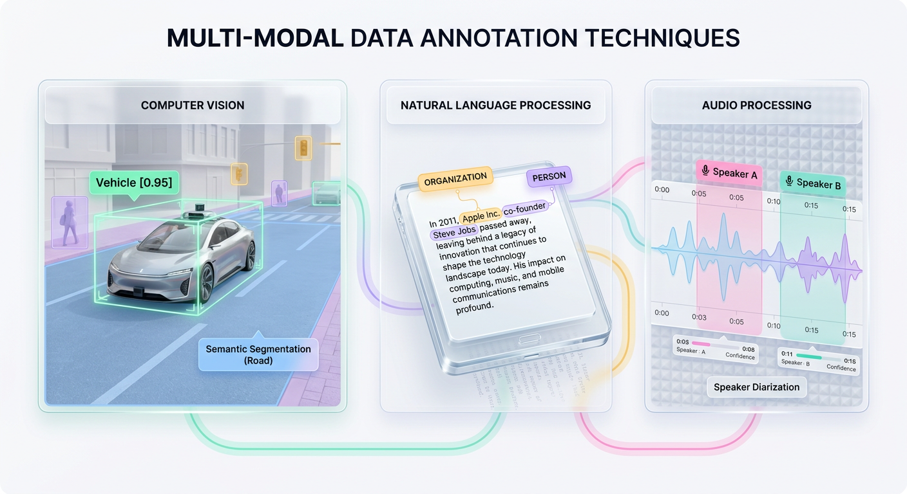
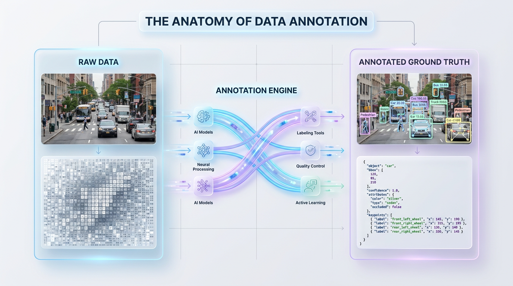
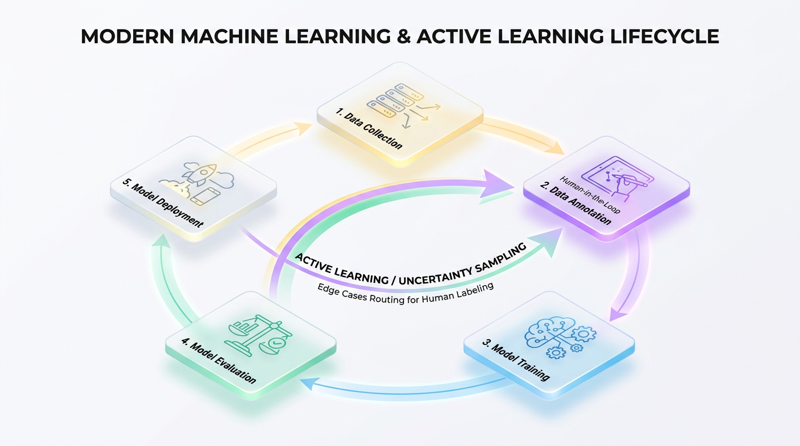

# Data Annotation: Fueling the Next Wave of Accurate AI Models

*Discover the critical process of data annotation, where raw data is transformed into high-quality training fuel for machine learning. This guide covers the techniques, tools, and strategies for building accurate AI.*


## The Engineer's Guide to Data Annotation: Building Production-Ready AI

*Transform raw data into high-quality, structured datasets. This guide covers the essential techniques, quality control guardrails, and architectural mindset needed to build reliable production AI systems.*

To a state-of-the-art neural network, the world begins as utter chaos. Modern AI models start as blank slates, unable to deduce meaning from raw pixels, audio waves, or unstructured text. They cannot learn without a guide.

Data annotation is the process of acting as that guide. Think of teaching a child to recognize objects. You don't just sit them in front of a window; you point to a vehicle and say, "That is a car." Annotation is this exact process of "pointing and naming," translated for machine learning algorithms. It bridges the gap between meaningless raw data and the structured information models need to learn.


## The Foundation of AI: From Raw Data to Ground Truth

For a computer, an unannotated image is just a matrix of pixel intensities—numbers representing red, green, and blue values. To transform this into something a supervised learning model can use, we must add semantic structure. This explicit mapping of inputs to targets is what allows a model to calculate error, update its internal weights, and generalize to new, unseen data.

Consider the difference between a raw image file and its annotated data point:

```json
// Raw Data: raw_image.jpg (A grid of 1920x1080 pixel values)

// Annotated Data:
{
  "image_path": "dataset/train/cat_04.jpg",
  "annotations": [
    {
      "label": "cat",
      "bbox": [124, 350, 412, 680] // [x_min, y_min, width, height]
    }
  ]
}
```

This annotated dataset establishes the **ground truth**—the objective, verified reality the model uses as a benchmark. In supervised learning, algorithms learn a function `f(X) = Y`, where `X` is the raw input data and `Y` is the target label provided by annotators. Without a validated ground truth, it's impossible to calculate core performance metrics like precision and recall, leaving engineers blind.

> ⚠️ **Common Mistake:** The engineering rule of "Garbage In, Garbage Out" reigns supreme in AI. If your training labels are noisy, inconsistent, or incorrect, your model will faithfully learn those exact errors, compromising its performance in production.

Annotation is not a one-time task but the engine of an iterative development loop. The ML lifecycle demonstrates this continuous flow:

```text
[ Data Collection ] ➔ [ Data Annotation ] ➔ [ Model Training ]
       ▲                                             │
       │────────── [ Active Learning Loop ] ◄────────[ Evaluation ]
                                                     │
                                              [ Deployment ]
```

When evaluation reveals model failures on edge cases, engineers must collect and annotate new data to correct these blind spots, retraining the model on an updated and more robust ground truth.


## A Tour of Data Annotation Techniques

Raw data is a silent resource. To transform this unstructured mass into high-performance features, engineers rely on data annotation. The techniques you deploy will vary dramatically across data modalities and project goals. Let's take a structured tour of these methods to understand how raw bytes become actionable signals.

### Computer Vision Annotation

In computer vision, annotation bridges the gap between raw pixel arrays and spatial intelligence. Models must learn not just what objects are in a frame, but where they are and how they interact.

*   **Bounding Boxes:** Drawing 2D rectangular coordinates around target objects. This is the most cost-effective and common technique for object detection.
*   **Polygon Segmentation:** Tracing the exact outer boundaries of irregular shapes. This is critical when background noise inside a bounding box would confuse the model.
*   **Semantic Segmentation:** Labeling every single pixel in an image with a class category (e.g., "road," "sky," "car"). All pixels of a class share one identity, with no individual instance boundaries.
*   **Keypoint Annotation:** Marking specific coordinate points on an object to track pose, skeletal structure, or facial expressions.

**The Real-World Analogy:** A bounding box is like placing a sticky note over an item. Polygon segmentation is like carefully cutting out that item with scissors. Semantic segmentation is akin to using different colored highlighters for every category on the page. Keypoint annotation is like pinning thumbtacks into the joints of a mannequin.



*Figure 1: Data annotation takes different specialized forms depending on the modality, ranging from bounding boxes in computer vision to named entities in text and diarization segments in audio.*


**Technical Implementation:** Computer vision datasets are typically exported in standardized JSON formats like COCO. Here’s how bounding boxes and keypoints are represented programmatically:

```json
{
  "image_id": 4092,
  "file_name": "street_scene_01.jpg",
  "annotations": [
    {
      "id": 101,
      "category_id": 1, // "Pedestrian"
      "bbox": [412, 320, 85, 220], // [x_min, y_min, width, height]
      "keypoints": [
        450, 330, 2, // [x, y, visibility (2 = visible)]
        455, 390, 2,
        460, 480, 1  // [x, y, visibility (1 = occluded)]
      ],
      "iscrowd": 0
    }
  ]
}
```

### Natural Language Processing Annotation

Text is symbolic, dense, and highly contextual. NLP annotation transforms strings of characters into structured semantic tokens that models like LLMs can interpret.

*   **Named Entity Recognition (NER):** Locating and tagging specific entities within text, such as people, organizations, dates, and locations.
*   **Text Classification:** Assigning a single categorical label to an entire sentence, paragraph, or document.
*   **Sentiment Analysis:** A subset of text classification that maps text to an emotional scale (e.g., positive, negative, neutral).

**The Real-World Analogy:** NER is like using a highlighter to mark all client names and deadlines in a memo. Text classification is sorting that entire memo into the "Urgent" filing cabinet. Sentiment analysis is deciding if the memo's tone is polite, angry, or professional.

**Technical Implementation:** In frameworks like spaCy, training data is often represented as character offset spans within a document.

```python
# Training data for a Named Entity Recognition (NER) pipeline
training_data = [
  {
    "text": "Alex joined OpenAI on October 24, 2023, in San Francisco.",
    "entities": [
      {"start": 0, "end": 4, "label": "PERSON"},
      {"start": 12, "end": 18, "label": "ORG"},
      {"start": 22, "end": 38, "label": "DATE"},
      {"start": 43, "end": 56, "label": "GPE"} // Geopolitical Entity
    ],
    "sentiment": "NEUTRAL"
  }
]
```

### Audio Annotation

Audio signals are continuous, time-varying waveforms. To make these acoustic vibrations machine-readable, annotations must slice them along both temporal and spectral dimensions.

*   **Audio Transcription:** Converting speech into structured text, often matching timestamps to individual words.
*   **Speaker Diarization:** Solving the "who spoke when" problem by segmenting audio and assigning unique speaker IDs to temporal boundaries.
*   **Sound Event Detection (SED):** Pinpointing the start and end times of distinct non-speech sounds (e.g., "glass breaking," "sirens").

**The Real-World Analogy:** Transcription is a court reporter typing every word. Speaker diarization is adding "The Judge:" or "The Defendant:" next to each statement. Sound Event Detection is the reporter noting *(Gavel bangs)* in the transcript.

### Advanced Data Modalities

Modern systems extend far beyond static images and text, requiring specialized annotation frameworks.

*   **3D Point Clouds (LiDAR):** In autonomous driving and robotics, annotators draw 3D bounding cuboids around objects in a point cloud. These cuboids require nine degrees of freedom: position `[x, y, z]`, dimensions `[length, width, height]`, and rotation `[roll, pitch, yaw]`. This allows a system to calculate an object's depth, speed, and trajectory.
*   **Time-Series Telemetry:** For industrial IoT or medical monitoring, annotation involves identifying and labeling anomalies (sudden spikes) or specific pattern trends in continuous data streams. These labels train models to predict machine failures or cardiac events.


## Real-World Applications of Data Annotation

Data annotation transforms chaotic, real-world inputs into structured fuel for machine learning. Think of raw data as crude oil; unrefined, it cannot power an engine. Annotation is the refinery, converting raw signals into high-octane labeled datasets that power specialized business outcomes.

### Driving Revenue in E-Commerce

Modern e-commerce platforms rely on recommendation engines to drive product discovery. By labeling user behavior data—such as clicks, add-to-cart events, and historical purchases—systems learn to map user intent. This structured behavioral pipeline directly powers personalized suggestions, resulting in measurable lifts in average order value and customer retention.

### High-Stakes Vision in Healthcare and Autonomy

In safety-critical industries, annotation precision is non-negotiable. Expert radiologists annotate medical images like MRIs to isolate tumors and fractures. This gold-standard data trains diagnostic models that assist physicians with faster, more accurate clinical triage. Similarly, autonomous vehicles rely on semantic segmentation and 3D point cloud annotation to classify lanes, pedestrians, and obstacles, turning raw sensor data into safe, predictable actions.

### Optimizing Operations with NLP

Customer support centers process millions of unstructured text logs daily. By labeling emails and chat history for **intent classification** (e.g., "billing inquiry" vs. "technical bug") and **sentiment analysis**, companies build highly efficient automated routing systems. These models drastically lower response times and reduce support ticket backlogs, directly impacting operational costs.



*Figure 2: Data annotation transforms unstructured, raw files into structured data points with geometric bounds and label metadata, creating explicit target labels for machine learning.*


## The Annotation Ecosystem: Tools, Platforms, and People

Data annotation is a dynamic operational pipeline. The success of any ML system relies on the orchestration of your workforce, tooling, and quality control processes.

### Sourcing the Right Annotation Workforce

Choosing your annotators is a critical architectural decision that impacts data quality, speed, security, and budget.

*   **In-house Teams:** Ideal for highly specialized or sensitive domains like medical imaging. This model provides direct oversight, deep domain expertise, and strict data privacy control, but it is the most expensive and least scalable option.
*   **Managed Outsourcing:** A balanced approach where vendors like Scale AI or Appen provide vetted, trained labelers and manage operations. This mitigates overhead while ensuring quality through service-level agreements (SLAs).
*   **Crowdsourcing:** Platforms like Amazon Mechanical Turk offer massive scale for simple, non-sensitive tasks at a low cost. However, this approach requires rigorous statistical filtering and quality control to manage inherent noise from a distributed, non-expert workforce.

### Choosing Your Platform: Commercial vs. Open Source

Your software platform coordinates the labeling process, tracks annotator performance, and versions your datasets.

*   **Commercial Platforms:** Tools like Labelbox and V7 function as end-to-end data engines. They offer built-in workforce management, automated consensus scoring, and active learning pipelines, simplifying operations for enterprise teams.
*   **Open-Source Tools:** Utilities like CVAT (Computer Vision Annotation Tool) and Label Studio offer complete control and customization. They can be self-hosted, integrated into private cloud environments, and modified without licensing fees, making them ideal for teams with specific security or workflow requirements.

### Human-in-the-Loop and Active Learning

Labeling every single data point is inefficient and expensive. Production systems use **Human-in-the-Loop (HITL)** and **Active Learning** to focus human effort where it matters most. The model identifies samples where its prediction confidence is lowest and sends only those challenging examples to human annotators.

The following script shows how to select uncertain samples using **Shannon Entropy**, a measure of uncertainty. Samples with high entropy (where the model's predictions are close to a uniform distribution) are the most valuable for human review.



*Figure 3: Data annotation is not a static milestone, but an iterative pipeline within the machine learning lifecycle that continuously refines model performance through active learning.*


```python
import numpy as np

def get_uncertain_samples(predictions: np.ndarray, n_samples: int = 5) -> np.ndarray:
    """Selects the most uncertain samples based on class probability entropy."""
    # Add a tiny epsilon to prevent log2(0) runtime errors
    epsilon = 1e-9
    
    # Calculate Shannon Entropy: H(x) = -Σ (p_i * log2(p_i))
    entropy = -np.sum(predictions * np.log2(predictions + epsilon), axis=1)
    
    # Get the indices of the highest entropy samples
    uncertain_indices = np.argsort(entropy)[-n_samples:]
    
    return uncertain_indices[::-1] # Return sorted by highest uncertainty

# Simulation: 3 data points, 3 target classes
model_outputs = np.array([
    [0.90, 0.05, 0.05],  # Sample A: High confidence (Low Entropy)
    [0.40, 0.35, 0.25],  # Sample B: Moderate uncertainty (Medium Entropy)
    [0.33, 0.33, 0.34]   # Sample C: Maximum uncertainty (High Entropy)
])

# The system will prioritize Sample C and Sample B for human labeling.
print("Indices flagged for human review:", get_uncertain_samples(model_outputs, n_samples=2))
```

> ✅ **Best Practice:** Always create detailed labeling guidelines. These documents act as the functional specification for your human workforce, defining edge cases and providing "gold standard" examples. Clear guidelines are the foundation of label consistency and model accuracy.


## Matching Annotation Strategy to Engineering Goals

Choosing the right annotation technique is a trade-off between speed, cost, and precision. An overly complex method wastes budget, while an overly simple one prevents your model from learning critical features. Always start with the simplest format that meets your performance requirements.

| Goal | Recommended Technique | Reason |
| :--- | :--- | :--- |
| **Quickly locate objects in an image** | Bounding Boxes | Fastest and cheapest method for object detection. Sufficient if precise shape is not needed. |
| **Isolate an object's exact shape** | Polygon Segmentation | Required for pixel-level accuracy (e.g., background removal, medical image analysis). |
| **Ensure safe autonomous driving** | 3D Point Cloud Cuboids | Necessary for precise spatial depth, velocity calculation, and collision planning. |
| **Extract key topics from documents** | Named Entity Recognition (NER) | Essential for information extraction, knowledge graphs, and contextual chatbots. |
| **Route customer support tickets** | Text Classification | A simple, effective way to categorize documents for automated workflows. |
| **Predict factory equipment failure** | Time-Series Anomaly Labeling | Recognizes warning signatures and abnormal spikes in continuous sensor data. |

> 🚀 **Production Tip:** Don't over-engineer annotations. If your model achieves production accuracy with 2D bounding boxes, avoid the high cost of semantic segmentation. Keep your schema as lightweight as your target metrics allow.


## Production Guardrails: Ensuring High-Quality Labels

Raw data is inherently ambiguous. When annotators label complex data, subjectivity introduces **label noise**. This is like asking three referees to call a marginal penalty; their interpretations will differ. If unchecked, noisy training data degrades model performance.

To combat subjectivity, engineering teams must mathematically measure consensus using **Inter-Annotator Agreement (IAA)** metrics. For two annotators, we use **Cohen’s Kappa**; for three or more, we use **Fleiss’ Kappa**.

Cohen's Kappa is calculated as `κ = (Po - Pe) / (1 - Pe)`, where `Po` is the observed agreement and `Pe` is the probability of chance agreement. A low Kappa score (e.g., `κ < 0.70`) can automatically trigger a review, sending the ambiguous data point to a domain expert for arbitration.

### The Honeypot Strategy for Auditing

To proactively measure annotator performance, production pipelines inject hidden **gold standard** (or **honeypot**) tasks into the labeling queue. These are pre-labeled, verified benchmarks that test an annotator's accuracy in real time.

This script demonstrates an automated quality auditor that flags underperforming annotators by checking their submissions against a gold standard dataset.

```python
class QualityAuditor:
    def __init__(self, gold_standards: dict, rejection_threshold: float = 0.85):
        """Initializes the auditor with gold standard labels and a quality threshold."""
        self.gold_standards = gold_standards
        self.rejection_threshold = rejection_threshold

    def evaluate_annotator(self, annotator_id: str, submissions: list) -> dict:
        """Evaluates annotator performance against hidden gold standards."""
        matched_tasks = 0
        correct_labels = 0

        for sub in submissions:
            if sub['task_id'] in self.gold_standards:
                matched_tasks += 1
                if sub['label'] == self.gold_standards[sub['task_id']]:
                    correct_labels += 1
        
        if matched_tasks == 0:
            return {"status": "insufficient_data", "score": None}

        accuracy = correct_labels / matched_tasks
        flagged = accuracy < self.rejection_threshold

        return {
            "annotator_id": annotator_id,
            "accuracy": round(accuracy, 2),
            "flagged_for_retraining": flagged
        }

# Example: Annotator gets 2 of 3 honeypots correct (67%), failing the 85% threshold.
gold_data = {101: "Positive", 102: "Negative", 103: "Neutral"}
auditor = QualityAuditor(gold_standards=gold_data, rejection_threshold=0.85)
submissions = [
    {"task_id": 101, "label": "Positive"},
    {"task_id": 102, "label": "Positive"},  # Incorrect
    {"task_id": 103, "label": "Neutral"}
]
print(auditor.evaluate_annotator("annotator_99", submissions))
# Output: {'annotator_id': 'annotator_99', 'accuracy': 0.67, 'flagged_for_retraining': True}
```

High-quality annotation is a continuous loop. When disagreements or honeypot failures occur, they highlight flaws in your labeling taxonomy. This feedback fuels a quality flywheel where experts resolve ambiguities and engineers update the guidelines, constantly refining the ground truth.


## Building the Right Mental Model

Many engineering teams treat data annotation as a tedious chore to be completed before the "real" ML work begins. This is a fundamental architectural mistake. Your data annotation pipeline is your model's foundational curriculum. A cheap, poor-quality curriculum guarantees a poorly performing model, regardless of how sophisticated your neural network is.

During annotation, human assumptions and edge-case resolutions are systematically encoded into your dataset. Your labeling guidelines don't just reduce noise; they explicitly construct the boundaries of the model's worldview. When a model fails in production, it's rarely due to a flawed loss function. It is almost always because the training data lacked a clear representation of that specific real-world scenario.

To build robust AI, you must shift from simply writing training scripts to actively designing the data-generation engine. Treat annotator agreement metrics and quality-control loops with the same rigor you apply to hyperparameter tuning.

| Legacy Perspective | Modern Engineering Reality | Actionable Shift |
| :--- | :--- | :--- |
| Annotation is a one-time operational cost. | Annotation is the core differentiator of system performance. | Allocate dedicated engineering hours to active learning loop design. |
| Guidelines are informal instructions. | Guidelines are the pseudo-code for semantic feature extraction. | Version-control your labeling guidelines alongside your model code. |
| Labeling is a static pre-training phase. | Labeling is an iterative, continuous refinement loop. | Integrate production drift detection directly into annotation queues. |

> ✅ **Best Practice:** A machine learning system's success is determined not in the final lines of a training script, but in the first, careful decisions made during data annotation. Do not outsource your model's core intelligence. Build, validate, and version your data with the same discipline you apply to production source code.