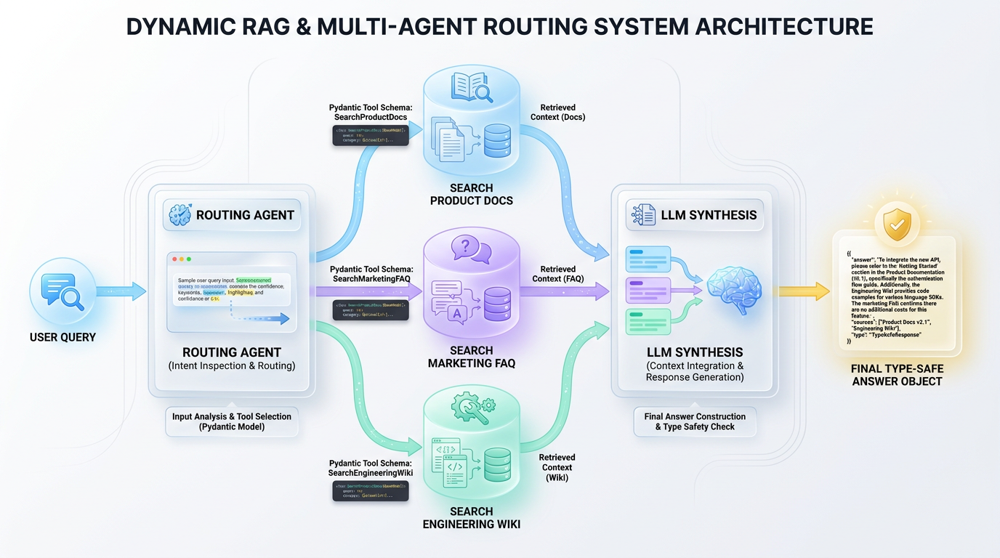
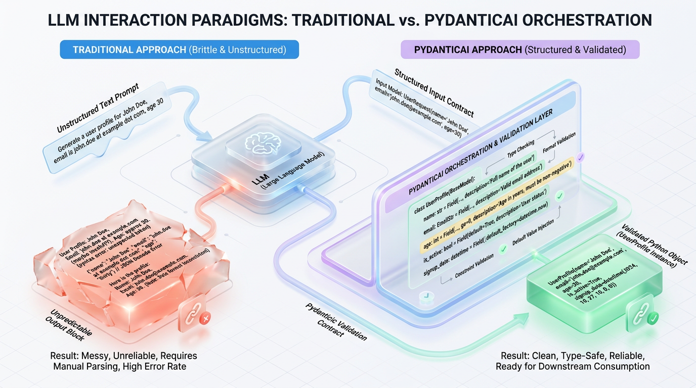
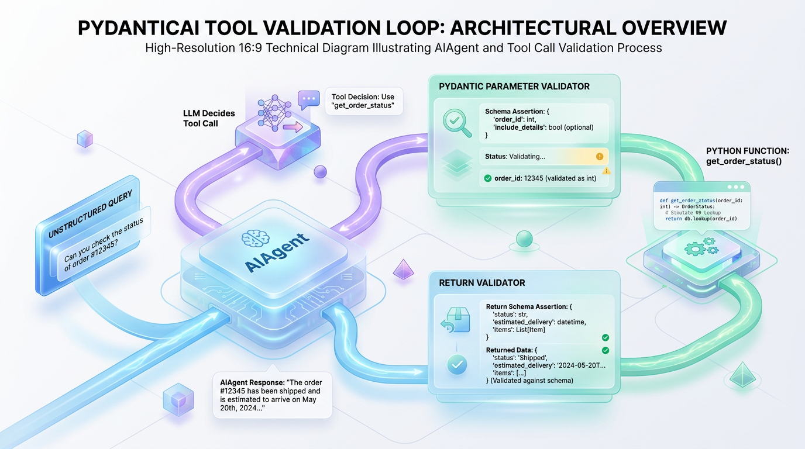

# PydanticAI: Build Production AI Agents with Pythonic Guardrails

*Go beyond simple prompts and learn how to build reliable, production-grade AI agents. Discover how PydanticAI uses type safety and structured data to make your agent's behavior predictable and maintainable.*


## Building Reliable AI Agents with Python and PydanticAI

*Move beyond brittle prompts and unpredictable outputs. This guide explores how to use Python's native type system with PydanticAI to build production-grade, schema-enforced AI agents that are reliable by design.*

We have all been there. You build an AI-powered prototype in an afternoon, and it feels like magic. But the moment you deploy it to production, the magic fades into engineering chaos. Unstructured, non-deterministic LLM outputs break downstream databases, turning your elegant application into a fragile house of cards.



*Figure 1: Intelligent dynamic RAG architecture utilizing tool-based classification to route user intent to specialized context repositories.*


Imagine constructing a high-rise building. Relying solely on raw prompts to guide your AI is like molding a foundation out of wet clay; it is highly flexible but structurally unpredictable. To build a system that lasts, you need a steel frame that enforces structure, validates boundaries, and guarantees shape. In modern Python development, that steel framework is static typing. This operational reality has triggered a critical paradigm shift: **programming with types, not just prompts**.

Instead of pleading with an LLM via prompt engineering to "return valid JSON," we can use Python's native type system to enforce strict data schemas at the runtime boundary. By embedding validation directly into our code, we transform unpredictable natural language into reliable, structured data. This is where **PydanticAI** enters the ecosystem, bringing battle-tested software engineering principles to the world of generative AI.

> 💡 Tip: Stop treating LLMs as creative writers. Start treating them as non-deterministic engines that must compile to deterministic Python types.

PydanticAI, developed by the creators of Pydantic, treats LLMs not as mysterious black boxes but as predictable, typed components of a Pythonic codebase. It allows you to transition from fragile prototypes to production-ready systems by enforcing type safety, structured validation, and clean dependency injection.

| Operational Vector | The Brittle Prompt Way | The PydanticAI Way |
| :--- | :--- | :--- |
| **Output Schema** | Pleading with prompts ("Please return JSON") | Enforced via native Python **Type Hints** |
| **Error Handling** | Complex string parsing and regular expressions | Automatic schema validation and self-correction |
| **State Management** | Global variables or custom wrappers | Clean, testable **Dependency Injection** |

This article explores how to leverage PydanticAI to build robust, maintainable AI agents that operate with the same reliability as your traditional backend services.


## The Pydantic Philosophy for Controlling LLMs

Large Language Models (LLMs) are fundamentally probabilistic text predictors. While their creativity is an asset for drafting essays, it is a liability when building production software that expects predictable API payloads. PydanticAI solves this by establishing a strict **data contract** between your application logic and the LLM, transforming chaotic text generation into deterministic runtime execution.

### Structured Schemas as Data Contracts

Think of this data contract like a digital customs form. Instead of asking a traveler (the LLM) to "describe your luggage in a free-text letter," you hand them a structured form with pre-defined checkboxes and input fields. If they write "banana" in the "passport number" field, the system instantly rejects it at the border before it can cause downstream system failures.

Under the hood, PydanticAI compiles Python type hints into a **JSON Schema**. This schema is injected directly into the LLM's system prompt or passed via tool-calling APIs. The LLM is no longer just generating text; it is executing a constrained search over tokens that must strictly conform to your specified schema.



*Figure 2: Traditional brittle text-based prompting vs. PydanticAI's structured data contracts, forcing LLMs to output fully-validated, type-safe Python objects.*


```python
from pydantic import BaseModel, EmailStr, Field
from pydantic_ai import Agent

# Define the exact data contract we expect from the LLM
class UserDetail(BaseModel):
    name: str = Field(description="The user's full name")
    email: EmailStr = Field(description="A valid, validated email address")
    signup_year: int = Field(description="The year the user joined")

# Initialize the PydanticAI Agent with the expected output schema
agent = Agent(
    'openai:gpt-4o',
    result_type=UserDetail,
    system_prompt="Extract user details from the provided unstructured text."
)

# The input text is messy, but the output will be a clean Python object
unstructured_input = "John Doe joined us last year, hit him up at john.doe@example.com."
result = agent.run_sync(unstructured_input)

# Print the fully validated Pydantic object
print(result.data)
# Output: UserDetail(name='John Doe', email='john.doe@example.com', signup_year=2023)
```
In this setup, the `EmailStr` type and custom `Field` descriptions serve dual purposes. The LLM reads the description as a semantic instruction, while Pydantic uses the type hint as an active runtime validation constraint.

### The Run-Time Validation Loop

What happens when the LLM generates an invalid email address like `john.doe@notanemail`? In traditional frameworks, your application would crash with a parsing error. PydanticAI implements an **automatic self-correction loop** to resolve this. When a validation error occurs, the framework catches the traceback and sends it directly back to the LLM with a correction request. The LLM is told exactly *why* its previous output failed, allowing it to self-correct and return a valid payload in a subsequent attempt.

| Output Control Strategy | Target Use Case | Failure Mode & Behavior |
| :--- | :--- | :--- |
| **Unstructured Text** | Creative writing, chatbots, summarization | Hallucinations, parsing errors, unpredictable schemas |
| **Raw JSON Generation** | Internal tools, simple data scraping | Syntax errors (missing commas), schema drift |
| **PydanticAI Models** | Production APIs, multi-agent chains | Validated, type-safe objects with auto-retry loops |

> ✅ Best Practice: Never trust raw LLM output in production pipelines. Always wrap your LLM interactions in a Pydantic model to guarantee type safety and runtime stability.


## Architecting Your First PydanticAI Agent

With the core philosophy of type-enforced contracts established, let's move from theory to practice. Architecting an agent in PydanticAI means defining your target output structure as a Pydantic model and letting the framework handle the complex mechanics of LLM interaction, schema enforcement, and error correction.

Think of a traditional LLM API call as ordering a custom suit from a tailor who speaks a different language; you might get a suit, but the measurements could easily be wrong. PydanticAI acts as a precise, automated blueprint-checker. It translates your structural specifications (the Pydantic schema) into instructions the LLM cannot ignore and then double-checks the finished product before delivering it to your application.

The **PydanticAI Agent** class orchestrates the entire process. It coordinates the **LLM runner** (e.g., OpenAI, Gemini), the **system prompt**, and the **result type validator**. When executed, it compiles your Pydantic model into a JSON schema, passes it to the LLM's structured output API, and validates the response. If validation fails, its built-in retry loop automatically requests a correction from the model.

### Implementing a Structured Data Extractor

To see this in action, let's build a production-grade extraction agent. This agent will take a raw, unstructured invoice and convert it into a strictly validated, deeply nested Python object.

```python
import os
from datetime import date
from typing import List
from pydantic import BaseModel, Field
from pydantic_ai import Agent

# Define the target structured schema using standard Pydantic
class LineItem(BaseModel):
    description: str = Field(description="The name or description of the item purchased")
    quantity: int = Field(description="The quantity of the item purchased")
    price: float = Field(description="The unit price of the item in USD")

class Invoice(BaseModel):
    vendor: str = Field(description="The name of the vendor issuing the invoice")
    invoice_number: str = Field(description="The unique identifier or invoice number")
    due_date: date = Field(description="The payment due date in YYYY-MM-DD format")
    items: List[LineItem] = Field(description="List of individual line items on the invoice")
    total_amount: float = Field(description="The total amount due on the invoice")

# Initialize the Agent, passing our target Pydantic model into 'result_type'.
invoice_agent = Agent(
    'openai:gpt-4o-mini',
    result_type=Invoice,
    system_prompt=(
        "You are an expert financial assistant. Analyze the unstructured input "
        "and extract the invoice details accurately. Ensure all numbers are cast "
        "to correct types and dates are in standard YYYY-MM-DD format."
    )
)

# Unstructured, messy text representing an email draft of an invoice
raw_invoice_text = """
Hey Team, 
We just got billed by ACME Industrial Services. The invoice ID is ACME-2024-X992. 
They said the payment is due by November 15, 2024. 

Here is what we bought:
- 5x Enterprise Cloud Nodes at $120.00 each
- 1x Setup & Architecture Consulting Package for $350.00

The grand total comes out to exactly $950.00. Please process this as soon as possible!
"""

if __name__ == "__main__":
    # Ensure OPENAI_API_KEY is configured in your environment variables
    print("Sending unstructured text to PydanticAI Agent...")
    result = invoice_agent.run_sync(raw_invoice_text)
    
    # Access the validated Python object directly from the result
    invoice_data: Invoice = result.data
    
    # Demonstrate type safety and IDE autocomplete capabilities
    print("\n--- Extraction Successful! ---")
    print(f"Vendor: {invoice_data.vendor}")
    print(f"Invoice Number: {invoice_data.invoice_number}")
    print(f"Due Date: {invoice_data.due_date} (Type: {type(invoice_data.due_date)})")
    print(f"Total Amount: ${invoice_data.total_amount:.2f}")
    print("\nLine Items:")
    for item in invoice_data.items:
        print(f"  - {item.quantity}x {item.description} @ ${item.price:.2f}")
```

### Analyzing the Execution Lifecycle

When you trigger `invoice_agent.run_sync()`, PydanticAI orchestrates several background mechanics. Because `due_date` is annotated as a `datetime.date` object, the framework doesn't just accept any string the LLM outputs. Instead, it validates the format and parses it into a native Python `date` object before returning it to your application. This automated validation and type coercion is the core value proposition.

| Strategy | Execution Complexity | Validation & Guarantees |
| :--- | :--- | :--- |
| **Raw LLM Calls** | Low initial complexity, but requires manual parsing and high maintenance. | Zero validation. High risk of runtime failures in production. |
| **Manual Pydantic Validation** | Medium complexity. You must write the request, parse JSON, and handle exceptions. | Good validation, but you must build your own LLM repair loops. |
| **PydanticAI Agent** | Minimal complexity. A single definition encapsulates the entire workflow. | Full guarantees with built-in validation, error feedback, and retries. |

> 🚀 Production Tip: When choosing models, use modern endpoints like GPT-4o-mini or Gemini 1.5 Flash that natively support JSON schema mode. PydanticAI automatically leverages these to ensure faster inference and lower error rates.


## Unlocking Agentic Behavior with Tools

To transform an LLM from a passive text synthesizer into an active, decision-making agent, you must grant it agency. In modern AI architectures, agency is achieved by exposing external systems, databases, and APIs to the model through **Tools**. Tools act as the hands and eyes of the agent, allowing it to interact dynamically with the real world instead of relying solely on its static training data.

### From Knowledge to Action

Imagine a brilliant logistics manager who has memorized every company policy but is locked in a room without internet or database access. While they can explain the *theory* of tracking an order, they cannot tell you where your specific package is right now. Giving an agent tools is like handing that manager a computer terminal with live database access.

> 💡 Tip: In PydanticAI, tools are not complex wrapper classes. They are simply type-hinted Python functions decorated with `@agent.tool`, turning your existing business logic directly into agent capabilities.

When you decorate a function, PydanticAI uses runtime reflection to inspect its signature and docstring. It maps Python types to their JSON Schema equivalents and uses the docstring as the tool's description for the LLM. This allows the agent to understand what the tool does and what arguments it requires.



*Figure 3: The PydanticAI Agent Tool Cycle: The LLM's function arguments and execution results are strictly validated against Pydantic schemas at every step.*


```python
from pydantic import BaseModel, Field
from pydantic_ai import Agent, RunContext

# Define structured output for the tool
class OrderStatus(BaseModel):
    order_id: int
    status: str
    estimated_delivery: str

# Instantiate the agent with a targeted system prompt
support_agent = Agent(
    'openai:gpt-4-turbo',
    system_prompt="You are an autonomous support assistant. Help customers track their orders."
)

@support_agent.tool
def get_order_status(ctx: RunContext[None], order_id: int) -> OrderStatus:
    """Retrieve the real-time shipping status and delivery estimate for a specific order.

    Args:
        ctx: The runtime context of the agent execution.
        order_id: The unique 5-digit integer identifier of the order.
    """
    # Pydantic validates 'order_id' is an integer before this code runs.
    # In production, you would perform a database query here.
    if order_id == 99482:
        return OrderStatus(
            order_id=99482, 
            status="In Transit", 
            estimated_delivery="2026-03-30"
        )
    return OrderStatus(
        order_id=order_id, 
        status="Processing", 
        estimated_delivery="Delayed"
    )

# Execute the agent
result = support_agent.run_sync("Where is my order #99482?")
print(result.data)
```

### The Closed-Loop Execution Cycle

The interaction between the agent, tools, and the validation layer occurs in a secure, closed loop. When a user submits a query, the agent evaluates whether it needs external data. If so, it identifies the correct tool and constructs a payload with the extracted arguments. Pydantic then intercepts this payload, validating that the inputs strictly match the function's type hints. Only after successful validation does the tool execute, returning a structured object that is injected back into the LLM's context to formulate the final response.

```
[User Prompt] ➔ [LLM Identifies Tool] ➔ [Pydantic Validates Arguments]
                                                   │
[Final Answer] 🔀 [LLM Parses Output] ◀ [Tool Execution] ◄┘
```

This cycle ensures that your business logic is never executed with invalid data, dramatically reducing the risk of runtime errors.


## PydanticAI vs. Other Frameworks

Selecting an AI orchestration framework is a critical architectural decision that impacts development speed, debugging complexity, and production reliability. Instead of seeking a one-size-fits-all solution, you must match the framework to your team's engineering maturity and system requirements.

Imagine building a commercial kitchen. LangChain is like renting a fully equipped catering hall; it has every gadget imaginable, but rearranging the layout is incredibly difficult. Building from scratch is like constructing a kitchen from raw steel, giving you total control at the cost of implementing your own plumbing and safety systems. PydanticAI is like a modern modular kitchen—it provides the precise structural integrity and validation you need while letting you choose your own appliances.

This operational difference manifests in how state and validation are handled. Traditional frameworks often wrap LLM calls in deep abstractions, which can hide underlying network requests and make stack traces difficult to read. PydanticAI, by contrast, leverages Python’s native typing and Pydantic's validation engine to inspect inputs and outputs at the agent boundary. This approach shifts potential runtime failures into predictable validation errors before they cascade through your system.

| Goal | Recommended Approach | Reason |
| :--- | :--- | :--- |
| **Maximum Reliability & Type Safety** | **PydanticAI** | Built from the ground up for data validation and structured outputs, reducing runtime errors and simplifying integration with existing systems. |
| **Rapid Prototyping & Broad Toolset** | **LangChain** | Its vast library of components is optimized for speed of experimentation, though it can lead to more complex debugging and steeper learning curves. |
| **Full Control & Minimal Dependencies** | **Build From Scratch** | Provides total transparency and minimal overhead but requires you to build your own logic for tool use, retries, and schema parsing. |

> ✅ Best Practice: If your downstream applications rely on strict database schemas or structured APIs, PydanticAI is the most robust choice. It eliminates the fragile "prompt-and-pray" paradigm by treating the LLM as a typed, verifiable function call.


## Production Guardrails: Observability, Testing, and Error Handling

Transitioning an AI agent from a local notebook to a production environment requires shifting your mindset from "it usually works" to "it fails predictably." In production, LLMs are volatile dependencies. PydanticAI tames this volatility by treating agent workflows as standard, observable, and testable software components.

### End-to-End Observability with OpenTelemetry

You cannot debug what you cannot see. When an agent fails, you need to know if the failure was due to a bad prompt, a misconfigured tool, or a validation error. PydanticAI natively instrumentates agent execution using **OpenTelemetry (OTel)**, creating a flight data recorder for your LLM's reasoning loop.

This instrumentation breaks down the agent’s internal "thought process" into clear parent-child spans. When an agent receives a prompt, calls a tool, fails validation, retries, and finally succeeds, this entire sequence is captured as nested spans in your APM dashboard. This visibility is crucial for diagnosing schema validation issues and recovery attempts in real-time.

> ✅ Best Practice: Set up your OpenTelemetry collector early in development. Having tracing parity between staging and production ensures that edge-case schema failures are caught before they impact users.

### Resilient Error Handling and the Dead-Letter Queue

Even with automated retries, an LLM will occasionally hallucinate schemas so severely that validation fails repeatedly. Simply raising a raw traceback crashes your application and ruins the user experience. A resilient system must catch validation exhaustion, fall back to a safe state, and route the malformed payload to a **Dead-Letter Queue (DLQ)** for offline analysis.

```python
from pydantic import BaseModel, ValidationError
from pydantic_ai import Agent, ModelRetryFailed

class UserProfile(BaseModel):
    username: str
    age: int

# Initialize agent with a maximum of 2 validation retry attempts
profile_agent = Agent(
    "openai:gpt-4o",
    result_type=UserProfile,
    max_retries=2
)

async def safe_agent_execution(user_input: str) -> UserProfile:
    try:
        result = await profile_agent.run(user_input)
        return result.data
    except (ValidationError, ModelRetryFailed) as err:
        # Log the raw payload and error context to your DLQ for prompt optimization
        log_to_dead_letter_queue(user_input, str(err))
        
        # Return a graceful fallback payload to keep the system running
        return UserProfile(username="anonymous_fallback", age=0)

def log_to_dead_letter_queue(original_input: str, error_message: str):
    # In production, route this to SQS, RabbitMQ, or an evaluation database
    print(f"[DLQ ALERT] Input: '{original_input}' | Error: {error_message}")
```

### Testing and Versioning Agents as Code

Prompts and Pydantic schemas are application code and must be treated with the same rigor as database migrations. To ensure reliability, you should write unit tests that mock the LLM provider, validating that specific inputs correctly trigger your agent's tools and produce the expected schema.

| Goal | Recommended Technique | Reason |
| :--- | :--- | :--- |
| **Track Agent Decisions** | OpenTelemetry Spans | Exposes nested tool calls and validation retry loops in real-time. |
| **Handle Schema Drift** | Dead-Letter Queue (DLQ) | Prevents system crashes by isolating unparseable LLM payloads for review. |
| **Prevent Regressions** | Mocked Unit Tests | Asserts prompt modifications do not break tool routing or output schemas. |

> 🚀 Production Tip: Never deploy a prompt change without running your evaluation suite. Since PydanticAI binds schemas tightly to Python classes, version-control your prompts alongside your Pydantic models to ensure system integrity.


## What a Pythonic AI Architecture Reveals

Adopting PydanticAI reframes AI agent development from an unpredictable prompt-engineering guessing game into a rigorous **software architecture** discipline. Instead of pleading with a large language model to return valid JSON, you define strict **data contracts** using the standard Python type hints your team already knows and uses.

Think of this approach like a high-speed railway system. Instead of letting a powerful locomotive steer itself across open terrain, you lay down rigid steel tracks. The LLM acts as the raw engine, while Pydantic schemas serve as the tracks, constraining its non-deterministic power into predictable, structured data paths. This architectural shift reveals that reliable agentic behavior is not a magical byproduct of monolithic models but a systems-engineering achievement.

Adopting a type-safe, validation-first design fundamentally alters how engineers must reason about production AI:
*   **Explicit Failures over Silent Degradation:** When an agent misbehaves, the system raises a structured `ValidationError`, instantly isolating the failure point instead of leaving you to parse nebulous text logs.
*   **LLMs as Runtimes, Schemas as APIs:** The model becomes just another execution runtime. Your Pydantic models become the true APIs that connect the AI's capabilities to your legacy databases and services.
*   **Eliminating Hallucination Cascades:** By validating data at every tool transition, you prevent corrupt information from propagating through the execution chain, containing errors before they can compound.

The Pythonic way to build AI is, in the end, identical to building any other piece of enterprise software. Success relies not on magic, but on clear interfaces, explicit data contracts, and code that prioritizes maintainability and reliability.