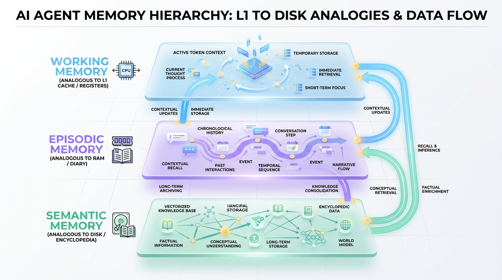
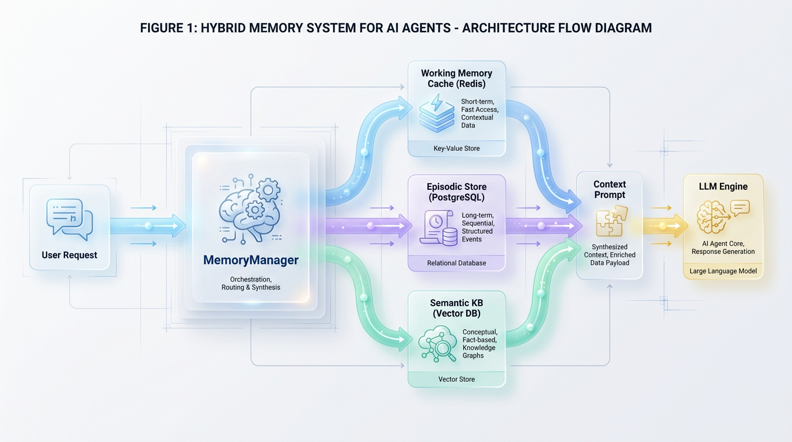

# AI Agent Memory: A Practical Engineering Guide

*Move beyond stateless chatbots. This guide provides the architectural patterns for building AI agents with reliable memory, balancing latency, cost, and contextual accuracy for production systems.*


## Why Your AI Agent Forgets: The Memory Problem

Most LLM-powered applications suffer from a fundamental limitation: they are inherently stateless. Every API call to a frontier model is a blank slate, completely blind to what happened a millisecond ago. 

This creates what we call the **Goldfish Agent**. Imagine a customer service representative who gets amnesia every time you pause to catch your breath. This constant memory wipe forces users to repeatedly re-explain their context, goals, and system preferences, causing immediate user frustration.

### Stateless Isolation vs. Stateful Value

In simple utility applications, statelessness is acceptable. However, building an autonomous agent that can execute multi-step software engineering workflows, manage complex financial portfolios, or act as a personalized executive assistant requires state. Without a robust mechanism to retain context, enterprises face severe penalties: dropped user engagement, ballooning token costs from redundant prompting, and broken user journeys.

| Agent State | System Behavior | Business Impact |
| :--- | :--- | :--- |
| **Stateless** | Treats every prompt as an isolated, independent query. | High token churn, zero personalization, high user friction. |
| **Stateful** | Retains, synthesizes, and updates historical context. | Compound reasoning, high user retention, low operational latency. |

### The Tiered Memory Solution

To solve this, we cannot simply dump every historical interaction back into the LLM prompt window. Doing so quickly violates context window constraints, degrades model attention, and drives up API costs. Instead, effective agent memory must mimic a computer's tiered memory hierarchy.

> 💡 **Architectural Insight:** Just as a computer uses CPU registers, RAM, and solid-state drives to balance access speed and capacity, a production-grade AI agent requires a multi-layered memory architecture.

This layered approach separates immediate conversational state (**Working Memory**), short-term semantic recall (**Episodic Memory**), and long-term analytical knowledge (**Semantic Memory**). In this article, we will explore how to engineer this tiered system, moving from conceptual system design to production-ready, stateful agents.


## The Four Pillars of Agent Memory

To design resilient, autonomous AI agents, we must move beyond treating Large Language Models (LLMs) as stateless functions. Agents require structured, multi-tiered memory architectures to maintain state, learn from interactions, and execute complex workflows over long horizons. 

We can categorize agent memory into four distinct cognitive pillars. Each pillar serves a unique purpose, carries distinct access latencies, and maps to specific components in our technical stack.



*Figure 1: The AI Agent Memory Hierarchy maps context requirements to optimized physical storage layers, mirroring traditional computing architectures.*


```
       +-----------------------------------------------------------+
       |                  WORKING MEMORY (L1/L2)                   |
       |  System Prompt + Dynamic Context (LLM Context Window)     |
       +-----------------------------------------------------------+
               ^                      ^                      ^
               |                      |                      |
    +----------+----------+ +---------+---------+ +----------+----------+
    |   SEMANTIC MEMORY   | |  EPISODIC MEMORY  | |  PROCEDURAL MEMORY  |
    |  Vector DB / Knowledge| | Relational Logs   | | Hardcoded Workflows |
    |      (Fact Base)     | | (Context Stream)  | |  (Agent Skills)     |
    +---------------------+ +-------------------+ +---------------------+
```

---

### Working Memory: The Scratchpad

Working memory acts as the agent’s immediate, active workspace during execution. 

Think of this as CPU registers or L1 cache—incredibly fast, highly volatile, and strictly limited in capacity. 

In production systems, this is managed entirely within the LLM's active **context window** during a single inference pass. Every token in the system prompt, historical conversation slice, and retrieved tool output resides here. It is volatile and vanishes the moment the API call completes.

```python
def assemble_working_memory(system_prompt: str, episodic_context: list, semantic_context: list) -> list:
    """
    Assembles the active context window (Working Memory) for the agent.
    Ensures that the LLM has immediate access to critical execution state.
    """
    working_memory = [{"role": "system", "content": system_prompt}]
    
    # Inject relevant semantic domain knowledge
    for fact in semantic_context:
        working_memory.append({"role": "system", "content": f"Fact: {fact}"})
        
    # Inject relevant historical events (episodic)
    for interaction in episodic_context:
        working_memory.append(interaction)
        
    return working_memory
```

---

### Semantic Memory: The Knowledge Base

Semantic memory holds the agent’s static, conceptual knowledge of the world, including facts, definitions, and domain rules.

It operates like a personal encyclopedia, allowing the agent to understand concepts without needing to remember exactly *when* or *how* it first learned them.

This is implemented using **Vector Databases** (such as Qdrant, pgvector, or Pinecone). Text is converted into dense vector embeddings and queried via cosine similarity. This allows the agent to pull relevant factual context into its working memory only when required.

---

### Episodic Memory: The Conversation Log

Episodic memory records the chronological stream of the agent's unique experiences, tracking specific interactions over time.

Think of this as an append-only application transaction log or a detailed personal diary.

Engineers implement episodic memory using relational databases, document stores, or graph databases (like PostgreSQL, MongoDB, or Neo4j). This layer allows the agent to recall specific historical sequences, such as what a user said three days ago or the exact sequence of API failures it encountered during a previous task run.

---

### Procedural Memory: The Skill Set

Procedural memory defines the agent's implicit knowledge of *how* to execute tasks step-by-step.

This is the digital equivalent of muscle memory—the hardwired instructions for riding a bicycle.

Instead of retrieval queries, procedural memory is baked into the agent's code as **Directed Acyclic Graphs (DAGs)**, hardcoded execution chains, or fine-tuned model weights. It dictates how the agent parses tools, handles errors, and structures its internal reasoning loop before executing actions.

> 💡 **Key Architecture Pattern:** Never mix episodic and semantic memory in the same storage engine. Semantic memory requires high-dimensional vector search for concept matching, while episodic memory requires time-series or relational query capabilities to reconstruct linear timelines.

---

### Architectural Summary

The table below breaks down the optimal engineering choices for managing each memory pillar in a production environment:

| Goal | Recommended Technique | Reason |
| :--- | :--- | :--- |
| **Real-time execution** | In-context variables (Working Memory) | Minimizes latency by keeping active state inside the prompt. |
| **Domain-specific lookup** | Vector DB similarity search (Semantic Memory) | Allows efficient semantic retrieval of static knowledge. |
| **User session tracking** | Relational/Time-series database (Episodic Memory) | Ensures accurate reconstruction of chronological event timelines. |


## Architecting a Hybrid Memory System

AI agents operating in production environments quickly outgrow single-tier memory solutions. Relying solely on a vector database or a simple in-memory session cache leads to a critical bottleneck: the agent either lacks long-term historical awareness or becomes paralyzed by high search latency and irrelevant context. To build an enterprise-grade agent, you must architect a **hybrid memory system** that treats memory as a multi-tiered storage hierarchy.

### The Memory Hierarchy

To understand hybrid memory, consider how a standard computer manages data. Your operating system does not load everything from the hard drive; it utilizes CPU registers, L1/L2 caches, RAM, and solid-state disks to balance speed and capacity. 

In an AI agent, the **MemoryManager** acts as the operating system's memory controller. It orchestrates three distinct storage layers to serve the agent's cognitive needs:



*Figure 2: The MemoryManager orchestrates real-time user requests, concurrently querying and routing across Redis, Vector DB, and PostgreSQL before synthesizing final LLM context.*


*   **Working Memory (Cache):** Ultra-low latency transient storage. This layer tracks the immediate, active conversation state and recent system updates.
*   **Episodic Memory (Relational/Graph):** Structured, chronological logs of past interactions. This preserves the exact timeline of events, structured entity relationships, and causal chains.
*   **Semantic Memory (Vector Store):** Unstructured, conceptually indexed knowledge. This allows the agent to recall facts, user preferences, and historical contexts based on meaning rather than exact keywords.

```text
       [ User Request / Event ]
                  │
                  ▼
      ┌───────────────────────┐
      │     MemoryManager     │
      └───────────┬───────────┘
                  │
        ┌─────────┼─────────┐
        ▼         ▼         ▼
    ┌───────┐ ┌───────┐ ┌───────┐
    │ Redis │ │ Neo4j │ │ PgVect │
    │ Cache │ │ Graph │ │  DB   │
    └───┬───┘ └───┬───┘ └───┬───┘
        │         │         │
        └─────────┼─────────┘
                  ▼
      ┌───────────────────────┐
      │  Context Synthesizer  │
      └───────────┬───────────┘
                  ▼
      ┌───────────────────────┐
      │  Prompt Construction  │
      └───────────────────────┘
```

---

### The Retrieval Workflow

When a query hit the system, the **MemoryManager** must coordinate lookups across these layers without introducing prohibitive latency. This requires a carefully managed query orchestration pipeline.

First, the manager retrieves the active session state from the **Working Memory** cache. Simultaneously, it fires parallel async queries to the **Episodic** and **Semantic** databases. 

The semantic query performs an embedding-based similarity search to find conceptually relevant history, while the episodic query pulls the exact chain of recent events or specific entity profiles. Finally, a synthesis layer deduplicates, ranks, and merges these distinct data streams into a cohesive context window for the LLM.

> ✅ Best Practice: Never execute retrieval queries sequentially. Use asynchronous concurrent tasks to query your vector store and relational databases in parallel, keeping your end-to-end memory retrieval latency under 150 milliseconds.

---

### Implementation: The Unified Memory Manager

The following Python implementation demonstrates how to coordinate these stores using asynchronous execution. This runnable prototype uses simulated client drivers to illustrate how you can write to and query Redis, PostgreSQL, and Pinecone concurrently.

```python
import asyncio
import time
from typing import Dict, Any, List

class MockRedisClient:
    async def get_session(self, session_id: str) -> List[str]:
        # Simulate sub-millisecond cache lookup
        await asyncio.sleep(0.005)
        return [f"User initiated session {session_id}", "User asked about system status"]

    async def save_session(self, session_id: str, event: str):
         await asyncio.sleep(0.005)

class MockPgClient:
    async def get_episodic_history(self, user_id: str, limit: int = 5) -> List[str]:
        # Simulate fast relational index lookup
        await asyncio.sleep(0.02)
        return [f"Transaction 1042 failed for user {user_id}", "User downgraded plan"]

    async def save_episode(self, user_id: str, event: str):
        await asyncio.sleep(0.02)

class MockVectorDBClient:
    async def query_semantic_memory(self, query: str, top_k: int = 2) -> List[str]:
        # Simulate network hop and vector index scan
        await asyncio.sleep(0.05)
        return ["System documentation: Error 1042 indicates a database timeout."]

    async def upsert_vector(self, text: str):
        await asyncio.sleep(0.05)

class MemoryManager:
    def __init__(self):
        self.working_memory = MockRedisClient()
        self.episodic_memory = MockPgClient()
        self.semantic_memory = MockVectorDBClient()

    async def add_event(self, user_id: str, session_id: str, event_text: str):
        """Asynchronously writes new events to all three memory layers."""
        start_time = time.perf_counter()
        
        # Parallelize writes to avoid blocking the agent thread
        await asyncio.gather(
            self.working_memory.save_session(session_id, event_text),
            self.episodic_memory.save_episode(user_id, event_text),
            self.semantic_memory.upsert_vector(event_text)
        )
        
        duration = time.perf_counter() - start_time
        print(f"Successfully committed event to all tiers in {duration:.4f}s")

    async def retrieve_context(self, query: str, user_id: str, session_id: str) -> Dict[str, Any]:
        """Orchestrates parallel retrieval from memory tiers and synthesizes context."""
        start_time = time.perf_counter()

        # Execute all lookups concurrently to minimize latency
        working_task = self.working_memory.get_session(session_id)
        episodic_task = self.episodic_memory.get_episodic_history(user_id)
        semantic_task = self.semantic_memory.query_semantic_memory(query)

        working_res, episodic_res, semantic_res = await asyncio.gather(
            working_task, episodic_task, semantic_task
        )

        # Synthesize results into structured prompt components
        synthesized_context = {
            "immediate_session_state": working_res,
            "relevant_user_history": episodic_res,
            "semantic_knowledge_retrieved": semantic_res,
            "retrieval_latency_ms": (time.perf_counter() - start_time) * 1000
        }
        return synthesized_context

# Running the asynchronous orchestrator
async def main():
    manager = MemoryManager()
    
    # 1. Ingesting an event
    await manager.add_event(
        user_id="usr_8829", 
        session_id="sess_abc123", 
        event_text="Database timeout during user checkout flow."
    )
    
    # 2. Retrieving context for next generation step
    context = await manager.retrieve_context(
        query="Why did the checkout fail?", 
        user_id="usr_8829", 
        session_id="sess_abc123"
    )
    
    print("\nSynthesized Context Result:")
    for tier, data in context.items():
        print(f" - {tier}: {data}")

if __name__ == "__main__":
    asyncio.run(main())
```

---

### Architectural Trade-offs and Decision Matrix

Designing a hybrid memory system is an exercise in balancing opposing forces. Deepening the agent's memory capability directly impacts your system's operating cost and response times.

Every time you add a query to a relational database or perform an embedding call for a vector database lookup, you trade millisecond performance and API costs for context accuracy. If you query too aggressively, your agent will be slow and expensive. If you query too conservatively, your agent will suffer from amnesia and make decisions based on incomplete context.

| Engineering Goal | Recommended Technique | Reason |
| :--- | :--- | :--- |
| **Minimize Read Latency** | Run parallel asynchronous fetches (`asyncio.gather`) and implement query-result caching in Redis. | Prevents slower databases (like vector indices) from bottlenecking the agent's primary generation cycle. |
| **Control Operating Costs** | Implement dynamic embedding gating; only run vector searches when the user's intent requires deep history. | Reduces continuous API calls to embedding models and specialized vector databases for simple chatter. |
| **Prevent Context Stale-ness** | Periodically prune the active Redis cache and persist structured historical rollups to PostgreSQL. | Keeps the LLM prompt size small and highly relevant while maintaining a durable, long-term archival trail. |


## Real-World Applications

Memory engineering is the differentiating factor between brittle conversational bots and resilient, autonomous enterprise agents. By structuring memory into semantic, episodic, and procedural layers, organizations can unlock significant business value and measurable engineering outcomes.

| Goal | Recommended Technique | Reason |
| :--- | :--- | :--- |
| Reduce Support Resolution Time | Episodic Session Threading | Caches cross-channel history to prevent users from repeating information. |
| Increase E-commerce Conversion | Hybrid Episodic-Semantic Retrieval | Blends user-specific interaction histories with global product catalogs. |
| Automate Incident Response | Tri-Memory Fusion | Synthesizes runbooks, historical incident logs, and executable command scripts. |

### Customer Support and Personalized Commerce

Modern customer service agents leverage **episodic memory** to retain context across disparate communication channels. Instead of treating each interaction as an isolated event, the agent recalls the user's complete history. This dramatically reduces Mean Time to Resolution (MTTR) and improves overall CSAT scores.

In personalized e-commerce, agents combine episodic memory of past purchases with **semantic memory** of the product catalog. 

> 💡 **Design Principle:** Think of this setup as a seasoned retail concierge. They instantly remember your unique style and size constraints (episodic memory) while simultaneously knowing every item currently sitting in the warehouse stockroom (semantic memory).

This dual-memory lookup allows the agent to generate highly tailored product recommendations. This technical integration directly correlates with increases in average order value (AOV) and conversion rates.

### Autonomous DevOps and Corporate Knowledge Networks

For complex operations like Site Reliability Engineering (SRE), agents require a sophisticated **tri-memory fusion** architecture. When a system failure occurs, the SRE agent queries its **procedural memory** for the correct execution steps, its episodic memory for past incident similarities, and its semantic memory for internal runbooks.

```python
# SRE Agent memory synthesis workflow
def diagnose_incident(incident_payload, semantic_store, episodic_store, procedural_store):
    # 1. Query semantic memory for runbook policies
    runbook = semantic_store.query_by_concept(incident_payload.error_signature)
    
    # 2. Query episodic memory for historical context (e.g., "failed last Tuesday")
    past_incidents = episodic_store.query_similar_events(incident_payload.vector)
    
    # 3. Retrieve procedural steps from action store (e.g., "restart pod")
    execution_plan = procedural_store.get_action_sequence(runbook.recommended_action)
    
    return execution_plan, past_incidents
```

In corporate knowledge management, internal agents use a similar topology to eliminate information silos. By indexing company wikis (semantic) alongside previous employee inquiries (episodic), the agent delivers precise, non-redundant answers. This reduces the cognitive load on subject-matter experts and streamlines internal onboarding workflows.


## When Should You Use Which Memory Type?

Building a production AI agent requires choosing the right memory tool for the job. Just like human cognitive systems, agentic memory is not a monolith. 

Imagine an elite executive assistant. They use a **sticky note** for what you just said (Working Memory), a **reference library** for company policy (Semantic Memory), a **meeting journal** to recall past interactions (Episodic Memory), and a **standard operating procedures manual** to execute recurring tasks (Procedural Memory). To build a resilient agent, you must map your functional requirements directly to these specialized database architectures.

### The Agent Memory Selection Matrix

| Goal | Recommended Technique | Reason |
| :--- | :--- | :--- |
| Fast, in-conversation context for the current turn | **Working Memory** (LLM Prompt) | Lowest latency for immediate conversational flow. Managed directly by the context window, but expensive and limited in size. |
| Answering "what" questions about general knowledge | **Semantic Memory** (Vector DB) | Efficiently finds conceptually similar information in large, unstructured text corpora. Ideal for RAG over documents. |
| Recalling "who/when" details from past interactions | **Episodic Memory** (Relational/Graph DB) | Structured to store and query specific events, timelines, and user histories with high fidelity. Essential for personalization. |
| Automating a multi-step, learned task reliably | **Procedural Memory** (Cached Plans/Fine-tuning) | Optimizes for repeating successful workflows, reducing latency, token usage, and unpredictability for common tasks. |
| Understanding relationships between entities | **Hybrid Memory** (Graph DB + Semantic) | A graph database models the explicit relationships (e.g., "User A works for Company B"), while semantic memory provides rich, unstructured context. |

### Technical Implementation

In production, you can implement a **Memory Router** pattern. This component inspects incoming queries and routes them to the correct storage engine to minimize latency and token costs.

```python
# A routing layer to dispatch queries to the appropriate memory store
class AgentMemoryRouter:
    def __init__(self, vector_db, graph_db, relational_db):
        self.vector_db = vector_db      # Semantic Memory
        self.graph_db = graph_db        # Relational/Hybrid Memory
        self.relational_db = relational_db  # Episodic Memory

    def fetch_context(self, user_id: str, query: str, intent: str) -> dict:
        # Route based on the engineering requirements of the query intent
        if intent == "relationship_lookup":
            # Graph query handles explicit entity-to-entity linkages
            return self.graph_db.query_relationships(query)
        elif intent == "user_history":
            # Relational database guarantees precise chronological order
            return self.relational_db.get_chronological_events(user_id, limit=10)
        else:
            # Vector DB handles unstructured, conceptually similar search
            return self.vector_db.similarity_search(query, k=3)
```

This routing logic ensures that the LLM context window is only populated with high-relevance, low-noise data. This optimizes inference speed and improves downstream task accuracy.

> ✅ **Best Practice:** Never rely on vector similarity searches to reconstruct a chronological timeline. Vector embeddings do not naturally preserve exact temporal relationships, which are better served by querying a transactional relational database.


## Production Guardrails: Cost, Latency, and Security

Moving a memory-enabled agent from a local prototype to a production environment is where most architectures break down. Unbounded memory growth quickly degrades model latency, spikes API costs, and introduces significant privacy and compliance liabilities. To build a resilient agent, you must treat memory as a managed system with strict boundaries, optimization pipelines, and compliance layers.

### Cost Management: Compressing the Past

As agent conversations grow, so do prompt sizes. Without intervention, feeding an agent's entire raw history into the context window with every turn will exponentially increase LLM token costs.

> **Analogy:** Imagine keeping every receipt, email, and sticky note you have ever written directly on your desk. Eventually, you run out of physical space and cannot find anything; instead, you need to file away summaries and throw out the trash.

To implement this programmatically, you should use a dual-model pipeline. Run a small, inexpensive model (such as Llama-3-8B) or a cheaper API tier to summarize, classify, and index conversational memory asynchronously. Simultaneously, enforce strict **Time-To-Live (TTL)** policies on episodic memories—such as expiring raw logs after 24 hours while keeping only high-level semantic summaries.

### Latency Optimization: Asynchronous Recall and Caching

Querying vector databases and synthesizing memories adds critical milliseconds to your agent's response time. If your agent blocks its execution loop to fetch long-term semantic memories, the user experience will suffer.

Instead, leverage **asynchronous retrieval**. Fetch long-term semantic context in parallel while your agent begins processing the immediate system prompt and short-term window. Additionally, implement an in-memory cache (like Redis) for frequently accessed user profiles and system states, avoiding redundant, high-latency database queries on repetitive loops.

```python
import asyncio
import time

async def fetch_semantic_memory(user_id: str) -> str:
    """Simulates fetching long-term context asynchronously from a vector DB."""
    await asyncio.sleep(0.15)  # Simulate network latency of 150ms
    return f"User {user_id} prefers Python and microservice architectures."

async def prepare_immediate_context(user_input: str) -> str:
    """Processes the immediate user input in parallel."""
    await asyncio.sleep(0.05)  # Simulate local token processing of 50ms
    return f"Current prompt: {user_input}"

async def execute_agent_loop(user_id: str, user_input: str):
    start_time = time.time()
    
    # Gather both tasks concurrently to avoid blocking the execution loop
    memory_task = asyncio.create_task(fetch_semantic_memory(user_id))
    context_task = asyncio.create_task(prepare_immediate_context(user_input))

    # Wait for both to complete
    semantic_memory, current_context = await asyncio.gather(memory_task, context_task)

    # Merge context for LLM consumption
    final_prompt = f"Memory: {semantic_memory}\nContext: {current_context}"
    print(f"Prompt compiled in {time.time() - start_time:.3f}s")
    return final_prompt

# Run the async orchestration loop
asyncio.run(execute_agent_loop("usr_102", "How do I optimize my database connections?"))
```

### Security and Privacy: Compliance by Design

AI memory stores are a magnet for personally identifiable information (PII). Under regulations like GDPR and CCPA, users have a "right to be forgotten," which is notoriously difficult to enforce in vector databases and embedded summaries.

You must treat memory as a tier-1 sensitive data store. Implement client-side or gateway-level anonymization pipelines to strip PII before embeddings are generated. Furthermore, design a deterministic **Forget API** that maps a user's ID to their specific vector chunks and document IDs, ensuring complete deletion when requested.

> ✅ Best Practice: Implement Role-Based Access Control (RBAC) at the memory-database layer. An agent running on behalf of a low-privilege user must never pull semantic memories generated by a high-privilege administrative session.

### Observability: Traceable Reasoning

When an agent hallucinates, it is often because of low-quality or irrelevant injected context. Debugging these failures requires strict lineage tracking.

Log every retrieved memory chunk along with its exact source metadata (e.g., `source: semantic_memory`, `doc_id: usr_902`, `similarity_score: 0.89`). This audit trail allows developers to pinpoint exactly which piece of recalled context poisoned the prompt.

The decision matrix below outlines how to trade off and balance these operational guardrails in a production architecture.

| Goal | Recommended Technique | Reason |
| :--- | :--- | :--- |
| **Minimize API Token Spend** | Tiered Model Summarization + TTL | Offloads expensive context synthesis to cheaper, smaller models asynchronously. |
| **Reduce First-Token Latency** | Asynchronous Retrieval & Redis Caching | Fetches semantic memories in parallel while bypassing DB lookups for warm data. |
| **Ensure Legal Compliance** | Gateway PII Anonymization & Forget API | Strips sensitive data before ingestion and allows clean deletion under GDPR. |


## Design Decisions That Matter

Memory engineering is fundamentally an **information logistics** problem, not a database storage problem. Your primary challenge is to route the right context to the LLM's limited attention window at the exact moment it is needed. This requires balancing relevance, computational cost, and retrieval latency. 

### System Orchestration over Database Selection

Think of your agentic memory architecture as the human brain's **hippocampus**. Rather than acting as a passive hard drive, it actively orchestrates the flow of stimulus. The central orchestrator—the **MemoryManager**—determines what information belongs in the immediate, high-cost context window (working memory) versus what should be offloaded to slower, lower-cost persistence tiers.

| Memory Type | Retrieval Goal | Primary Engineering Focus |
| :--- | :--- | :--- |
| **Episodic** | Recall past sequence of events | Temporal alignment and chronological order |
| **Semantic** | Fetch general domain knowledge | Vector embedding distance and clustering |
| **Working** | Track current execution state | Strict token-budget optimization and low latency |

System failures rarely stem from sub-optimal vector search algorithms. Instead, they occur due to poor integration between memory types. For example, a semantic search might surface a highly relevant recommendation, but fail because the system did not cross-reference episodic memory to recall a user's explicit negative preference (e.g., "Do not suggest seafood"). 

> ✅ Best Practice: Prioritize deterministic rule-based filters for user constraints before running probabilistic semantic searches. A hard constraint must always override a vector similarity score.

Ultimately, database benchmarks are secondary to how you design the flow, synthesis, and ranking of retrieved context. A successful AI agent relies on an orchestrator that constructs a coherent prompt out of disparate memory fragments. Your core engineering goal is to build a predictable context pipeline that consistently drives the model toward the correct execution path.