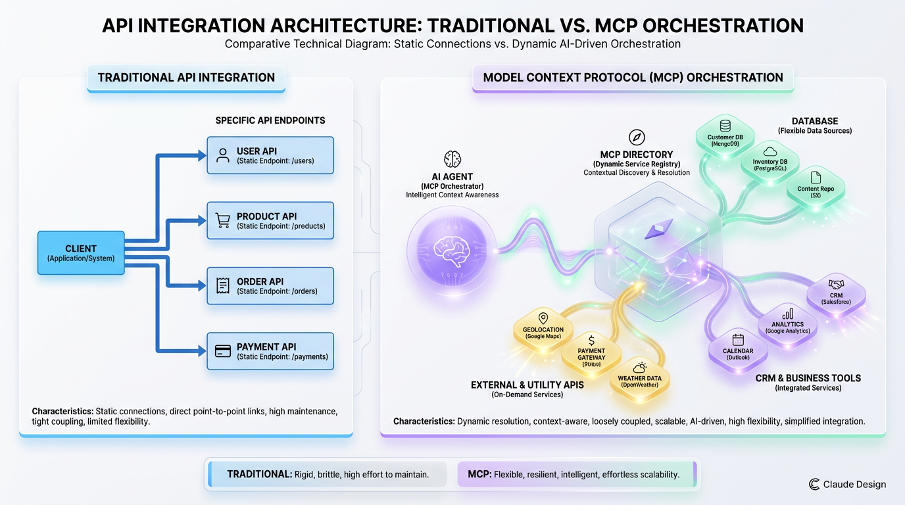
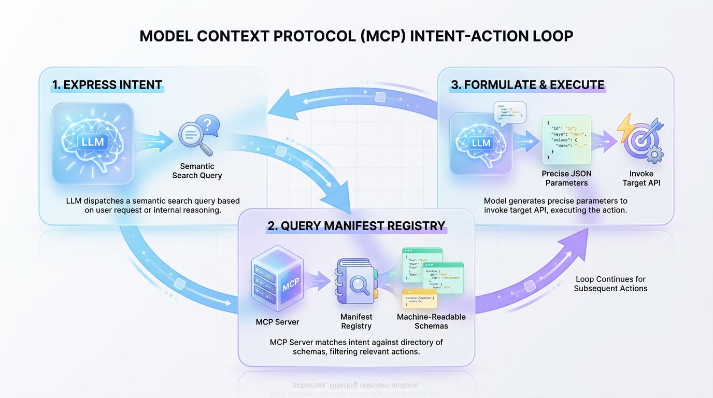
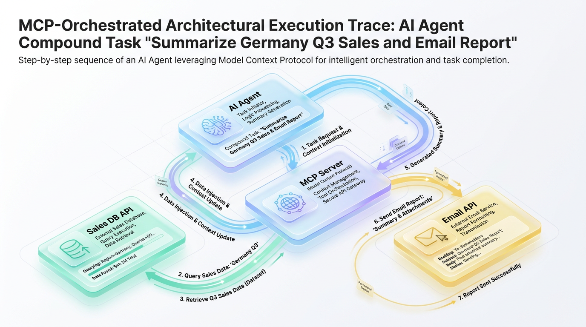

# MCP vs API: Not a Replacement, but a Powerful Upgrade

*Stop viewing MCP as an API killer. Learn how this intent-driven protocol works with your existing APIs to build more dynamic, powerful, and autonomous AI-powered applications.*


## Beyond the Endpoint: Why AI Needs More Than Just APIs

*Traditional APIs are too brittle for autonomous AI agents. Discover how the Model Context Protocol (MCP) creates a flexible orchestration layer for dynamic, intent-driven tool use and runtime capability discovery.*

Traditional APIs are designed for deterministic software, where engineers define a strict sequence of requests to achieve a predictable outcome. When we force an autonomous AI agent into this rigid pipeline, the system becomes incredibly brittle. A single variation in a user's prompt can render a hard-coded chain of endpoints useless.



*Figure 1: Direct, hard-coded API integrations vs. dynamic, intent-driven MCP tool discovery and execution.*


This limitation is best understood through an analogy. A traditional API is like a highly specific instruction: "turn this exact 4mm screw three times clockwise." If the screw size changes, the instruction fails. In contrast, an AI-native protocol allows the model to understand the objective at a higher level: "assemble this chair." Armed with this goal, the AI can inspect its environment, dynamically choose the correct tools, and execute them in the optimal sequence.

This shift from static execution to dynamic reasoning exposes a massive engineering challenge: **the discovery and selection problem**. If an agent has access to hundreds of enterprise endpoints, how does it know which tool is the right one for a given task? Hard-coding these paths destroys the agent's autonomy, while stuffing hundreds of raw API schemas into an LLM's prompt causes massive context bloat, high latency, and frequent hallucinations.

This is where the Model Context Protocol (MCP) becomes essential. MCP does not replace traditional APIs; it sits on top of them as an open, standardized integration layer that translates an AI's cognitive intent into structured, reliable API execution.

### The Architectural Decision Matrix

Choosing between a direct API call and an MCP-driven architecture depends on whether your system requires deterministic execution or dynamic orchestration.

| Goal | Recommended Technique | Reason |
| :--- | :--- | :--- |
| **Executing a single, predictable task** | Direct API Call | The interaction is static and doesn't require model interpretation. A direct call is faster, cheaper, and less complex. |
| **Enabling AI agent tool selection** | MCP + APIs | MCP provides the critical discovery layer for the model to select the correct API based on user intent and runtime context. |
| **Standard service-to-service integration** | Direct API Call | MCP is for AI interaction; it adds unnecessary overhead for deterministic machine-to-machine communication. |
| **Creating an adaptive, extensible system** | MCP + APIs | New tools can be registered with the MCP server; the model discovers and uses them without application redeployment. |

Before we can fully appreciate the paradigm shift that MCP introduces, it's crucial to solidify our understanding of the traditional API architecture it builds upon.


## The Foundation: A Refresher on API Architecture

For decades, the software ecosystem has relied on Application Programming Interfaces (APIs) for system integration. Among these, RESTful architectures are the industry standard, utilizing structured paths to expose server-side resources. These systems communicate over HTTP using deterministic methods like `GET`, `POST`, and `DELETE`, typically exchanging payloads in structured JSON formats.

To understand this interaction, consider a traditional vending machine. You enter a precise code (the endpoint), insert the exact cash (the parameters), and receive a specific snack (the payload). The machine cannot interpret vague requests; if you are thirsty but input the code for chips, it will not correct your mistake or suggest an alternative.

Technically, a RESTful API operates as a strict contract between the client and the server. The server defines the exact OpenAPI schema, authentication handshakes, and valid data types, requiring the client to conform entirely. While this rigidity ensures predictable and secure machine-to-machine exchanges, it leaves no room for runtime negotiation or semantic interpretation.

The following Python example demonstrates a standard, synchronous API call to retrieve user data:

```python
import requests

# Define the target resource path and authentication headers
url = "https://api.example.com/v1/users/101"
headers = {
    "Authorization": "Bearer mock_token_123",
    "Accept": "application/json"
}

# Execute the synchronous GET request
response = requests.get(url, headers=headers)

# Validate the response and programmatically parse the structured JSON
if response.status_code == 200:
    user_data = response.json()
    print(f"Successfully retrieved user: {user_data['name']}")
else:
    print(f"Request failed with status code: {response.status_code}")
```

In this code, the client must know the exact structural path (`/users/101`) and required headers before compilation. If the API schema changes or the endpoint is deprecated, the hardcoded client logic immediately breaks. The system lacks the intelligence to adapt to interface changes dynamically.

This highlights the fundamental limitation of traditional APIs when integrated with AI. In a standard architecture, a developer must programmatically write all orchestration logic. AI models, conversely, require a fluid ecosystem where they can discover capabilities and autonomously determine tool execution paths at runtime.

> ⚠️ **Common Mistake:** Traditional APIs are inherently static. They require the client to possess absolute, compile-time knowledge of what endpoint to call, what parameters to pass, and how to parse the output, making them poorly suited for the open-ended reasoning loops of modern AI agents.


## The Intent Layer: How Model Context Protocol (MCP) Works

The rapid evolution of LLMs has exposed a fundamental architectural bottleneck: they are powerful reasoning engines but are natively blind to your local files, private databases, and internal APIs. To bridge this gap, the **Model Context Protocol (MCP)** was developed as an open standard that acts as a universal, bidirectional interface between AI models and secure data sources.

Instead of developers writing brittle, custom glue code for every new tool and LLM pairing, MCP establishes a standardized communication protocol. It functions as a machine-readable directory, allowing models to dynamically discover, inspect, and safely interact with external systems.



*Figure 2: The closed-loop discovery and parameter negotiation cycle of the Model Context Protocol.*


### The Restaurant Menu Analogy

Imagine entering a world-class restaurant where you do not speak the chef's language. Rather than guessing, the host hands you a dynamic, detailed menu. This menu translates your vague desires (your intent) into structured dishes with explicit ingredients (the schema). MCP serves as this universal menu, sitting between the AI model (the diner) and your APIs (the kitchen) to translate high-level prompts into precise, executable actions.

### The Architectural Execution Flow

At its core, MCP operates through a structured, four-part handshaking process that shifts integration from compile-time hardcoding to run-time semantic discovery.

1.  **Intent Expression**: The user prompts the AI model. The model analyzes the request and realizes it lacks the necessary context or capability to answer natively, thereby expressing an "intent" to use an external tool.
2.  **Manifest Matching**: The MCP client queries connected MCP servers, which evaluate the model's intent against their registry of live **tool manifests**.
3.  **Schema Negotiation**: The MCP server returns a curated list of candidate tools along with their rigid JSON schemas to the model.
4.  **Targeted Invocation**: The model parses the schemas, binds the user's variables to the required parameters, and formulates a precise JSON-RPC call to execute the tool.

> 💡 **Tip:** By decoupling the model's capabilities from the underlying data systems, MCP allows you to update API implementations, access controls, and data structures on the server side without ever needing to retrain or re-prompt the core LLM.

### The Semantic Blueprint: A Tool Manifest Example

The engine driving this discovery process is the **tool manifest**. Below is an example of an MCP tool definition for a weather utility. This JSON schema serves a dual purpose: it provides natural language hints for the model's semantic router and strict typing for the validation layer.

```json
{
  "name": "get_weather_forecast",
  "description": "Retrieves the wind speed, precipitation, and temperature forecast for a specific location. Use this tool whenever users ask about current atmospheric conditions, clothing recommendations, or travel weather safety.",
  "inputSchema": {
    "type": "object",
    "properties": {
      "location": {
        "type": "string",
        "description": "The city and state/country, e.g., 'San Francisco, CA' or 'Paris, France'."
      },
      "unit": {
        "type": "string",
        "enum": ["celsius", "fahrenheit"],
        "default": "celsius",
        "description": "The temperature measurement scale."
      }
    },
    "required": ["location"]
  }
}
```

This manifest is highly functional. The LLM processes the natural language `description` to determine *if* and *when* to execute this tool. Once selected, the `inputSchema` guarantees that the model formats its response payload exactly as the target system expects, ensuring reliable execution.

| Execution Phase | Active Component | Architectural Responsibility |
| :--- | :--- | :--- |
| **1. Intent Detection** | LLM & Client | Identifies a knowledge gap and targets a semantic capability. |
| **2. Context Discovery** | MCP Server | Exposes the tool registry and schema requirements via JSON-RPC. |
| **3. Execution** | Host & Server | Invokes the local or remote process safely and streams back the context. |


## Unifying the Layers: MCP Orchestrating API Execution

Historically, connecting AI models to enterprise systems required writing rigid, deterministic pipelines. The Model Context Protocol (MCP) shifts this paradigm by acting as an open, standardized negotiation layer between cognitive engines and transactional APIs.

Think of the AI model as a brilliant executive, APIs as specialized department heads, and MCP as an agile Chief of Staff. The executive doesn't need to learn database query syntax or SMTP protocols. Instead, they state a business goal, and the Chief of Staff dynamically discovers department capabilities, negotiates data schemas, and orchestrates the execution sequence.

Let’s trace a real-world scenario where a user prompts: *"Summarize our Q3 sales in Germany and email the report to the regional manager."*

1.  **Intent Analysis**: The AI model parses the prompt and identifies two distinct intents: retrieving sales metrics and dispatching an email.
2.  **Capabilities Discovery**: The model queries the MCP Server, which responds with the schemas for two independent functions: `query_sales_db` and `send_email`.
3.  **Schema Exchange**: The model inspects the JSON schemas, maps "Q3" and "Germany" to the correct parameters, and constructs a valid tool execution payload.
4.  **Data Retrieval**: The model invokes `query_sales_db` via MCP. The server executes the query against a backend database and returns the raw sales figures.
5.  **Synthesis & Dispatch**: The model analyzes the data, writes a summary, and formats a secondary payload for `send_email` to dispatch the report.

Here is how a developer implements this on the MCP Server using Python. Notice the code contains no orchestration logic; it only declares atomic capabilities.

```python
# mcp_server.py
from mcp.server.fastmcp import FastMCP

# Initialize the MCP Server
mcp = FastMCP("SalesOrchestration")

@mcp.tool()
def query_sales_db(quarter: str, country: str) -> str:
    """Query the database for sales metrics by quarter and country."""
    # Simulating a database lookup
    data_payload = f"Sales for {country} ({quarter}): Total $1.2M. Growth +8% QoQ."
    return data_payload

@mcp.tool()
def send_email(recipient: str, subject: str, body: str) -> str:
    """Send a synthesized text report to the specified email address."""
    # Simulating a transactional email API call
    return f"Successfully sent email to {recipient} with subject: '{subject}'"
```

In this architecture, the developer only registers decoupled tools. The AI model, guided by MCP's metadata, acts as a runtime dynamic compiler that decides *how* and *when* to chain them together.

| Architectural Attribute | Traditional API Integration | MCP-Enabled Orchestration |
| :--- | :--- | :--- |
| **Execution Logic** | Hardcoded state machines | Dynamic, LLM-generated execution paths |
| **Extensibility** | Requires rewriting middleware | Simply register a new atomic tool schema |
| **Data Translation** | Custom manual parsing functions | Autonomous JSON payload generation |

> ✅ **Best Practice:** Keep your MCP tool descriptions highly descriptive. The AI model relies entirely on your tool's docstrings and parameter type hints to safely construct execution sequences and determine tool dependencies.


## Real-World Applications with MCP

While traditional APIs expose raw endpoints, MCP acts as a semantic routing layer, enabling LLMs to dynamically discover and coordinate multiple APIs to solve complex tasks. Instead of writing brittle integration pipelines, developers expose services to an MCP server, allowing the AI to stitch resources together based on real-time context.

This is like an elite hotel concierge. Instead of you calling the valet, kitchen, and spa to coordinate a late checkout and lunch, you make one request. The concierge understands your intent, knows each department's capabilities, and schedules the actions on your behalf.



*Figure 3: Multi-tool orchestration workflow of a compound AI agent request handled dynamically through MCP.*


### Autonomous Customer Support

A customer states, "My last order arrived damaged; I want a refund and a replacement." With MCP, the LLM orchestrates a structured workflow: it queries a **CRM API** to verify purchase history, triggers a **Payments API** to issue a refund, and calls an **E-commerce API** to generate a new shipping order.

### AI-Powered Data Analysis

When an analyst asks to "Compare user engagement for our new feature launch week-over-week," the MCP server translates this query. It can automatically fetch timeseries metrics from a **Prometheus API** and correlate that data with user traits from a **Segmentation Service** without requiring manual ETL pipelines.

### Intelligent DevOps Automation

A platform engineer can issue a simple command: "Our checkout service has high latency in the EU region; double the pod count and alert the team." The AI processes this through MCP, executing a scaling patch via the **Kubernetes API** while triggering an incident notification via the **PagerDuty API**.

### Smart Home IoT Integration

Consumer IoT is notoriously fragmented. If a user says, "I'm leaving for the weekend," MCP can bridge the vendor gap. It translates this single intent into coordinated API calls to lock smart doors, lower the thermostat, and arm security cameras, regardless of the device manufacturers.

| Orchestration Goal | Interacting Systems | MCP Advantage |
| :--- | :--- | :--- |
| **E-commerce Remediation** | CRM, Stripe, Shopify | Replaces brittle state machines with dynamic reasoning. |
| **Incident Response** | Kubernetes, Prometheus, Slack | Safely executes infrastructure actions using real-time context. |
| **Cross-Vendor IoT** | Philips Hue, Nest, Ring | Unifies disparate vendor ecosystems under a single semantic interface. |


## Production Guardrails: Security, Cost, and Reliability

Moving an MCP implementation from a prototype to production introduces critical operational realities. While MCP standardizes how models interact with tools, it does not inherently secure, optimize, or bulletproof those interactions.

### Security is Not Delegated

MCP is a transport and discovery protocol, not a security framework. It describes what a tool does, but it does not authenticate the user or authorize the action.

> ⚠️ **Common Mistake:** Never assume MCP provides security. The underlying APIs exposed through your MCP server must remain fully secured with independent authentication and authorization mechanisms.

To secure your systems, enforce transport-layer security and token-based access control. The AI client should act as a delegated user, passing scoped credentials through the MCP host to the server.

| Operational Risk | Guardrail Mechanism | Technical Implementation |
| :--- | :--- | :--- |
| **Credential Exposure** | Scoped Delegation | Force OAuth 2.0 with ephemeral, user-scoped tokens. |
| **Token Runaways** | Execution Budgets | Apply hard limits on max execution turns per user request. |
| **State Drift** | Idempotency Keys | Require unique transaction IDs for all write operations. |

> ✅ **Best Practice:** Never hardcode static API keys in an MCP server. Use mutual TLS (mTLS) for server-to-server communication and apply the principle of least privilege to the LLM's service account.

### Preventing Cost and Latency Overruns

In an agentic loop, a single prompt can trigger an unpredictable cascade of tool calls, leading to massive API bills and exhausted token quotas. To prevent this, implement circuit breakers and hard execution budgets.

```python
# mcp_guardrails.py
import time

class ExecutionGuardrail:
    """Prevents infinite loops and runaway costs by monitoring tool calls."""
    def __init__(self, max_calls: int = 5, max_duration_sec: float = 10.0):
        self.max_calls = max_calls
        self.max_duration_sec = max_duration_sec
        self.call_count = 0
        self.start_time = time.time()

    def record_call(self) -> None:
        self.call_count += 1
        elapsed = time.time() - self.start_time
        
        # Raise exceptions to break the execution loop if limits are breached
        if self.call_count > self.max_calls:
            raise RuntimeError("Guardrail triggered: Maximum tool call limit exceeded.")
        if elapsed > self.max_duration_sec:
            raise TimeoutError("Guardrail triggered: Execution time limit exceeded.")

# Example usage within an MCP host execution loop
try:
    guard = ExecutionGuardrail(max_calls=3, max_duration_sec=5.0)
    for _ in range(10): # Simulate agentic loop
        guard.record_call()
        # Execute tool logic...
except (RuntimeError, TimeoutError) as err:
    print(f"Loop halted safely: {err}")
```

### Tool Description is the New Prompt Engineering

The quality of the natural language `description` in your tool manifest directly impacts performance. LLMs rely entirely on these descriptions to determine when to invoke a tool. Vague descriptions lead to tool hallucination, where the model calls the wrong API or provides bad arguments.

> 🚀 **Production Tip:** Embed explicit constraints and examples directly into your tool descriptions. This acts as inline prompt engineering that guides the model's decision-making process at runtime.

### Idempotency and Error Handling

When an LLM chains multiple tool calls, a single failure can leave your system in an inconsistent state. For example, if the model charges a credit card but fails to update the shipping database, retrying the loop must not charge the card a second time. All side-effect-producing tools must be idempotent. Require unique transaction keys in your tool contracts to ensure that retried calls are safely handled.


## What the Architecture Optimizes For

The unified Model Context Protocol (MCP) and API architecture fundamentally optimizes for **flexibility and autonomy**. Instead of writing rigid, pre-programmed code paths for every possible user action, this approach enables systems to handle novel requests by dynamically composing tool sequences on the fly. This architecture trades deterministic execution for emergent capability.

This shift can be visualized as moving from a train on a fixed track to an autonomous drone navigating a changing landscape. Traditional APIs provide the structured tracks, while MCP acts as the navigation system, choosing how and when to switch paths to reach a destination. While a traditional integration guarantees that input A always yields output B, an MCP-driven workflow is probabilistic. The system can solve complex, multi-step problems it was never explicitly programmed for, but it also introduces new failure modes like incorrect tool selection or hallucinated parameters.

This transition requires a mindset shift for engineers, from being rigid **integrators** to becoming meticulous **toolsmiths**. The primary job is no longer to orchestrate procedural control flow but to build a robust, descriptive palette of capabilities that an autonomous agent can safely reason about and orchestrate.

| Architectural Focus | Traditional API Integration | MCP-Enabled Architecture |
| :--- | :--- | :--- |
| **Execution Model** | Deterministic & Procedural | Probabilistic & Autonomous |
| **Primary Engineer Role** | Control Flow Integrator | Tool Curator & Guardrail Architect |
| **System Failure Mode** | Static Code / Connection Breaks | Hallucinated Inputs & Tool Misuse |

Ultimately, adding an AI orchestration layer does not make traditional API design obsolete; it raises the stakes. Because the primary consumer of your API is now a non-deterministic agent rather than a predictable client, your backend services must be more secure, highly observable, and strictly validated than ever before.

> ✅ **Best Practice:** Treat your MCP tool definitions as production-grade SDKs. Because autonomous agents will inevitably test the boundaries of your input parameters, strict schema validation and runtime guardrails must be enforced at the API boundary, not just inside the LLM prompt.